# Параллельное программирование (C++20/23) — полный конспект (40 билетов)

> Единый документ: все 40 билетов подряд. Для навигации по отдельным файлам и карте зависимостей см. README.md.

---

# Билет 01. Закон Амдала и закон Густафсона

> **На экзамен (кратко).**
> **Закон Амдала** (фиксированный размер задачи): $S(p) = \dfrac{1}{a + \dfrac{1-a}{p}}$, где
> $a\in[0,1]$ — доля принципиально **последовательного** кода, $p$ — число процессоров.
> Предел: $\lim_{p\to\infty} S = \dfrac{1}{a}$ (насыщение). Пример: $a=0{,}05 \Rightarrow$ потолок $20\times$
> даже при бесконечном числе ядер.
> **Закон Густафсона** (задача растёт с ресурсами): $S(p) = p - a\,(p-1) = a + p\,(1-a)$ — масштабированное
> ускорение растёт **линейно** по $p$.
> Это не противоречие: Амдал отвечает на вопрос «как быстрее решить **ту же** задачу» (*strong scaling*),
> Густафсон — «насколько **большую** задачу решим за то же время» (*weak scaling*).

---

## 1. Зачем это нужно

Прежде чем распараллеливать, надо понимать, **сколько вообще можно выиграть**. Параллелизм стоит денег
(ядра, синхронизация, сложность, баги). Законы масштабируемости дают верхнюю границу выигрыша и
подсказывают, куда вкладывать усилия. Главный практический вывод формулируется заранее: **бессмысленно
ускорять то, что занимает малую долю времени** — этот принцип («ускоряйте общий случай») прямо следует из
закона Амдала.

Введём базовые величины. Пусть $T_1$ — время выполнения программы на одном процессоре, $T_p$ — на $p$
процессорах. **Ускорение** (speedup):

$$S(p) = \frac{T_1}{T_p}.$$

**Эффективность** (efficiency): $E(p) = \dfrac{S(p)}{p}$ — какая доля «идеального» линейного ускорения
достигнута. Идеал — $S(p)=p$, $E=1$ (*linear / ideal speedup*). На практике $E<1$ почти всегда.

---

## 2. Закон Амдала: вывод

Джин Амдал (1967) рассуждал так. Любая программа состоит из двух частей: часть, которую **нельзя**
распараллелить (последовательная доля $a$), и часть, которую можно идеально распараллелить (доля $1-a$).
Здесь доли берутся **от времени однопроцессорного выполнения** $T_1$.

При идеальном распараллеливании параллельная часть на $p$ процессорах ускоряется ровно в $p$ раз, а
последовательная — никак:

$$T_p = \underbrace{a\,T_1}_{\text{послед.}} + \underbrace{\frac{(1-a)\,T_1}{p}}_{\text{паралл.}}
      = T_1\left(a + \frac{1-a}{p}\right).$$

Отсюда сразу:

$$\boxed{\,S(p) = \frac{T_1}{T_p} = \frac{1}{a + \dfrac{1-a}{p}}\,}$$

**Предельный анализ.** При $p\to\infty$ член $\frac{1-a}{p}\to 0$, поэтому

$$\lim_{p\to\infty} S(p) = \frac{1}{a}.$$

Это ключевой и контринтуитивный результат: ускорение **ограничено сверху** и определяется *только*
последовательной долей. Никакое железо не пробьёт этот потолок.

**Таблица интуиции** (потолок $= 1/a$):

| $a$ (послед. доля) | Потолок $S$ | $S$ при $p=16$ | $S$ при $p=256$ |
|---|---|---|---|
| 0% | $\infty$ | 16,0 | 256,0 |
| 1% | 100 | 13,9 | 72,1 |
| 5% | 20 | 9,1 | 16,8 |
| 10% | 10 | 6,4 | 9,7 |
| 25% | 4 | 3,4 | 3,9 |
| 50% | 2 | 1,9 | 2,0 |

Видно, что при $a=5\%$ переход с 16 ядер на 256 (в 16 раз больше железа) даёт менее чем двукратный
прирост (9,1 → 16,8). Дальше — почти плато.

---

## 3. Метрика Карпа–Флэтта: как измерить $a$ на практике

Закон Амдала бесполезен, если $a$ берётся «с потолка». **Метрика Карпа–Флэтта** (Karp–Flatt, 1990) позволяет
*экспериментально* оценить эффективную последовательную долю из измеренного ускорения. Перевернём закон
Амдала, выразив $a$ через измеренное $S$ и известное $p$:

$$e = \frac{\dfrac{1}{S} - \dfrac{1}{p}}{1 - \dfrac{1}{p}}.$$

Здесь $e$ — *экспериментально определённая последовательная доля*. Ценность метрики в **динамике**: если с
ростом $p$ величина $e$ остаётся примерно постоянной — узкое место действительно последовательный код
(чистый закон Амдала). Если $e$ **растёт** с $p$ — это сигнал, что появляются дополнительные накладные
расходы на параллелизм (синхронизация, дисбаланс нагрузки, коммуникация), которых в идеализированной модели
Амдала нет. Это диагностический инструмент: он отличает «фундаментальный» последовательный предел от
«паразитного» оверхеда.

---

## 4. Закон Густафсона: другой вопрос

Джон Густафсон (1988, работа в Sandia на гиперкубе nCUBE) заметил практический парадокс: на реальных
суперкомпьютерах люди получали ускорения, «запрещённые» законом Амдала. Разгадка — **в постановке вопроса**.
Амдал фиксирует размер задачи. Но на практике, получив больше ядер, мы решаем не ту же задачу быстрее, а
**более крупную** задачу за то же время: более мелкую сетку, больше частиц, выше разрешение.

Густафсон фиксирует **время** (а не размер). Пусть на $p$ процессорах программа работает время, нормированное в
единицу, и в нём доля $s$ — последовательная, доля $1-s$ — параллельная (теперь доли берутся **от
параллельного** выполнения). Сколько заняла бы эта же работа на одном процессоре? Последовательная часть так и
осталась бы $s$, а параллельная заняла бы в $p$ раз дольше: $p\,(1-s)$. Тогда масштабированное ускорение:

$$S(p) = \frac{s + p\,(1-s)}{s + (1-s)} = s + p\,(1-s) = p - s\,(p-1).$$

(Обозначение совпадает с врезкой при $a\equiv s$.) Это **линейный** рост по $p$ с наклоном $1-s$. При том же
«проценте последовательного кода» Густафсон оптимистичен, Амдал пессимистичен — потому что у них **разные
определения процента** (от $T_1$ против от $T_p$) и разные фиксируемые величины.

> **Согласование.** Существует строгий результат (например, разбор Y. Shi, Temple University), что Амдал и
> Густафсон **математически эквивалентны** при корректном пересчёте последовательной доли между «от
> $T_1$» и «от $T_p$». На экзамене достаточно противопоставления: *strong scaling* (Амдал, фиксированная
> задача, есть потолок) vs *weak scaling* (Густафсон, растущая задача, линейный рост). Это два разных
> измерения, а не спор «кто прав».

---

## 5. Реалистичнее обоих: Universal Scalability Law

И Амдал, и Густафсон игнорируют то, что синхронизация сама **дорожает** с ростом $p$. Нил Гантер (Neil
Gunther) предложил **USL** (Universal Scalability Law), добавив к последовательной доле $\sigma$ (contention,
сериализация) ещё член $\kappa$ — **когерентность/cross-talk** (стоимость согласования между $p$ узлами,
растущая как $p(p-1)$):

$$S(p) = \frac{p}{1 + \sigma\,(p-1) + \kappa\,p\,(p-1)}.$$

Член $\kappa$ делает кривую **немонотонной**: после некоторого $p^\*$ ускорение **падает** — добавление ядер
*вредит* (классический «retrograde scalability», знакомый по перегруженным базам данных и блокировкам с высоким
контеншном). Это куда ближе к реальным измерениям, чем плато Амдала. USL полезен тем, что его три параметра
($1$, $\sigma$, $\kappa$) подгоняются по нескольким замерам и дают **прогноз** оптимального числа узлов.

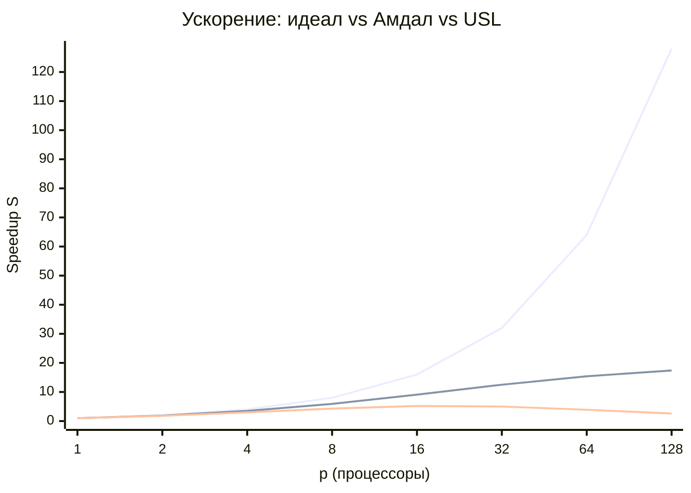
```mermaid
xychart-beta
  title "Ускорение: идеал vs Амдал vs USL"
  x-axis "p (процессоры)" [1, 2, 4, 8, 16, 32, 64, 128]
  y-axis "Speedup S" 0 --> 128
  line [1, 2, 4, 8, 16, 32, 64, 128]
  line [1, 1.9, 3.5, 5.9, 9.1, 12.5, 15.4, 17.4]
  line [1, 1.8, 3.0, 4.3, 5.2, 5.0, 3.9, 2.6]
```
*Верхняя — линейный идеал; средняя — Амдал ($a{=}0{,}05$, выходит на плато $\approx 20$); нижняя — USL с
ненулевым $\kappa$ (растёт, достигает максимума и спадает).*

---

## 6. Суперлинейное ускорение: не нарушает ли оно закон?

Иногда измеряют $S(p) > p$ — **суперлинейное** ускорение. Это *не* опровержение Амдала. Причины — обычно
**эффекты памяти**: при $p$ процессорах рабочий набор делится на $p$ частей, и каждая часть начинает помещаться
в кэш (L2/L3) данного ядра, тогда как на одном процессоре весь набор в кэш не влезал и постоянно ходил в DRAM.
Меняется **эффективная стоимость одной операции** — то есть фактически меняется $T_1$, относительно которого
считается ускорение. Реже причина — алгоритмическая (параллельный поиск раньше натыкается на решение).
Суперлинейность почти всегда говорит о том, что однопроцессорный baseline был неоптимален по памяти.

---

## 7. Что законы Амдала и Густафсона *не* учитывают

Это идеализации. В реальности добавляются накладные расходы, ни в одной формуле не отражённые:

- **создание/уничтожение потоков**, планирование, переключения контекста (см. билеты 04, 13);
- **синхронизация**: блокировки, атомики, барьеры — их стоимость растёт с $p$ (USL это частично ловит, чистый
  Амдал — нет);
- **дисбаланс нагрузки**: «параллельная часть» редко делится ровно на $p$ равных кусков;
- **коммуникация и пропускная способность памяти**: общая шина/контроллер памяти насыщается, ядра конкурируют
  за bandwidth;
- **NUMA**: доступ к «чужой» памяти дороже локальной;
- **false sharing**: переменные разных потоков в одной кэш-линии вызывают лишние инвалидации (см. билет 25).

Поэтому реальная кривая ускорения почти всегда ниже Амдала и часто имеет максимум, как у USL.

---

## 8. Код

```cpp
#include <cmath>
#include <print>   // C++23

// Закон Амдала: фиксированный размер задачи.
constexpr double amdahl(double a, int p) {
    return 1.0 / (a + (1.0 - a) / p);
}

// Закон Густафсона: масштабированная задача.
constexpr double gustafson(double s, int p) {
    return p - s * (p - 1);            // == s + p*(1 - s)
}

// Метрика Карпа–Флэтта: оценка эффективной последовательной доли
// из ИЗМЕРЕННОГО ускорения S на p процессорах.
constexpr double karp_flatt(double measured_speedup, int p) {
    const double S = measured_speedup;
    return (1.0 / S - 1.0 / p) / (1.0 - 1.0 / p);
}

// Universal Scalability Law (Gunther).
constexpr double usl(double sigma, double kappa, int p) {
    return p / (1.0 + sigma * (p - 1) + kappa * p * (p - 1));
}

int main() {
    std::println("Amdahl a=5%, p=16   : {:.2f}x  (потолок {:.1f}x)", amdahl(0.05, 16), 1.0 / 0.05);
    std::println("Gustafson s=5%, p=16: {:.2f}x", gustafson(0.05, 16));
    // Допустим, замерили S=9.0 на 16 ядрах -> какова эффективная послед. доля?
    std::println("Karp-Flatt(S=9, p=16): e = {:.4f}", karp_flatt(9.0, 16));
    std::println("USL sigma=.03 kappa=.001 p=64: {:.2f}x", usl(0.03, 0.001, 64));
}
```

---

## 9. Реальные задачи и как этим пользоваться

- **Решение «распараллеливать ли»**: сначала профилируйте, найдите доминирующую долю времени. Если она
  составляет, скажем, 60% (а 40% — принципиально последовательны), потолок $= 1/0{,}4 = 2{,}5\times$ — возможно,
  овчинка не стоит выделки, и время лучше потратить на алгоритм, а не на потоки.
- **HPC и weak scaling**: при покупке кластера считают по Густафсону — «во сколько раз более крупную сетку
  посчитаем». Бенчмарки делятся на *strong scaling* (та же задача, больше узлов — упирается в Амдала) и *weak
  scaling* (задача растёт пропорционально узлам — должна оставаться почти константной по времени).
- **Прогноз масштабируемости сервиса**: снимают latency/throughput на 1, 2, 4, 8… узлах, подгоняют USL,
  предсказывают $p^\*$ — после какого числа узлов добавлять железо вредно, и что лечить ($\sigma$ → убирать
  блокировки, $\kappa$ → убирать общую согласуемую структуру, шардировать).

---

## 10. Подводные камни

- **Доли $a$ у Амдала и Густафсона — это разные доли** (от $T_1$ vs от $T_p$). Подставлять одно число в обе
  формулы и «сравнивать» — методическая ошибка.
- **Амдал молчит про растущий оверхед синхронизации.** Если эксперимент расходится с Амдалом «в худшую
  сторону» сильнее ожидаемого — считайте Карпа–Флэтта: растущее $e$ выдаёт паразитный оверхед, а не
  фундаментальный предел.
- **Суперлинейность не магия** — это почти всегда кэш; не закладывайте её в проектные ожидания.
- **«Последовательная доля» может скрываться в библиотеках** (malloc под глобальным локом, логирование,
  единый mutex на структуру) — формально код «параллельный», а фактически сериализуется. См. билеты 15–18, 32.

---

## См. также

- Билет 04 (поток), 13 (syscall) — откуда берётся «невидимый» оверхед.
- Билет 25 (MESI), 38 (декомпозиция по данным) — пропускная способность памяти, false sharing, NUMA.
- Билеты 15–18, 32 — почему синхронизация увеличивает эффективную последовательную долю.


---

# Билет 02. SIMD-инструкции: SSE, AVX, AVX-512

> **На экзамен (кратко).**
> **SIMD** (Single Instruction, Multiple Data) — одна инструкция применяет операцию к **вектору** элементов
> сразу. На x86: **SSE** — регистры `xmm` 128 бит (4×`float` или 2×`double`); **AVX/AVX2** — `ymm` 256 бит
> (8×`float`); **AVX-512** — `zmm` 512 бит (16×`float`) плюс 8 **регистров-масок** `k0..k7` для
> поэлементного предикатного исполнения. Три способа применения: (1) **интринсики** (`_mm256_add_ps`),
> (2) **автовекторизация** компилятором, (3) **портируемые** типы `std::experimental::simd` (в C++26 —
> `std::simd`). Главные практические темы: **выравнивание**, **обработка хвоста** (длина не кратна ширине
> вектора), **маскирование**, штраф перехода **AVX↔SSE** и **снижение частоты** на AVX-512.

---

## 1. Зачем это нужно: data-level parallelism

В таксономии Флинна SIMD — отдельный класс параллелизма (наряду с SISD/MIMD). Идея проста: в численном коде мы
часто делаем **одну и ту же** операцию над массивом — сложить два массива, умножить на скаляр, посчитать
скалярное произведение. Скалярный код обрабатывает по одному элементу за инструкцию, **простаивая** широкий
исполнительный тракт ALU. SIMD-инструкция за **ту же** латентность обрабатывает 4/8/16 элементов — это почти
«бесплатное» ускорение пропускной способности на регулярных данных.

SIMD — это **параллелизм внутри одного потока/ядра** (отличается от потоков и процессов: см. билеты 04, 06).
Его можно и нужно сочетать с многопоточностью (декомпозиция по данным, билет 38) и с GPU (где DLP доведён до
предела).

---

## 2. Эволюция наборов инструкций x86

| Набор | Регистры | Ширина | `float`/`double` за такт* | Год / нюанс |
|---|---|---|---|---|
| MMX | `mm0..7` | 64 бит | целочисленный | 1997, делил регистры с x87 |
| SSE / SSE2 | `xmm0..15` | 128 бит | 4 / 2 | 1999/2000; SSE2 добавил `double` и целые |
| AVX | `ymm0..15` | 256 бит | 8 / 4 | 2011; трёхоперандный VEX-кодинг (`c = a + b`, не разрушая `a`) |
| AVX2 | `ymm` | 256 бит | 8 / 4 | 2013; целочисленный 256-бит, **FMA3**, gather |
| AVX-512 | `zmm0..31` | 512 бит | 16 / 8 | 2016; 32 регистра, маски `k0..7`, scatter |

\* Количество элементов в регистре, а не реальная пропускная способность портов (она зависит от числа
векторных FMA-портов в конкретном микроархитектурном ядре).

Важные архитектурные сдвиги:
- **VEX-кодирование (AVX)** ввело **неразрушающий** трёхоперандный формат: `vaddps ymm0, ymm1, ymm2`
  (раньше `addps xmm0, xmm1` затирал `xmm0`). Это уменьшает число пересылок.
- **FMA** (fused multiply-add): `a*b + c` за одну инструкцию с одним округлением — основа быстрых матумножений
  и свёрток.
- **AVX-512 — не монолит, а семейство подмножеств**: `F` (Foundation, базис, есть на всех AVX-512 CPU), плюс
  `DQ` (doubleword/quadword), `BW` (byte/word), `VL` (применить 512-битные операции к 128/256-битным
  регистрам), `CD` (conflict detection для scatter), `VNNI` (нейросетевые скалярные произведения) и др.
  Поэтому «поддерживает AVX-512» — недостаточная характеристика; проверяют конкретные биты CPUID.

### Маски в AVX-512 — это качественный скачок

До AVX-512 предикатное (условное) исполнение в SIMD делали через **blend** (вычисли обе ветви, потом смешай по
маске). AVX-512 ввёл **mask-регистры** `k0..k7`: почти каждая инструкция имеет вариант с маской, где бит
маски=0 означает «не трогать этот lane» (zeroing или merging). Это даёт настоящее поэлементное ветвление без
лишних вычислений и упрощает обработку **хвостов** (см. ниже): маской отключают «лишние» lanes за пределами
массива.

---

## 3. Три способа писать SIMD-код

### 3.1. Интринсики (максимальный контроль, минимальная переносимость)

Интринсики — это C-функции, отображаемые 1:1 в машинные инструкции, плюс типы `__m128/__m256/__m512` (и
`*i`/`*d` для целых/double). Полный контроль, но код привязан к конкретному ISA и нечитаем.

```cpp
#include <immintrin.h>
#include <cstddef>

// y[i] += a * x[i]  (AXPY) на AVX2 + FMA, непортируемо.
void axpy_avx2(float* y, const float* x, float a, std::size_t n) {
    const __m256 va = _mm256_set1_ps(a);          // широковещаем скаляр a во все 8 lanes
    std::size_t i = 0;
    for (; i + 8 <= n; i += 8) {                  // основной цикл по 8 элементов
        __m256 vx = _mm256_loadu_ps(x + i);       // unaligned load
        __m256 vy = _mm256_loadu_ps(y + i);
        vy = _mm256_fmadd_ps(va, vx, vy);         // vy = va*vx + vy (одно округление)
        _mm256_storeu_ps(y + i, vy);
    }
    for (; i < n; ++i) y[i] += a * x[i];          // ХВОСТ: скалярно добиваем остаток
}
```

Скалярное произведение требует **горизонтальной редукции** (сложить элементы внутри вектора) — она дороже и
делается «деревом»:

```cpp
float dot_avx2(const float* x, const float* y, std::size_t n) {
    __m256 acc = _mm256_setzero_ps();
    std::size_t i = 0;
    for (; i + 8 <= n; i += 8)
        acc = _mm256_fmadd_ps(_mm256_loadu_ps(x + i), _mm256_loadu_ps(y + i), acc);
    // горизонтальная сумма 8 lanes -> скаляр:
    __m128 lo = _mm256_castps256_ps128(acc);
    __m128 hi = _mm256_extractf128_ps(acc, 1);
    lo = _mm_add_ps(lo, hi);                       // 8 -> 4
    lo = _mm_hadd_ps(lo, lo);                      // 4 -> 2
    lo = _mm_hadd_ps(lo, lo);                      // 2 -> 1
    float s = _mm_cvtss_f32(lo);
    for (; i < n; ++i) s += x[i] * y[i];           // хвост
    return s;
}
```

### 3.2. Автовекторизация (просто, но хрупко)

Компилятор (`-O2/-O3 -march=native`) сам превращает скалярные циклы в SIMD. Это удобно, но ломается от любой
неопределённости. Главные враги:
- **возможный aliasing** (компилятор не знает, что `x` и `y` не пересекаются) — лечится `__restrict`;
- **зависимости по данным** между итерациями;
- неизвестная на компиляции **длина**/выравнивание;
- ветвления, побочные эффекты, вызовы функций в теле.

```cpp
// Подсказки компилятору: restrict + omp simd.
void axpy_auto(float* __restrict y, const float* __restrict x, float a, std::size_t n) {
    #pragma omp simd
    for (std::size_t i = 0; i < n; ++i) y[i] += a * x[i];
}
```
Полезно читать **отчёты векторизации** (`-fopt-info-vec` в GCC, `-Rpass=loop-vectorize` в Clang): они говорят,
*что* векторизовалось и *почему нет*.

### 3.3. Портируемый `std::simd` (золотая середина)

История стандартизации: библиотека **Vc** Маттиаса Кретца (CERN, ~2009) → предложение **P0214** (много
ревизий) → **Parallelism TS 2** (`std::experimental::simd`, поставлен в GCC 11, 2021) → **`std::simd` в
C++26** (P1928). Тип `native_simd<T>` сам подбирает ширину под целевой ISA (SSE/AVX/AVX-512/NEON), а операторы
перегружены поэлементно. Один и тот же исходник масштабируется между платформами.

```cpp
#include <experimental/simd>
namespace stdx = std::experimental;

void axpy_simd(float* y, const float* x, float a, std::size_t n) {
    using V = stdx::native_simd<float>;
    const V va = a;
    const std::size_t W = V::size();              // ширина в элементах: 4/8/16 в зависимости от ISA
    std::size_t i = 0;
    for (; i + W <= n; i += W) {
        V vx, vy;
        vx.copy_from(x + i, stdx::element_aligned);
        vy.copy_from(y + i, stdx::element_aligned);
        vy = va * vx + vy;                        // компилятор сложит в FMA
        vy.copy_to(y + i, stdx::element_aligned);
    }
    for (; i < n; ++i) y[i] += a * x[i];          // хвост
}
```

---

## 4. Выравнивание и память

SIMD-загрузки бывают **выровненные** (`_mm256_load_ps`, требует адрес, кратный 32 байтам для `ymm`) и
**невыровненные** (`loadu`). На современных ядрах разница невелика, *если* данные фактически выровнены, но
невыровненный доступ, **пересекающий границу кэш-линии** (64 байта), стоит дороже. Поэтому горячие буферы
выравнивают:

```cpp
alignas(64) float buf[1024];                       // выровнено по кэш-линии
float* p = static_cast<float*>(std::aligned_alloc(64, n * sizeof(float)));
```

Также важна **раскладка данных**: SIMD любит **SoA** (Structure of Arrays: отдельные массивы `xs[]`, `ys[]`,
`zs[]`), а не **AoS** (массив структур `{x,y,z}`), потому что соседние по памяти элементы одного поля грузятся в
один вектор без перетасовки.

---

## 5. Подводные камни уровня микроархитектуры

- **Штраф перехода AVX↔SSE.** Смешивание «легаси-SSE» (без VEX) и AVX-кода в горячем участке вызывает дорогие
  переходы состояния верхних половин `ymm`. Идиома — вставлять `_mm256_zeroupper()` (или собирать весь код с
  AVX-кодированием через `-mavx`) на границах, особенно перед вызовом библиотек, скомпилированных под SSE.
- **Снижение частоты на AVX-512.** На ряде серверных CPU (особенно Skylake-SP/Cascade Lake) интенсивный
  AVX-512-код **сбрасывает тактовую частоту** ядра (license-based downclocking), чтобы уложиться в тепловой
  бюджет. Иногда узкий AVX-512-кусок замедляет соседний скалярный код — выигрыш в SIMD «съедается» частотой.
  На более новых архитектурах ситуация лучше, но проверять надо измерением. (На некоторых клиентских CPU
  AVX-512 вовсе отключён в продакшене.)
- **Хвосты обязательны.** $n$ почти никогда не кратно ширине вектора. Либо скалярный «добивающий» цикл (как
  выше), либо маскированный доступ AVX-512 (одной инструкцией с маской `k`, отключающей лишние lanes) —
  последнее изящнее и без отдельной ветви.
- **gather/scatter дороги.** Сбор по индексам (`_mm256_i32gather_ps`) полезен, но заметно медленнее линейной
  загрузки; если можно перестроить данные в линейные, обычно стоит это сделать.
- **Точность и порядок суммирования.** Векторная редукция складывает элементы в другом порядке, чем скаляр →
  результат с плавающей точкой может **чуть отличаться** (некоммутативность округления). Для воспроизводимости
  это надо учитывать.

---

## 6. Реальные задачи

- **Обработка изображений/сигналов**: фильтры, свёртки, цветовые преобразования — классический SIMD по
  пикселям.
- **Линейная алгебра**: BLAS-ядра (GEMM) построены на FMA + блокировке под кэш + SIMD; ручные интринсики тут
  обгоняют наивную автовекторизацию в разы.
- **Научные вычисления**: например, пакет **Corrfunc** для корреляционных функций в космологии переписан на
  **AVX-512F**-интринсики ради ускорения подсчёта пар частиц — иллюстрация того, что в bandwidth-bound ядрах
  ручной SIMD оправдан.
- **Парсинг/строки**: simdjson использует SIMD для поиска структурных символов; поиск подстроки, валидация
  UTF-8.

---

## 7. Диаграмма: скаляр против SIMD

```
Скалярно (4 операции):              SIMD 128-бит (1 операция):
  a0 + b0 -> c0                       ┌──a3─a2─a1─a0──┐   xmm
  a1 + b1 -> c1            vaddps     +              +
  a2 + b2 -> c2          ───────►     └──b3─b2─b1─b0──┘
  a3 + b3 -> c3                       = c3 c2 c1 c0   (за одну инструкцию)
```

---

## См. также

- Билет 38 (декомпозиция по данным) — SIMD как нижний уровень data-параллелизма, сочетание с потоками.
- Билет 25 (MESI) — кэш-линии, выравнивание, false sharing.
- Билет 06 (потоки vs процессы) — SIMD это параллелизм *внутри* потока, ортогональный многопоточности.


---

# Билет 03. Понятие процесса

> **На экзамен (кратко).**
> **Процесс** — исполняющийся экземпляр программы со своим **виртуальным адресным пространством**, таблицей
> файловых дескрипторов, учётными данными (uid/gid), идентификатором PID и как минимум одним потоком
> выполнения. Изоляция адресных пространств обеспечивается **MMU** и **таблицами страниц** (у каждого
> процесса свои). В Linux процесс описывается структурой `task_struct`; создаётся через `fork()`
> (копирование адресного пространства по схеме **Copy-on-Write**), `clone()`, `posix_spawn()`, а образ
> заменяется через `execve()`. Завершившийся, но ещё не «прибранный» родителем процесс — **зомби**
> (`EXIT_ZOMBIE`); процесс, чей родитель умер, — **сирота**, его усыновляет `init`/PID 1.

---

## 1. Что такое процесс и зачем изоляция

**Программа** — это пассивный файл на диске (ELF). **Процесс** — это программа «в движении»: код плюс всё его
динамическое состояние (счётчик команд, стек, куча, открытые файлы, права). Ключевое свойство процесса —
**изоляция**: один процесс не может случайно (или злонамеренно) читать/портить память другого. Это даёт
надёжность (упавший процесс не роняет остальные) и безопасность.

Изоляция реализована аппаратно. Процессор работает с **виртуальными** адресами; блок управления памятью
(**MMU**) переводит их в физические по **таблицам страниц** конкретного процесса. У каждого процесса —
**собственный** корень таблиц страниц (на x86 его физический адрес лежит в регистре **`CR3`**). Переключение на
другой процесс меняет `CR3`, и тем самым меняется вся карта «виртуальный→физический» — процесс просто
**не может выразить** адрес чужой памяти. (Стоимость смены `CR3` — сброс TLB — разбирается в билете 06.)

---

## 2. Виртуальное адресное пространство процесса

Типичная раскладка (Linux, 64-бит, схематично, снизу вверх по адресам):

```
0xFFFF... ┌───────────────────────────┐
          │  kernel space (общий, но   │  недоступен из ring 3
          │  недоступен пользователю)  │
          ├───────────────────────────┤
          │  stack  ↓ (растёт вниз)     │  локальные переменные, кадры вызовов; guard page снизу
          │            ...              │
          │  mmap region                │  разделяемые библиотеки (.so), mmap-файлы, большие malloc
          │            ...              │
          │  heap   ↑ (растёт вверх)     │  brk/sbrk, малые malloc
          ├───────────────────────────┤
          │  .bss   (нулевые данные)    │  неинициализированные глобальные
          │  .data  (инициализир.)      │  глобальные с начальным значением
          │  .text  (код, read-only)    │  машинный код, обычно разделяется между процессами
0x0000... └───────────────────────────┘  нулевая страница не отображена (ловит разыменование nullptr)
```

Это **виртуальная** карта; физически страницы могут быть где угодно, частично в swap, частично ещё не выделены
(аллоцируются лениво при первом обращении — *demand paging*). `.text` одной и той же программы, запущенной
дважды, физически разделяется (одна копия кода на несколько процессов).

---

## 3. `task_struct`: как ядро видит процесс

В Linux **нет жёсткого разделения «процесс» и «поток»** на уровне планировщика — есть **задачи** (tasks),
каждая описана структурой `task_struct` (это и есть «дескриптор процесса/потока»). Поток — это задача, которая
**делит** с другими определённые ресурсы. Ключевые разделяемые подструктуры:

- `mm_struct` — адресное пространство (таблицы страниц, области VMA). Потоки одного процесса делят **один**
  `mm_struct`; у разных процессов он свой.
- `files_struct` — таблица файловых дескрипторов.
- сигнальные структуры, рабочая директория, кредиты и т. д.

Различие процесс/поток в Linux — это **какие из этих структур разделяются**. Полная изоляция (новый
`mm_struct`, новые `files_struct`, …) = «процесс»; разделение почти всего = «поток» (см. билет 04).

Идентификаторы: **PID** (в ядре — TGID, thread group id, общий у всех потоков процесса), **PPID** (родитель),
**PGID** (группа процессов — для управления заданиями в shell), **SID** (сессия).

---

## 4. Создание процесса: `fork()` и Copy-on-Write

`fork()` создаёт **почти точную копию** вызывающего процесса: возвращает в родителе PID потомка, в потомке — 0.

```cpp
#include <unistd.h>
#include <sys/wait.h>
#include <print>

int main() {
    pid_t pid = fork();
    if (pid < 0) {                 // ошибка (например, исчерпан лимит процессов)
        perror("fork");
        return 1;
    } else if (pid == 0) {         // ПОТОМОК
        std::println("child: pid={}", getpid());
        _exit(0);                  // именно _exit, не exit: не дёргать atexit/буферы дважды
    } else {                       // РОДИТЕЛЬ
        int status = 0;
        waitpid(pid, &status, 0);  // дождаться потомка, иначе он станет зомби
        std::println("parent: child exited, status={}", WEXITSTATUS(status));
    }
}
```

**Copy-on-Write (COW) — суть.** Наивная реализация `fork` копировала бы всё адресное пространство — дорого и
обычно бессмысленно (потомок часто сразу делает `exec`). Вместо этого ядро **не копирует страницы**, а:

1. Создаёт потомку **новые таблицы страниц**, указывающие на **те же физические** страницы, что у родителя.
2. Помечает все разделяемые страницы как **read-only** в обоих процессах и увеличивает их счётчики ссылок.
3. Пока оба только **читают** — всё работает на общих страницах, копий нет.
4. Как только **кто-то пишет** в COW-страницу, MMU генерирует **page fault** (запись в read-only). Обработчик
   ядра видит, что страница COW: выделяет **новую** физическую страницу, копирует туда содержимое, делает её
   writable у писавшего процесса, уменьшает счётчик исходной. Теперь у процессов **разные** копии этой
   страницы.

Так копируются только реально изменённые страницы — `fork` дёшев. Родственники: `vfork()` (потомок временно
делит память родителя и обязан сразу сделать `exec`/`_exit` — историческая оптимизация), `clone()` —
низкоуровневый системный вызов с флагами, точно задающими, что разделять (на нём строятся и `fork`, и потоки),
`posix_spawn()` — портируемая обёртка «fork+exec» без COW-ловушек.

---

## 5. Запуск новой программы: `execve()`

`fork` создаёт копию **той же** программы. Чтобы запустить **другую**, потомок вызывает `execve()` (или обёртки
`execlp`, `execvp`…): ядро **заменяет** образ процесса — сбрасывает старые `.text/.data/heap/stack`, загружает
новый ELF, и управление переходит на его точку входа. PID **сохраняется**, открытые дескрипторы по умолчанию
наследуются (если не помечены `FD_CLOEXEC`). Классическая идиома shell — `fork` + `exec`:

```cpp
if (pid_t p = fork(); p == 0) {
    execlp("ls", "ls", "-l", nullptr);   // если вернулось — exec не удался
    _exit(127);                           // важно: иначе потомок продолжит код родителя
}
```

При успехе `execve` **не возвращается** (возвращаемого кода нет — нечему возвращаться); возврат означает ошибку.

---

## 6. Состояния процесса и жизненный цикл

Основные состояния задачи в Linux:

| Состояние | Что значит |
|---|---|
| `TASK_RUNNING` | исполняется на CPU или готов и ждёт планировщика (в run-queue) |
| `TASK_INTERRUPTIBLE` | спит, ожидая событие; может быть разбужен сигналом |
| `TASK_UNINTERRUPTIBLE` | спит, **не** реагируя на сигналы (обычно короткое ожидание устройства; такие процессы видны как `D` и не убиваются даже `SIGKILL`) |
| `__TASK_STOPPED` | остановлен (`SIGSTOP`/Ctrl-Z) |
| `EXIT_ZOMBIE` | завершился, но запись ещё жива — ждёт `wait()` родителя |
| `EXIT_DEAD` | финальное снятие записи |

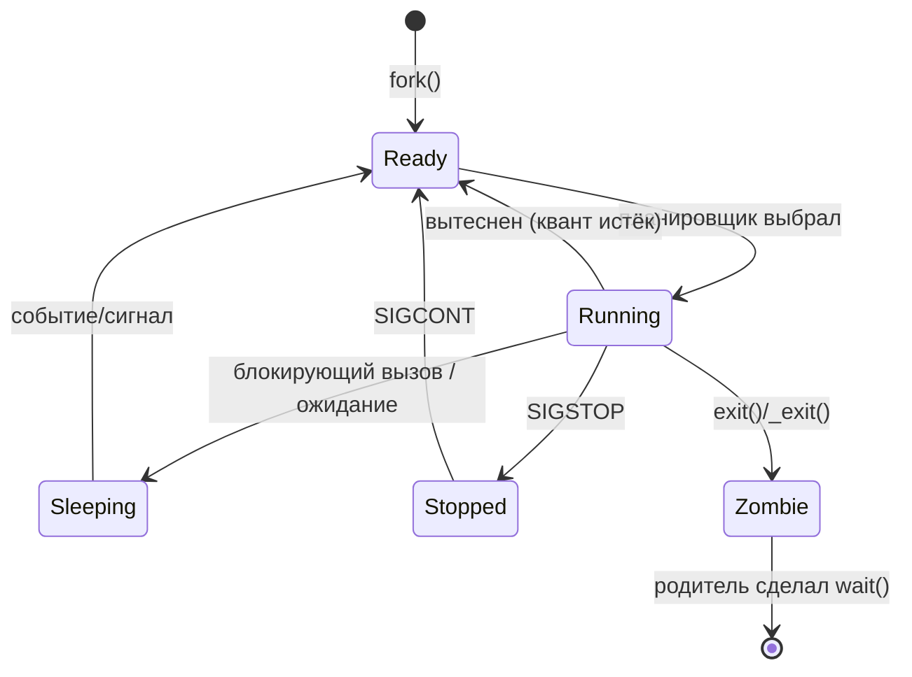
```mermaid
stateDiagram-v2
  [*] --> Ready: fork()
  Ready --> Running: планировщик выбрал
  Running --> Ready: вытеснен (квант истёк)
  Running --> Sleeping: блокирующий вызов / ожидание
  Sleeping --> Ready: событие/сигнал
  Running --> Stopped: SIGSTOP
  Stopped --> Ready: SIGCONT
  Running --> Zombie: exit()/_exit()
  Zombie --> [*]: родитель сделал wait()
```

---

## 7. Зомби и сироты

**Зомби** (`EXIT_ZOMBIE`) — процесс завершился, освободил почти все ресурсы, но в таблице процессов **остаётся
запись** с кодом возврата, ожидающая, что родитель его прочитает через `wait()`/`waitpid()`. Зомби не занимает
память/CPU, но занимает **слот PID**. Если родитель долго не делает `wait`, зомби копятся и могут исчерпать
лимит PID — типичная утечка в плохо написанных демонах. Завершение зомби — ответственность родителя; уведомление
о смерти потомка приходит сигналом **`SIGCHLD`**.

**Сирота** — процесс, чей родитель умер **раньше** него. Сироту немедленно **усыновляет** `init`/`systemd`
(PID 1) (или ближайший «subreaper»), который регулярно делает `wait` и не даёт сиротам превратиться в вечных
зомби.

**Идиома демона — double fork.** Чтобы корректно «отвязаться» от терминала и не оставлять зомби, демоны делают
двойной `fork`: первый потомок создаёт новую сессию (`setsid`), форкает второго и сразу умирает; второй
становится сиротой и усыновляется `init`, гарантированно прибираясь системой.

---

## 8. Реальные задачи

- **Оболочка (shell)**: на каждую команду — `fork` + `exec`; конвейеры (`a | b`) строятся форком нескольких
  процессов и связыванием их `pipe` (билет 05).
- **Преforking-серверы** (классический Apache MPM prefork, PostgreSQL): мастер форкает воркеров; изоляция
  процессами повышает надёжность (краш одного соединения не роняет остальные) ценой памяти/IPC.
- **Браузеры** (Chrome): процесс на вкладку/сайт ради изоляции и безопасности (билет 06).
- **Контейнеры**: тот же `clone()` с дополнительными флагами **namespaces** (`CLONE_NEWNS`, `CLONE_NEWPID`,
  `CLONE_NEWNET`…) изолирует не только память, но и вид на ФС/сеть/PID — основа Docker/runc.

---

## 9. Подводные камни

- **Зомби** при отсутствии `wait`/`SIGCHLD`-обработчика — медленная утечка PID.
- **`fork` в многопоточной программе копирует только вызывающий поток** — остальные «исчезают», а удерживаемые
  ими мьютексы остаются навечно занятыми → **deadlock после fork** (подробно в билете 19). После `fork` в
  потомке безопасно делать только **async-signal-safe** действия, в идеале сразу `exec`.
- **`exit` vs `_exit` в потомке**: `exit()` дёргает `atexit`-хендлеры и сбрасывает stdio-буферы, которые
  унаследованы от родителя — двойной flush, дубли вывода. В потомке после `fork` (до `exec`) используют
  `_exit()`.
- **Наследование дескрипторов**: забытый `FD_CLOEXEC` — утечка открытых файлов/сокетов в дочернюю программу
  (и потенциальная дыра безопасности).
- **Fork-бомба**: неконтролируемый `fork` в цикле исчерпывает таблицу процессов (защита — `ulimit -u`,
  cgroups `pids.max`).

---

## См. также

- Билет 04 (поток) — что именно «не копируется» при создании потока против процесса.
- Билет 06 (потоки vs процессы) — TLB, стоимость переключения, выбор модели.
- Билет 05 (IPC) — как изолированные процессы общаются.
- Билет 19 (deadlock) — deadlock при `fork` в многопоточной программе.


---

# Билет 04. Понятие потока

> **На экзамен (кратко).**
> **Поток** (thread) — единица **планирования** внутри процесса. Потоки одного процесса **разделяют**
> адресное пространство, кучу и таблицу файловых дескрипторов, но у каждого — **свой стек, набор регистров
> (включая счётчик команд), thread-local storage (TLS) и приоритет**. В Linux потоки реализованы как задачи,
> созданные `clone()` с флагами `CLONE_VM | CLONE_FILES | CLONE_SIGHAND | CLONE_THREAD | …`; модель **1:1**
> (NPTL) — каждому пользовательскому потоку соответствует один поток ядра. Переключение между потоками одного
> процесса **дешевле**, чем между процессами: не меняется `CR3`, **TLB не сбрасывается** (см. билет 06).
> В C++ современная идиома — **`std::jthread`** (автоматический `join` + кооперативная отмена через
> `std::stop_token`).

---

## 1. Зачем нужны потоки

Процессы изолированы, но за изоляцию платят: общение через IPC (копирование/сериализация), дорогое создание и
переключение. Часто нужно ровно противоположное — **дешёвый общий доступ к одним данным** из нескольких
параллельных «линий исполнения»: веб-сервер, обрабатывающий тысячи соединений над общим кэшом; UI-поток плюс
фоновый рабочий; параллельная обработка массива в общей памяти. Это и есть ниша потоков: **параллелизм с общей
памятью внутри одного процесса**.

Цена общей памяти — необходимость **синхронизации** (мьютексы, атомики, барьеры — билеты 07–14, 25–26) и риск
**гонок** (билет 20). Вся остальная часть курса, по сути, про то, как безопасно и эффективно работать с этой
общей памятью.

---

## 2. Что поток разделяет, а что нет

| Разделяется (общее на процесс) | Приватно у каждого потока |
|---|---|
| виртуальное адресное пространство (`mm_struct`): код, **куча**, глобальные | **стек** (свой кадр вызовов) |
| таблица файловых дескрипторов | **регистры**, включая PC и SP |
| обработчики сигналов, рабочая директория, кредиты | **TLS** (`thread_local`) |
| PID (TGID) | **TID** (идентификатор потока), приоритет, affinity |

Именно из «общая куча + общие глобальные, но свой стек» вытекают практические правила: указатель на стек
другого потока опасен (его кадр может исчезнуть), а данные на куче доступны всем (нужна синхронизация).

---

## 3. Реализация в Linux: NPTL и модель 1:1

Современный Linux использует **NPTL** (Native POSIX Thread Library) — модель **1:1**: каждый
пользовательский поток = отдельная **задача ядра** (`task_struct`), которую планирует ядро. Поток создаётся тем
же `clone()`, что и процесс, но с набором флагов разделения:

```
CLONE_VM       — общий mm_struct (одно адресное пространство)
CLONE_FILES    — общая таблица дескрипторов
CLONE_FS       — общая рабочая директория/umask
CLONE_SIGHAND  — общие обработчики сигналов
CLONE_THREAD   — та же thread group (общий PID/TGID, свой TID)
CLONE_SETTLS   — настроить TLS нового потока
```

У всех потоков процесса **общий PID (TGID)**, но **разные TID** (`gettid()`). С точки зрения планировщика
все они равноправные задачи — отсюда и тезис «в Linux поток это процесс, делящий ресурсы».

**Альтернативные модели** (для понимания, почему 1:1 победила):
- **N:1** (много пользовательских потоков на один ядровый, «green threads»): переключение в userspace очень
  дёшево, но **один блокирующий syscall блокирует все** потоки, и нет реального параллелизма на нескольких
  ядрах.
- **M:N** (мультиплексирование M пользовательских на N ядровых): теоретически лучшее из обоих, но крайне
  сложно реализовать корректно (исторический Scheduler Activations, Solaris LWP); Linux отказался от M:N в
  пользу простой и предсказуемой 1:1.

Сегодня «лёгкие» сопрограммы (fibers/корутины, билеты 36, 40) — это возврат идеи дешёвого пользовательского
переключения **поверх** 1:1-потоков, но уже как осознанный инструмент для I/O-bound нагрузки, а не как замена
ядровым потокам.

---

## 4. Стек потока

Каждый поток имеет **свой стек** (по умолчанию в Linux обычно ~8 МБ, настраивается `pthread_attr_setstacksize`).
Снизу стека — **guard page** (неотображённая страница): при переполнении стека обращение к ней даёт `SIGSEGV`,
а не молчаливую порчу соседней памяти. Практические следствия: тысячи потоков × мегабайты стека = десятки
гигабайт виртуальной памяти (ещё одна причина не делать «поток на соединение» при C10k — билеты 35–36); глубокая
рекурсия упирается в лимит стека.

---

## 5. Thread-Local Storage (TLS)

**TLS** — переменные, у которых **своя копия в каждом потоке** (`thread_local` в C++, `__thread` в GCC). Доступ
к TLS реализован через сегментный регистр (`%fs` на x86-64 в Linux): база `%fs` указывает на TLS-блок текущего
потока, и компилятор кэширует/вычисляет адреса `thread_local`-переменных относительно неё. Типичные применения:
per-thread буферы, счётчики, кэши, контекст логирования, идентификатор потока в пуле.

Важная архитектурная деталь, всплывающая в билете 36: компиляторы **кэшируют адрес TLS** в регистрах между
вызовами для скорости. Поэтому **stackful-сопрограммы запрещают миграцию между потоками** (после переезда
кэшированный `%fs`-адрес стал бы неверным) — «invalidating cached TLS pointers across every opaque function call
is deemed unacceptable overhead».

```cpp
thread_local int request_id = 0;   // своя копия в каждом потоке
```

---

## 6. Поток в C++: `std::thread` → `std::jthread`

`std::thread` (C++11) — обёртка над ядровым потоком. Его слабое место: если объект разрушается **joinable**
(не сделан `join()`/`detach()`), вызывается `std::terminate()` — программа падает. C++20 ввёл **`std::jthread`**,
который в деструкторе сам делает `request_stop()` и `join()`, и поддерживает **кооперативную отмену**:

```cpp
#include <thread>
#include <print>

void worker(std::stop_token st) {
    while (!st.stop_requested()) {        // периодически проверяем запрос остановки
        // ... короткий кусок работы ...
    }
    std::println("worker: stop requested, выходим чисто");
}

int main() {
    std::jthread t{worker};               // токен остановки передаётся автоматически
    // ... что-то делаем ...
    // деструктор t: t.request_stop(); t.join();  — ничего не забудем
}
```

`std::thread::hardware_concurrency()` подсказывает число аппаратных потоков (для размера пула — билет 37).
Состояния потока: **joinable** (есть связанный ход исполнения, нужно `join`/`detach`) и не-joinable. `detach()`
«отвязывает» поток (он живёт сам по себе) — обычно нежелательно: теряется контроль над временем жизни.

Кооперативная отмена — это **единственный** корректный способ «остановить» поток в C++ (принудительного
«убийства» нет, в отличие от `pthread_cancel`, см. билет 08), потому что насильственное прерывание в произвольной
точке оставило бы инварианты/мьютексы в неопределённом состоянии.

---

## 7. Планирование

Поток в каждый момент либо **исполняется** на ядре, либо **готов** (в очереди планировщика), либо **спит**
(ждёт событие/блокировку). В Linux политики: `SCHED_OTHER` (обычная, CFS — Completely Fair Scheduler, по
умолчанию), `SCHED_FIFO`/`SCHED_RR` (реального времени, с приоритетами — релевантно инверсии приоритетов, билет
21), `SCHED_IDLE`. Привязка к ядрам — **affinity** (`pthread_setaffinity_np`) — полезна для кэш-локальности и
NUMA, но мешает балансировке.

**Переключение контекста потока** того же процесса: сохранить регистры старого, восстановить регистры нового;
`CR3` **не меняется** (общий `mm_struct`), поэтому **TLB сохраняется** — это и есть главное преимущество в
стоимости перед переключением процессов (детали и PCID — билет 06).

---

## 8. Реальные задачи и подводные камни

**Где применять.** Серверы запросов с общим состоянием (пулы потоков — билет 37), параллельная численная
обработка (декомпозиция по данным/задачам — билеты 38–39), вынос блокирующей работы из UI-потока.

**Подводные камни.**
- **`std::thread` без `join`/`detach`** → `std::terminate`. Используйте `std::jthread`.
- **Переподписка** (oversubscription): потоков много больше ядер у CPU-bound нагрузки → лишние переключения
  контекста, давление на кэш, падение производительности. Для CPU-bound число потоков ≈ числу ядер.
- **Исчерпание памяти стеками** при тысячах потоков; для масштаба I/O — асинхронность/корутины (билеты 35–36).
- **False sharing**: переменные разных потоков в одной кэш-линии → лишние инвалидации MESI (билет 25);
  лечится выравниванием (`alignas(std::hardware_destructive_interference_size)`).
- **Гонки на общей памяти** — основная опасность совместного доступа (билет 20); любой неатомарный общий
  доступ с записью требует синхронизации.
- **Опасные ссылки на стек** другого потока: его кадр может исчезнуть; передавайте данные через кучу/`shared_ptr`
  или захватом по значению.

---

## См. также

- Билет 03 (процесс) — что разделяется при `clone`/`fork`.
- Билет 06 (потоки vs процессы) — TLB/PCID, стоимость переключения, выбор модели.
- Билет 08 (завершение) — `join`/`cancel`/`stop_token`.
- Билеты 11–14, 25–26 — синхронизация общей памяти; 20 — гонки.


---

# Билет 05. IPC — межпроцессное взаимодействие

> **На экзамен (кратко).**
> **IPC** (Inter-Process Communication) — механизмы обмена данными и уведомлениями между **изолированными**
> процессами. Восемь категорий: **(1) файлы**, **(2) каналы (pipes/FIFO)**, **(3) сокеты**,
> **(4) разделяемая память (shared memory)**, **(5) сигналы**, **(6) семафоры**, **(7) D-Bus (Linux)**,
> **(8) оконные сообщения (Windows)**. Ось сравнения: *что передаётся* (поток байт / сообщения / общая память
> / уведомление-номер), *направление* (одно-/двунаправленный), *скорость*, *синхронность*. Самый быстрый —
> **shared memory** (нет копирования через ядро), но он **не несёт синхронизации** — её добавляют семафорами
> или мьютексами в самой разделяемой памяти.

---

## 1. Зачем и общая картина

Процессы изолированы (билет 03): прямой доступ к чужой памяти невозможен. Значит, для совместной работы нужен
**санкционированный ядром** канал. Механизмы IPC различаются тем, **что** именно передаётся и **через что**:

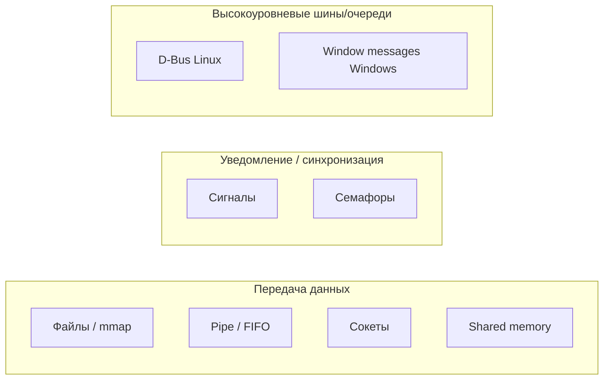
```mermaid
graph LR
  subgraph "Передача данных"
    F[Файлы / mmap]
    P[Pipe / FIFO]
    S[Сокеты]
    SHM[Shared memory]
  end
  subgraph "Уведомление / синхронизация"
    SIG[Сигналы]
    SEM[Семафоры]
  end
  subgraph "Высокоуровневые шины/очереди"
    DB[D-Bus Linux]
    WM[Window messages Windows]
  end
```

Грубая иерархия по «уровню»: shared memory + семафор — самый низкоуровневый и быстрый тандем; pipe/сокеты —
удобный поток байт; D-Bus/оконные сообщения — высокоуровневые сообщения с маршрутизацией.

---

## 2. (1) Файлы

Простейший IPC: один процесс пишет в файл, другой читает. Координацию дают **advisory-блокировки** (`flock`,
`fcntl(F_SETLK)`). Разновидность — **файл, отображённый в память** (`mmap`): процессы отображают один файл и
обращаются к нему как к массиву в памяти (фактически это уже почти shared memory, см. п. 5).

Плюсы: персистентность, простота, переживает завершение процессов. Минусы: медленно (через ФС/страничный кэш),
нужна явная координация, нет «уведомления о новых данных» (опрос или `inotify`).

---

## 3. (2) Каналы (pipes) и FIFO

**Анонимный pipe** (`pipe()`) — однонаправленный буфер «байтовый поток» между **родственными** процессами
(передаётся по наследству через `fork`). Это механизм shell-конвейеров `a | b`:

```cpp
#include <unistd.h>
int fd[2];
pipe(fd);                       // fd[0] — чтение, fd[1] — запись
if (fork() == 0) {              // потомок-писатель
    close(fd[0]);
    write(fd[1], "hello", 5);
    close(fd[1]); _exit(0);
} else {                        // родитель-читатель
    close(fd[1]);
    char buf[16]; ssize_t n = read(fd[0], buf, sizeof buf);
    close(fd[0]);
}
```

**Named pipe (FIFO)** (`mkfifo`) — имеет имя в ФС, поэтому связывает **неродственные** процессы. Семантика та
же: поток байт, обычно однонаправленный.

Подводный камень: запись в pipe, у которого закрыт читающий конец, шлёт писателю **`SIGPIPE`** (по умолчанию —
завершение процесса); часто его игнорируют и обрабатывают `EPIPE`.

---

## 4. (3) Сокеты

Сокеты — **двунаправленный** канал, единый API для локального и сетевого IPC.

- **Unix-domain sockets** (`AF_UNIX`): локальные, быстрые (не проходят сетевой стек). Уникальная возможность —
  **передача файловых дескрипторов между процессами** через вспомогательные данные `SCM_RIGHTS` (например,
  мастер принимает соединение и передаёт готовый сокет воркеру). Бывают потоковые (`SOCK_STREAM`) и
  датаграммные (`SOCK_DGRAM`).
- **Сетевые сокеты** (`AF_INET`/`AF_INET6`): TCP (надёжный поток) / UDP (датаграммы); работают и между
  машинами.

```cpp
#include <sys/socket.h>
int sv[2];
socketpair(AF_UNIX, SOCK_STREAM, 0, sv);   // двунаправленная локальная «труба» (full-duplex)
// sv[0] и sv[1] симметричны: можно писать и читать с обоих концов
```

Плюсы: двунаправленность, единая модель для сети, отлично сочетается с `epoll`/IOCP (билет 35). Минусы: данные
копируются через ядро (медленнее shared memory), для сетевых — накладные расходы стека.

---

## 5. (4) Разделяемая память (shared memory) — самый быстрый IPC

Несколько процессов отображают **один и тот же** физический регион в свои адресные пространства и обращаются к
нему **напрямую**, без копирования через ядро на каждой операции. Поэтому это **самый быстрый** IPC. Два API:
**POSIX** (`shm_open` + `mmap`, объект виден как `/dev/shm/...`) и **System V** (`shmget`/`shmat`).

```cpp
#include <sys/mman.h>
#include <fcntl.h>
#include <unistd.h>

int fd = shm_open("/myseg", O_CREAT | O_RDWR, 0600);
ftruncate(fd, 4096);
void* p = mmap(nullptr, 4096, PROT_READ | PROT_WRITE, MAP_SHARED, fd, 0);
// *p теперь общая память; писать/читать как обычный буфер
// ... работа ...
munmap(p, 4096);
shm_unlink("/myseg");          // ВАЖНО: иначе сегмент переживёт процессы (утечка)
```

**Ключевой нюанс: shared memory НЕ содержит синхронизации.** Два процесса, одновременно пишущие в один регион, —
это гонка ровно как у потоков (билет 20). Поэтому в разделяемую память **кладут** примитив синхронизации:
семафор (п. 7) или мьютекс с атрибутом `PTHREAD_PROCESS_SHARED`:

```cpp
pthread_mutexattr_t a;
pthread_mutexattr_init(&a);
pthread_mutexattr_setpshared(&a, PTHREAD_PROCESS_SHARED); // мьютекс ЖИВЁТ в shared memory
pthread_mutex_init(reinterpret_cast<pthread_mutex_t*>(p), &a);
```

Плюсы: максимальная скорость, годится для больших объёмов (БД, мультимедиа). Минусы: ручная синхронизация и
очистка, нет встроенной семантики «сообщений».

---

## 6. (5) Сигналы

Сигнал — **асинхронное уведомление** процессу: ядро или другой процесс (`kill(pid, sig)`) доставляет **номер**
сигнала, прерывая обычное исполнение и запуская обработчик. Примеры: `SIGINT` (Ctrl-C), `SIGTERM` (вежливое
завершение), `SIGKILL` (неотменяемое), `SIGCHLD` (потомок завершился — связь с зомби, билет 03), `SIGSEGV`.

```cpp
#include <csignal>
volatile std::sig_atomic_t stop = 0;
void handler(int) { stop = 1; }            // ТОЛЬКО async-signal-safe действия!
int main() {
    std::signal(SIGTERM, handler);          // лучше sigaction (точнее семантика)
    while (!stop) { /* работа */ }
}
```

Обычные сигналы несут только номер. **Real-time сигналы** (`SIGRTMIN..SIGRTMAX`) могут нести значение
(`sigqueue`, `siginfo_t`) и **ставятся в очередь** (обычные могут «сливаться»).

Подводные камни: в обработчике разрешены **только async-signal-safe** функции (нельзя `malloc`, `printf`,
большинство libc); гонки через `errno` (сохранять/восстанавливать); прерывание syscall сигналом даёт `EINTR`
(нужен повтор). Сигналы — это **уведомление/управление**, а не транспорт данных.

---

## 7. (6) Семафоры

Семафор (счётчик Дейкстры; определение и теория — билет 07) используется как **межпроцессный** примитив
синхронизации, чаще всего в паре с shared memory. Бывают **именованные** (`sem_open("/name")` — видны
неродственным процессам по имени) и **безымянные** (`sem_init` в общей памяти). System V предлагает свой
интерфейс (`semget`/`semop`) с массивами семафоров.

```cpp
#include <semaphore.h>
sem_t* s = sem_open("/mysem", O_CREAT, 0600, 1);  // начальное значение 1 = бинарный
sem_wait(s);    /* критическая секция над shared memory */   sem_post(s);
sem_close(s);   sem_unlink("/mysem");
```

Семафор сам по себе данных не переносит — он **координирует** доступ к данным, лежащим, например, в shared
memory (классика: один семафор «есть место», другой «есть данные» для кольцевого буфера producer/consumer).

---

## 8. (7) D-Bus (Linux)

**D-Bus** — высокоуровневая **шина сообщений** для десктопа и системных сервисов Linux. Архитектура: демон-шина,
к которой подключаются процессы; есть **системная** шина (общесистемные сервисы: NetworkManager, systemd,
управление питанием) и **сессионная** (приложения пользователя). Адресация сообщения: **bus name** (например
`org.freedesktop.NetworkManager`) → **object path** (`/org/freedesktop/...`) → **interface** → **member** (метод
или сигнал).

D-Bus поддерживает две модели: **вызовы методов** (адресный запрос-ответ, как RPC) и **сигналы** (broadcast —
подписавшиеся процессы получают уведомление, например «громкость изменилась», «появилась сеть»). Есть
интроспекция (объект описывает свои методы). Активно используется **systemd** и десктопными окружениями
(GNOME/KDE).

Плюсы: типизированные сообщения, маршрутизация, события (pub/sub), service activation (демон стартует по
запросу). Минусы: оверхед против сырых сокетов; это про **управление и события**, не про высокопроизводительный
поток данных.

---

## 9. (8) Оконные сообщения (Windows)

В Windows GUI-процессы взаимодействуют через **очередь сообщений окна**. Каждому окну принадлежит очередь;
сообщения (`WM_PAINT`, `WM_COMMAND`, `WM_COPYDATA`, пользовательские) кладутся в неё и разбираются циклом
сообщений (`GetMessage`/`DispatchMessage`). Способы отправки:

- **`PostMessage`** — асинхронно: кладёт сообщение в очередь и сразу возвращается (отправитель не ждёт
  обработки).
- **`SendMessage`** — синхронно: блокирует отправителя, пока оконная процедура **не обработает** сообщение
  (возвращает результат обработки).

Для передачи данных между процессами используют, например, `WM_COPYDATA`. Это естественный для Windows
механизм событийного взаимодействия GUI; концептуальный аналог событийных уведомлений (как сигналы/D-Bus в
*nix), но завязанный на оконную модель.

---

## 10. Сводное сравнение

| Механизм | Что передаёт | Направление | Скорость | Синхронизация | Типичное применение |
|---|---|---|---|---|---|
| Файлы / mmap-файл | байты / страницы | дв. | низко/высоко | внешняя (locks) | логи, персист, обмен большими данными |
| Pipe / FIFO | поток байт | одно | средне | поток как очередь | конвейеры shell |
| Unix-socket | байты + **передача fd** | дв. | высоко | поток как очередь | локальные сервисы, мастер→воркер |
| TCP/UDP socket | байты/датаграммы | дв. | ниже | поток | сеть, распределённость |
| **Shared memory** | общая память | дв. | **максимум** | **нужна явная** (sem/mutex) | БД, мультимедиа, большие объёмы |
| Сигналы | номер (RT: + значение) | одно | — | — | управление, уведомления |
| Семафоры | — (счётчик) | — | — | **сами и есть** | координация SHM, producer/consumer |
| D-Bus | типизир. сообщения | дв., pub/sub | средне | — | desktop/systemd, события |
| Window messages | сообщения окна | дв. | — | очередь | GUI Windows |

---

## 11. Реальные задачи и подводные камни

- **Producer/consumer между процессами**: shared memory (кольцевой буфер) + два семафора («есть место» / «есть
  данные») — классическая высокопроизводительная связка.
- **Мастер/воркеры**: принять соединение в мастере и **передать дескриптор** воркеру через Unix-socket
  `SCM_RIGHTS` (так делают nginx, systemd socket activation).
- **Координация демонов и десктопа**: D-Bus (события «сеть появилась», «батарея разряжена»).

Подводные камни (сводно): **`SIGPIPE`** при записи в закрытый pipe/socket; **async-signal-safety** в
обработчиках сигналов; **очистка** именованных объектов (`shm_unlink`, `sem_unlink`) — иначе утечка в `/dev/shm`;
shared memory **без синхронизации** = гонка; разные процессы могут иметь регион по **разным виртуальным
адресам** → внутри shared memory нельзя хранить «сырые» указатели, только смещения/offset-указатели.

---

## См. также

- Билет 03 (процесс), 06 (потоки vs процессы) — почему вообще нужен IPC.
- Билет 07 (семафор — определение), 11 (мьютекс), 20 (гонки) — синхронизация для shared memory.
- Билет 35 (async I/O) — сокеты и `epoll`/IOCP.


---

# Билет 06. Сравнение параллелизма на потоках и процессах. TLB

> **На экзамен (кратко).**
> **Потоки** делят адресное пространство → дешёвое общение и **дешёвое переключение** (не меняется `CR3`,
> **TLB не сбрасывается**), но падение/порча в одном потоке роняет весь процесс. **Процессы** изолированы
> (надёжность, безопасность), но общение идёт через IPC, а переключение **дорого** (смена `CR3` → сброс TLB).
> **TLB** (Translation Lookaside Buffer) — кэш переводов «виртуальный адрес → физический»; его сброс при
> смене процесса вызывает дорогие промахи (page walk). **PCID/ASID** (теги адресного пространства) позволяют
> *не* сбрасывать TLB целиком при переключении.

---

## 1. Постановка: два способа получить параллелизм

Нам нужны несколько одновременных линий исполнения. Есть два пути:
- **много потоков в одном процессе** — общая память, тесная связь;
- **много процессов** — изоляция, слабая связь через IPC.

Выбор — это компромисс **скорость/связность ↔ надёжность/безопасность**. Чтобы обосновать его количественно,
нужно понять, *почему* переключение процессов дороже переключения потоков. Главная причина — **TLB**.

---

## 2. TLB: что это и почему он критичен

Процессор работает с **виртуальными** адресами; MMU переводит каждый в физический по **таблицам страниц**.
Таблицы многоуровневые (на x86-64 — 4–5 уровней), и полный перевод одного адреса — это **page walk**: несколько
последовательных обращений к памяти, чтобы пройти уровни. Делать это на **каждый** доступ было бы катастрофой по
скорости.

Поэтому есть **TLB** — небольшой ассоциативный кэш уже выполненных переводов «виртуальная страница → физический
кадр». Попадание в TLB — перевод почти бесплатен; промах — дорогой page walk (десятки-сотни тактов). TLB обычно
многоуровневый (L1 TLB на десятки записей, L2 TLB на тысячи), отдельный для кода и данных.

**Ключевая проблема:** TLB-записи привязаны к **конкретному** адресному пространству. Виртуальный адрес
`0x400000` у процесса A и у процесса B указывает на **разную** физическую память. Значит, при переключении на
другой процесс старые переводы становятся **неверными**.

---

## 3. Переключение контекста: потоки против процессов

**Переключение между потоками одного процесса:**
- сохранить регистры старого потока, восстановить регистры нового;
- `CR3` (корень таблиц страниц) **не меняется** — адресное пространство **то же**;
- → **TLB остаётся валиден**, его не сбрасывают; кэши «тёплые».

**Переключение между процессами:**
- сохранить/восстановить регистры;
- **сменить `CR3`** на таблицы нового процесса;
- → без специальных мер **весь TLB надо считать невалидным** (исторически — полный flush). После переключения
  первые обращения к памяти — каскад TLB-промахов и page walks; «холодный старт».

Именно поэтому переключение процессов **дороже**: не сам факт смены регистров, а **потеря TLB** (и частично
кэшей данных/инструкций) ведёт к шлейфу промахов после переключения.

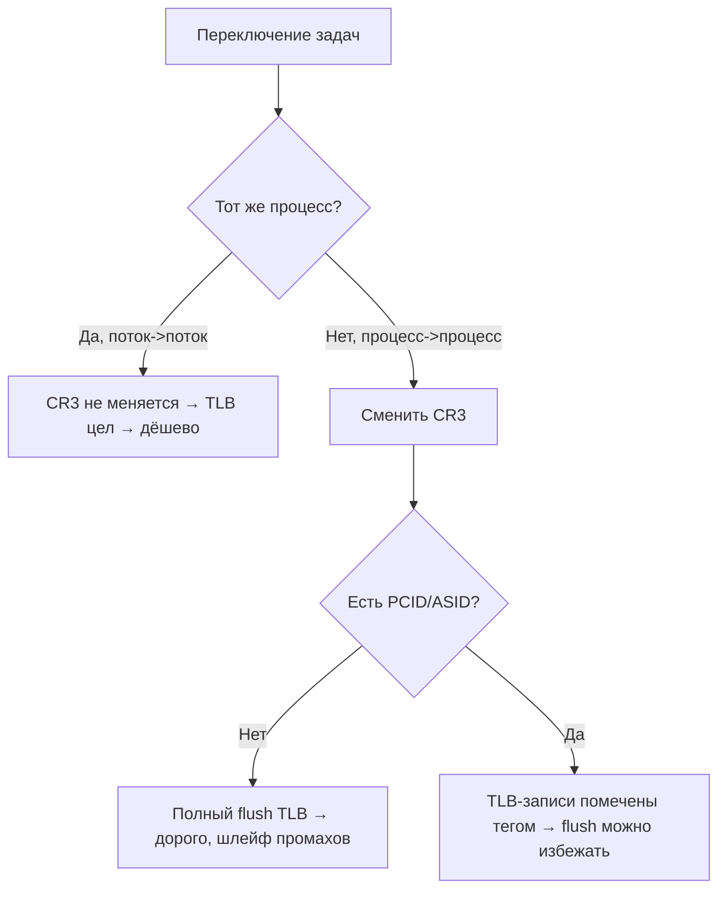
```mermaid
graph TD
  A[Переключение задач] --> Q{Тот же процесс?}
  Q -->|Да, поток->поток| K[CR3 не меняется → TLB цел → дёшево]
  Q -->|Нет, процесс->процесс| C[Сменить CR3]
  C --> P{Есть PCID/ASID?}
  P -->|Нет| F[Полный flush TLB → дорого, шлейф промахов]
  P -->|Да| T[TLB-записи помечены тегом → flush можно избежать]
```

---

## 4. PCID/ASID: как смягчили стоимость

Чтобы не сбрасывать TLB при каждой смене процесса, в железо добавили **теги адресного пространства**: на x86 —
**PCID** (Process-Context Identifier), на ARM — **ASID** (Address Space Identifier). Идея: каждая TLB-запись
**помечается** идентификатором адресного пространства, которому принадлежит. При смене `CR3` процессор не
выбрасывает чужие записи, а просто начинает использовать те, у которых тег совпадает с новым PCID. Когда процесс
снова получит управление, его «тёплые» переводы ещё в TLB — повторный flush не нужен.

Это превращает дорогой «сбросить всё» в дешёвый «переключить тег», заметно снижая разницу между переключением
потоков и процессов (но не до нуля: записей в TLB конечное число, и под давлением они всё равно вытесняются).

**KPTI и Meltdown (контекст безопасности).** После уязвимости **Meltdown** в Linux включили **KPTI** (Kernel
Page-Table Isolation): пользовательский и ядерный наборы таблиц страниц **разделены**, чтобы ядерная память не
просматривалась спекулятивно из user mode. Побочный эффект — переходы **user↔kernel** (в т. ч. на syscall, билет
13) стали дороже: меняется `CR3`, нужна работа с TLB. PCID частично компенсирует и эту стоимость. Вывод для
билета: с KPTI «невидимый» оверхед даже у обычных системных вызовов вырос.

---

## 5. Полное сравнение

| Критерий | Потоки | Процессы |
|---|---|---|
| Память | **общая** (одна куча, глобальные) | **изолированная** (свои таблицы страниц; COW при `fork`) |
| Изоляция отказа | краш роняет **весь** процесс | краш **локализован** в одном процессе |
| Безопасность | слабая (общая память) | сильная (MMU/namespaces) |
| Переключение контекста | **дёшево**: `CR3` не меняется, TLB цел | **дороже**: смена `CR3`, давление на TLB (смягчает PCID) |
| Связь | прямой доступ к памяти (+ синхронизация) | IPC (копирование/сериализация — билет 05) |
| Создание | лёгкое (`clone` с разделением) | тяжелее (`fork`+COW, `exec`) |
| Память на экземпляр | стек на поток (~МБ) | полное адресное пространство |
| Отладка | гонки на общей памяти (трудно) | проще изолировать; сложнее протокол IPC |

---

## 6. Когда что выбирать

- **Изоляция/безопасность важнее производительности → процессы.** Браузеры (Chrome, Firefox) выделяют **процесс
  на вкладку/сайт**: эксплойт или краш одной страницы не достаёт до других и до системы; платят за это памятью.
  Так же — sandbox-архитектуры, плагины недоверенного кода, прежний Apache prefork, PostgreSQL.
- **Скорость и тесная работа с общими данными → потоки.** Серверы запросов с общим кэшом/состоянием, пулы
  потоков (билет 37), параллельные численные вычисления над общим массивом (билеты 38–39), вынос блокирующей
  работы из UI-потока.
- **Гибрид**: процессы для изоляции доменов + потоки внутри каждого для параллелизма (типичная архитектура
  высоконагруженных серверов: несколько процессов-воркеров, в каждом пул потоков).

**NUMA-уточнение.** На многосокетных системах важна не только модель, но и **локальность памяти**: доступ к
памяти «своего» сокета быстрее. Политика *first-touch* (страницу физически размещает тот узел, который первым в
неё записал) и привязка потоков к ядрам (affinity) часто решают больше, чем выбор «потоки vs процессы».

---

## 7. Подводные камни

- **«Потоки всегда быстрее» — миф.** При высокой конкуренции за общие данные синхронизация (блокировки,
  инвалидации кэшей — билеты 15–18, 25) может сделать многопоточное решение **медленнее** многопроцессного с
  шардированием данных. Иногда «ничего не разделять» (shared-nothing на процессах) масштабируется лучше.
- **Переподписка** одинаково вредна обоим, но потоки её провоцируют легче (дёшево создать тысячи).
- **Безопасность общей памяти**: один баг с указателем в потоке портит данные всего процесса; в процессной
  модели MMU это пресекает.
- **PCID не делает переключение процессов бесплатным**: при большом числе процессов теги тоже вытесняются, и
  TLB-промахи возвращаются.

---

## См. также

- Билет 03 (процесс), 04 (поток) — что разделяется, COW, стек, TLS.
- Билет 13 (syscall) — переход user↔kernel, влияние KPTI.
- Билет 25 (MESI) — кэши и false sharing как ещё одна цена общей памяти.
- Билет 01 (Амдал/USL) — почему синхронизация ограничивает масштабируемость общей памяти.


---

# Билет 07. Семафоры (определение)

> **На экзамен (кратко).**
> **Семафор** (Дейкстра, 1965) — целочисленный счётчик $S \ge 0$ с двумя **атомарными** операциями:
> **`P()`** (он же `wait`/`acquire`/`down`) — «если $S>0$, уменьшить $S$ на 1; иначе **заблокироваться**,
> пока $S$ не станет $>0$»; **`V()`** (он же `signal`/`release`/`up`) — «увеличить $S$ на 1 и **разбудить**
> одного ожидающего, если он есть». **Бинарный** семафор: $S\in\{0,1\}$. **Считающий** (counting): $S$ может
> быть любым $\ge 0$ и ограничивает число одновременных доступов к ресурсу. Семафор **не имеет владельца**
> (в отличие от мьютекса): `V` может вызвать **не тот** поток, что делал `P` — это даёт *сигнальную*
> семантику.

---

## 1. Зачем нужен семафор и что он обобщает

Семафор — старейший и самый универсальный примитив синхронизации: через него выражаются и **взаимное
исключение** (бинарный семафор как мьютекс), и **ограничение параллелизма** (не более $N$ потоков в ресурсе), и
**сигнализация событий** (поток ждёт, пока другой что-то не сделает), и классические задачи (producer/consumer,
читатели/писатели). Идея Дейкстры была в том, чтобы спрятать **гонку самого ожидания** внутрь атомарных `P`/`V`,
а прикладной код писать поверх них.

Названия `P`/`V` — от голландских слов (по разным толкованиям *prolaag* «попробовать уменьшить» и *verhoog*
«увеличить»); важно не имя, а атомарность пары «проверить-и-изменить-или-уснуть».

---

## 2. Точная семантика и инвариант

Семафор — это пара (счётчик $S$, очередь ожидающих $Q$). Операции **атомарны** (выполняются как неделимое целое
относительно других `P`/`V`):

```
P(S):                                  V(S):
   атомарно {                             атомарно {
     ждать, пока S > 0;                     S = S + 1;
     S = S - 1;                             если очередь Q непуста:
   }                                            разбудить один поток из Q;
                                           }
```

**Инвариант семафора.** Если $S_0$ — начальное значение, то в любой момент:

$$S = S_0 + (\text{число выполненных } V) - (\text{число завершённых } P).$$

Поскольку $P$ не может завершиться при $S=0$, выполняется $S\ge 0$ всегда. Из инварианта следует ключевое
свойство для взаимного исключения: при $S_0=1$ число потоков «внутри» (завершивших `P`, но не сделавших `V`) не
превышает 1.

**Бинарный** семафор ограничивает $S\le 1$ (в некоторых реализациях `V` при $S=1$ — ошибка или no-op).
**Считающий** допускает любое $S_0\ge 0$: например, $S_0=4$ означает «пул из 4 разрешений» — до 4 потоков
работают одновременно, пятый блокируется в `P`, пока кто-то не сделает `V`.

---

## 3. Устройство: как `P`/`V` реализованы

Наивная реализация «крутить в цикле, пока $S>0$» (busy-wait) корректна, но жжёт процессор. Настоящая реализация
**усыпляет** ожидающий поток и состоит из двух уровней.

**Быстрый путь (userspace, без ядра).** Счётчик — атомарная переменная. `acquire` при $S>0$ просто делает
атомарный декремент через CAS-петлю (билет 14) и **возвращается без обращения к ядру**. `release` при отсутствии
ожидающих — атомарный инкремент, тоже без ядра. Это покрывает неконкурентный случай — самый частый.

**Медленный путь (блокировка через ядро).** Если `acquire` видит $S=0$, поток должен **уснуть** до пробуждения.
В Linux это делается системным вызовом **futex** (Fast Userspace muTEX, см. билет 11): `FUTEX_WAIT` атомарно
проверяет, что значение в памяти всё ещё равно ожидаемому (защита от гонки «значение изменилось прямо сейчас»),
и если да — кладёт поток в **очередь ожидания ядра** на этом адресе и снимает с процессора. `release`, увеличив
счётчик, вызывает `FUTEX_WAKE`, который будит один (или несколько) спящий поток из очереди.

Таким образом «очередь ожидающих $Q$» из определения физически живёт **в ядре** (futex wait queue), а быстрый
путь работает целиком в пользовательском пространстве. Это и есть смысл слов «дёшево, когда нет конкуренции».

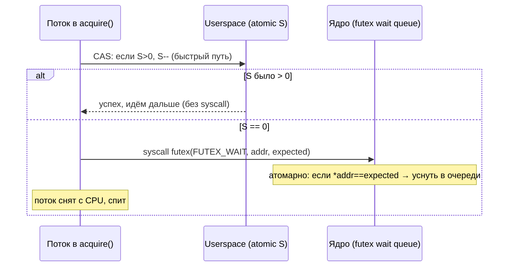
```mermaid
sequenceDiagram
  participant T as Поток в acquire()
  participant U as Userspace (atomic S)
  participant K as Ядро (futex wait queue)
  T->>U: CAS: если S>0, S--  (быстрый путь)
  alt S было > 0
    U-->>T: успех, идём дальше (без syscall)
  else S == 0
    T->>K: syscall futex(FUTEX_WAIT, addr, expected)
    Note over K: атомарно: если *addr==expected → уснуть в очереди
    Note over T: поток снят с CPU, спит
  end
```

---

## 4. Слабые и сильные семафоры (тонкость прогресса)

Определение `V` говорит «разбудить **один** поток из очереди», но **какой именно** — не уточняет. Это разделяет
семафоры по гарантии прогресса:

- **Слабый (weak) семафор** — будит *произвольный* ожидающий поток. Возможна **голодовка** (starvation):
  невезучий поток может бесконечно «пропускаться» при потоке `V`-сигналов и других ожидающих.
- **Сильный (strong) семафор** — будит потоки в порядке **FIFO** (кто раньше встал в очередь). Голодовки нет:
  каждый ожидающий рано или поздно проснётся.

Реальные реализации (POSIX, libc) обычно дают что-то близкое к FIFO/честному, но **строгих гарантий порядка
стандарт не даёт** — на это нельзя закладываться (см. подводные камни).

---

## 5. Семафор ≠ мьютекс: критическое отличие

Это любимый экзаменационный вопрос. Хотя бинарный семафор внешне похож на мьютекс, есть принципиальная разница:

| | Мьютекс | Семафор |
|---|---|---|
| **Владелец** | есть: отпустить (`unlock`) может **только** захвативший поток | **нет**: `V` может вызвать **любой** поток |
| Семантика | взаимное исключение | исключение **или** сигнал/счётчик ресурсов |
| Наследование приоритета | возможно (есть владелец — кому наследовать; билет 21) | невозможно (владельца нет) |
| Рекурсия | бывает рекурсивный | нет понятия рекурсии |

Наличие/отсутствие владельца — суть. Из-за владельца мьютекс умеет priority inheritance (билет 21) и проверку
«отпускает тот, кто захватил». Отсутствие владельца у семафора — это **фича** для сигнализации: поток A делает
`acquire` (ждёт события), поток B делает `release` (сигналит «событие произошло») — здесь «отпускает не тот, кто
брал» и есть нужное поведение.

---

## 6. Код (C++20)

```cpp
#include <semaphore>
#include <thread>
#include <vector>
#include <print>

// (а) Считающий семафор как ограничитель параллелизма: не более 3 одновременно.
std::counting_semaphore<3> slots{3};       // шаблонный параметр — МАКСИМУМ, аргумент — начальное

void use_limited_resource(int id) {
    slots.acquire();                        // P(): при S==0 заблокируется
    std::println("[{}] вошёл (доступно ещё {} мест)", id, /*приблизительно*/ 0);
    // ... работа с ограниченным ресурсом (например, пул соединений) ...
    slots.release();                        // V(): освобождает место, будит ожидающего
}

// (б) Бинарный семафор как СИГНАЛ между потоками (сигнальная семантика, не mutex).
std::binary_semaphore data_ready{0};        // 0 = события ещё не было
int payload = 0;

void producer() { payload = 42; data_ready.release(); }   // V: «данные готовы»
void consumer() { data_ready.acquire(); std::println("got {}", payload); } // P: ждём события
```

Замечание про `try_acquire`: он может вернуть `false` даже когда формально мог бы захватить (**spurious
failure**), потому что под капотом стоит CAS, который сам по себе бывает ложно-неуспешным (билет 14), а ещё —
гонка с конкурентами. Поэтому `try_acquire` используют в циклах/с таймаутами, не как точный оракул.

---

## 7. Реальные задачи

- **Пул ограниченного ресурса** (соединения к БД, лицензии, слоты к внешнему API): считающий семафор с
  $S_0=N$ — ровно $N$ одновременных пользователей, остальные ждут.
- **Producer/consumer на кольцевом буфере**: два семафора — `empty` (начально = размер буфера, сколько ещё
  можно положить) и `full` (начально 0, сколько готово к чтению). Producer: `empty.acquire(); положить;
  full.release()`. Consumer: `full.acquire(); взять; empty.release()`. Семафоры **считают** места и элементы.
- **Старт-сигнал / ограничение конкурентности задач** в пуле потоков (билет 37).
- **Межпроцессная синхронизация** над shared memory (именованные семафоры, билет 05).

---

## 8. Подводные камни

- **Потерянный `release`** → счётчик «утекает» вниз, ожидающие зависают навсегда (эффективный deadlock).
  Симметрично, лишний `release` поднимает счётчик выше начального и «впускает» больше потоков, чем задумано, —
  легко нарушить инвариант ресурса.
- **Семафор не отслеживает владельца** — нельзя надеяться на priority inheritance; для взаимного исключения с
  наследованием приоритета берут мьютекс (билет 11, 21).
- **Порядок пробуждения не гарантирован** стандартом (weak vs strong) — не закладывайтесь на FIFO без явных
  гарантий реализации; иначе скрытая голодовка.
- **`try_acquire` бывает ложно-неуспешен** — не как точный «свободно/занято».
- **Бинарный семафор как мьютекс** скрывает баг «отпустил не тот поток»: компилятор/рантайм это не поймает, в
  отличие от мьютекса. Если нужна взаимная блокировка — берите мьютекс.

---

## См. также

- Билет 09 — семафор и **барьер** как примитивы; `std::counting_semaphore` подробнее.
- Билет 11 — мьютекс (владелец, futex, рекурсия), прямое сравнение.
- Билет 14 — CAS как основа быстрого пути семафора.
- Билет 21 — почему отсутствие владельца лишает семафор наследования приоритета.
- Билет 05 — межпроцессные (именованные) семафоры над shared memory.


---

# Билет 08. Механизмы завершения потоков

> **На экзамен (кратко).**
> **`join`** — блокирующее ожидание завершения потока и сбор его результата/ресурсов (стека, TCB).
> **`cancel`** — *запрос* на завершение потока. В POSIX `pthread_cancel()` помечает поток как «отменяемый»; на
> самом деле отмена срабатывает в **точках отмены** (*cancellation points*) — функциях, перечисленных POSIX
> (`read`, `write`, `wait`, `sleep`, `accept`, …), где поток проверяет флаг и, если отмена запрошена,
> разворачивает стек, выполняя зарегистрированные cleanup-обработчики. В C++ **принудительной** отмены потока
> **нет**; идиома C++20 — **кооперативная остановка** через `std::stop_token`/`std::jthread`.

---

## 1. Зачем и в чём сложность

Поток нельзя просто «убить» в произвольной точке: он может удерживать мьютекс, быть в середине обновления общей
структуры, владеть незакоммиченным ресурсом. Насильственное прерывание оставит инварианты в неопределённом
состоянии (зависший мьютекс → deadlock, утечки, повреждённые данные). Поэтому корректное завершение — это либо
**дождаться** естественного конца (`join`), либо **попросить** поток завершиться в безопасной точке (cancel /
кооперативная остановка). Прямое «kill thread» в нормальном коде не делают.

---

## 2. `join`: ожидание и сбор ресурсов

`join` решает две задачи: (1) дождаться, когда поток доработает; (2) **освободить** его ресурсы и получить
результат. Это важно: у завершившегося, но не присоединённого потока остаётся **TCB** (Thread Control Block) и,
в зависимости от реализации, стек — аналог «зомби» у процессов (билет 03). Поток создают либо **joinable**
(нужно `join`), либо **detached** (ресурсы освободятся сами при завершении, но результат не собрать и момент
конца не отследить).

**Устройство (NPTL).** Каждый поток в своём дескрипторе имеет поле состояния и futex-слово «завершён ли».
`pthread_join` атомарно проверяет это поле; если поток ещё жив — встаёт на `FUTEX_WAIT` по адресу слова
завершения. Когда поток выходит (`pthread_exit`/возврат из стартовой функции), рантайм записывает код возврата,
помечает слово завершения и делает `FUTEX_WAKE` — `join` просыпается, читает результат, освобождает стек/TCB.

В C++:
```cpp
std::thread t{[]{ /* работа */ }};
t.join();                  // ждём; после join t больше не joinable
// std::jthread делает join() автоматически в деструкторе — нельзя забыть
```
**Подводный камень `std::thread`:** если объект разрушается **joinable** (не сделан `join`/`detach`) →
`std::terminate()`. `std::jthread` (C++20) это устраняет.

---

## 3. `cancel` в POSIX и точки отмены

`pthread_cancel(t)` **не** убивает поток мгновенно. Он переводит у целевого потока внутренний флаг «отмена
запрошена». Дальше всё зависит от **типа** и **состояния** отмены целевого потока:

- **Состояние** (`PTHREAD_CANCEL_ENABLE`/`DISABLE`) — включена ли отмена вообще. В критических участках её
  временно выключают.
- **Тип** (`PTHREAD_CANCEL_DEFERRED` — по умолчанию / `PTHREAD_CANCEL_ASYNCHRONOUS`):
  - **deferred**: отмена срабатывает **только в точках отмены** — поток проверяет флаг, когда входит в одну из
    специальных функций;
  - **asynchronous**: отмена может произойти **в любой** инструкции — крайне опасно (можно прерваться посреди
    `malloc`, оставив кучу в неконсистентном состоянии), используется почти исключительно для чисто
    вычислительного кода без вызовов библиотек.

**Точка отмены (cancellation point)** — функция из списка POSIX, при входе в которую (или внутри которой) поток
обязан проверить флаг отмены: блокирующие вызовы вроде `read`, `write`, `recv`, `accept`, `select`, `poll`,
`sleep`, `wait`, `pthread_cond_wait` и др. Программно проверить флаг в произвольном месте можно вызовом
`pthread_testcancel()`. Если на момент проверки отмена запрошена — начинается **раскрутка стека**: выполняются
зарегистрированные cleanup-обработчики.

**Устройство (NPTL).** Отмена реализована через **сигнал** (внутренний `SIGCANCEL`): `pthread_cancel` шлёт
целевому потоку этот сигнал; обработчик помечает флаг. В deferred-режиме обработчик не разворачивает стек
немедленно — он лишь выставляет флаг, а реальная отмена и cleanup происходят, когда поток дойдёт до точки отмены
(чтобы не прерывать небезопасный код). В asynchronous-режиме раскрутка может начаться прямо из обработчика.

**Cleanup-обработчики** регистрируются макросами `pthread_cleanup_push(fn, arg)` / `pthread_cleanup_pop(exec)`
(они образуют стек, как `defer`/деструкторы) — туда кладут «отпустить мьютекс», «закрыть файл», «освободить
память». При отмене (и при `pthread_exit`) этот стек выполняется в обратном порядке.

```c
void* worker(void*) {
    int fd = open("data", O_RDONLY);
    pthread_cleanup_push([](void* p){ close(*(int*)p); }, &fd);  // выполнится при отмене
    char buf[4096];
    read(fd, buf, sizeof buf);   // ТОЧКА ОТМЕНЫ: здесь поток может быть отменён
    pthread_cleanup_pop(1);      // 1 = выполнить обработчик и при нормальном выходе
    return nullptr;
}
```

---

## 4. C++: кооперативная остановка вместо отмены

В C++ **нет** аналога `pthread_cancel` — намеренно: насильственная отмена несовместима с RAII/деструкторами и
безопасностью исключений. Вместо этого C++20 даёт **кооперативный** механизм: `std::stop_source` /
`std::stop_token` / `std::stop_callback`, встроенный в `std::jthread`.

**Устройство `stop_token`.** За токеном стоит общее **stop-state** (с подсчётом ссылок, как у `shared_ptr`),
содержащее: атомарный флаг `stop_requested` и **список зарегистрированных колбэков**. `request_stop()` атомарно
выставляет флаг и **синхронно** вызывает все колбэки (в потоке, который запросил остановку). `stop_requested()`
— это просто атомарное чтение флага (дёшево). `std::stop_callback` регистрирует функцию, которая выполнится при
запросе остановки (или немедленно, если он уже произошёл) — удобно, чтобы «разбудить» поток, ждущий на чём-то.

```cpp
#include <thread>
#include <stop_token>

void worker(std::stop_token st) {
    while (!st.stop_requested()) {        // (1) опрос флага в цикле работы
        // ... короткий блок работы; периодически возвращаемся к проверке ...
    }
    // вышли чисто: деструкторы отработают, мьютексы отпустятся
}

int main() {
    std::jthread t{worker};               // jthread сам передаёт stop_token
    // ... позже ...
    // деструктор t: t.request_stop(); t.join();  — остановка + join гарантированы
}
```

**Прерывание блокирующего ожидания.** Чистый опрос флага не помогает, если поток **спит** на условной
переменной. Для этого `std::condition_variable_any` умеет ждать **с** `stop_token`: при запросе остановки колбэк
будит CV, и ожидание прерывается.

```cpp
std::condition_variable_any cv;
std::mutex m;
std::unique_lock lk{m};
// проснётся либо когда ready==true, либо когда запрошена остановка:
cv.wait(lk, st, []{ return ready; });
if (st.stop_requested()) return;          // отличаем причину пробуждения
```

---

## 5. Сравнение подходов

| | POSIX `pthread_cancel` | C++ `stop_token` |
|---|---|---|
| Модель | внешняя отмена в точках отмены / async | кооперативная (поток сам проверяет/реагирует) |
| Безопасность | опасна (особенно async): прерывание в произвольном месте | безопасна: завершение только в выбранных точках |
| Очистка | `pthread_cleanup_push/pop` | RAII/деструкторы (естественно) |
| Прерывание сна | срабатывает в блокирующем вызове (точка отмены) | `condition_variable_any::wait(lk, st, pred)` |
| Принудительность | да (можно «дожать») | нет (поток обязан кооперировать) |

---

## 6. Реальные задачи и подводные камни

**Применение.** Останов воркеров пула при shutdown сервиса (билет 37); прерывание длинной фоновой задачи по
действию пользователя; таймауты на блокирующих операциях.

**Подводные камни.**
- **Async-отмена (`PTHREAD_CANCEL_ASYNCHRONOUS`)** почти всегда зло: прерывание посреди не-async-cancel-safe
  кода (malloc, stdio) повреждает состояние. По умолчанию — deferred.
- **Отмена с захваченным мьютексом без cleanup** → раскрутка стека пропустит `unlock` → deadlock. Всегда
  регистрируйте освобождение в cleanup (в C++ это делает RAII автоматически).
- **`std::thread` без `join`/`detach`** → `std::terminate`. Используйте `std::jthread`.
- **`detach` теряет контроль над временем жизни**: отсоединённый поток может пережить данные, на которые
  ссылается (висячие ссылки). Предпочтительно joinable + явный останов.
- **Кооперативность требует дисциплины**: если поток надолго уходит в блокирующий вызов без поддержки
  `stop_token`, запрос остановки «не услышан» — дробите работу или используйте прерываемые ожидания.

---

## См. также

- Билет 04 (поток) — joinable/detached, `std::jthread`, TCB/стек.
- Билет 12 (условные переменные) — `condition_variable_any` + `stop_token` для прерываемого сна.
- Билет 37 (пул потоков) — корректный shutdown воркеров.
- Билет 21 — почему async-прерывание опасно для инвариантов под блокировкой.


---

# Билет 09. Примитивы синхронизации: семафор и барьер

> **На экзамен (кратко).**
> Два базовых примитива координации многих потоков. **Семафор** — счётчик разрешений (билет 07): `acquire`
> уменьшает/блокирует, `release` увеличивает/будит; ограничивает параллелизм и сигнализирует. **Барьер**
> (barrier) — точка синхронизации: $N$ потоков вызывают «прибыть и ждать», и **никто** не идёт дальше, пока
> **все** не достигли барьера. В C++20: одноразовая защёлка **`std::latch`** (`count_down`/`wait`,
> состояние необратимо) и **переиспользуемый** (фазовый) **`std::barrier`** (`arrive_and_wait()`, с
> опциональной *completion*-функцией, выполняемой один раз на фазу). Ключевая тонкость реализации барьера —
> **счётчик поколения/фазы** (generation), исключающий гонку при переиспользовании.

---

## 1. Зачем барьер

Многие параллельные алгоритмы **фазовые**: все потоки делают шаг, затем должны **синхронизироваться** перед
следующим шагом, потому что вход следующей фазы зависит от результатов всех в текущей. Примеры: итеративные
численные методы (Якоби, релаксация — посчитали новый слой, обменялись границами, и только потом следующая
итерация); этапы MapReduce; пошаговые симуляции (все агенты обновляются по состоянию **прошлого** шага). Барьер —
это «подождать всех на финише круга, потом стартовать новый круг вместе».

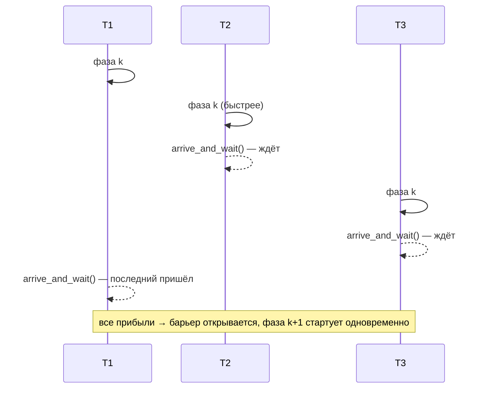
```mermaid
sequenceDiagram
  participant T1
  participant T2
  participant T3
  T1->>T1: фаза k
  T2->>T2: фаза k (быстрее)
  T2-->>T2: arrive_and_wait() — ждёт
  T3->>T3: фаза k
  T3-->>T3: arrive_and_wait() — ждёт
  T1-->>T1: arrive_and_wait() — последний пришёл
  Note over T1,T3: все прибыли → барьер открывается, фаза k+1 стартует одновременно
```

---

## 2. `std::latch` — одноразовая защёлка

`std::latch` инициализируется счётчиком; потоки уменьшают его `count_down()` и/или ждут `wait()`, пока он не
дойдёт до нуля. Состояние **необратимо** (нельзя «перезарядить») — отсюда «одноразовая».

```cpp
#include <latch>
#include <thread>
#include <vector>

std::latch all_ready{1};                    // главный поток отпустит старт
std::latch all_done{ N };                   // ждём завершения N воркеров

void worker() {
    all_ready.wait();                        // ждём общего старта
    /* ... работа ... */
    all_done.count_down();                   // «я закончил»
}

int main() {
    std::vector<std::jthread> ts;
    for (int i = 0; i < N; ++i) ts.emplace_back(worker);
    all_ready.count_down();                  // одновременный старт всех
    all_done.wait();                         // ждём, пока все N доработают
}
```

Два типичных применения: **синхронный старт** (защёлка на 1, все ждут, главный «отпускает» — для честного
бенчмаркинга без эффекта «кто раньше создан») и **ожидание завершения группы** (защёлка на $N$, каждый делает
`count_down`, координатор `wait`).

`count_down(k)` может уменьшить сразу на $k$; `arrive_and_wait()` = `count_down()` + `wait()`. `try_wait()` —
неблокирующая проверка нуля.

---

## 3. `std::barrier` — переиспользуемый барьер

`std::barrier` рассчитан на **повторное** использование по фазам. Поток вызывает `arrive_and_wait()`; когда
прибыл $N$-й участник, барьер **открывается**, счётчик **автоматически перезаряжается** на следующую фазу, и
(опционально) выполняется **completion-функция** — ровно один раз, одним потоком, *между* фазами (удобно для
«свести результаты фазы», «подготовить данные следующей фазы»).

```cpp
#include <barrier>

// completion-функция выполнится один раз в конце КАЖДОЙ фазы:
std::barrier sync_point{ N, []() noexcept {
    merge_partial_results();                 // например, собрать частичные суммы фазы
}};

void worker(int phases) {
    for (int p = 0; p < phases; ++p) {
        compute_phase(p);                    // параллельная работа фазы p
        sync_point.arrive_and_wait();        // ждём всех; затем completion() один раз; затем фаза p+1
    }
}
```

Дополнительно: `arrive()` возвращает **arrival token** и **не** блокирует (можно прибыть, сделать что-то, потом
`wait(token)`); `arrive_and_drop()` — поток прибывает и **выбывает** из участия в последующих фазах (ожидаемое
число участников на следующих фазах уменьшается на 1) — нужно, когда часть потоков заканчивает раньше.

---

## 4. Устройство барьера: почему нужен счётчик поколения

Наивный барьер «считаем прибывших, при $N$-м будим всех и обнуляем счётчик» содержит **тонкую гонку** при
переиспользовании. Рассмотрим: $N$-й поток обнулил счётчик и разбудил всех; быстрый поток мгновенно «пролетает»
следующую фазу и **снова входит** в барьер, инкрементируя счётчик, **раньше**, чем медленный поток из прошлой
фазы успел проснуться и выйти. Счётчик «съезжает», и барьер ломается (часть потоков застрянет, часть пройдёт
раньше времени). Это вариант проблемы переиспользования синхронной точки.

**Решение — поколения (generation / phase).** Барьер хранит не только счётчик прибывших, но и **номер фазы**
(generation). Ожидающие потоки спят, пока **номер фазы не сменится**, а не «пока счётчик не обнулится». Когда
прибывает последний, барьер атомарно: сбрасывает счётчик прибывших, **инкрементирует номер фазы** и будит всех.
Проснувшиеся проверяют, что фаза действительно сменилась (а не ложное пробуждение), и выходят. Быстрый поток,
вошедший в новую фазу, работает уже с **новым** номером фазы — путаницы со старыми ожидающими нет.

Классическая аппаратно-дружественная реализация этой идеи — **sense-reversing barrier** («барьер с
переворотом смысла»): вместо растущего номера фазы используется один **булев флаг `sense`**, чередующийся
0→1→0… Каждый поток хранит свой локальный ожидаемый `sense`; ждёт, пока глобальный `sense` не станет равен его
локальному; последний прибывший **переворачивает** глобальный `sense`, открывая барьер. Локальный `sense`
инвертируется на каждой фазе. Это устраняет необходимость в неограниченном счётчике поколений и хорошо ложится
на атомики.

```cpp
// Идея sense-reversing барьера (схематично, поверх атомиков):
struct SenseBarrier {
    const int N;
    std::atomic<int> count;
    std::atomic<bool> sense{false};
    SenseBarrier(int n) : N(n), count(n) {}

    void arrive_and_wait() {
        thread_local bool local_sense = false;
        local_sense = !local_sense;                  // переворот локального смысла на этой фазе
        if (count.fetch_sub(1) == 1) {               // я последний?
            count.store(N);                          // перезарядка на следующую фазу
            sense.store(local_sense);                // переворот глобального → открываем барьер
        } else {
            while (sense.load() != local_sense) {}   // ждём смены смысла (здесь — спин)
        }
    }
};
```
(Реальный `std::barrier` спит через futex, а не крутится в спине, но логика поколения/смысла та же.)

---

## 5. Семафор vs барьер vs latch — когда что

| Примитив | Семантика | Переиспользуемость | Типичная задача |
|---|---|---|---|
| Семафор | счётчик разрешений / сигнал | да (счётчик живёт) | пул ресурсов, producer/consumer |
| `latch` | «дождаться, пока счётчик → 0» | **нет** (одноразовый) | синхронный старт, ожидание группы |
| `barrier` | «дождаться всех $N$, потом вместе дальше» | **да** (по фазам) | итеративные/фазовые алгоритмы |

Барьер можно *смоделировать* семафорами, но это громоздко и подвержено гонке переиспользования — поэтому есть
отдельный примитив с правильным устройством (поколения).

---

## 6. Реальные задачи

- **Итеративные методы** (решение СЛАУ, диффуры на сетке): тело — `compute_phase()` (обновить свою часть сетки)
  + `arrive_and_wait()` (синхронизация перед следующей итерацией) + completion для проверки сходимости/обмена
  границами.
- **Параллельная редукция по фазам**: каждый поток считает частичную сумму, completion сводит их.
- **Симуляции с дискретным временем**: все агенты обновляются по состоянию прошлого шага — барьер между шагами.
- **Бенчмаркинг**: `latch`-старт, чтобы все потоки начали замер одновременно.

---

## 7. Подводные камни

- **Неверный счётчик `latch`/`barrier`**: заниженный — барьер «откроется» раньше, чем все прибудут (часть
  потоков убежит вперёд); завышенный — **вечное ожидание** (последний участник не придёт).
- **Поток упал, не дойдя до `arrive_and_wait`** → остальные **зависнут навсегда** (у барьера нет таймаута). При
  раннем выходе части потоков используйте `arrive_and_drop()`.
- **Completion-функция должна быть `noexcept`** и короткой: она выполняется на критическом пути между фазами,
  одним потоком, блокируя остальных.
- **Дисбаланс фаз**: барьер синхронизирует по самому медленному — если один поток систематически отстаёт, все
  ждут его (связь с законом Амдала: «последовательная» точка синхронизации ограничивает масштабируемость).
- **`latch` одноразовый** — попытка «переиспользовать» его как барьер не сработает; берите `std::barrier`.

---

## См. также

- Билет 07 — семафор (определение, устройство, отличие от мьютекса).
- Билет 14 — атомики/CAS как основа sense-reversing барьера.
- Билет 38–39 — фазовые/итеративные паттерны, где барьер ключевой.
- Билет 01 — точка синхронизации как «последовательная доля» (Амдал).


---

# Билет 10. Синхронизация связного списка на двух потоках

> **На экзамен (кратко).**
> Задача: безопасно выполнять `add`/`remove`/`contains` над общим **отсортированным связным списком** из
> двух (и более) потоков, сохраняя **множество** ключей. Список реализует множество: узлы упорядочены по ключу,
> используются **сентинелы** `head`(−∞) и `tail`(+∞). Минимально корректное решение — **один мьютекс на весь
> список** (грубая синхронизация, билет 15): просто и очевидно правильно, но всё сериализует. Дальнейшие
> уровни (тонкая → оптимистичная → ленивая → неблокирующая, билеты 15–18) постепенно увеличивают
> параллелизм. Главная опасность при наивном «параллелизме» — **потерянное обновление** при одновременной
> модификации соседних узлов и **небезопасное освобождение памяти** удалённых узлов.

---

## 1. Почему именно список и почему это трудно

Отсортированный односвязный список — каноническая «учебная» конкурентная структура (по Herlihy & Shavit): он
достаточно прост, чтобы рассуждать строго, и достаточно богат, чтобы продемонстрировать **весь спектр** техник
синхронизации — от единого лока до неблокирующих алгоритмов. Операции:

- `add(x)` — вставить ключ, если его нет (возвращает, добавлено ли);
- `remove(x)` — удалить ключ, если есть;
- `contains(x)` — проверить наличие.

Каждая операция ищет позицию обходом от `head`, удерживая два указателя: `pred` (предыдущий) и `curr` (текущий),
причём всегда `pred.key < x ≤ curr.key`. Вставка происходит **между** `pred` и `curr`; удаление — отцепление
`curr` (`pred.next = curr.next`).

Трудность в том, что **две операции могут затрагивать перекрывающиеся участки** списка одновременно. Покажем
фундаментальную гонку, которая мотивирует все последующие билеты.

---

## 2. Фундаментальная гонка: потерянный узел

Пусть список `a → b → c → d`, и два потока одновременно:
- поток 1: `remove(b)` — хочет сделать `a.next = c`;
- поток 2: `remove(c)` — хочет сделать `b.next = d`.

Если синхронизации нет (или она недостаточна), возможно такое переплетение: поток 2 читает `b.next = c`,
вычисляет, что надо записать `b.next = d`. Параллельно поток 1 записывает `a.next = c` (удалил `b`). Теперь
поток 2 записывает `b.next = d` — но узел `b` **уже отцеплен** от списка! Запись уходит «в никуда», а узел `c`
остаётся достижим через `a → c → ...` — то есть **`c` не удалился**, хотя `remove(c)` «успешно» завершился.
Получили нарушение корректности множества.

```
было:  a → b → c → d

поток1 remove(b):  a ──────→ c → d      (a.next = c)
поток2 remove(c):  b → d                (b.next = d, но b уже не в списке!)

итог:  a → c → d     ← c НЕ удалён, обновление b.next потеряно
```

Вывод: чтобы операции не «затирали» друг друга, нужно как-то **исключить одновременную модификацию смежных
узлов**. Разные способы это сделать и порождают иерархию билетов 15–18.

---

## 3. Минимальное корректное решение: один мьютекс (coarse)

Самый простой способ — **сериализовать всё** одним мьютексом: любая операция захватывает его на всё время.
Очевидно корректно (в каждый момент структуру трогает один поток), но параллелизма ноль — на многих ядрах
становится узким местом.

```cpp
#include <mutex>
#include <optional>

template <class T>
class CoarseSet {
    struct Node { T key; Node* next; };
    Node* head_;                              // сентинел -inf
    std::mutex m_;
public:
    CoarseSet() {
        head_ = new Node{ std::numeric_limits<T>::lowest(), nullptr };
        head_->next = new Node{ std::numeric_limits<T>::max(), nullptr }; // сентинел +inf
    }

    bool add(T x) {
        std::scoped_lock lk{m_};              // весь метод под одним локом
        Node* pred = head_;
        Node* curr = pred->next;
        while (curr->key < x) { pred = curr; curr = curr->next; }
        if (curr->key == x) return false;     // уже есть
        pred->next = new Node{ x, curr };     // вставка между pred и curr
        return true;
    }

    bool remove(T x) {
        std::scoped_lock lk{m_};
        Node* pred = head_;
        Node* curr = pred->next;
        while (curr->key < x) { pred = curr; curr = curr->next; }
        if (curr->key != x) return false;     // нет такого
        pred->next = curr->next;              // отцепляем
        delete curr;                          // безопасно: всё под локом, никто не держит curr
        return true;
    }

    bool contains(T x) {
        std::scoped_lock lk{m_};
        Node* curr = head_->next;
        while (curr->key < x) curr = curr->next;
        return curr->key == x;
    }
};
```

Сентинелы `head`/`tail` устраняют частные случаи (вставка в начало/конец, пустой список): `pred` всегда
существует (минимум `head`), `curr` всегда существует (минимум `tail`).

---

## 4. Куда двигаться: обзор иерархии (билеты 15–18)

Грубый лок сериализует. Дальше параллелизм наращивают так:

| Уровень | Идея | Что параллельно | Билет |
|---|---|---|---|
| Грубая (coarse) | один лок на структуру | ничего | 15 |
| Тонкая (fine) | лок на узел, обход «hand-over-hand» (держим **два** соседних лока) | разные участки списка | 15 |
| Оптимистичная | искать без локов, потом залочить и **валидировать** (перепроверить достижимость) | поиск без блокировок | 16 |
| Ленивая (lazy) | бит `marked` (логическое удаление); `contains` **wait-free** без локов | чтение без блокировок | 17 |
| Неблокирующая | только CAS, marked-pointer; `add`/`remove` lock-free | всё, без локов | 18 |

Идея «держать **два** лока (на `pred` и `curr`)» в тонкой синхронизации — прямой ответ на гонку из §2: удерживая
блокировку **предшественника**, мы не даём конкуренту удалить соседний узел, пока наша операция не завершится
(подробности и доказательство — билет 15).

---

## 5. Освобождение памяти: скрытая трудность параллельных списков

В грубом решении `delete curr` безопасен — всё под одним локом, никто другой не держит указатель на `curr`. Но
как только мы убираем глобальный лок (оптимистичная, ленивая, неблокирующая синхронизация), появляется проблема:
**другой поток может прямо сейчас держать указатель на узел, который мы удаляем**. Освободить такой узел = висячий
указатель и use-after-free у конкурента.

Это **safe memory reclamation** — отдельная большая тема. Решения (подробно — билеты 22, 30):
- **сборщик мусора** (в Java «просто работает» — узел не освобождается, пока есть ссылки; поэтому многие
  классические алгоритмы публиковались на Java);
- **hazard pointers** (поток «публикует» защищаемый указатель; узел не освобождают, пока на него есть hazard);
- **epoch-based / RCU** (узел освобождают только после grace period, когда гарантированно нет читателей,
  стартовавших до удаления).

В C++ это приходится делать **вручную** — отсюда значительная часть сложности lock-free кода (билеты 18, 27, 28).
C++26 даёт `std::hazard_pointer` (билет 22).

---

## 6. Подводные камни

- **Двойное удаление** одного ключа двумя потоками: без корректной синхронизации возможен double-free или
  «успех» у обоих. Каждая операция должна атомарно проверять-и-действовать.
- **Потерянное обновление** при модификации смежных узлов (§2) — главная причина, по которой «лок на узел»
  требует удерживать **два** лока, а не один.
- **Висячие указатели/use-after-free** при освобождении узла, который ещё кто-то читает (нужен reclamation).
- **Итераторная инвалидизация**: указатель, добытый до операции другого потока, может указывать на уже
  удалённый узел — в конкурентной структуре «сырые» указатели на узлы наружу отдавать опасно.
- **Порядок захвата локов** в тонкой синхронизации (всегда `head → tail`) — иначе deadlock (билет 19).

---

## См. также

- Билет 15 — грубая и тонкая синхронизация (доказательство «зачем два лока»).
- Билеты 16, 17, 18 — оптимистичная, ленивая, неблокирующая синхронизация списка.
- Билет 22 — ABA и безопасное освобождение памяти; hazard pointers.
- Билет 29 — линеаризуемость и точки линеаризации операций списка.


---

# Билет 11. POSIX-мьютекс и C++11 мьютекс

> **На экзамен (кратко).**
> **Мьютекс** (mutual exclusion) — примитив взаимного исключения **с владельцем**: захватить и отпустить
> может только один поток, причём отпускает **тот же** поток, что захватил. POSIX: `pthread_mutex_lock/unlock`,
> `pthread_mutex_trylock`. C++: `std::mutex` (`lock`/`unlock`/`try_lock`), `std::recursive_mutex`,
> `std::shared_mutex` (= **ReadWriteLock**). Идиома C++ — **RAII** (`std::scoped_lock`/`std::unique_lock`),
> ручной `unlock` не вызывают. В Linux мьютекс построен на **futex**: неконкурентный захват — атомарный CAS
> **в пользовательском пространстве** без системного вызова; системный вызов `futex(FUTEX_WAIT/WAKE)` —
> только при наличии конкуренции. Это и есть смысл названия *futex* — «fast userspace mutex».

---

## 1. Зачем мьютекс и его главное свойство — владелец

Мьютекс защищает **критическую секцию**: участок, где обращаются к общим данным и где одновременно должен быть
не более одного потока. Главное, что отличает мьютекс от бинарного семафора (билет 07), — **владелец**: lock
устанавливает владельца, unlock проверяет, что его вызывает именно владелец. Из владельца вытекают:
- проверка корректности (отпустить чужой мьютекс — ошибка/UB);
- **наследование приоритета** (есть кому наследовать — билет 21);
- **рекурсивный** режим (счётчик повторных захватов владельцем).

---

## 2. Базовые операции

**(1) lock/unlock.** `lock()` блокирует, пока не захватит; `unlock()` освобождает. В C++ — **только через
RAII**: объект-замок захватывает в конструкторе, отпускает в деструкторе, поэтому при исключении/раннем выходе
мьютекс **гарантированно** освободится.

```cpp
#include <mutex>
std::mutex m;
void critical() {
    std::scoped_lock lk{m};     // lock() в конструкторе
    /* ... критическая секция ... */
}                                // unlock() в деструкторе — даже при исключении
```

**(2) `bool try_lock()`** — неблокирующая попытка: захватывает и возвращает `true`, либо сразу `false`, если
занят. Полезно, чтобы **избежать deadlock** или сделать «работу или пропуск». Для нескольких мьютексов C++ даёт
**`std::scoped_lock(a, b, c)`** с встроенным **алгоритмом избегания взаимоблокировки** (он же `std::lock`): он
захватывает все переданные мьютексы так, чтобы не возникло циклического ожидания (билет 19), даже если разные
потоки перечисляют их в разном порядке.

```cpp
if (m.try_lock()) {
    std::scoped_lock lk{std::adopt_lock, m};   // принять уже захваченный
    /* ... */
} else {
    /* занято — сделаем что-то другое, не блокируемся */
}

// Два мьютекса без риска deadlock:
std::scoped_lock lk{m1, m2};                    // безопасный одновременный захват обоих
```

---

## 3. Устройство: futex и протокол трёх состояний

Самое интересное в мьютексе — **как** он усыпляет поток без постоянного busy-wait и при этом не делает syscall в
типичном случае.

**Идея futex.** Состояние мьютекса — обычная атомарная переменная **в пользовательской памяти**. Захват без
конкуренции — это атомарный CAS над ней, **без обращения к ядру**. Ядро (через системный вызов `futex`)
привлекается только когда поток действительно надо **усыпить** (мьютекс занят) или **разбудить** (освобождён, и
есть ожидающие). Очередь ожидающих живёт в ядре, привязанная к **адресу** futex-переменной.

**Протокол трёх состояний** (классическая схема Drepper, «Futexes Are Tricky»):

```
0 — мьютекс СВОБОДЕН
1 — ЗАНЯТ, ожидающих НЕТ
2 — ЗАНЯТ, есть ОЖИДАЮЩИЕ (возможно)
```

`lock()`:
1. CAS попытка `0 → 1` (захват свободного). Успех → владеем, **syscall не было** (быстрый путь).
2. Иначе мьютекс занят. Переводим состояние в `2` (CAS/обмен): это помечает, что появились ожидающие.
3. Делаем `futex(FUTEX_WAIT, addr, 2)` — атомарно: «если `*addr == 2`, усни». Проверка значения внутри
   syscall закрывает гонку: если между шагами 2 и 3 мьютекс освободился (стал `0`), `*addr != 2`, и `FUTEX_WAIT`
   **не уснёт**, а сразу вернётся — поток повторит попытку.
4. Проснувшись, повторяем с шага 1.

`unlock()`:
1. Если состояние было `1` (ожидающих нет), просто пишем `0` — **никого не будим, syscall не нужен** (быстрый
   путь).
2. Если состояние было `2` (могут быть ожидающие), пишем `0` и делаем `futex(FUTEX_WAKE, addr, 1)` — будим
   один ожидающий поток.

**Зачем именно ТРИ состояния** (а не два). Если бы было только «свободен/занят», `unlock` **не знал бы**, есть
ли спящие, и был бы вынужден **всегда** вызывать `FUTEX_WAKE` (дорогой syscall) на всякий случай. Третье
состояние (`2` = «есть ожидающие») позволяет `unlock` делать syscall **только когда есть кого будить**, а в
самом частом случае (никто не ждал) обойтись атомарной записью. Это и есть оптимизация, ради которой futex
существует.

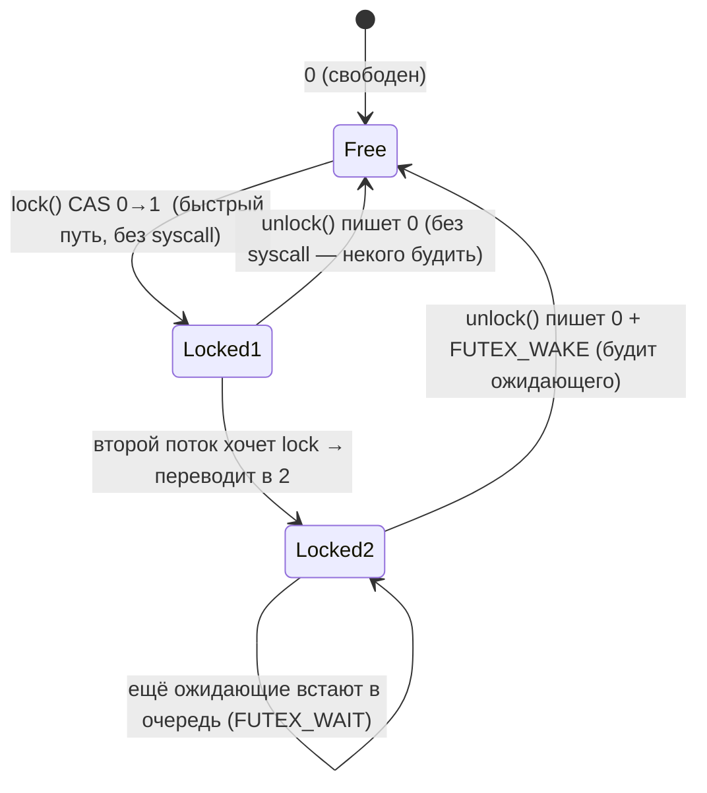
```mermaid
stateDiagram-v2
  [*] --> Free: 0 (свободен)
  Free --> Locked1: lock() CAS 0→1  (быстрый путь, без syscall)
  Locked1 --> Free: unlock() пишет 0 (без syscall — некого будить)
  Locked1 --> Locked2: второй поток хочет lock → переводит в 2
  Locked2 --> Free: unlock() пишет 0 + FUTEX_WAKE (будит ожидающего)
  Locked2 --> Locked2: ещё ожидающие встают в очередь (FUTEX_WAIT)
```

**Адаптивный мьютекс.** Многие реализации сначала **немного крутятся** (спин с `pause`, в надежде, что владелец
вот-вот отпустит — дешевле, чем усыпление+пробуждение через ядро), и лишь затем уходят в `FUTEX_WAIT`. Это
гибрид спинлока (билет 14) и блокирующего мьютекса.

---

## 4. (3) Рекурсивный мьютекс

`std::recursive_mutex` (POSIX: `PTHREAD_MUTEX_RECURSIVE`) позволяет **владельцу** захватывать мьютекс повторно;
снаружи он считается занятым, пока владелец не сделает столько же `unlock`, сколько `lock`. Устройство: к
обычному futex-слову добавляются поля **TID владельца** и **счётчик рекурсии**. `lock`: если владелец = текущий
поток → инкремент счётчика (без блокировки); иначе обычный захват. `unlock`: декремент; при достижении нуля —
реальное освобождение и (при необходимости) `FUTEX_WAKE`.

**Когда возникает соблазн** — вложенные вызовы публичных методов, каждый из которых берёт мьютекс:

```cpp
struct Vector {                                  // АНТИПАТТЕРН
    std::recursive_mutex m_;
    std::vector<int> v_;
    void push(int x)      { std::scoped_lock lk{m_}; v_.push_back(x); }
    void push_two(int a,int b){ std::scoped_lock lk{m_}; push(a); push(b);}  // повторный захват m_
};
```
Здесь `push_two` берёт `m_`, затем вызывает `push`, который **снова** берёт `m_` — обычный мьютекс тут устроил
бы deadlock (билет 19, «простой deadlock»), рекурсивный — нет.

**Как избавиться от рекурсивного мьютекса** (это считается «запахом дизайна»). Стандартный приём — разделить
каждый метод на **приватное «ядро» без блокировки** (предполагает, что мьютекс уже удержан) и **публичную
обёртку**, которая берёт мьютекс один раз:

```cpp
struct Vector2 {                                 // БЕЗ рекурсивного мьютекса
    std::mutex m_;
    std::vector<int> v_;
    void push_locked(int x) { v_.push_back(x); }            // ТРЕБУЕТ удержания m_ (инвариант)
    void push(int x)        { std::scoped_lock lk{m_}; push_locked(x); }
    void push_two(int a,int b){ std::scoped_lock lk{m_}; push_locked(a); push_locked(b);} // один захват
};
```
Это делает структуру блокировок **явной** (видно, что под локом, а что нет) и убирает накладные расходы счётчика
рекурсии. Рекурсивный мьютекс часто маскирует то, что границы критических секций продуманы плохо.

---

## 5. (4) `shared_mutex` — ReadWriteLock

`std::shared_mutex` (C++17) различает два режима доступа: **разделяемый** (shared, «читатели») — много потоков
одновременно; **эксклюзивный** (unique, «писатель») — строго один и без читателей. Это **ReadWriteLock** для
паттерна «много чтений, редкие записи».

```cpp
#include <shared_mutex>
std::shared_mutex rw_;
T data_;

T read()        { std::shared_lock lk{rw_}; return data_; }   // много читателей параллельно
void write(T x) { std::unique_lock lk{rw_}; data_ = x; }      // один писатель, без читателей
```

**Устройство (схематично).** Состояние — слово со **счётчиком активных читателей** + **флаг писателя** +
флаги/счётчики ожидающих. Захват shared: при отсутствии писателя — инкремент счётчика читателей; иначе ждать.
Захват unique: дождаться, пока счётчик читателей = 0 и нет другого писателя. Тонкость — **политика приоритета**:
если постоянно приходят новые читатели, ожидающий писатель может **голодать** (reader-preference); чтобы этого
избежать, реализации часто блокируют **новых** читателей при наличии ожидающего писателя (writer-preference) —
но тогда могут голодать читатели. Универсально честной политики нет; это надо учитывать под высокой нагрузкой.

---

## 6. POSIX vs C++: соответствие

| Концепт | POSIX | C++ |
|---|---|---|
| обычный мьютекс | `pthread_mutex_t` (default) | `std::mutex` |
| try | `pthread_mutex_trylock` | `try_lock()` |
| рекурсивный | `PTHREAD_MUTEX_RECURSIVE` | `std::recursive_mutex` |
| RW-lock | `pthread_rwlock_t` | `std::shared_mutex` |
| наследование приоритета | `PTHREAD_PRIO_INHERIT` | (нет в стандарте; платформенно) |
| RAII-обёртка | (нет, вручную) | `scoped_lock`/`unique_lock`/`shared_lock` |
| межпроцессный | `PTHREAD_PROCESS_SHARED` | (нет; через POSIX в shared memory) |

C++-мьютексы под Linux — это, по сути, обёртки над теми же futex-механизмами, что и pthread, но с RAII и
типобезопасностью поверх.

---

## 7. Реальные задачи и подводные камни

**Применение.** Защита общих структур (кэши, счётчики, очереди); `shared_mutex` для конфигов/справочников
(читают часто, обновляют редко); `scoped_lock(a,b)` для атомарного перевода средств между двумя счетами без
deadlock.

**Подводные камни.**
- **Ручной `unlock`** легко «потерять» при раннем `return`/исключении → утечка блокировки → deadlock.
  **Только RAII.**
- **Рекурсивный мьютекс как «лекарство»** от непродуманных вложенных захватов — обычно сигнал переработать
  дизайн (см. §4).
- **`shared_mutex` при частых писателях** вырождается (writer ждёт всех читателей; либо голодает писатель, либо
  читатели) — измеряйте; иногда обычный `mutex` или RCU (билеты 30–31) лучше.
- **Слишком крупная критическая секция** сериализует (закон Амдала, билет 01) — держите лок минимально
  необходимое время; не делайте под локом I/O/долгие вычисления.
- **Захват нескольких мьютексов в разном порядке** разными потоками → deadlock (билет 19); используйте
  `std::scoped_lock` с несколькими аргументами или фиксированный порядок.

---

## См. также

- Билет 07 — семафор: ключевое отличие «нет владельца».
- Билет 12 — условные переменные (работают в паре с мьютексом).
- Билет 13 — системный вызов `futex` (механизм усыпления).
- Билет 14 — CAS/спинлок (быстрый путь и адаптивный спин).
- Билет 19 — deadlock; 21 — наследование приоритета.
- Билеты 30–31 — RCU как масштабируемая альтернатива RW-локу при «почти только чтении».


---

# Билет 12. Условные переменные

> **На экзамен (кратко).**
> **Условная переменная** (condition variable, CV) — примитив ожидания **условия**: поток под захваченным
> мьютексом вызывает `wait(lock, pred)`, который **атомарно** отпускает мьютекс и засыпает; просыпается по
> `notify_one`/`notify_all`, **снова захватывает** мьютекс и проверяет предикат. CV сама по себе состояния не
> хранит — она лишь «будит». Поэтому ожидание **всегда** оборачивают в цикл проверки предиката, что защищает
> от **(1) ложных пробуждений** (spurious wakeups — пробуждение без `notify`) и от **потерянных пробуждений**
> (lost wakeup — `notify` пришёл до `wait`). Атомарность «отпустить-мьютекс-и-уснуть» — ключевое свойство,
> без которого CV была бы неработоспособна.

---

## 1. Зачем CV и какую гонку она закрывает

Часто нужно ждать **условие на общих данных**: «очередь непуста», «работа готова», «достигнут порог». Наивное
решение — крутить опрос (`while(!ready) {}`) — жжёт CPU. Можно усыплять, но тут возникает **фундаментальная
гонка ожидания**:

```
поток-ждущий:                          поток-сигналящий:
  если (!ready)                           ready = true;
      // <-- ОКНО                          notify();   // некого будить — ждущий ещё не уснул
      уснуть();                            // сигнал ПОТЕРЯН
```

Между проверкой условия и засыпанием есть окно, в котором сигнал может «проскользнуть» и потеряться (**lost
wakeup**) — ждущий уснёт навсегда. CV решает это, делая «проверить-под-мьютексом-и-атомарно-уснуть-отпустив-
мьютекс» неделимым, а `notify` — синхронизированным тем же мьютексом.

---

## 2. Канонический шаблон использования

```cpp
#include <mutex>
#include <condition_variable>
#include <queue>

std::mutex m;
std::condition_variable cv;
std::queue<int> q;

void producer(int x) {
    {
        std::scoped_lock lk{m};         // меняем общие данные под мьютексом
        q.push(x);
    }                                    // мьютекс отпущен ДО notify (см. §5)
    cv.notify_one();                     // будим одного ожидающего
}

int consumer() {
    std::unique_lock lk{m};              // unique_lock: CV умеет его отпускать/захватывать
    cv.wait(lk, []{ return !q.empty(); });   // ЦИКЛ внутри: пока предикат ложен — спать
    int v = q.front(); q.pop();
    return v;
}                                         // мьютекс отпущен деструктором lk
```

Форма `cv.wait(lk, pred)` **эквивалентна** `while(!pred()) cv.wait(lk);` — то есть проверка предиката встроена и
повторяется при каждом пробуждении. Это и есть защита от spurious/lost wakeup в одну строку.

---

## 3. Почему предикат и цикл обязательны: три причины

1. **Ложные пробуждения (spurious wakeups).** Стандарт C++ и POSIX **разрешают** CV проснуться **без** всякого
   `notify`. Это не дефект, а следствие реализации (см. §4). Без проверки предиката поток после ложного
   пробуждения пошёл бы работать с **не**выполненным условием.
2. **Потерянные пробуждения (lost wakeup).** `notify` к CV, на которой никто не ждёт, **ничего не делает** — CV
   не «запоминает» сигнал. Если сигнал пришёл до `wait`, но условие к этому моменту уже истинно, проверка
   предиката (под мьютексом, до `wait`) **сразу** вернёт управление, не уснув. Мьютекс + предикат закрывают
   окно из §1.
3. **Множество потребителей.** При `notify_all` или нескольких ожидающих проснувшийся поток может обнаружить,
   что данные уже **увёл** другой проснувшийся (`q` снова пуста). Предикат заставит его уснуть обратно, а не
   работать с пустой очередью.

> **Правило.** Никогда `if(!ready) cv.wait(lk);` — только `cv.wait(lk, []{return ready;});` (или цикл `while`).
> Замена `while`→`if` — классический баг.

---

## 4. Устройство: откуда берутся spurious wakeups и как реализована атомарность

CV в Linux реализуется поверх **futex** (билет 13) и связанного мьютекса. Упрощённая механика `wait`:

1. Под захваченным мьютексом читаем внутренний **счётчик последовательности** (sequence/generation) CV.
2. **Отпускаем мьютекс** и вызываем `futex(FUTEX_WAIT, &seq, прочитанное_значение)`. Проверка значения внутри
   syscall закрывает гонку: если `notify` уже изменил `seq` (между шагами 1 и 2), `FUTEX_WAIT` **не уснёт**, а
   сразу вернётся — пробуждение не потеряется.
3. Проснувшись, **снова захватываем** мьютекс и возвращаемся в цикл проверки предиката.

`notify_one`/`notify_all`: инкрементируют `seq` и делают `FUTEX_WAKE` на одного/всех ожидающих.

**Откуда spurious wakeups:**
- **Сигналы (signals).** `FUTEX_WAIT` может вернуться с `EINTR` при доставке сигнала потоку; реализация CV
  обычно возвращает управление из `wait` (а цикл предиката отправит обратно спать, если рано) — для прикладного
  кода это выглядит как ложное пробуждение.
- **`FUTEX_REQUEUE` и состязания.** Оптимизация против «громового стада» (см. §5) перемещает ждущих между
  очередями futex; при гонках возможны лишние пробуждения.
- **`notify_all` будит всех**, но реально продолжит лишь тот, кому достанутся данные; остальные — «ложно»
  разбуженные с точки зрения их предиката.
Гарантировать **отсутствие** ложных пробуждений дорого/невозможно на всех платформах, поэтому стандарт
переложил защиту на предикат — и это правильно: код становится корректным **независимо** от причины
пробуждения.

---

## 5. `notify_one` vs `notify_all` и проблема «громового стада»

- **`notify_one`** будит **один** ожидающий поток — дёшево; годится, когда любой из ожидающих может обработать
  событие (например, один элемент в очередь — один потребитель).
- **`notify_all`** будит **все** — нужно, когда условие может удовлетворить нескольких (изменился общий флаг
  состояния), или когда у ожидающих **разные** предикаты и неизвестно, чей именно выполнен (`notify_one` мог бы
  разбудить «не того» и привести к голодовке/зависанию).

**Громовое стадо (thundering herd).** `notify_all` будит всех ожидающих, но они **тут же** упираются в **один**
мьютекс, который проснувшийся берёт в `wait` перед возвратом — то есть просыпаются массово, а проходят по
одному. Linux оптимизирует это через **`FUTEX_REQUEUE`/`FUTEX_CMP_REQUEUE`**: вместо того чтобы будить всех на
futex условной переменной, ядро **будит одного**, а остальных **перемещает** в очередь ожидания futex **самого
мьютекса** — они проснутся естественно, когда мьютекс будет освобождён, без давки. Эта оптимизация — ещё один
источник «ложных» с точки зрения предиката пробуждений, что лишний раз оправдывает цикл проверки.

**Где `notify` относительно мьютекса.** Часто `notify` делают **после** освобождения мьютекса (как в §2): иначе
разбуженный поток проснётся и сразу заблокируется на ещё-удерживаемом мьютексе (лишнее переключение). Но если
важно строгое отсутствие гонок видимости, допустимо и под мьютексом — это компромисс производительности, а не
корректности (корректность даёт предикат).

---

## 6. Прерываемое ожидание: CV и `stop_token` (C++20)

`std::condition_variable_any` (работает с любым lockable) умеет ждать **с** `std::stop_token`: при запросе
остановки потока ожидание прерывается. Это «кооперативная» альтернатива прерыванию через сигнал и стандартный
способ останавливать ждущие на CV воркеры (билет 08):

```cpp
#include <condition_variable>
std::condition_variable_any cv;
std::mutex m;

void worker(std::stop_token st) {
    std::unique_lock lk{m};
    // проснётся, когда ready==true ИЛИ когда запрошена остановка:
    cv.wait(lk, st, []{ return ready; });
    if (st.stop_requested()) return;       // отличаем причину
    /* обрабатываем ready */
}
```

---

## 7. Реальные задачи

- **Producer/consumer** (очередь задач в пуле потоков — билет 37): потребители ждут «очередь непуста».
- **Пороговые/событийные ожидания**: «накопилось $K$ элементов», «инициализация завершена».
- **Реализация других примитивов**: барьеры, защёлки, ограниченные буферы строятся на CV + мьютекс (хотя в
  C++20 для многих есть готовые `latch`/`barrier`/`semaphore` — билеты 07, 09).
- **Graceful shutdown**: воркеры на `condition_variable_any` + `stop_token`.

---

## 8. Подводные камни

- **`if` вместо цикла/предиката** — главный баг: ломается при spurious/lost wakeup и нескольких потребителях.
- **Изменение общих данных без мьютекса перед `notify`** — гонка видимости: ждущий может не увидеть новое
  состояние. Меняйте данные **под** тем же мьютексом, что и `wait`.
- **`notify_one` при разнородных предикатах** ожидающих → можно разбудить «не того» и подвесить нужного;
  используйте `notify_all` или раздельные CV.
- **Потеря пробуждения** при неверной дисциплине мьютекса (notify без удержания/без последующей проверки
  предиката).
- **`wait` без мьютекса / с чужим мьютексом** — UB: CV и мьютекс должны быть согласованной парой; `wait`
  требует, чтобы переданный `unique_lock` владел мьютексом.
- **Слишком частые `notify_all`** под нагрузкой — громовое стадо и лишние переключения; продумывайте,
  достаточно ли `notify_one`.

---

## См. также

- Билет 11 — мьютекс (CV работает только в паре с ним; futex-механика).
- Билет 13 — `futex`, `FUTEX_WAIT`/`WAKE`/`REQUEUE`.
- Билет 08 — `condition_variable_any` + `stop_token` для прерываемого сна.
- Билеты 07, 09 — семафор/барьер/защёлка как альтернативные примитивы координации.
- Билет 37 — очередь задач пула на CV.


---

# Билет 13. Системный вызов

> **На экзамен (кратко).**
> **Системный вызов** (syscall) — контролируемый переход из **пользовательского режима** (user space, ring 3)
> в **режим ядра** (kernel space, ring 0) для выполнения привилегированной операции (ввод-вывод, работа с
> памятью, создание процессов и т. п.). Прямой доступ к ядерной памяти и привилегированным инструкциям из
> ring 3 запрещён аппаратно (MMU + уровни привилегий CPL). На x86-64 вызов делается инструкцией **`syscall`**:
> номер вызова в `rax`, аргументы в `rdi, rsi, rdx, r10, r8, r9`, результат в `rax`. Ядро по таблице
> `sys_call_table` диспетчеризует запрос. Стоимость — сотни-тысячи тактов (смена режима, сохранение
> регистров, с KPTI — ещё смена `CR3` и работа с TLB).

---

## 1. Зачем нужны системные вызовы и аппаратная защита

Операционная система обязана **монопольно** управлять железом и защищать процессы друг от друга. Если бы любой
код мог напрямую обращаться к диску, сети, таблицам страниц — изоляция (билет 03) была бы невозможна. Поэтому
процессор поддерживает **уровни привилегий** (на x86 — кольца, CPL 0..3): пользовательский код исполняется в
ring 3, ядро — в ring 0. Привилегированные инструкции (`hlt`, запись в `CR3`, работа с портами ввода-вывода) и
доступ к ядерным страницам в ring 3 вызывают **General Protection Fault**. Единственный санкционированный способ
«попросить» ядро сделать привилегированную работу — **системный вызов**: управляемая «дверь» с одной точкой
входа, которую контролирует ядро.

---

## 2. Два адресных пространства в одном

**(1) User space / kernel space.** Виртуальное пространство процесса исторически делилось на пользовательскую и
ядерную половины (на x86-64 верхняя «каноническая» половина — ядро). Ядерные страницы в таблицах помечены как
доступные только при CPL 0 — пользовательский код их «видит» в карте, но обращение ловится MMU. (После Meltdown
эту общую карту разделили — см. KPTI в §6.) Идея: при системном вызове **не меняется процесс**, но **повышается
привилегия** и открывается доступ к ядерной части.

---

## 3. Механизм `syscall`: шаг за шагом (x86-64)

**(2) Как именно происходит переход.** На современном x86-64 Linux используется быстрая инструкция **`syscall`**
(не медленный `int 0x80` из 32-битной эпохи). Её поведение задаётся тремя **MSR** (Model-Specific Registers),
которые ядро настраивает при загрузке:

- **`IA32_LSTAR`** — адрес (`RIP`) точки входа ядра (`entry_SYSCALL_64`). Куда прыгнуть.
- **`IA32_STAR`** — селекторы сегментов кода/стека для ядра и для возврата в user.
- **`IA32_FMASK`** — маска `RFLAGS`: какие флаги сбросить при входе (например, `IF` — запретить прерывания на
  входе, `DF`, `TF`).

Что делает `syscall` аппаратно (атомарно, без обращения к памяти):
1. сохраняет адрес **следующей** инструкции пользователя в `RCX` (куда вернуться);
2. сохраняет `RFLAGS` в `R11`, затем применяет маску `IA32_FMASK`;
3. загружает `RIP` из `IA32_LSTAR`, переключает CPL в 0 и грузит ядерные сегментные селекторы из `IA32_STAR`.

Важно: `syscall` **не переключает стек сам** и **затирает `RCX`/`R11`**. Поэтому:
- **`RCX` нельзя использовать для аргумента** — для 4-го аргумента берут **`r10`** (а не `rcx`, как в обычном
  C-ABI). Это объясняет «странный» порядок аргументов syscall: `rdi, rsi, rdx, r10, r8, r9`.
- Точка входа ядра первым делом выполняет **`swapgs`** (меняет местами пользовательскую и ядерную базу `GS`,
  чтобы получить доступ к **per-CPU** данным ядра) и **переключается на ядерный стек** этого CPU. На выходе —
  обратный `swapgs` и `sysret`.

**Диспетчеризация.** Точка входа сохраняет пользовательские регистры в структуру `pt_regs` на ядерном стеке,
берёт номер из `rax` и индексирует **`sys_call_table`** — массив указателей на обработчики (`sys_read`,
`sys_write`, `sys_openat`, …). Вызывает обработчик, кладёт результат в `rax`, восстанавливает регистры и делает
**`sysret`** (он берёт `RIP` из `RCX`, `RFLAGS` из `R11`, понижает CPL в 3).

```mermaid
sequenceDiagram
  participant U as User (ring 3)
  participant CPU
  participant K as Kernel (ring 0)
  U->>CPU: rax=номер; rdi,rsi,...=аргументы; syscall
  CPU->>CPU: RCX←RIP, R11←RFLAGS, RIP←LSTAR, CPL→0
  CPU->>K: entry_SYSCALL_64: swapgs; switch to kernel stack; save pt_regs
  K->>K: idx = sys_call_table[rax]; вызвать обработчик
  K->>CPU: rax = результат; restore; swapgs; sysret
  CPU->>U: RIP←RCX, RFLAGS←R11, CPL→3 (вернулись с результатом в rax)
```

---

## 4. ABI результата и `errno`

Ядро возвращает результат в **`rax`**. Ошибки кодируются так: возвращается **отрицательное** значение в
диапазоне `-1..-4095` (`-errno`). Тонкий, но важный для понимания момент: **`errno` — это не магия ядра**.
Обёртка glibc/musl вокруг сырого syscall проверяет: если `rax` попал в «ошибочный» диапазон, она пишет `-rax` в
переменную `errno` (которая `thread_local`) и возвращает `-1`; иначе возвращает `rax` как есть. Поэтому прямой
`syscall(...)` **не** ставит `errno` так, как ожидает прикладной код, — это делает именно обёртка libc.

```cpp
#include <sys/syscall.h>
#include <unistd.h>

// Прямой системный вызов в обход обёртки glibc:
long tid = syscall(SYS_gettid);   // вернёт TID; errno НЕ устанавливается стандартным образом
```

---

## 5. vDSO: системный вызов, которого нет

Некоторые «вызовы» настолько частые и безопасные (чтение времени, номера CPU), что переход в ядро на каждый из
них — расточительство. Решение — **vDSO** (virtual Dynamic Shared Object): ядро отображает в адресное
пространство **каждого** процесса небольшую страницу с кодом **и данными** (например, текущим временем,
обновляемым ядром). Вызов `clock_gettime`/`gettimeofday`/`getcpu` через vDSO **выполняется целиком в
пользовательском режиме**, читая данные из этой страницы, — **без** настоящего перехода в ring 0. Это устраняет
стоимость syscall для самых горячих операций. (Если данные vDSO почему-то невалидны, vDSO-функция делает
fallback на реальный syscall.)

---

## 6. KPTI: цена системного вызова после Meltdown

**(уточнение про user/kernel space, см. §2).** Изначально ядерная и пользовательская карты страниц были **одной**
таблицей (с защитой по привилегии), и `syscall` не менял `CR3` — переход был относительно дёшев. Уязвимость
**Meltdown** показала, что ядерные данные можно **спекулятивно** прочитать из user mode. Защита — **KPTI**
(Kernel Page-Table Isolation): теперь у процесса **два набора** таблиц страниц — «пользовательский» (почти без
ядра) и «ядерный». Точка входа `syscall` стала **трамплином**, который **переключает `CR3`** с пользовательской
таблицы на ядерную (и обратно на выходе). Это добавило к каждому системному вызову стоимость смены `CR3` и
работы с TLB. **PCID** (билет 06) частично компенсирует (теги адресного пространства позволяют не сбрасывать TLB
целиком), но «бесплатным» syscall уже не стал.

**Из чего складывается стоимость syscall:** смена режима/привилегии, `swapgs` + переключение стека, сохранение/
восстановление регистров (`pt_regs`), нарушение конвейера и предсказателя, и — с KPTI — смена `CR3` + давление
на TLB. Итого сотни–тысячи тактов против единиц тактов у обычного вызова функции.

---

## 7. Связь с остальным курсом: минимизировать syscalls

Многие «продвинутые» механизмы — это, по сути, **способы не делать системный вызов** в горячем случае или
**батчить** их:

- **futex** (билеты 07, 11, 12): при отсутствии конкуренции захват/освобождение мьютекса — атомарный CAS в
  userspace, **без** syscall; ядро зовётся только чтобы усыпить/разбудить.
- **vDSO** (§5): время/CPU без перехода в ядро.
- **io_uring** (билет 35): кольцевые буферы submission/completion позволяют отправить **много** операций
  ввода-вывода и забрать результаты за **один** syscall (или вовсе без него в polled-режиме) — против «syscall
  на каждую операцию» у `read`/`write`/`epoll`.
- **Асинхронные движки** (билет 36): синхронный сервер «поток на соединение» платит syscall + переключение
  контекста на каждую блокирующую операцию; асинхронный амортизирует это event loop'ом.

---

## 8. Подводные камни

- **`EINTR`**: блокирующий системный вызов, прерванный сигналом, возвращает `-EINTR` — корректный код **должен
  повторять** вызов (или использовать `SA_RESTART`). Забытая обработка `EINTR` — классический баг.
- **`RCX`/`R11` затираются** инструкцией `syscall` — нельзя рассчитывать на их сохранность вокруг вызова; 4-й
  аргумент идёт в `r10`, а не `rcx`.
- **Прямой `syscall(...)` не ставит `errno`** как обёртка libc — учитывайте при низкоуровневом коде.
- **Syscall в горячем цикле** дорог (особенно с KPTI) — батчите (io_uring), кэшируйте (vDSO), оставайтесь в
  userspace (futex fast path).
- **ABI номеров syscall платформозависим** (номера различаются между архитектурами и между 32/64 бит) — не
  хардкодьте; используйте `SYS_*`.

---

## См. также

- Билет 06 — TLB/PCID/KPTI и стоимость смены `CR3`.
- Билеты 07, 11, 12 — futex как «syscall только при конкуренции».
- Билет 35 — `epoll`/IOCP/`io_uring` и амортизация системных вызовов.
- Билет 36 — синхронный vs асинхронный сервер (syscall + переключение контекста).


---

# Билет 14. CAS (Compare-and-Swap)

> **На экзамен (кратко).**
> **CAS** (compare-and-swap) — атомарная **read-modify-write** операция:
> `CAS(addr, expected, desired)` атомарно сравнивает `*addr` с `expected`; если равны — записывает `desired`
> и сообщает **успех**; иначе ничего не пишет и сообщает **неудачу** (вернув текущее значение). В C++:
> `std::atomic<T>::compare_exchange_strong/weak`. CAS — **универсальный** примитив синхронизации (консенсусное
> число $\infty$, билет 34): из CAS + регистров строится wait-free-реализация **любого** объекта. Аппаратно
> на x86 — инструкция **`cmpxchg`** с префиксом **`LOCK`**; на ARM/Power — пара **LL/SC** (`ldxr`/`stxr`).
> Два главных применения в билете: **spin-mutex** и **`atomicMax(a,b)`**.

---

## 1. Зачем CAS: атомарное «проверить-и-изменить»

Многие операции вида «прочитать, вычислить новое значение, записать» (инкремент, max, вставка в lock-free
структуру) **не атомарны** при наивной записи: между чтением и записью другой поток может вклиниться (race
condition, билет 20). CAS даёт неделимое «если значение **всё ещё** такое, какое я читал, — запиши новое; иначе
скажи, что не вышло». Это позволяет строить **оптимистичные** циклы: «читаю текущее → вычисляю новое → пытаюсь
CAS-ом подменить → если кто-то опередил (CAS неудачен), повторяю с новым текущим». На CAS-петлях держится **весь
lock-free** (билеты 18, 27, 28).

---

## 2. Устройство на x86: `LOCK CMPXCHG`

Инструкция **`cmpxchg dst, src`** сравнивает неявный аккумулятор (`rax`/`eax`) с `dst`: если равны — `dst ← src`
и флаг `ZF=1` (успех); иначе `rax ← dst` (загрузить текущее) и `ZF=0`. Чтобы сделать это **атомарно**
относительно других ядер, нужен префикс **`LOCK`**: `lock cmpxchg`.

**Что делает `LOCK` физически.**
- *Исторически* префикс `LOCK` поднимал аппаратный сигнал **`#LOCK`** на шине — **bus lock**: на время операции
  блокировался доступ к памяти **для всех** ядер. Корректно, но катастрофически дорого (сериализует всю
  систему).
- *На современных CPU* (если операнд помещается в одну кэш-линию и выровнен) применяется **cache locking**:
  ядро через протокол когерентности (MESI, билет 25) переводит нужную кэш-линию в **эксклюзивное** состояние
  (`M`/`E`), удерживает её на время read-modify-write и не отдаёт другим ядрам, пока RMW не завершится. Другие
  ядра физически **не могут наблюдать** промежуточное состояние. Это гораздо дешевле — затрагивается одна линия,
  а не вся шина.

**Split lock — дорогой провал.** Если атомарный операнд **пересекает границу кэш-линии** (невыровненный
доступ), cache locking невозможен, и CPU вынужден откатиться к **bus lock** — операция замедляется на порядки и
тормозит всю систему. Это называется **split lock**; современные ядра умеют его детектировать и даже штрафовать
(`split_lock_detect`). Практический вывод: атомики должны быть **выровнены** (что `std::atomic` обеспечивает).

**Двойная ширина.** Для атомарной работы с парой «указатель + счётчик» (борьба с ABA, билет 22) есть
**`cmpxchg16b`** — 128-битный CAS. `std::atomic<T>` с 16-байтным `T` будет lock-free только если CPU/компилятор
дают `cmpxchg16b` (иначе `std::atomic` подставит блокировку — проверяйте `is_lock_free()`).

---

## 3. Устройство на ARM/Power: LL/SC и почему CAS бывает «weak»

На многих RISC-архитектурах нет одной CAS-инструкции; вместо неё — пара **LL/SC** (Load-Linked / Store-
Conditional), на ARM это **`ldxr`** (load exclusive) и **`stxr`** (store exclusive):

1. `ldxr` читает значение и **устанавливает резервацию** (exclusive monitor) на адрес/гранулу памяти
   (reservation granule — обычно размер кэш-линии);
2. поток вычисляет новое значение;
3. `stxr` записывает **только если** резервация всё ещё цела (никто не трогал эту гранулу с момента `ldxr`);
   возвращает успех/неудачу. CAS эмулируется циклом: `ldxr; сравнить с expected; если не равно — выйти; stxr;
   если stxr не удался — повторить`.

**Ключевой нюанс: `stxr` может провалиться "ложно".** Резервация снимается не только записью **в ту же** ячейку,
но и: переключением контекста, прерыванием, вытеснением кэш-линии, записью **соседа по грануле**. То есть `stxr`
может не удаться, **даже если значение не менялось**. Отсюда — деление CAS в C++ на две формы:

- **`compare_exchange_weak`** — отображается прямо в LL/SC и **разрешено** ложно проваливаться (вернуть `false`,
  хотя значение равно `expected`). Поэтому его **всегда** используют в цикле — лишняя итерация не вредит.
- **`compare_exchange_strong`** — гарантирует «неудача ⟺ значение действительно не равно expected». На LL/SC
  это реализуется **внутренним циклом** (повторять `stxr` при ложных провалах), то есть `strong` **дороже** на
  ARM/Power. На x86 (где есть `cmpxchg`) разницы в стоимости нет — обе одинаковы.

**Правило выбора:** если CAS и так стоит в цикле (типичный lock-free паттерн) — берите **`weak`** (дешевле);
если нужен одиночный CAS без внешнего цикла — **`strong`**.

> Современный ARMv8.1+ добавил **LSE**-атомики — настоящую инструкцию `CAS` (и `LDADD`, `SWP` и т. п.),
> устраняющую LL/SC-цикл; компилятор использует их при `-march`, поддерживающем LSE.

---

## 4. Семантика `compare_exchange` в C++

Важная деталь API: при **неудаче** `expected` **обновляется** текущим значением `*addr` (передаётся по ссылке).
Это ровно то, что нужно для CAS-петли — на следующей итерации `expected` уже актуален:

```cpp
T expected = a.load(std::memory_order_relaxed);
T desired;
do {
    desired = f(expected);                       // вычисляем новое из текущего
} while (!a.compare_exchange_weak(expected, desired,
                                  std::memory_order_release,   // порядок при УСПЕХЕ
                                  std::memory_order_relaxed)); // порядок при НЕУДАЧЕ
// при неудаче expected ← фактическое значение, цикл повторяется
```

У `compare_exchange` **два** параметра `memory_order` — отдельно для успеха и для неудачи (порядок неудачи не
может быть сильнее успеха). Зачем разные: при неудаче записи не было, часто достаточно `relaxed`; при успехе —
`release`/`acq_rel`, чтобы опубликовать связанные данные (билет 26).

---

## 5. (1) Spin-mutex на CAS

Спинлок — мьютекс, который при занятости **крутится** (busy-wait), а не усыпляет поток. Оправдан, когда
критическая секция **очень короткая** и усыпление/пробуждение через ядро (futex, билет 11) дороже ожидания.
Правильная реализация — **TTAS** (test-and-test-and-set): сначала **читать** (дёшево, линия в `S`), и только
увидев «свободно», пытаться CAS-ом захватить (дорогая эксклюзивная транзакция). Плюс `pause` — снизить
энергопотребление и нагрузку на конвейер, и уступить hyperthread-соседу.

```cpp
#include <atomic>
#if defined(__x86_64__)
  #include <immintrin.h>
  static inline void cpu_relax() { _mm_pause(); }   // PAUSE: подсказка «спин-петля»
#else
  static inline void cpu_relax() { /* ARM: __asm__("yield"); */ }
#endif

class SpinLock {
    std::atomic<bool> locked_{false};
public:
    void lock() {
        for (;;) {
            bool expected = false;
            // пытаемся захватить (acquire — чтобы критическая секция не «уехала» вверх):
            if (locked_.compare_exchange_weak(expected, true, std::memory_order_acquire))
                return;
            // не вышло — КРУТИМСЯ НА ЧТЕНИИ (TTAS): не дёргаем эксклюзивную линию зря
            while (locked_.load(std::memory_order_relaxed))
                cpu_relax();
        }
    }
    void unlock() { locked_.store(false, std::memory_order_release); }  // release публикует изменения
};
```

Почему `acquire` на захвате и `release` на освобождении: это превращает спинлок в корректный барьер видимости —
всё, что писатель сделал до `unlock`, станет видно тому, кто потом захватит (билет 26). Наивный TAS-цикл
(`exchange` в петле без предварительного чтения) гоняет кэш-линию между ядрами в эксклюзивном режиме —
**cache-line bouncing**, резко тормозящий под конкуренцией (билет 25).

---

## 6. (2) `atomicMax(a, b)`

Атомарно выполнить `a = max(a, b)`. У `std::atomic` нет готового `fetch_max` (до C++26), поэтому делаем
CAS-петлю:

```cpp
void atomic_max(std::atomic<int>& a, int b) {
    int cur = a.load(std::memory_order_relaxed);
    // пока b строго больше текущего — пытаемся записать b; CAS обновит cur при гонке
    while (b > cur && !a.compare_exchange_weak(cur, b, std::memory_order_relaxed)) {
        // тело пустое: при неудаче cur уже обновлён фактическим значением, проверяем условие снова
    }
}
```

Тонкости, типичные для всех CAS-петель: (1) условие `b > cur` **перепроверяется** на каждой итерации — если
конкурент уже записал значение $\ge b$, мы корректно выходим, не затирая большее меньшим; (2) `weak` уместен, бо
мы и так в цикле; (3) `relaxed` достаточно, если max не «публикует» связанных данных (иначе — `release`).

---

## 7. Реальные задачи, прогресс и подводные камни

**Применение.** Лок-фри счётчики/аккумуляторы (`fetch_add`), вершина стека Трайбера и указатели MS-queue (билеты
27, 28), захват спинлока, атомарные «накопить максимум/минимум/побитовое».

**Подводные камни.**
- **ABA** (билет 22): значение вернулось к `A`, и CAS «успешен», не заметив промежуточных `A→B→A`. Особенно
  опасно с переиспользуемыми указателями. Лечится версионным CAS (`cmpxchg16b`), hazard pointers, RCU.
- **Livelock/контеншн**: под высокой нагрузкой CAS-петли могут долго «промахиваться» (все мешают друг другу) —
  нужен **backoff** (экспоненциальная пауза при повторных неудачах).
- **`weak` vs `strong`**: одиночный CAS без цикла → `strong`; CAS в цикле → `weak` (на LL/SC дешевле). Путаница
  даёт либо лишние итерации, либо лишнюю стоимость.
- **Невыровненные атомики → split lock** (§2): деградация до bus lock. Используйте `std::atomic` (он выравнивает)
  и проверяйте `is_lock_free()` для широких типов.
- **memory_order по умолчанию — `seq_cst`** (самый строгий и дорогой). Осознанно ослабляйте до acquire/release/
  relaxed там, где это корректно (билет 26), но не «на глаз».

---

## См. также

- Билет 25 (MESI) — cache locking, cache-line bouncing, false sharing.
- Билет 26 — `memory_order`, acquire/release на CAS.
- Билет 22 — ABA и `cmpxchg16b`/hazard pointers.
- Билет 34 — CAS как универсальный примитив (консенсус $\infty$).
- Билеты 18, 27, 28 — lock-free структуры на CAS-петлях.
- Билет 11 — спинлок vs блокирующий мьютекс (futex).


---

# Билет 15. Алгоритмы синхронизации: грубая и тонкая

> **На экзамен (кратко).**
> **(1) Грубая (coarse-grained)** синхронизация — **один** мьютекс на всю структуру: любая операция держит его
> целиком. Тривиально корректна, но **сериализует** всё → не масштабируется. **(2) Тонкая (fine-grained)** —
> мьютекс **на каждый узел**; обход «рука-об-руку» (**hand-over-hand / lock coupling**): поток удерживает
> блокировки **двух соседних** узлов (`pred` и `curr`) и отпускает `pred` только **после** захвата следующего
> узла. Два лока нужны, чтобы исключить гонку «потерянного узла» (билет 10): удерживая блокировку
> **предшественника**, мы не даём конкуренту удалить/изменить соседний узел до завершения нашей операции.
> Deadlock-free: все потоки берут локи в одном порядке (`head → tail`).

---

## 1. От грубой к тонкой: зачем

Грубая синхронизация (билет 10) проста и очевидно правильна, но превращает структуру в **последовательную** под
любой нагрузкой: пока один поток обходит/меняет список, все остальные ждут. По закону Амдала (билет 01) это
ограничивает масштабируемость. Хочется, чтобы операции, работающие в **разных** местах списка, шли
**параллельно**. Тонкая синхронизация делает это, заменяя «один большой лок» на «много маленьких» — по локу на
узел, захватываемых только на нужном участке.

Но наивный «лок на узел» (захватить один узел) **некорректен** из-за гонки потерянного узла (билет 10, §2).
Тонкая синхронизация решает её приёмом lock coupling.

---

## 2. Грубая синхронизация: эталон корректности

```cpp
template <class T>
class CoarseSet {
    struct Node { T key; Node* next; };
    Node* head_;  std::mutex m_;
public:
    bool remove(T x) {
        std::scoped_lock lk{m_};                 // весь метод — под одним локом
        Node* pred = head_; Node* curr = pred->next;
        while (curr->key < x) { pred = curr; curr = curr->next; }
        if (curr->key != x) return false;
        pred->next = curr->next; delete curr;    // безопасно: монопольный доступ
        return true;
    }
    // add/contains аналогично — под scoped_lock{m_}
};
```
Корректность очевидна: в каждый момент структуру трогает один поток, поэтому любая операция видит согласованное
состояние. Цена — нулевой параллелизм.

---

## 3. Тонкая синхронизация: обход «рука-об-руку»

**Идея lock coupling.** Перемещаясь по списку, поток всегда держит **два** лока — на `pred` и на `curr`. Чтобы
шагнуть вперёд: захватить лок **следующего** узла, и только потом отпустить лок `pred`. То есть в каждый момент
заблокировано **звено** `pred → curr` целиком, и «окно» между ними никем не может быть изменено.

```cpp
template <class T>
class FineSet {
    struct Node { T key; Node* next; std::mutex m; };
    Node* head_;                                  // сентинелы -inf и +inf
public:
    bool remove(T x) {
        head_->m.lock();                          // (a) лочим head
        Node* pred = head_;
        Node* curr = pred->next;
        curr->m.lock();                           // (b) лочим первый curr — ДВА лока удержаны
        try {
            while (curr->key < x) {               // hand-over-hand:
                pred->m.unlock();                 //   отпустить старый pred...
                pred = curr;
                curr = curr->next;
                curr->m.lock();                   //   ...только ПОСЛЕ захвата нового curr
            }
            if (curr->key == x) {
                pred->next = curr->next;          // отцепляем под защитой ДВУХ локов
                // (curr.m отпустим в финализаторе; узел можно удалять — мы держим pred)
                bool ok = true;
                curr->m.unlock(); pred->m.unlock();
                delete curr;                      // см. §6 про reclamation в неблокирующих версиях
                return ok;
            }
            curr->m.unlock(); pred->m.unlock();
            return false;
        } catch (...) { /* отпустить оба лока */ throw; }
    }
};
```
(В реальном коде освобождение двух локов оборачивают RAII-гардом, чтобы не «потерять» `unlock` при исключении.)

---

## 4. Доказательство: почему нужны именно ДВА лока

Вернёмся к гонке потерянного узла (билет 10): список `a → b → c → d`, конкурентные `remove(b)` и `remove(c)`.

**Утверждение.** При hand-over-hand эта гонка невозможна, потому что `remove(c)` обязан удерживать лок
**предшественника** `c` (т. е. `b`), а `remove(b)` обязан удерживать лок `b`, чтобы его отцепить. Эти требования
конфликтуют:

- `remove(b)` для отцепления `b` держит локи `a` **и** `b` (его `pred`=`a`, `curr`=`b`).
- `remove(c)` для отцепления `c` держит локи `b` **и** `c` (его `pred`=`b`, `curr`=`c`).

Оба нуждаются в локе `b` одновременно → они **сериализуются** на узле `b`. Тот, кто захватил `b` первым,
завершает свою операцию полностью, и только потом второй получает `b` — и **видит уже обновлённое** состояние.
Если `remove(b)` прошёл первым (`a.next=c`), то `remove(c)`, дождавшись лока `b`, обнаружит, что `b` больше не
указывает на `c` так, как он ожидал… — а точнее, он бы уже не нашёл `b` в списке при обходе (он лочит по пути
`pred`), и пришёл бы к `c` через `a`. Ключ в том, что **звено, которое модифицируется, целиком заблокировано** —
ни вставка, ни удаление соседнего узла не может «проскользнуть» в это окно.

**Инвариант тонкой синхронизации.** Если поток держит локи `pred` и `curr` (соседних, `pred.next == curr`), то
никакой другой поток не может: (i) удалить `pred` или `curr`, (ii) вставить узел между ними, (iii) удалить узел
сразу за `curr` так, чтобы это повредило операцию. Удержание **обоих** локов и есть условие безопасности —
одного (только `curr`) недостаточно, потому что для перелинковки нужно менять поле `next` именно у `pred`.

---

## 5. Прогресс и deadlock-freedom

- **Deadlock-free.** Все потоки захватывают локи **строго в одном порядке** — от `head` к `tail` (по
  направлению обхода). Циклического ожидания (билет 19) не возникает: нельзя, чтобы поток A ждал лок, который
  держит B, а B ждал лок, который держит A, — порядок захвата линеен.
- **Грубая** наследует свойство прогресса своего мьютекса: при честном (fair) мьютексе — starvation-free.
- **Тонкая** допускает **параллельный обход** (потоки в разных частях списка не мешают друг другу), но имеет
  цену: даже `contains` лочит цепочку узлов по пути; и **зависший** под локом поток блокирует всех, кто идёт
  «позади» него по списку. Это блокирующий алгоритм — отказ потока останавливает других (мотивация перейти к
  неблокирующим, билеты 17–18).

**Точка линеаризации** (билет 29) успешного `remove` — момент `pred.next = curr.next`, выполняемый под защитой
**обоих** локов; успешного `add` — установка `pred.next` на новый узел под локами.

---

## 6. Цена и нюансы

- **Память.** Мьютекс на **каждый** узел — заметный overhead (мьютекс не бесплатен по размеру); для мелких
  узлов это существенно. Иногда используют lock striping (один лок на группу узлов) как компромисс.
- **Освобождение узла.** В тонкой версии `delete curr` относительно безопасен (мы держали локи и сняли их), но
  в **оптимистичной/ленивой/неблокирующей** версиях (билеты 16–18) узел нельзя освобождать, пока другой поток
  может держать на него «сырой» указатель, добытый **без** лока — там нужен safe reclamation (билет 22).
- **Обход всё равно последователен по списку**: даже параллельные операции «толкаются» в очереди вдоль цепочки;
  для структуры с тысячами узлов и высоким контеншном это не идеал — отсюда оптимистичная схема (искать вообще
  без локов, билет 16).

---

## 7. Сравнение

| | Грубая (coarse) | Тонкая (fine) |
|---|---|---|
| Локов | один на структуру | один на узел (+ hand-over-hand) |
| Параллелизм | нет | операции в разных местах — параллельны |
| Корректность | тривиальна | требует **двух** локов (lock coupling) |
| Deadlock | нет (один лок) | нет (единый порядок head→tail) |
| Память | минимум | мьютекс на узел |
| Слабое место | сериализация | `contains` тоже лочит; зависший поток блокирует идущих позади |

---

## См. также

- Билет 10 — гонка потерянного узла (мотивация двух локов).
- Билет 16 — оптимистичная синхронизация (искать без локов, потом валидировать).
- Билет 17 — ленивая (логическое удаление, wait-free `contains`).
- Билет 18 — неблокирующая (только CAS, marked-pointer).
- Билет 19 — deadlock и порядок захвата локов.
- Билет 29 — точки линеаризации.


---

# Билет 16. Алгоритмы синхронизации: оптимистичная

> **На экзамен (кратко).**
> **Оптимистичная (optimistic)** синхронизация: (1) найти `pred`/`curr` обходом **без блокировок**;
> (2) залочить **оба** найденных узла; (3) **валидация** — заново пройти от `head` и убедиться, что `pred`
> всё ещё **достижим** и `pred.next == curr`; (4) если валидация прошла — выполнить операцию, иначе отпустить
> локи и **повторить с начала**. Ставка («оптимизм») на то, что **двойной обход без локов дешевле одного
> обхода с локами на каждом узле** (тонкая синхронизация, билет 15). Прогресс: **deadlock-free, но не
> starvation-free**.

---

## 1. Зачем: проблема тонкой синхронизации

В тонкой синхронизации (билет 15) даже простой `contains` захватывает **лок на каждом** узле по пути — это много
дорогих атомарных операций (захват мьютекса = эксклюзивная транзакция на кэш-линии, билет 25) и
cache-line bouncing. Идея оптимизма: **искать вообще без локов** (просто читать указатели), и брать локи
**только** на двух финальных узлах, которые собираемся менять. Но раз поиск шёл без блокировок, к моменту захвата
локов список мог **измениться** — поэтому нужна **валидация**, подтверждающая, что найденная позиция всё ещё
актуальна.

---

## 2. Алгоритм

```cpp
template <class T>
class OptimisticSet {
    struct Node { T key; Node* next; std::mutex m; };
    Node* head_;                                  // сентинелы -inf / +inf

    // ВАЛИДАЦИЯ: pred достижим от head и pred.next == curr?
    bool validate(Node* pred, Node* curr) {
        Node* node = head_;
        while (node->key <= pred->key) {          // идём, пока не дойдём до pred (по ключу)
            if (node == pred) return pred->next == curr;
            node = node->next;
        }
        return false;                             // pred не найден на пути от head → недостижим
    }
public:
    bool remove(T x) {
        for (;;) {
            // (1) ПОИСК БЕЗ ЛОКОВ
            Node* pred = head_;
            Node* curr = pred->next;
            while (curr->key < x) { pred = curr; curr = curr->next; }

            // (2) залочить оба найденных узла
            std::scoped_lock lk{pred->m, curr->m};   // порядок захвата безопасен (scoped_lock)

            // (3) ВАЛИДАЦИЯ
            if (!validate(pred, curr)) continue;     // позиция устарела → повтор с начала

            // (4) операция
            if (curr->key == x) { pred->next = curr->next; /* reclaim curr — см. §5 */ return true; }
            return false;
        }
    }
    // add — симметрично: поиск без локов, лок pred+curr, validate, вставка
};
```

---

## 3. Зачем именно ТАКАЯ валидация: две гонки

Поиск без локов означает, что между «нашли позицию» и «залочили» другой поток мог вмешаться. Валидация ловит
**две** опасные ситуации (по Herlihy & Shavit, §9.6):

**Гонка (a): `pred` стал недостижим.** Пока поток A искал место для `x`, другой поток **удалил** `pred` (или
участок до него) из списка. A залочит `pred` и `curr` и… выполнит вставку/удаление в **отсоединённый** сегмент —
изменение «уйдёт в никуда», ключ фактически не добавится/не удалится из настоящего списка. Проверка «`pred`
достижим от `head`» (повторный обход) это ловит: если `pred` больше не на пути от головы — валидация
проваливается, повтор.

**Гонка (b): между `pred` и `curr` кто-то вставил узел.** Пока A искал для `remove`, другой поток вставил узел
`y` **между** `pred` и `curr`. Теперь `pred.next` указывает на `y`, а не на `curr`. Если A выполнит
`pred.next = curr.next`, он сотрёт `y` (и `curr`) — удалит **два** узла вместо одного. Проверка
«`pred.next == curr`» это ловит: связь между залоченными узлами должна быть **непосредственной**.

Обе проверки вместе гарантируют: к моменту операции `pred` и `curr` — по-прежнему **смежные** и **в списке**.
Только тогда перелинковка корректна.

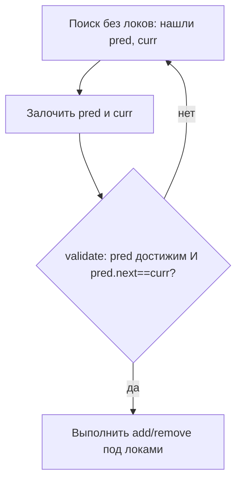
```mermaid
graph TD
  S[Поиск без локов: нашли pred, curr] --> L[Залочить pred и curr]
  L --> V{validate: pred достижим И pred.next==curr?}
  V -->|нет| S
  V -->|да| Op[Выполнить add/remove под локами]
```

---

## 4. Почему это может быть выгодно

Ключевая ставка: **обойти список дважды без локов** (один раз — поиск, второй — валидация) часто **дешевле**,
чем обойти его один раз, **захватывая лок на каждом** узле. Чтение указателя — почти бесплатно (линия в
`Shared`, билет 25); захват мьютекса — дорогая эксклюзивная транзакция. Поэтому при длинных списках и невысокой
частоте конфликтов оптимизм окупается, несмотря на двойной проход и редкие повторы.

---

## 5. Цена и нюансы

- **Список проходится дважды** (поиск + валидация). При очень частых изменениях валидация часто проваливается →
  много повторов → выгода теряется.
- **`contains` тоже лочит** (поиск без локов, но затем для проверки наличия нужно залочить и валидировать) — а
  это типично ~90% всех вызовов. Это главный недостаток, который устраняет **ленивая** синхронизация (билет 17),
  где `contains` становится wait-free без локов.
- **Освобождение памяти.** Поиск идёт **без локов** — значит, другой поток может в этот момент держать «сырой»
  указатель на узел, который мы удаляем. Поэтому узлы **нельзя сразу переиспользовать/освобождать**: нужен safe
  reclamation (в Java спасает GC; в C++ — hazard pointers/RCU/epoch, билет 22). Более того, валидация обходит
  список, который конкурент модифицирует, — обход должен быть устойчив к тому, что `next` может вести на уже
  удалённые узлы (поэтому важно, что узлы не освобождаются физически сразу).

---

## 6. Прогресс

- **Deadlock-free.** Локи берутся через `std::scoped_lock` (или фиксированным порядком), цикла ожидания нет;
  при провале валидации поток **отпускает** локи и повторяет — он не «застревает», держа ресурс.
- **НЕ starvation-free.** Валидация невезучего потока может проваливаться **сколь угодно долго** (его постоянно
  опережают конкуренты, меняя список) — теоретически он может никогда не завершить операцию. Это слабее, чем у
  грубой синхронизации (которая при честном мьютексе starvation-free).

---

## 7. Сравнение с соседями

| | Тонкая (15) | Оптимистичная (16) | Ленивая (17) |
|---|---|---|---|
| Поиск | с локом на каждом узле | **без локов** | без локов |
| `contains` | лочит цепочку | лочит + валидирует | **wait-free, без локов** |
| Валидация | не нужна | повторный обход (O(n)) | O(1) по биту `marked` |
| Проходов списка | 1 | **2** (поиск + валидация) | 1 |
| Прогресс | deadlock-free | deadlock-free (не starvation-free) | `contains` wait-free; `add`/`remove` блок. |
| Reclamation | проще | **нужен** | нужен |

---

## См. также

- Билет 15 — тонкая синхронизация (что оптимизируем).
- Билет 17 — ленивая (валидация за O(1), wait-free `contains`).
- Билет 18 — неблокирующая (без локов вовсе).
- Билет 22 — safe reclamation (почему узлы нельзя сразу освобождать).
- Билет 29 — точки линеаризации.


---

# Билет 17. Алгоритмы синхронизации: ленивая

> **На экзамен (кратко).**
> **Ленивая (lazy)** синхронизация — как оптимистичная (билет 16), но к узлу добавляется булев флаг **`marked`**
> (**логическое** удаление отделено от **физического**). `remove` сначала **помечает** узел логически
> (`curr.marked = true`), затем **физически** отцепляет (`pred.next = curr.next`). Это даёт два выигрыша:
> (1) **`contains` становится wait-free** — идёт **без локов** и **без валидации**, просто проверяя `marked` и
> порядок ключей; (2) **валидация в `add`/`remove` становится O(1)**: `!pred.marked && !curr.marked &&
> pred.next == curr` (не нужен повторный обход всего списка). Точки линеаризации: успешный `add` — установка
> `pred.next`; успешный `remove` — установка бита `marked`.

---

## 1. Зачем: убрать локи из `contains`

Главная боль оптимистичной синхронизации (билет 16): `contains` — самая частая операция (обычно ~90% вызовов) —
всё равно **берёт локи** и делает повторную валидацию обходом. Хочется, чтобы чтение было **полностью без
блокировок**. Препятствие: как читателю без локов **отличить** «узел ещё в множестве» от «узел уже удаляют»?
Ответ — **бит `marked`**: явный признак «этот узел логически удалён». Тогда читатель просто смотрит на бит, а не
участвует в гонке за указатели.

**Логическое vs физическое удаление** — центральная идея. Удаление разбивается на два шага:
- **логическое**: выставить `curr.marked = true` — узел «объявлен удалённым», хотя ещё физически в списке;
- **физическое**: `pred.next = curr.next` — узел отцеплен от цепочки.
Между этими шагами узел **присутствует в списке, но не принадлежит множеству**. Инвариант: «узел **не** помечен
⟺ он в множестве и достижим».

---

## 2. Алгоритм

```cpp
template <class T>
class LazySet {
    struct Node {
        T key;
        std::atomic<Node*> next;      // next атомарен: contains читает его без лока
        bool marked = false;          // логическое удаление
        std::mutex m;
    };
    Node* head_;                       // сентинелы -inf / +inf

    // O(1) ВАЛИДАЦИЯ: оба не помечены и связь непосредственная
    bool validate(Node* pred, Node* curr) {
        return !pred->marked && !curr->marked && pred->next.load() == curr;
    }
public:
    // WAIT-FREE: без локов, без валидации, без повторов
    bool contains(T x) {
        Node* curr = head_->next.load();
        while (curr->key < x) curr = curr->next.load();   // просто идём по ключам
        return curr->key == x && !curr->marked;            // есть ⟺ нашли и НЕ помечен
    }

    bool remove(T x) {
        for (;;) {
            Node* pred = head_;
            Node* curr = pred->next.load();
            while (curr->key < x) { pred = curr; curr = curr->next.load(); }   // поиск без локов

            std::scoped_lock lk{pred->m, curr->m};         // лочим pred и curr
            if (!validate(pred, curr)) continue;           // O(1)! устарело → повтор
            if (curr->key != x) return false;

            curr->marked = true;                           // (1) ЛОГИЧЕСКОЕ удаление = точка линеаризации
            pred->next.store(curr->next.load());           // (2) ФИЗИЧЕСКОЕ отцепление
            return true;                                    // reclaim curr — см. §5
        }
    }

    bool add(T x) {
        for (;;) {
            Node* pred = head_;
            Node* curr = pred->next.load();
            while (curr->key < x) { pred = curr; curr = curr->next.load(); }

            std::scoped_lock lk{pred->m, curr->m};
            if (!validate(pred, curr)) continue;
            if (curr->key == x) return false;              // уже есть
            Node* n = new Node{ x, {}, false, {} };
            n->next.store(curr);
            pred->next.store(n);                           // точка линеаризации успешного add
            return true;
        }
    }
};
```

---

## 3. Почему `contains` корректен без локов

`contains` идёт по списку, читая `next`, и возвращает `curr.key == x && !curr.marked`. Разберём, почему это
линеаризуемо несмотря на отсутствие блокировок.

- Если узел с ключом `x` **есть и не помечен** в момент, когда `contains` на него смотрит, — он в множестве,
  возвращаем `true`. Корректно.
- Если узел **помечен** (логически удалён) — возвращаем `false`. Тоже корректно: помеченный узел не принадлежит
  множеству, даже если ещё физически в списке.
- Может ли `contains` «промахнуться» мимо только что добавленного узла? Это допустимо: если `add(x)` происходит
  **конкурентно** с `contains(x)`, их можно линеаризовать в любом порядке — `contains` имеет право «не увидеть»
  ещё не зафиксированную вставку (точка линеаризации `add` — момент `pred.next = n`).
- Ключевой нетривиальный момент: `contains` идёт **по узлам, которые могут отцепляться** у него «из-под ног».
  Но помеченный (удаляемый) узел **остаётся валидным объектом** (физически не освобождён сразу — см. §5), и его
  `next` по-прежнему ведёт «вперёд» по возрастанию ключей. Поэтому даже если `contains` зашёл в узел, который
  параллельно отцепляют, он либо найдёт `x` дальше, либо упрётся в больший ключ — без обращения к
  «мусорной» памяти.

Это и есть **wait-free**: `contains` завершается за конечное число шагов (длину списка), **не** завися от других
потоков, без локов и повторов.

---

## 4. Точки линеаризации (билет 29)

- **успешный `add(x)`** — момент записи `pred.next = n` (узел стал достижим);
- **успешный `remove(x)`** — момент `curr.marked = true` (**логическое** удаление; физическое отцепление —
  уже «уборка», на семантику множества не влияет);
- **`contains(x) == true`** — момент, когда прочитан непомеченный узел с ключом `x`;
- **`contains(x) == false`** — раньшее из: чтение помеченного/несовпадающего узла, либо момент непосредственно
  **перед** конкурентным успешным `add(x)` (по официальным слайдам Herlihy–Shavit формулировки слегка
  варьируются, но все помещают точку внутрь интервала вызова).

Отделение логического удаления и есть то, что даёт «чистую» точку линеаризации `remove` (один атомарный бит),
видимую читателям без локов.

---

## 5. Цена и нюансы

- **`add`/`remove` всё ещё блокирующие** — они берут мьютексы (mutual exclusion); при контеншне — повтор после
  неуспешной валидации. Зависший под локом поток может «придержать» соседей. Это **не** lock-free (отказ потока
  под локом останавливает операции на его узлах) — переход к полностью неблокирующему варианту делает билет 18.
- **Reclamation.** Поскольку `contains` ходит **без локов** и может держать указатель на узел, который
  параллельно удаляют, узел **нельзя сразу освобождать**: нужен safe reclamation (GC в Java; hazard
  pointers/RCU/epoch в C++ — билет 22). Помеченный узел живёт, пока на него могут ссылаться читатели.
- **`next` должен быть атомарным/синхронизированным**: `contains` читает его без лока конкурентно с записью в
  `add`/`remove` — иначе data race (билет 20). Отсюда `std::atomic<Node*> next` (с подходящим `memory_order`,
  билет 26).

---

## 6. Сравнение

| | Оптимистичная (16) | **Ленивая (17)** | Неблокирующая (18) |
|---|---|---|---|
| `contains` | лочит + валидирует | **wait-free, без локов** | wait-free, без локов |
| Валидация `add`/`remove` | O(n) обход | **O(1)** по `marked` | нет (CAS) |
| Удаление | сразу физическое | **логическое → физическое** | логическое (mark) → физическое, через CAS |
| `add`/`remove` прогресс | блокирующие | блокирующие | **lock-free** |
| Reclamation | нужен | нужен | нужен |

Ленивая синхронизация — отличный практический компромисс: чтения масштабируются идеально (wait-free), а записи
просты (короткая O(1) валидация). Для многих рабочих нагрузок с преобладанием чтения этого достаточно, не
прибегая к сложности полного lock-free.

---

## См. также

- Билет 16 — оптимистичная (откуда взялась дорогая валидация).
- Билет 18 — неблокирующий список Харриса–Майкла (mark в указателе, CAS).
- Билет 22 — safe reclamation для узлов, читаемых без локов.
- Билет 26 — `memory_order` для атомарного `next`.
- Билет 29 — линеаризуемость и точки линеаризации.


---

# Билет 18. Алгоритмы синхронизации: неблокирующая

> **На экзамен (кратко).**
> **Неблокирующий (non-blocking)** список-множество (Харрис, 2001; Майкл, 2002) — без мьютексов, только через
> **CAS**: `add`/`remove` — **lock-free**, `contains`/`find` — **wait-free**. Удаление, как в ленивой схеме
> (билет 17), делится на **логическое** (пометка) и **физическое** (отцепление), но пометка **атомарно
> объединена с указателем `next`**: бит `marked` «вшит» в младший бит выровненного указателя
> (в Java — `AtomicMarkableReference`; в C++ — «кража» младшего бита). Это нужно, чтобы CAS видел **указатель
> и пометку как единое целое** и вставка/удаление не «проскальзывали» в логически удалённый узел. Рабочая
> лошадка — `find`, которая попутно **физически вырезает** встреченные помеченные узлы.

---

## 1. Зачем объединять бит пометки с указателем

Ленивая синхронизация (билет 17) уже разделила логическое и физическое удаление и сделала `contains` wait-free,
но `add`/`remove` оставались **блокирующими** (брали мьютексы). Хочется убрать локи и оттуда — делать все
изменения через **CAS**. Тут возникает тонкая, но фатальная гонка, объясняющая, **почему недостаточно отдельного
бита `marked`** и нужен **marked-pointer**.

**Гонка, требующая атомарного объединения** (по `lockfree_conspect`, §7). Пусть бит `marked` хранится **отдельно**
от `next`. Поток A логически удаляет узел `b` (ставит `b.marked`). Параллельно поток B хочет вставить узел `c`
**после** `b` и делает `CAS(b.next, old, c)`. Этот CAS **успешен** (он смотрит только на `next`, а `next` у `b`
не менялся) — но `b` **уже логически удалён** и вот-вот будет физически отцеплен. В результате `c` оказывается
вставлен в **отсоединяемый** узел и **теряется** вместе с `b`. Множество повреждено.

**Решение.** Пометка и указатель должны меняться **одним атомарным CAS**. Тогда любая попытка `CAS(b.next, …)`
для вставки после `b` **провалится**, если `b` помечен (потому что помеченное состояние `next` ≠ ожидаемому
непомеченному). Технически: указатели на узлы **выровнены** (минимум по 2 байта), поэтому младший бит адреса
всегда 0 — его «крадут» под флаг `marked`. CAS работает над парой **(указатель, бит)** как над одним словом.

```
next-слово узла:  [ ...адрес следующего узла... | mark-бит ]
                   старшие биты = ptr             бит0 = 0/1
```

---

## 2. Структура и упаковка marked-pointer (C++)

В Java это `AtomicMarkableReference<Node>` (атомарная пара ссылка+бит). В C++ — атомарный указатель с «вшитым»
битом:

```cpp
#include <atomic>
#include <cstdint>

template <class T>
class LockFreeSet {
    struct Node {
        T key;
        std::atomic<std::uintptr_t> next;   // упаковано: (Node* << 0) | mark-бит (бит 0)
    };
    Node* head_;                             // сентинелы -inf / +inf

    static Node*         ptr (std::uintptr_t v) { return reinterpret_cast<Node*>(v & ~std::uintptr_t{1}); }
    static bool          mark(std::uintptr_t v) { return v & 1u; }
    static std::uintptr_t pack(Node* p, bool m) { return reinterpret_cast<std::uintptr_t>(p) | (m ? 1u : 0u); }
    // ...
```

(Узлы должны быть выровнены так, чтобы младший бит адреса был свободен — для `struct` с указателями это
выполняется автоматически; при желании — `alignas(2)` и более.)

---

## 3. `find` — рабочая лошадка с физической уборкой

`find(x)` возвращает пару `(pred, curr)` с `pred.key < x ≤ curr.key`, **попутно физически удаляя** все
помеченные узлы, которые встретит. Если CAS-уборка не удалась (кто-то опередил) — `find` **рестартует** с головы.
Именно это делает алгоритм lock-free: рестарт происходит только потому, что **другой** поток продвинулся.

```cpp
    // Возвращает (pred, curr); по пути вырезает помеченные узлы. При гонке — рестарт.
    std::pair<Node*, Node*> find(T x) {
    retry:
        Node* pred = head_;
        std::uintptr_t cv = pred->next.load(std::memory_order_acquire);
        Node* curr = ptr(cv);
        for (;;) {
            std::uintptr_t sv = curr->next.load(std::memory_order_acquire);
            Node* succ = ptr(sv);
            while (mark(sv)) {                          // curr ЛОГИЧЕСКИ удалён → физически вырезаем
                std::uintptr_t expected = pack(curr, false);
                if (!pred->next.compare_exchange_strong(expected, pack(succ, false),
                        std::memory_order_acq_rel))
                    goto retry;                         // кто-то изменил pred.next → начать заново
                // reclaim curr (hazard pointers / RCU) — см. §6
                curr = succ;
                sv   = curr->next.load(std::memory_order_acquire);
                succ = ptr(sv);
            }
            if (curr->key >= x) return { pred, curr };  // нашли позицию
            pred = curr;
            curr = succ;
        }
    }
```

---

## 4. `remove` и `add` через CAS

```cpp
public:
    bool remove(T x) {
        for (;;) {
            auto [pred, curr] = find(x);
            if (curr->key != x) return false;          // нет такого
            std::uintptr_t sv = curr->next.load(std::memory_order_acquire);
            Node* succ = ptr(sv);
            if (mark(sv)) continue;                    // уже помечен кем-то — пробуем снова
            // (1) ЛОГИЧЕСКОЕ удаление: атомарно ставим mark на next узла curr
            std::uintptr_t expected = pack(succ, false);
            if (!curr->next.compare_exchange_strong(expected, pack(succ, true),
                    std::memory_order_acq_rel))
                continue;                              // не вышло — повтор
            // (2) ФИЗИЧЕСКОЕ отцепление (best-effort; если не выйдет — доделает find)
            std::uintptr_t e2 = pack(curr, false);
            pred->next.compare_exchange_strong(e2, pack(succ, false), std::memory_order_acq_rel);
            return true;
        }
    }

    bool add(T x) {
        for (;;) {
            auto [pred, curr] = find(x);
            if (curr->key == x) return false;          // уже есть
            Node* n = new Node{ x, {} };
            n->next.store(pack(curr, false), std::memory_order_relaxed);
            std::uintptr_t expected = pack(curr, false);
            // CAS провалится, если pred помечен/изменён → вставка в «живой» список
            if (pred->next.compare_exchange_strong(expected, pack(n, false),
                    std::memory_order_acq_rel))
                return true;
            delete n;                                  // проиграли гонку — повтор
        }
    }

    bool contains(T x) {                               // WAIT-FREE: только чтения, без CAS, без рестарта
        Node* curr = ptr(head_->next.load(std::memory_order_acquire));
        while (curr->key < x)
            curr = ptr(curr->next.load(std::memory_order_acquire));
        std::uintptr_t sv = curr->next.load(std::memory_order_acquire);
        return curr->key == x && !mark(sv);            // есть ⟺ нашли и НЕ помечен
    }
};
```

**Почему `add` корректен.** Вставка делает `CAS(pred.next: curr → n)`. Если `pred` к этому моменту логически
удалён (его `next` помечен) или изменён, ожидаемое значение `pack(curr,false)` не совпадёт — CAS **провалится**,
и мы рестартуем через `find` (который ещё и вычистит помеченный `pred`). Так вставка **никогда** не попадает в
отсоединяемый узел — ровно та проблема, ради которой бит вшит в указатель (§1).

**Почему `remove` корректен.** Логическое удаление — атомарный CAS, ставящий mark на `curr.next`. Только **один**
поток успеет это сделать (CAS), остальные увидят уже помеченное состояние и не продублируют удаление. Физическое
отцепление — best-effort: если наш CAS на `pred.next` не прошёл (конкурент влез), узел всё равно помечен, и его
вырежет ближайший `find`. **Точка линеаризации** `remove` — успешная установка mark.

---

## 5. Почему алгоритм lock-free (а не wait-free для записей)

**Lock-free** = на каждом шаге **система** прогрессирует: какой-то поток гарантированно завершает операцию.
Рестарт `find`/`add`/`remove` происходит **только** когда CAS провалился — а CAS проваливается лишь потому, что
**другой** поток успешно изменил структуру (продвинулся). Бесконечного «все стоят» быть не может. Но **отдельный**
поток может рестартовать неограниченно (его всё время опережают) — поэтому записи **не** wait-free. `contains`/
`find`-чтение — **wait-free** (конечный проход без CAS и рестартов на «чистом» пути; формально в худшем случае
`find` с уборкой может рестартовать, но «чистый» `contains` без модификаций — wait-free).

**Helping** (билет 24, 29). Идея «попутно доделать чужую работу» (вырезать помеченный узел, который другой поток
пометил, но не успел отцепить) — это и есть механизм, переводящий алгоритмы от lock-free к более сильным
гарантиям и устраняющий зависимость от конкретного потока.

---

## 6. Reclamation и ABA — обязательная часть

- **Освобождение памяти.** Нельзя `delete` узел сразу после отцепления: другой поток (например, идущий
  `contains`/`find`) может прямо сейчас держать на него указатель → use-after-free. Нужен safe reclamation:
  **hazard pointers** (Майкл; C++26 `std::hazard_pointer`), **RCU/epoch** (билеты 22, 30). Поэтому в коде выше
  стоят пометки «reclaim …», а не голый `delete`.
- **ABA** (билет 22). CAS по `next` может «не заметить» цикла `A→B→A` (узел отцеплен и переиспользован под тем
  же адресом). Marked-pointer **снижает** риск (mark меняет состояние), но полную защиту даёт reclamation,
  откладывающий переиспользование адреса, либо версионирование.

---

## 7. Подводные камни и производительность

- **Reclamation обязателен** — это не опция; без него lock-free список падает на use-after-free под нагрузкой.
- **memory_order на CAS/load** — `acquire` на чтениях `next`, `acq_rel` на CAS, чтобы публикация ключа/связей
  была видна (билет 26); ошибка здесь даёт «работает на x86, ломается на ARM».
- **Выравнивание узлов** под кражу младшего бита — иначе пометка испортит адрес.
- **Контеншн на CAS** в горячих точках (рядом стоящие ключи) → cache-line bouncing (билет 25); помогает backoff.
- На бенчмарках (по `lockfree_conspect` и классике Herlihy–Shavit) lock-free и ленивый списки **обгоняют**
  грубую/тонкую при высокой доле чтений; при доминирующих чтениях ленивый (билет 17) часто не хуже и **проще**.

---

## См. также

- Билет 17 — ленивая (логическое/физическое удаление, прообраз mark).
- Билет 22 — ABA и safe reclamation (hazard pointers, RCU).
- Билет 14 — CAS (weak/strong, упаковка, memory_order).
- Билеты 27, 28 — Treiber stack и MS-queue (CAS-структуры).
- Билеты 24, 29 — helping и линеаризуемость.


---

# Билет 19. Ошибки ‖-программирования: deadlock

> **На экзамен (кратко).**
> **Deadlock** (взаимоблокировка) — состояние, в котором набор потоков **бесконечно** ждёт ресурсы, удерживаемые
> друг другом, и никто не может продвинуться. Необходимы **все четыре условия Коффмана** одновременно:
> (1) **взаимное исключение** (ресурс нельзя разделить), (2) **удержание с ожиданием** (hold-and-wait — держу
> один, жду другой), (3) **отсутствие вытеснения** (ресурс нельзя отнять), (4) **циклическое ожидание**
> (circular wait — цикл в графе «кто кого ждёт»). Виды в билете: **(1) простой** (поток ждёт ресурс, который
> сам держит — например, повторный захват нерекурсивного мьютекса), **(2) перекрёстный/взаимный** (T1: A→B,
> T2: B→A), **(3) deadlock при `fork`** (поток держит мьютекс, другой делает `fork`; в потомке мьютекс
> «навечно занят» исчезнувшим потоком). Профилактика: **единый порядок захвата**, `std::scoped_lock` (с
> алгоритмом избегания), иерархии локов, таймауты.

---

## 1. Что такое deadlock и условия Коффмана

Deadlock — это не «медленно», а **навсегда стоит**: потоки взаимно заблокированы. Эдвард Коффман (1971)
сформулировал **четыре необходимых условия** — deadlock возможен **только если выполнены все**; убрать **любое**
одно — и deadlock невозможен. Это и есть рецепт профилактики (см. §5).

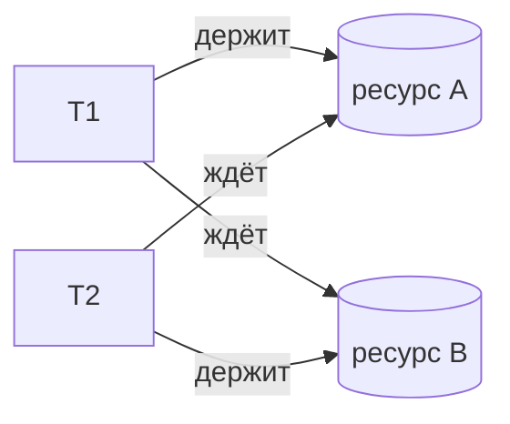
```mermaid
graph LR
  T1 -->|держит| A[(ресурс A)]
  T1 -->|ждёт| B[(ресурс B)]
  T2 -->|держит| B
  T2 -->|ждёт| A
  classDef cyc fill:#fdd;
```
Цикл `T1 → B → T2 → A → T1` в **wait-for graph** — и есть четвёртое условие (circular wait).

---

## 2. (1) Простой deadlock

Поток ждёт ресурс, который **сам же** удерживает. Канонический случай — повторный захват **нерекурсивного**
мьютекса тем же потоком:

```cpp
std::mutex m;
void f() {
    std::scoped_lock lk1{m};
    g();                       // g тоже берёт m...
}
void g() {
    std::scoped_lock lk2{m};   // тот же поток повторно лочит m → DEADLOCK (ждёт сам себя)
}
```
Здесь все четыре условия Коффмана выполнены для одного потока относительно одного ресурса. Лечится либо
реструктуризацией (приватное «ядро» без лока + публичная обёртка, билет 11, §4), либо `std::recursive_mutex`
(если повторный захват — осознанная необходимость).

---

## 3. (2) Перекрёстный (взаимный) deadlock

Два потока берут **два** мьютекса в **противоположном** порядке:

```cpp
std::mutex A, B;
void t1() { std::scoped_lock a{A}; /* ... */ std::scoped_lock b{B}; }   // A потом B
void t2() { std::scoped_lock b{B}; /* ... */ std::scoped_lock a{A}; }   // B потом A
```
Переплетение: `t1` захватил `A` и ждёт `B`; `t2` захватил `B` и ждёт `A` → цикл, оба стоят навсегда. Это
**самый частый** deadlock на практике (счета, переводы, графы блокировок). Классический пример — перевод средств:
поток 1 переводит со счёта X на Y (лочит X, потом Y), поток 2 — с Y на X (лочит Y, потом X).

---

## 4. (3) Deadlock при `fork`

Тонкий и коварный случай, специфичный для многопоточных программ (связь с билетами 03–04). `fork()` копирует в
потомке **только вызывающий поток** — все остальные потоки родителя в потомке **не существуют**. Но **состояние
памяти** (включая мьютексы) копируется **как есть**. Если в момент `fork` **другой** поток держал мьютекс
(например, внутренний мьютекс `malloc`/аллокатора), то в потомке этот мьютекс остаётся **захваченным
несуществующим потоком** — его **никто никогда не отпустит**. Первая же попытка потомка вызвать `malloc` (или
любую функцию, берущую тот же мьютекс) → **вечная блокировка**.

```cpp
// Опасно: другой поток может держать lock внутри malloc в момент fork
pid_t pid = fork();
if (pid == 0) {
    // в потомке аллокаторный мьютекс может быть «навечно занят» исчезнувшим потоком
    void* p = malloc(100);     // потенциальный DEADLOCK
    // ...
}
```

**Почему так.** Мьютекс — это память (futex-слово + поле владельца). `fork` скопировал её в состоянии «занят».
Поток-владелец в потомок не попал → декремента/`unlock` не будет.

**Как бороться.**
- После `fork` в потомке выполнять **только async-signal-safe** действия, в идеале — сразу `exec` (новая
  программа начинается «с чистого листа», старые мьютексы исчезают вместе с заменой образа). Это золотое правило.
- **`pthread_atfork(prepare, parent, child)`** регистрирует обработчики: `prepare` (в родителе **до** `fork`)
  захватывает критичные мьютексы в фиксированном порядке; `parent`/`child` (после `fork`) их отпускают/
  переинициализируют. Так библиотеки приводят своё состояние в согласованность вокруг `fork`. (Сам аллокатор
  glibc регистрирует atfork-обработчики для своих мьютексов.)
- Не делать `fork` из потока, который может держать произвольные библиотечные локи, если потом не сразу `exec`.

---

## 5. Профилактика, избегание, обнаружение

Три уровня борьбы (по убыванию строгости):

**Prevention (предотвращение)** — структурно сделать невозможным одно из условий Коффмана:
- убрать **circular wait**: глобальный **порядок** захвата (всегда лочить мьютексы в одном и том же порядке,
  например по адресу/идентификатору) или **иерархия локов** (уровни; нельзя брать лок более низкого уровня,
  держа более высокий);
- убрать **hold-and-wait**: захватывать **все** нужные локи разом (атомарно), или не держать лок при запросе
  следующего;
- убрать **no-preemption**: использовать `try_lock` с откатом (взять что можешь, не вышло — отпустить всё и
  начать заново).

**Avoidance (избегание)** — динамически не входить в опасное состояние (алгоритм банкира Дейкстры: выдавать
ресурс, только если остаётся «безопасная последовательность»). На практике в прикладном коде применяется редко
(нужно знать максимумы запросов).

**Detection + recovery (обнаружение и восстановление)** — позволить deadlock'ам случаться, периодически искать
**цикл в wait-for graph** и разрывать его (откат транзакции, «убийство» жертвы). Так делают **СУБД**: при
обнаружении взаимоблокировки транзакций одна выбирается жертвой и откатывается (deadlock victim).

### Устройство `std::scoped_lock` / `std::lock` (избегание для нескольких мьютексов)

C++ даёт встроенное избегание перекрёстного deadlock при захвате **нескольких** мьютексов сразу:

```cpp
std::scoped_lock lk{A, B};   // или std::lock(A, B); — БЕЗ deadlock, даже если другой поток пишет {B, A}
```
Как это работает **внутри**: алгоритм **не** просто лочит по порядку (это и давало бы deadlock). Он использует
схему **«try-and-back-off»**: блокирующе захватывает один мьютекс, затем `try_lock` остальные; если какой-то
`try_lock` не удался — **отпускает все** уже захваченные и начинает заново, но уже **с того** мьютекса, на
котором споткнулся (чтобы в следующий раз сначала дождаться именно его). Так гарантируется отсутствие
циклического ожидания **независимо** от порядка аргументов у разных потоков. (Это решает hold-and-wait через
откат, а не через фиксированный порядок.)

---

## 6. Код: безопасный перевод между счетами

```cpp
struct Account { std::mutex m; long balance; };

void transfer(Account& from, Account& to, long amount) {
    // Безопасно: scoped_lock берёт ОБА мьютекса без риска deadlock,
    // даже если другой поток вызывает transfer(to, from, ...)
    std::scoped_lock lk{from.m, to.m};
    from.balance -= amount;
    to.balance   += amount;
}
```
Альтернатива без `scoped_lock` — **фиксированный порядок** по адресу:
```cpp
std::mutex& first  = (&from < &to) ? from.m : to.m;
std::mutex& second = (&from < &to) ? to.m   : from.m;
std::scoped_lock l1{first}; std::scoped_lock l2{second};   // всегда один порядок → нет цикла
```

---

## 7. Подводные камни

- **Перекрёстный deadlock прячется** в коде, где разные пути захватывают одни мьютексы в разном порядке —
  особенно через вложенные вызовы. Дисциплина: единый порядок **или** `std::scoped_lock(a,b,...)`.
- **`fork` в многопоточной программе** без немедленного `exec` — мина: любой библиотечный лок (malloc, stdio,
  логгер) может оставить потомка в deadlock. Правило «после fork только exec/async-signal-safe».
- **Лок + блокирующий вызов** (I/O, ожидание другого потока) под локом — повышает шанс взаимоблокировки и
  сериализует; не держите лок дольше необходимого.
- **`try_lock`-схемы** без backoff могут давать **livelock** (потоки бесконечно отпускают и берут заново, мешая
  друг другу) — добавляйте рандомизированную паузу.
- **Условные переменные/семафоры** тоже участвуют: «жду сигнал, который пошлёт тот, кто ждёт мой» — логический
  deadlock без мьютексов.

---

## См. также

- Билет 11 — мьютекс, `scoped_lock`, рекурсивный (простой deadlock).
- Билеты 03, 04 — `fork`/потоки (почему копируется только вызывающий поток).
- Билет 21 — инверсия приоритетов (родственная, но другая патология планирования).
- Билет 14 — livelock при CAS-петлях без backoff.


---

# Билет 20. Ошибки ‖-программирования: data race, race condition, API race

> **На экзамен (кратко).**
> **(1) Data race** (гонка данных) — два потока обращаются к **одной** не-атомарной ячейке памяти **без
> синхронизации (без отношения happens-before)**, и хотя бы одно обращение — **запись**. В C++ это
> **undefined behavior** (UB) — не «иногда неверный результат», а *полностью неопределённое поведение всей
> программы*. **(2) Race condition** (состояние гонки) — **более широкое** понятие: корректность зависит от
> **тайминга/порядка** выполнения; может существовать **и без** data race. **(3) API race / TOCTOU**
> (time-of-check to time-of-use) — гонка на уровне **интерфейса**: между двумя по отдельности корректными
> вызовами состояние меняется; классический пример — `if (!v.empty()) v.back();` над общим вектором.
> Data race ⟹ обычно race condition, но **не наоборот**.

---

## 1. Три разных, но путаемых понятия

Студенты постоянно смешивают эти термины. Разведём их строго.

- **Data race** — это про **память и модель памяти**: одновременный неатомарный доступ с записью без
  синхронизации. Чисто формальное, проверяемое определение (см. §2). В C++ — **UB**.
- **Race condition** — это про **логику**: исход зависит от того, **в каком порядке** успели выполниться потоки.
  Может быть из-за data race, но может — и при полностью атомарных операциях (см. §4).
- **API race / TOCTOU** — частный, очень частый вид race condition: между **проверкой** условия и **действием**
  по нему состояние успело измениться (см. §5).

Ключевые импликации: **data race ⟹ (как правило) race condition**; **race condition ⇏ data race** (бывает без
гонки данных).

---

## 2. (1) Data race: точное определение и почему это UB

**Определение (модель памяти C++).** Два **конфликтующих** обращения к одной ячейке (конфликт = хотя бы одно —
запись) образуют data race, если они **не упорядочены** отношением **happens-before** (т. е. между ними нет
синхронизации: общего мьютекса, atomic-операций с подходящим порядком, и т. п.). Программа, содержащая хотя бы
один data race, имеет **undefined behavior**.

```cpp
int counter = 0;                          // обычный int

void worker() {
    for (int i = 0; i < 1000; ++i)
        ++counter;                        // DATA RACE: неатомарное чтение-изменение-запись из многих потоков → UB
}
```

**Почему именно UB, а не «потеряем пару инкрементов».** Это критично понять — UB **сильнее**, чем «неверное
число». Стандарт даёт компилятору право предполагать, что **data race'ов нет**, и на этом строить оптимизации:

- **Разрывы (torn reads/writes).** Доступ к переменной может быть не атомарным на уровне инструкций (особенно
  >машинного слова, невыровненной, или на узких шинах) — другой поток увидит «полузаписанное» значение.
- **Переупорядочение и кэширование в регистрах.** Компилятор вправе держать переменную в регистре, переставлять
  чтения/записи, «вынести» загрузку из цикла, — потому что в **корректной** (без гонок) программе это
  ненаблюдаемо. При наличии гонки эти оптимизации дают абсурдные наблюдаемые эффекты.
- **«Out-of-thin-air» и каскадные оптимизации.** Поскольку поведение не определено, компилятор может породить
  код, ломающий даже не связанные участки. Поэтому нельзя «чуть-чуть погонять» — UB отравляет всю программу.

**Как убрать data race.** Установить happens-before между обращениями: мьютекс/`scoped_lock`, либо сделать
переменную **атомарной** с корректным `memory_order` (билеты 14, 26):

```cpp
std::atomic<int> counter{0};
void worker() { for (int i = 0; i < 1000; ++i) counter.fetch_add(1, std::memory_order_relaxed); } // НЕ data race
```
`fetch_add` атомарен → нет «полузаписи» и нет UB. (Заметьте: это убирает **data race**, но логическая
корректность счётчика обеспечивается атомарностью RMW, а не просто отсутствием UB — см. §4.)

---

## 3. `volatile` — НЕ про многопоточность (частый миф)

`volatile` в C/C++ означает «не оптимизировать обращения к этой переменной» (для memory-mapped I/O, сигналов
`sig_atomic_t`). Он **не** даёт ни атомарности, ни happens-before, ни запрета переупорядочения **обычных**
обращений вокруг него относительно других потоков. Использование `volatile` для межпотоковой синхронизации —
**ошибка**; для этого есть `std::atomic`. (В Java семантика `volatile` иная — там это acquire/release; в C++ —
нет.)

---

## 4. (2) Race condition без data race

Race condition может существовать **даже когда все обращения атомарны** (data race'а нет). Пример — «проверить и
действовать» над атомиком:

```cpp
std::atomic<int> balance{100};

void withdraw(int amount) {
    if (balance.load() >= amount)          // (проверка атомарна — нет data race)
        balance.fetch_sub(amount);         // (вычитание атомарно — нет data race)
    // НО между load и fetch_sub другой поток мог уже снять деньги → перерасход
}
```
Здесь **нет** data race (каждая операция атомарна), но есть **race condition**: два потока одновременно прошли
проверку при `balance=100, amount=100` и оба сняли → баланс ушёл в минус. Исправление — **атомарность всей
транзакции** (CAS-петля или мьютекс):

```cpp
void withdraw_ok(int amount) {
    int cur = balance.load();
    do { if (cur < amount) return; }
    while (!balance.compare_exchange_weak(cur, cur - amount));   // проверка-и-снятие атомарны вместе
}
```
Вывод: **отсутствие data race не означает отсутствие race condition.** Атомики убирают UB, но логику «проверить-
и-действовать» нужно делать неделимой явно.

---

## 5. (3) API race / TOCTOU

Самый частый практический вид гонки — на уровне **интерфейса** структуры: каждый вызов корректен, но **между**
вызовами состояние меняется.

**Пример с вектором** (check-then-act):
```cpp
std::vector<int> v;          // общий
// поток-читатель:
if (!v.empty()) {            // TIME-OF-CHECK
    int x = v.back();        // TIME-OF-USE: другой поток успел сделать v.pop_back()/v.clear()
}                            // → обращение к несуществующему элементу: UB/креш
```
Даже если бы у `vector` каждый метод был потокобезопасен по отдельности, **последовательность** «проверить
`empty` → взять `back`» не атомарна. Правильно — выполнить проверку-и-действие **под одним локом** (одна
критическая секция):
```cpp
std::mutex m;
std::scoped_lock lk{m};
if (!v.empty()) { int x = v.back(); v.pop_back(); }   // вся транзакция атомарна
```

**TOCTOU в файловой системе** (классическая уязвимость): `access(path, W_OK)` (проверка прав) затем
`open(path, …)` (использование) — между ними злоумышленник подменяет `path` симлинком → проверка прошла для
одного файла, открытие — другого. Лечится атомарными примитивами (`openat`/`O_NOFOLLOW`, работа по дескриптору,
а не по имени).

> **Почему «потокобезопасные контейнеры» не спасают.** Даже если каждый метод контейнера атомарен, **компоновка**
> методов — нет. Поэтому STL-контейнеры **намеренно** не имеют внутренней синхронизации: правильный уровень
> атомарности — это **транзакция приложения**, а не отдельный вызов. Синхронизировать нужно последовательность.

---

## 6. Устройство обнаружения: ThreadSanitizer

Гонки трудно ловить тестами (зависят от тайминга). **ThreadSanitizer (TSan)** — динамический детектор. Механика
(упрощённо):
- инструментирует **каждое** обращение к памяти; ведёт **shadow memory** — теневые записи о последних доступах к
  каждой ячейке (какой поток, какие «часы»);
- поддерживает **векторные часы (vector clocks)** для отношения happens-before: мьютексы/atomic-операции
  обновляют часы потоков;
- при обращении проверяет: упорядочено ли оно happens-before с предыдущими конфликтующими обращениями. Если
  есть конфликт (запись + доступ) **без** happens-before — рапортует data race со стеками обоих обращений.

TSan ловит **data race** (формальное свойство), но **не** общие race condition/логические гонки и не все TOCTOU
(их часто ищут статически/ревью). Стоимость — замедление в разы и рост памяти; используется в тестовых сборках.
Аналог под Valgrind — **Helgrind**.

---

## 7. Подводные камни и рекомендации

- **«Работает на x86» ≠ корректно.** x86-TSO (билет 26) скрывает многие гонки, которые «выстрелят» на ARM/Power
  со слабой моделью. Корректность — это **отсутствие UB по стандарту**, а не «прошло на моей машине».
- **`volatile` не синхронизирует** — используйте `std::atomic`.
- **Атомики убирают UB, но не race condition** — проверку-и-действие делайте атомарной (CAS/мьютекс).
- **Не отдавайте наружу «сырые» компоновки** методов общих структур — оборачивайте транзакцию в одну
  критическую секцию.
- **Запускайте TSan** в CI; гонки почти не воспроизводятся «вручную».
- **TOCTOU в ФС/безопасности** — работайте по дескрипторам/атомарным syscalls, а не по именам с разрывом
  проверка→использование.

---

## См. также

- Билет 26 — модель памяти, happens-before, почему «работает на x86» обманчиво.
- Билет 14 — атомарная «проверка-и-действие» через CAS.
- Билет 11 — мьютекс как способ установить happens-before.
- Билеты 15–18 — корректная синхронизация структур (API race в контейнерах).


---

# Билет 21. Ошибки ‖-программирования: инверсия приоритетов

> **На экзамен (кратко).**
> **Инверсия приоритетов** (priority inversion) — высокоприоритетная задача **H** блокируется на ресурсе
> (мьютексе), удерживаемом низкоприоритетной задачей **L**, а **L** в это время вытесняется
> **средне**приоритетной задачей **M**, которая на ресурс **не** претендует. В итоге **H** (высший приоритет)
> ждёт неограниченно долго, фактически «пропуская вперёд» M — приоритеты **инвертированы**. Это патология
> **планирования** (не deadlock: прогресс есть, но не у того, у кого должен быть). Решения: **наследование
> приоритета** (priority inheritance — L временно поднимается до приоритета H, пока держит ресурс) и
> **протокол потолка приоритета** (priority ceiling — ресурсу присвоен «потолок», задача при захвате
> поднимается до него). Знаменитый кейс — **Mars Pathfinder (1997)**.

---

## 1. Механизм инверсии

Рассмотрим три задачи с приоритетами H > M > L и один общий мьютекс, нужный H и L:

1. **L** захватывает мьютекс и входит в критическую секцию.
2. **H** просыпается, вытесняет L, пытается захватить тот же мьютекс — **блокируется** (его держит L). Пока всё
   «правильно»: H ждёт ресурс.
3. Просыпается **M** (ей мьютекс не нужен). Поскольку M приоритетнее L, планировщик **вытесняет L** и отдаёт CPU
   M. L **не может** доработать критическую секцию и отпустить мьютекс.
4. M работает сколько угодно (или приходят ещё M-задачи). Всё это время **L не бежит** → мьютекс не освобождается
   → **H не бежит**.

Итог: высокоприоритетная H ждёт завершения среднеприоритетной M — **инверсия**. Формально прогресс в системе
есть (M работает), поэтому это **не** deadlock; но дедлайн H срывается.

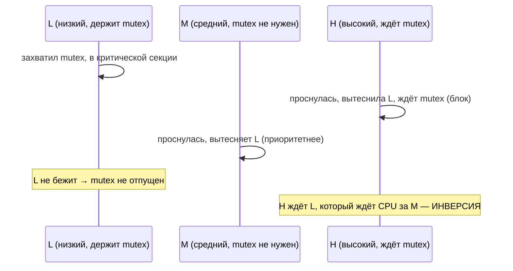
```mermaid
sequenceDiagram
  participant L as L (низкий, держит mutex)
  participant M as M (средний, mutex не нужен)
  participant H as H (высокий, ждёт mutex)
  L->>L: захватил mutex, в критической секции
  H->>H: проснулась, вытеснила L, ждёт mutex (блок)
  M->>M: проснулась, вытесняет L (приоритетнее)
  Note over L: L не бежит → mutex не отпущен
  Note over H: H ждёт L, который ждёт CPU за M — ИНВЕРСИЯ
```

---

## 2. Кейс Mars Pathfinder (1997)

Хрестоматийный пример из реальной миссии — марсоход/посадочный модуль Pathfinder на ОСРВ **VxWorks**.

**Что происходило.** На борту была высокоприоритетная задача управления шиной данных **`bc_dist`**
(`bc_sched`/информационная шина), работавшая часто и с жёстким дедлайном. Был общий ресурс — **мьютекс**,
защищавший канал/пайп, через который шёл обмен (в частности, его касался механизм `select` и
низкоприоритетная **метеозадача `ASI/MET`**, публиковавшая данные). Иногда происходила точно описанная выше
последовательность: `ASI/MET` (низкий приоритет) захватывала мьютекс; высокоприоритетная `bc_dist` блокировалась
на нём; а **среднеприоритетная** коммуникационная задача (загруженная, к мьютексу непричастная) **вытесняла**
`ASI/MET`, не давая ей отпустить мьютекс.

**Симптом.** Сторожевой таймер (**watchdog**) следил, что `bc_dist` укладывается в дедлайн. Обнаружив, что
`bc_dist` «зависла» (на самом деле — ждёт инвертированный мьютекс), watchdog делал вывод об аномалии и
**перезагружал** систему. На Земле это выглядело как периодические **загадочные перезагрузки** аппарата, теряющие
данные.

**Корень.** У мьютекса VxWorks была опция **наследования приоритета**, но она была **выключена** (из соображений
производительности) при инициализации этого мьютекса. Поэтому L (метеозадача) не поднималась до приоритета H и
оставалась вытесняемой M.

**Как нашли и починили.** Инженеры JPL воспроизвели сбой на наземной копии, **включив трассировку** (которая в
полётной конфигурации была отключена), и поймали инверсию. Исправление: **включить наследование приоритета** для
этого мьютекса. Замечательная деталь — это сделали **в полёте**: VxWorks предоставлял C-интерпретатор и доступ к
символам/глобальным переменным, поэтому удалось загрузить короткий скрипт, переключивший флаг инициализации
мьютекса (значение параметра, управляющего priority inheritance), без перекомпиляции и перезаливки всей прошивки.
После этого перезагрузки прекратились.

**Мораль для билета:** в системах реального времени наследование/потолок приоритета для критичных мьютексов нужно
**включать по умолчанию**; «оптимизация», отключающая его, может стоить миссии.

---

## 3. Решение 1: наследование приоритета (priority inheritance)

**Идея.** Пока низкоприоритетная задача L **удерживает** мьютекс, которого ждёт высокоприоритетная H, L
**временно наследует** приоритет H (поднимается до него). Тогда среднеприоритетная M **не может** вытеснить L
(L теперь не ниже H), L быстро доделывает критическую секцию и отпускает мьютекс — после чего возвращается к
своему исходному приоритету, а H получает ресурс.

**Устройство.** Мьютекс хранит **владельца**; когда более приоритетная задача блокируется на нём, планировщик
**повышает** приоритет владельца до приоритета ждущей (boosting). При вложенных блокировках boosting
**транзитивен** (поднимается цепочка владельцев). При `unlock` приоритет владельца **восстанавливается**. Это
возможно именно потому, что у мьютекса **есть владелец** — отсюда фундаментальное отличие от семафора (билет 07),
у которого владельца нет и наследовать некому.

В Linux: `pthread_mutexattr_setprotocol(&attr, PTHREAD_PRIO_INHERIT)`.

```cpp
// POSIX: мьютекс с наследованием приоритета (псевдо-C)
pthread_mutexattr_t attr;
pthread_mutexattr_init(&attr);
pthread_mutexattr_setprotocol(&attr, PTHREAD_PRIO_INHERIT);   // включить inheritance
pthread_mutex_init(&m, &attr);
```

---

## 4. Решение 2: протокол потолка приоритета (priority ceiling)

**Идея.** Каждому ресурсу заранее присваивается **потолок** — максимальный приоритет среди всех задач, которые
могут его захватывать. Задача, **захватившая** ресурс, немедленно поднимается до этого потолка (а в строгом
варианте — может захватить ресурс, только если её приоритет выше потолков всех **уже** заблокированных ресурсов).

**Свойства.** Потолок не только устраняет инверсию, но и **предотвращает deadlock** (при определённых условиях) и
**ограничивает время блокирования** одной критической секцией (важно для анализа дедлайнов в RT). Цена — нужно
**заранее знать**, кто какие ресурсы берёт (статический анализ), и возможны лишние повышения приоритета. В Linux:
`PTHREAD_PRIO_PROTECT` (с заданием `prioceiling`).

**Сравнение:**
| | Наследование (inheritance) | Потолок (ceiling/protect) |
|---|---|---|
| Когда поднимается приоритет | **динамически**, когда появился ждущий приоритетнее | **сразу** при захвате, до потолка ресурса |
| Нужно знать заранее | нет | да (потолок = max приоритет пользователей ресурса) |
| Deadlock | не предотвращает сам по себе | при строгом протоколе предотвращает |
| Накладные расходы | boosting по факту блокировки | повышение при каждом захвате |

---

## 5. Чем инверсия отличается от deadlock

Частая путаница. **Deadlock** (билет 19) — **никто** не прогрессирует (цикл взаимного ожидания, прогресса нет).
**Инверсия приоритетов** — прогресс **есть** (M спокойно работает), но **не у той** задачи: высокоприоритетная H
ждёт, потому что её «обогнала» среднеприоритетная M через удерживающую ресурс L. Инверсия — это нарушение
**планировочной** гарантии (приоритеты должны соблюдаться), а не взаимная блокировка.

---

## 6. Реальные задачи и подводные камни

**Где критично.** Системы **реального времени**: авионика, космос (Pathfinder), промышленные контроллеры,
аудио/видео с дедлайнами, ядро ОС. В обычных серверных приложениях (политика `SCHED_OTHER`/CFS) инверсия менее
выражена, т. к. CFS не даёт «среднему» бесконечно вытеснять «низкого» (есть честность), но при использовании
RT-политик (`SCHED_FIFO`/`SCHED_RR`) проблема реальна.

**Подводные камни.**
- **Inheritance/ceiling выключены по умолчанию** в обычных мьютексах — для RT-критичных ресурсов их надо
  **явно** включать (урок Pathfinder).
- **Семафор не умеет наследование** (нет владельца) — для взаимного исключения с RT-гарантиями берите мьютекс с
  `PRIO_INHERIT`, а не семафор.
- **Удержание мьютекса долго** низкоприоритетной задачей усиливает инверсию — критические секции должны быть
  короткими.
- **Транзитивные цепочки**: H ждёт L1, L1 ждёт L2 — наследование должно распространяться по цепочке; не все
  упрощённые реализации это делают.

---

## См. также

- Билет 07 — семафор: «нет владельца» ⟹ нет наследования приоритета.
- Билет 11 — мьютекс с владельцем; `PTHREAD_PRIO_INHERIT`/`PRIO_PROTECT`.
- Билет 19 — deadlock (соседняя патология, но прогресса нет вовсе).
- Билет 04 — политики планирования (`SCHED_FIFO`/`RR` vs CFS).


---

# Билет 22. Ошибки ‖-программирования: ABA

> **На экзамен (кратко).**
> **ABA-проблема** — поток читает значение **A**, конкурент успевает поменять **A → B → A**, и **CAS** этого
> потока «успешно» проходит (значение снова **A**), **не заметив** промежуточных изменений → структура
> повреждена. Особенно опасно с **переиспользуемыми указателями** (free-list/аллокатор вернул тот же адрес).
> Способы борьбы: **(1)** версионный/тегированный указатель (CAS над парой `(ptr, counter)`, обычно через
> `cmpxchg16b`); **(2)** **hazard pointers** (поток публикует защищаемый указатель — узел не освобождают, пока
> на него есть hazard); **(3)** epoch-based reclamation / **RCU** (освобождение только после grace period);
> **(4)** сборщик мусора (нет переиспользования адреса, пока есть ссылки). ABA — частный, но коварный спутник
> **любого** CAS по указателям (билеты 14, 18, 27, 28).

---

## 1. Суть: CAS сравнивает значение, а не историю

CAS проверяет, что значение **сейчас равно** ожидаемому, и делает вывод «ничего не изменилось». Но равенство
значения **не означает** отсутствие изменений: значение могло **уйти и вернуться** (A→B→A). Для большинства
скалярных счётчиков это безвредно (нам важно лишь итоговое число). Но когда значение — **указатель на узел**, а
память узлов **переиспользуется**, «тот же адрес» может означать **совсем другой** (или повторно вставленный)
узел. CAS «успешен», а инвариант структуры нарушен.

---

## 2. (1) Канонический пример: ABA в стеке Трайбера

Стек Трайбера (билет 27): вершина `top` — атомарный указатель; `pop` читает `top` и его `next`, затем
`CAS(top, t, t->next)`.

Сценарий ABA (по `lockfree_conspect`, §4):

```
Стек:  top → A → B → C

Поток T1 (pop):
   t1: читает top = A
   t2: читает next = A.next = B
   ... вытеснен перед CAS ...

Поток T2:
   pop A      (top → B → C),  A освобождён/возвращён в пул
   pop B      (top → C)
   push A     (узел A переиспользован, теперь top → A → C, причём A.next = C!)

Поток T1 (продолжает):
   CAS(top, A, B)   ← УСПЕХ! top снова == A, как T1 и ожидал
```

После CAS `top = B`. Но `B` уже **не в стеке** (его извлёк T2)! Узел `C` (и всё под ним) **потерян**, `top`
указывает на освобождённый/чужой `B` → повреждение, потенциальный use-after-free. Причём каждое отдельное
действие T2 корректно — проблема именно в том, что T1 **не заметил** цикла A→B(нет)→A.

> Заметьте: ABA и **safe reclamation** — две стороны одной медали. Если бы `A` **нельзя было** переиспользовать,
> пока T1 держит на него ссылку, цикл A→…→A был бы невозможен. Поэтому методы борьбы с ABA во многом совпадают с
> методами безопасного освобождения памяти.

---

## 3. (2) Версионный (tagged) указатель

**Идея.** Хранить рядом с указателем **счётчик версии**, инкрементируемый при **каждом** изменении, и делать CAS
над **парой** `(ptr, version)`. Тогда цикл A→B→A изменит версию (A,7)→(B,8)→(A,9), и CAS T1 с ожидаемым (A,7)
**провалится** — версия другая. ABA устранена «на уровне значения».

**Устройство.** Нужен **двойной по ширине CAS**: на x86-64 — `cmpxchg16b` (128 бит: 64 бита указатель + 64 бита
счётчик). `std::atomic<TaggedPtr>` будет lock-free только если платформа даёт `cmpxchg16b` (иначе подставится
блокировка — проверяйте `is_lock_free()`).

```cpp
struct TaggedPtr {
    Node*         ptr;
    std::uintptr_t tag;          // версия; ++ при каждом изменении
    bool operator==(const TaggedPtr&) const = default;
};
std::atomic<TaggedPtr> top;      // 16 байт; lock-free ⟺ есть cmpxchg16b

// в pop: CAS(top, {A, v}, {A.next, v+1}) — версия защищает от ABA
```
**Минус.** Счётчик конечной ширины — теоретически возможен **переполнение/повтор версии** (ABA на самом
счётчике), но при 64-битной версии это практически недостижимо. Требует double-width CAS, который есть не везде.

---

## 4. (3) Hazard pointers — устройство

**Hazard pointers** (M. Michael, 2002/2004) — способ **безопасного освобождения**, попутно решающий ABA. Идея:
прежде чем разыменовать «опасный» (hazardous) указатель, поток **публикует** его в специальном per-thread слоте;
освобождающий поток **не удаляет** узел, на который есть опубликованный hazard.

**Механика по шагам:**
1. **Публикация.** У каждого потока есть несколько **hazard-слотов** (атомарных указателей) в глобальном
   массиве. Читая `top` (или `next`), поток записывает прочитанный указатель в свой hazard-слот и **перепроверяет**,
   что он всё ещё актуален (иначе повтор) — это гарантирует, что публикация произошла **до** того, как кто-то
   мог начать освобождение.
2. **Использование.** Пока указатель в hazard-слоте, узел **гарантированно не будет освобождён** другими
   потоками.
3. **Retire (отложенное удаление).** Когда поток логически удаляет узел, он **не** делает `delete` сразу, а
   кладёт узел в свой **retire-list** (приватный список «к удалению»).
4. **Scan + reclaim.** Периодически (когда retire-list подрос) поток **сканирует все hazard-слоты всех потоков**,
   собирая множество «защищённых» указателей. Из своего retire-list он освобождает (`delete`) только те узлы,
   которых **нет** среди защищённых; остальные оставляет на следующий раз.

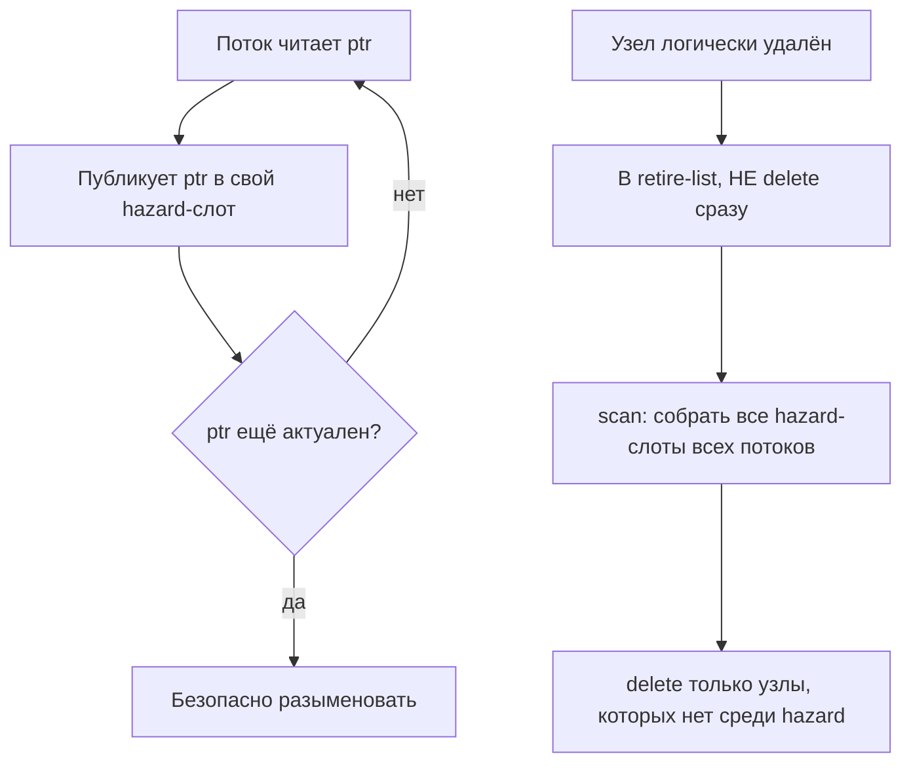
```mermaid
graph TD
  R[Поток читает ptr] --> H[Публикует ptr в свой hazard-слот]
  H --> V{ptr ещё актуален?}
  V -->|нет| R
  V -->|да| U[Безопасно разыменовать]
  D[Узел логически удалён] --> RL[В retire-list, НЕ delete сразу]
  RL --> SC[scan: собрать все hazard-слоты всех потоков]
  SC --> F[delete только узлы, которых нет среди hazard]
```

**Почему это решает ABA.** Узел `A`, на который T1 опубликовал hazard, **не может быть освобождён** и
**переиспользован** T2, пока T1 держит hazard. Значит, цикл «A освободили → A переиспользовали → A снова в
структуре» невозможен в течение жизни hazard'а. ABA исчезает вместе с переиспользованием адреса.

**Стоимость (C++26 `std::hazard_pointer`, P2530).** По данным предложения: на современном серверном железе
конструкция/деструкция `hazard_pointer` в реализации Folly — примерно **4 нс**; использование **заранее
созданного** hazard pointer для «защиты» — обычно **меньше наносекунды** (Folly `hazptr_local<1>` ~2 нс против
~5 нс). То есть защита чтения почти бесплатна, цена сосредоточена в периодическом scan.

```cpp
// C++26 (концептуально):
std::hazard_pointer h = std::make_hazard_pointer();
Node* p = h.protect(top);     // публикует и возвращает безопасный для разыменования указатель
// ... используем p ...
// удаление: node->retire();  (отложенное; реально освободится после отсутствия hazard)
```

---

## 5. (3′) Epoch-based reclamation и RCU

**Epoch-based reclamation** (K. Fraser, «Practical Lock-Freedom», эпохи): глобальный счётчик **эпох**; каждый
поток при входе в критическую секцию объявляет текущую эпоху. Удалённые узлы привязываются к эпохе удаления и
освобождаются, лишь когда **все** потоки покинули эту (и более раннюю) эпоху. Дешевле hazard pointers по чтению
(не надо публиковать каждый указатель), но «застрявший» в критической секции поток **задерживает** освобождение
всех (амортизированная, не строго ограниченная отложенность памяти).

**RCU** (билеты 30, 31) — родственная идея «освобождать после grace period». Грубое правило (McKenney):
**RCU ≈ масштабируемая замена reader-writer lock**; **hazard pointers ≈ масштабируемая замена reference
counting**. RCU блестящ при «почти только чтение»; hazard pointers точечно защищают отдельные объекты.

**Сравнение методов:**
| Метод | Защита от ABA | Накладные на чтение | Ограничена ли отложенность памяти | Нужна аппаратная поддержка |
|---|---|---|---|---|
| Версионный CAS | да | минимальные | — | double-width CAS (`cmpxchg16b`) |
| Hazard pointers | да | публикация указателя (~нс) | **да** (ограничено) | нет |
| Epoch / RCU | да | очень малые | нет (зависит от потоков) | нет |
| GC (managed) | да | — | зависит от GC | среда с GC |

---

## 6. (4) Сборщик мусора

В средах с **GC** (Java, C#) ABA по указателям во многом «растворяется»: пока существует ссылка на узел, GC
**не освобождает** и **не переиспользует** его память. Поэтому многие классические lock-free алгоритмы
публиковались на Java — там reclamation «бесплатен». В C++ этого нет, и значительная часть сложности lock-free
кода — именно ручной reclamation (отсюда билеты выше).

---

## 7. Подводные камни

- **ABA молча проходит** — нет исключения/краша в точке CAS; повреждение проявляется позже (потеря узлов,
  use-after-free). Поэтому **любой** CAS по указателям с переиспользованием памяти требует осознанной защиты.
- **Версионный счётчик** требует double-width CAS и теоретически переполняем (для 64 бит — несущественно).
- **Hazard pointers**: число hazard-слотов на поток ограничено (нужно знать, сколько указателей защищать
  одновременно); забытая публикация = use-after-free; scan имеет стоимость.
- **Epoch/RCU**: один «уснувший» в критической секции читатель задерживает освобождение памяти у всех — риск
  роста памяти.
- **«У нас x86, ABA не страшна»** — заблуждение: ABA — это про **логику CAS и переиспользование адресов**, а не
  про модель памяти; она платформонезависима.

---

## См. также

- Билет 14 — CAS, `cmpxchg16b`, weak/strong.
- Билет 27 — стек Трайбера (где ABA и возникает).
- Билет 28 — MS-queue (counted pointers против ABA).
- Билет 18 — lock-free список и reclamation.
- Билеты 30, 31 — RCU как reclamation/синхронизация для «почти только чтение».


---

# Билет 23. Атомарные снимки: lock-free

> **На экзамен (кратко).**
> **Атомарный снимок** (atomic snapshot, Afek, Attiya, Dolev, Gafni, Merritt, Shavit, JACM 1993) — общий массив
> из $n$ ячеек (по одному «писателю» на ячейку), поддерживающий две операции: **`update(i, v)`** (записать в
> свою ячейку $i$) и **`scan()`** — получить **мгновенный, согласованный** снимок **всего** массива (как будто
> прочитан атомарно в один момент). **Lock-free** реализация — **двойной сбор (double collect)**: прочитать
> весь массив дважды (`collect`); если **оба сбора совпали** — это валидный (линеаризуемый) снимок; иначе
> повторить. Чтобы совпадение значений не было обманчивым (ABA на значениях), к каждой ячейке добавляют
> **порядковый номер (sequence number)**, увеличиваемый при каждом `update`.

---

## 1. Зачем нужен атомарный снимок

Часто требуется **согласованный** взгляд на множество переменных, изменяемых параллельно: сделать checkpoint,
снять статистику со всех потоков, прочитать вектор показаний датчиков «на один момент». Наивное «прочитать ячейки
по очереди» даёт **рваный** результат: пока читаем `a[5]`, кто-то меняет `a[2]`, и итог не соответствует
**ни одному** реальному состоянию массива. Atomic snapshot гарантирует, что возвращённый массив **существовал
целиком** в некоторый момент между началом и концом `scan` (линеаризуемость, билет 29) — без глобального лока.

**Модель.** Single-writer multi-reader: ячейку $i$ пишет только «процесс $i$» (через `update`), а `scan` могут
делать все. Ячейки — атомарные регистры (билет 14). Цель — построить `scan`, выглядящий атомарным, из обычных
атомарных чтений/записей отдельных ячеек.

---

## 2. Идея double collect

Назовём **`collect`** простое последовательное чтение всех $n$ ячеек (рваное само по себе). Ключевое
наблюдение:

> Если выполнить `collect` **дважды подряд** и **оба результата идентичны**, то в промежутке между концом
> первого и началом второго сбора **никто ничего не записал** — следовательно, прочитанный массив **был**
> реальным состоянием в этот промежуток, и его можно вернуть как корректный атомарный снимок.

```cpp
std::vector<std::atomic<Word>> A(n);

std::vector<Word> collect() {                 // рваное чтение всех ячеек
    std::vector<Word> r(A.size());
    for (size_t i = 0; i < A.size(); ++i) r[i] = A[i].load(std::memory_order_acquire);
    return r;
}

std::vector<Word> scan_lockfree() {
    for (;;) {
        auto first  = collect();
        auto second = collect();
        if (first == second) return first;     // два одинаковых сбора → валидный снимок
        // иначе кто-то писал между ними → повторяем
    }
}

void update(size_t i, Word v) { A[i].store(v, std::memory_order_release); }  // писать в свою ячейку
```

**Линеаризация (билет 29).** Точка линеаризации `scan` — момент **между** двумя совпавшими сборами (там массив
точно был в возвращённом состоянии). Точка линеаризации `update` — сама атомарная запись ячейки.

---

## 3. Почему нужны порядковые номера (ABA на значениях)

Простое сравнение **значений** двух сборов недостаточно: значение ячейки могло **измениться и вернуться**
($v \to w \to v$) ровно между сборами — два `collect` дадут одинаковое $v$, хотя запись **была** (это **ABA**,
билет 22, но на уровне содержимого ячеек). Тогда «снимок» окажется несогласованным: мы решили, что записей не
было, а они были.

**Решение.** К каждой ячейке прикрепляют **монотонный порядковый номер (sequence number)**, который `update`
**инкрементирует при каждой записи** (даже если записывает то же значение). Сравниваются пары **(значение,
seq#)**. Тогда цикл $v_{,7} \to w_{,8} \to v_{,9}$ даст различие в seq# — сборы **не** совпадут, и `scan`
корректно повторится.

```cpp
struct Cell { Word value; uint64_t seq; bool operator==(const Cell&) const = default; };
std::vector<std::atomic<Cell>> A(n);          // нужен атомарный Cell (16 байт → cmpxchg16b)

void update(size_t i, Word v) {
    Cell cur = A[i].load();
    A[i].store(Cell{ v, cur.seq + 1 });        // seq++ при КАЖДОЙ записи — ломает ABA на значениях
}
```
(Базовый алгоритм требует «достаточно широких»/неограниченных счётчиков; на практике 64-битного seq хватает.)

---

## 4. Почему только lock-free, но не wait-free

Double collect даёт **lock-free** (системный прогресс: если `scan` всё время повторяется, значит **кто-то**
постоянно делает `update`, т. е. система прогрессирует), но **не wait-free**:

> При **непрерывном потоке** `update` от разных писателей два последовательных `collect` могут **никогда** не
> совпасть — конкретный `scan` способен повторяться сколь угодно долго и **голодать**.

То есть отдельная операция `scan` не имеет гарантии завершения за конечное число шагов. Чтобы получить
**wait-free** snapshot (каждый `scan` завершается за ограниченное число шагов **независимо** от других), нужен
механизм **взаимопомощи (helping)** через встроенные снимки — это билет 24.

---

## 5. Реальные задачи

- **Согласованные чекпоинты**: снять состояние всех воркеров «на один момент» для сохранения/отладки.
- **Глобальная статистика без лока**: суммарные счётчики, гистограммы по потокам, прочитанные согласованно.
- **Многозначные регистры / снимок конфигурации**: атомарно прочитать набор связанных параметров.
- **Теоретическая основа**: atomic snapshot — кирпич в доказательствах в распределённых вычислениях
  (построение более сложных объектов поверх регистров).

---

## 6. Подводные камни

- **Сравнение только значений → ABA на ячейках.** Обязательны порядковые номера (или иные «штампы») на каждой
  ячейке; иначе «снимок» может быть несогласованным.
- **Голодовка `scan`** при высокой частоте `update` (только lock-free). Если нужна гарантия завершения каждого
  `scan` — wait-free вариант (билет 24).
- **memory_order**: `update` — `release`, чтения в `collect` — `acquire`, чтобы снимок видел согласованные
  записи (билет 26).
- **Атомарность (значение+seq)**: пара должна читаться/писаться атомарно (широкий атомик/`cmpxchg16b`), иначе
  сам штамп рвётся.
- **Стоимость**: каждый `scan` — минимум два полных прохода по $n$ ячейкам; при больших $n$ и частых снимках —
  ощутимо.

---

## См. также

- Билет 24 — wait-free atomic snapshot (helping, встроенные снимки).
- Билет 22 — ABA (та же природа, что и «совпадение значений» здесь).
- Билет 29 — линеаризуемость и точка линеаризации `scan`.
- Билет 14 — атомарные регистры/`cmpxchg16b` для (значение, seq).


---

# Билет 24. Атомарные снимки: wait-free

> **На экзамен (кратко).**
> **Wait-free atomic snapshot** (Afek et al., 1993) — реализация снимка, где **каждый** `scan` завершается за
> **конечное (ограниченное)** число шагов **независимо** от поведения других потоков (в отличие от lock-free
> double collect, который может голодать, билет 23). Достигается **взаимопомощью (helping)** через **встроенные
> снимки (embedded snapshots)**: каждый писатель **перед** записью сам делает `scan` и **встраивает** его
> результат в свою ячейку. Сканирующий, заметив, что некоторый писатель «сдвинулся» (изменил seq#) **дважды**
> за время его двойного сбора, понимает: этот писатель выполнил полный `update` **внутри** интервала scan, —
> и может **позаимствовать** его встроенный (заведомо согласованный) снимок. После $\le O(n)$ мешающих записей
> scan гарантированно завершается.

---

## 1. Зачем wait-free и в чём трудность

Lock-free double collect (билет 23) хорош, но **отдельный** `scan` может повторяться бесконечно при непрерывном
потоке `update` — нет гарантии завершения. В системах реального времени и в теории нужна **wait-free** гарантия:
*каждая* операция завершается за ограниченное число своих шагов, что бы ни делали другие. Трудность: как `scan`
получить согласованный снимок, если писатели **не дают** двум сборам совпасть?

Идея решения — превратить «помеху» в «помощь»: заставить **писателей делиться** уже готовым согласованным
снимком, чтобы сканирующий мог его **позаимствовать** вместо бесконечных попыток собрать свой.

---

## 2. Конструкция: встроенные снимки

Каждая ячейка теперь хранит **тройку**: `(value, seq, embedded_snapshot)`:
- `value` — собственно значение;
- `seq` — порядковый номер, инкрементируемый при каждом `update` (как в билете 23, против ABA);
- `embedded_snapshot` — **полный снимок всего массива**, который этот писатель получил, выполнив `scan`
  **непосредственно перед** своей записью.

**`update(i, v)` (writer тоже сканирует):**
```cpp
struct Cell {
    Word value;
    uint64_t seq;
    std::vector<Word> embedded;     // снимок всего массива на момент перед записью
};
std::vector<std::atomic<Cell*>> A(n);   // указатели на тройки (через reclamation/GC)

void update(size_t i, Word v) {
    std::vector<Word> snap = scan();        // (!) писатель СНАЧАЛА делает полный scan
    Cell* c = new Cell{ v, A[i].load()->seq + 1, std::move(snap) };
    A[i].store(c);                          // публикует (значение, seq++, встроенный снимок)
}
```
Цена — писатель платит за `scan` на каждой записи; зато его ячейка теперь несёт готовый согласованный снимок,
которым смогут воспользоваться сканирующие.

---

## 3. Алгоритм `scan` с helping

`scan` ведёт двойной сбор, но дополнительно **следит за движением** каждого писателя по его `seq`:

```cpp
std::vector<Word> scan() {
    auto a = collect();                         // первый сбор (значения + seq всех ячеек)
    for (;;) {
        auto b = collect();                     // следующий сбор
        if (seqs_equal(a, b))                   // никто не двигался → как в lock-free: валидный снимок
            return values_of(b);

        // кто-то двигался. ищем писателя, сдвинувшегося ДВАЖДЫ с начала нашего scan:
        for (size_t i = 0; i < n; ++i)
            if (moved_twice(i))                 // его seq изменился ≥ 2 раз за наш интервал
                return embedded_snapshot_of(i); // ПОЗАИМСТВОВАТЬ его встроенный снимок

        a = b;                                  // иначе продолжаем наблюдение
    }
}
```

---

## 4. Почему «сдвинулся дважды» ⟹ его снимок «чистый»

Ядро доказательства wait-freedom. Рассмотрим писателя $p$, чей `seq` изменился **дважды** за время нашего
`scan` (между двумя нашими сборами зафиксированы как минимум две его записи).

- Между его **первой** и **второй** записью он успел **полностью** выполнить **второй** `update`, а тот, по
  построению, **начался** с собственного `scan` — и этот `scan` **целиком уложился внутри** интервала нашего
  `scan` (потому что обе его записи мы наблюдали внутри нашего интервала).
- Значит, встроенный во **вторую** запись снимок был получен в момент, лежащий **внутри** нашего интервала
  `scan`. Это «чистый» (согласованный) снимок, **линеаризуемый внутри** нашего вызова — его можно безопасно
  вернуть как **наш** результат: он соответствует реальному состоянию массива в некоторый момент между началом и
  концом нашего `scan`.

**Почему это завершается (ограниченность).** Каждый писатель может **сорвать** наш двойной сбор (сделав одну
запись и тем изменив seq) **не более одного раза** «бесплатно» — на **второй** своей записи он уже **предоставит**
нам годный встроенный снимок. Писателей всего $n$. Значит, после не более чем $O(n)$ мешающих записей либо
случится совпадение seq (чистый double collect, как в билете 23), либо найдётся писатель, сдвинувшийся дважды, и
мы позаимствуем его снимок. В любом случае `scan` завершается за **ограниченное** число шагов → **wait-free**.

Любой «заимствованный» (case-b) снимок опирается на конечную цепочку, в основании которой лежит «чистый» (case-a)
снимок от двух совпавших сборов. Рекурсии-в-бесконечность нет: глубина ограничена $n$.

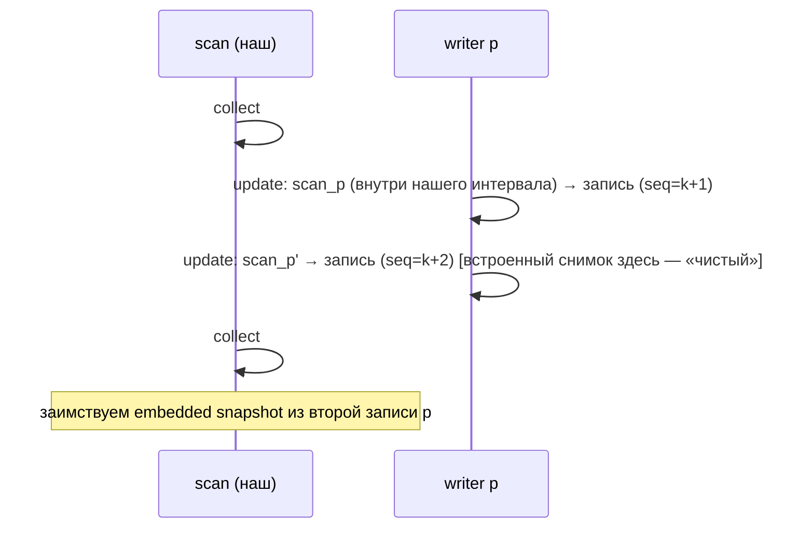
```mermaid
sequenceDiagram
  participant S as scan (наш)
  participant P as writer p
  S->>S: collect #1 (видим seq[p]=k)
  P->>P: update: scan_p (внутри нашего интервала) → запись (seq=k+1)
  P->>P: update: scan_p' → запись (seq=k+2)  [встроенный снимок здесь — «чистый»]
  S->>S: collect #2 (видим seq[p]=k+2 → сдвинулся дважды)
  Note over S: заимствуем embedded snapshot из второй записи p
```

---

## 5. Сравнение lock-free и wait-free снимков

| | Lock-free (билет 23) | **Wait-free (билет 24)** |
|---|---|---|
| Метод | double collect | double collect + **helping** |
| Гарантия `scan` | системный прогресс (может голодать) | **каждый scan завершается** за $O(\cdot)$ |
| Что хранит ячейка | (value, seq) | (value, seq, **встроенный снимок**) |
| Цена `update` | одна запись | запись **+ собственный scan** |
| Память | $O(1)$ на ячейку | $O(n)$ на ячейку (встроенный снимок) |
| Сложность | проще | заметно сложнее |

Цена wait-freedom — **двойная работа писателя** (он тоже сканирует) и **память $O(n)$** на ячейку под встроенный
снимок. Это типичный размен: сильнейшая гарантия прогресса (wait-free) стоит дороже по работе и памяти.

---

## 6. Helping как общий приём

Механизм «заметил незавершённую/конкурентную операцию — **доделай/позаимствуй** её результат» (helping) —
универсальный мост от lock-free к wait-free. Он встречается в:
- этом снимке (заимствование встроенного снимка);
- MS-queue (билет 28): поток **дотягивает** отставший `tail` за конкурента;
- lock-free списке (билет 18): `find` **физически вырезает** помеченный конкурентом узел;
- универсальных wait-free конструкциях (Herlihy) — потоки помогают друг другу применить операции.

Цена helping — дополнительная работа и сложность, выигрыш — независимость прогресса каждого потока от остальных
(билет 29, линеаризуемость).

---

## 7. Подводные камни

- **Память $O(n)$ на ячейку** под встроенный снимок (плюс reclamation для троек) — масштабируется хуже
  lock-free при больших $n$.
- **Писатель платит за scan** на каждой записи — `update` дороже; wait-free snapshot оправдан, когда критична
  гарантия завершения `scan`, а не пропускная способность записей.
- **Порядковые номера всё ещё нужны** (против ABA на значениях и для детекции «сдвинулся дважды»).
- **Атомарная публикация тройки** (через указатель + reclamation/GC) — иначе сама тройка рвётся.

---

## См. также

- Билет 23 — lock-free snapshot (double collect), на котором это построено.
- Билет 28 — helping в MS-queue (тот же приём).
- Билет 18 — helping в lock-free списке.
- Билет 29 — линеаризуемость, точки линеаризации, прогресс wait-free.
- Билет 22 — ABA и порядковые номера.


---

# Билет 25. Модели памяти: протокол когерентности кэшей (MESI)

> **На экзамен (кратко).**
> **MESI** — протокол **когерентности кэшей**: каждая кэш-линия в одном из четырёх состояний — **M**odified
> (изменена, грязная, эксклюзивная), **E**xclusive (чистая, эксклюзивная), **S**hared (чистая, может быть в
> нескольких кэшах), **I**nvalid. Гарантирует, что **по каждой отдельной линии** все ядра видят согласованное
> значение. Реализуется обменом **сообщениями когерентности** (Read, Read Response, Invalidate, Invalidate
> Acknowledge, Read Invalidate, Writeback). Две оптимизации поверх MESI — **store buffer** (запись не ждёт
> завершения инвалидации) и **invalidate queue** (входящие инвалидации откладываются) — дают
> производительность, но **ломают** интуитивный порядок памяти и требуют **барьеров** (билет 26). MESI
> обеспечивает **когерентность** (по одной линии), но НЕ **consistency** (порядок между разными линиями).

---

## 1. Зачем когерентность

CPU на порядки быстрее памяти, поэтому у каждого ядра — свой кэш (L1/L2, L3 общий). Данные ходят блоками —
**кэш-линиями** (обычно 64 байта). Проблема: если ядро 0 закэшировало переменную и изменило её в своём кэше, а
ядро 1 держит **старую** копию той же линии — они «видят разное». **Протокол когерентности** заставляет все
кэши **согласиться** о значении каждой линии: при записи копии у других ядер инвалидируются, при чтении
актуальная версия доставляется владельцем.

---

## 2. Четыре состояния MESI

| Состояние | Кто ещё держит | Память актуальна? | Что можно |
|---|---|---|---|
| **M** odified | только я | **нет** (я грязный) | читать/писать локально; обязан **writeback** перед отдачей/вытеснением |
| **E** xclusive | только я | да | читать/писать; запись `E→M` **без сообщений** (я и так один) |
| **S** hared | возможно, другие | да | только читать; для записи нужно **инвалидировать** чужие копии |
| **I** nvalid | — | — | строки фактически нет; для доступа нужно её запросить |

Ключевые свойства (по `memory_barriers_konspekt`): из **M** нельзя просто выбросить строку — сначала writeback
(она единственная актуальная). Из **E**/**S** можно выбросить без writeback (память актуальна). Запись в **S**
требует согласования (инвалидировать остальных).

---

## 3. Сообщения когерентности и переходы

Кэши общаются через snoop-шину/директорию сообщениями:

| Сообщение | Смысл |
|---|---|
| **Read** | «дайте данные линии (для чтения)» |
| **Read Response** | данные в ответ на Read; источник — память **или** кэш-владелец (если у него **M** — отвечает он) |
| **Invalidate** | «удалите эту линию у себя» |
| **Invalidate Acknowledge** | подтверждение об удалении (после фактического удаления) |
| **Read Invalidate** | Read + Invalidate разом: нужен Read Response **и** полный набор Invalidate Ack |
| **Writeback** | адрес + данные для записи обратно в память (попутно может быть snooped) |

**Запись = Read For Ownership (RFO).** Чтобы записать в линию, которой у меня нет или которая в **S**, ядро шлёт
**Read Invalidate**: получает данные (Read Response) и ждёт **Invalidate Acknowledge от всех** остальных кэшей —
только тогда линия становится **M** (я единственный владелец, могу писать). Это и есть та задержка, которую
оптимизирует store buffer (§4).

**Типичные переходы** (фрагмент таблицы из `memory_barriers_konspekt`):
- `I → M` (атомарный RMW над отсутствующими данными): шлём read invalidate, ждём read response + все inval ack.
- `S → M` (запись в разделяемую): шлём invalidate, ждём все inval ack → пишем.
- `E → M`: локально, **без сообщений**.
- `M → S` (другой читает): отдаём из своего кэша (read response), оставляем read-only копию (возможен
  writeback).
- `M → I` (пришёл read invalidate на грязную): отдаём данные + inval ack, инвалидируем у себя.

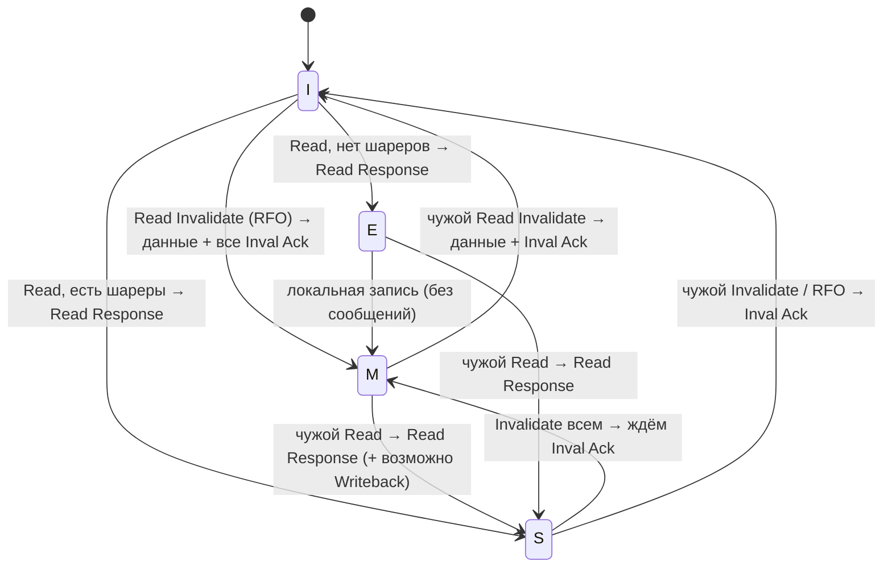
```mermaid
stateDiagram-v2
  [*] --> I
  I --> E: Read, нет шареров → Read Response
  I --> S: Read, есть шареры → Read Response
  I --> M: Read Invalidate (RFO) → данные + все Inval Ack
  S --> M: Invalidate всем → ждём Inval Ack
  E --> M: локальная запись (без сообщений)
  M --> S: чужой Read → Read Response (+ возможно Writeback)
  E --> S: чужой Read → Read Response
  M --> I: чужой Read Invalidate → данные + Inval Ack
  S --> I: чужой Invalidate / RFO → Inval Ack
```

**Варианты.** **MESIF** (Intel) — добавляет **F**orward: одна из shared-копий назначается «отвечающей» (кто
шлёт Read Response), снижая нагрузку. **MOESI** (AMD) — добавляет **O**wned: грязная, но **разделяемая** линия
(можно делиться без немедленного writeback в память).

---

## 4. Store buffer: запись не должна ждать RFO

**Проблема.** RFO (получить линию в **M**) может занять сотни тактов (round-trip по шине + сбор Invalidate Ack).
Заставлять ядро **простаивать** на каждой записи — расточительно, тем более что результат записи ядру «и так
известен».

**Решение — store buffer.** Запись кладётся в **локальную очередь записей** (store buffer), и ядро **сразу идёт
дальше**, не дожидаясь, пока линия станет **M**. Когда RFO завершится, запись «сливается» (drain) из буфера в
кэш.

**Store forwarding.** Если ядро тут же **читает** только что записанную (ещё в буфере) переменную, оно берёт
значение **из своего store buffer** (а не из кэша) — иначе увидело бы старое. Это «store-to-load forwarding».

**Что ломается.** Запись видна **своему** ядру немедленно (через forwarding), но **другим** ядрам — только
**после** слива буфера. Отсюда фундаментальный эффект: **store→load reordering** — другое ядро может увидеть, что
наша загрузка «обогнала» нашу запись. Это **единственное** переупорядочение, наблюдаемое на x86 (x86-TSO, билет
26), и причина, по которой алгоритмы вроде Петерсона требуют полного барьера.

```
CPU0:  x = 1   → кладётся в store buffer (линия x ещё не M)
CPU0:  r = y   → загрузка y выполняется СЕЙЧАС (не ждёт слива буфера)
        ⇒ для CPU1 выглядит так, будто чтение y произошло ДО записи x
```

---

## 5. Invalidate queue: инвалидации тоже не ждут

**Проблема (симметричная).** При серии записей **другие** ядра должны обрабатывать поток **Invalidate**-сообщений
и слать Acknowledge. Если ядро занято/кэш загружен, отправитель RFO ждёт эти Ack → простой. Лишние простои.

**Решение — invalidate queue.** Входящее **Invalidate** ядро **немедленно подтверждает** (шлёт Invalidate Ack) и
ставит запрос в **очередь инвалидаций**, **отложив** фактическое удаление линии. Отправитель быстро собирает все
Ack и продолжает.

**Что ломается.** Между приёмом Invalidate (и отправкой Ack) и **реальным** удалением линии ядро может ещё
**читать устаревшую** копию из своего кэша (инвалидация лежит в очереди, не применена). Это даёт
**LoadLoad/чтение устаревших данных** и требует **read-барьера**, который «осушает» invalidate queue перед
последующими чтениями (билет 26).

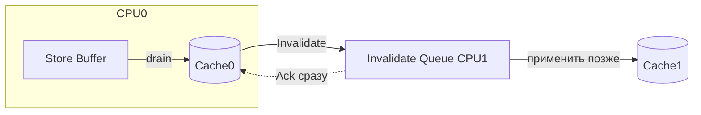
```mermaid
graph LR
  subgraph CPU0
    SB[Store Buffer] -->|drain| C0[(Cache0)]
  end
  C0 -->|Invalidate| IQ[Invalidate Queue CPU1]
  IQ -.->|Ack сразу| C0
  IQ -->|применить позже| C1[(Cache1)]
```

---

## 6. Когерентность ≠ согласованность; false sharing

**Очень важное различие (на экзамен).** MESI даёт **когерентность** — согласие **по каждой отдельной линии**.
Но он **не** задаёт **порядок между обращениями к РАЗНЫМ линиям** — это **memory consistency** (модель памяти),
которую обеспечивают **барьеры** и acquire/release (билет 26). Store buffer + invalidate queue как раз
показывают, что «когерентная» система может переупорядочивать обращения к разным переменным.

**False sharing.** Две **независимые** переменные, попавшие в **одну** кэш-линию, заставляют ядра, пишущие в
«свои» переменные, постоянно **инвалидировать** линию друг у друга (RFO туда-сюда) — резкое падение
производительности, хотя логически данные не связаны. Лечение — **выравнивание/паддинг** до размера линии:

```cpp
struct alignas(std::hardware_destructive_interference_size) PerThread {
    std::atomic<long> counter{0};   // каждый счётчик — в своей кэш-линии, нет false sharing
};
```

---

## 7. Реальные задачи и подводные камни

**Применение/влияние.** Понимание MESI объясняет: стоимость атомиков и спинлоков (cache-line bouncing, билет
14), важность выравнивания и SoA-раскладки (билет 02, 38), почему «горячая» разделяемая переменная — узкое
место. NUMA добавляет уровень: межсокетная когерентность ещё дороже.

**Подводные камни.**
- **False sharing** — самая частая «невидимая» потеря производительности; выравнивайте горячие per-thread
  данные.
- **Cache-line bouncing** на популярном атомике/локе под высоким контеншном — линия мечется в **M** между
  ядрами; помогает TTAS/backoff/шардирование.
- **«Когерентность = порядок» — заблуждение**: для порядка между разными переменными нужны барьеры (билет 26);
  store buffer/invalidate queue это и доказывают.
- **Writeback грязных линий** при вытеснении — скрытая стоимость; паттерны доступа влияют на трафик шины.

---

## См. также

- Билет 26 — барьеры памяти, acquire/release, x86-TSO (что «чинят» барьеры поверх MESI).
- Билет 14 — CAS/спинлок: cache locking, cache-line bouncing.
- Билет 02, 38 — выравнивание, SoA, false sharing в численном коде.
- Билет 06 — NUMA и стоимость межсокетной когерентности.


---

# Билет 26. Модели памяти: memory reordering

> **На экзамен (кратко).**
> **Переупорядочение памяти** (memory reordering) — компилятор и/или процессор меняют порядок обращений к
> памяти относительно порядка в исходном коде. Возможны **четыре** типа переупорядочения пар: **LoadLoad,
> LoadStore, StoreLoad, StoreStore**. **Барьеры памяти** (fences) ограничивают их; на уровне железа read-барьер
> «осушает» invalidate queue, write-барьер сливает store buffer (билет 25). В C++ порядок задаётся через
> **`std::memory_order`**. **Acquire** (на загрузке) запрещает перенос последующих обращений **вверх** через
> неё; **release** (на записи) запрещает перенос предыдущих обращений **вниз** через неё; пара
> release→acquire устанавливает **happens-before**. **x86-TSO** (Total Store Order) — модель x86, где
> единственное наблюдаемое переупорядочение — **store→load** (из-за store buffer); поэтому на x86 загрузки
> имеют acquire-, а записи — release-семантику «бесплатно».

---

## 1. Зачем переупорядочение и почему оно нас касается

Переупорядочение даёт **производительность**: компилятор переставляет независимые инструкции, процессор
выполняет вне очереди и не ждёт медленную память (store buffer, invalidate queue — билет 25). В
**однопоточной** программе это **ненаблюдаемо** (соблюдается иллюзия последовательного исполнения, «as-if»). Но в
**многопоточной** другой поток может **увидеть** результаты в переставленном порядке — и без барьеров получится
неверная синхронизация. Барьеры нужны **точечно** — в примитивах синхронизации (локи, lock-free), чья
корректность зависит от порядка.

Два уровня переупорядочения, оба надо контролировать:
- **компилятор** (переставляет инструкции, кэширует в регистрах) — сдерживается атомиками/барьерами компилятора;
- **процессор** (out-of-order, store buffer, invalidate queue) — сдерживается аппаратными барьерами.

`std::atomic` с правильным `memory_order` закрывает **оба** уровня одной абстракцией.

---

## 2. Четыре типа переупорядочения

Для пары последовательных обращений (первое; второе) возможны переупорядочения:

| Тип | Что переставляется | Где наблюдается |
|---|---|---|
| **LoadLoad** | Load ; Load → второй Load обгоняет первый | слабые модели (ARM/Power); invalidate queue |
| **LoadStore** | Load ; Store → Store обгоняет Load | слабые модели |
| **StoreStore** | Store ; Store → второй Store виден раньше первого | слабые модели; store buffer |
| **StoreLoad** | Store ; Load → Load обгоняет Store | **даже на x86** (store buffer) — самое «живучее» |

**StoreLoad** — самый дорогой для запрета (требует полного слива store buffer, `mfence`) и единственный,
сохраняющийся на x86 (см. §6).

---

## 3. Барьеры на уровне железа (связь с билетом 25)

- **Write-барьер (store barrier)** помечает store buffer: последующие записи не «обгонят» предыдущие — буфер
  должен слиться по порядку. Запрещает **StoreStore**.
- **Read-барьер (load barrier)** «осушает» **invalidate queue**: все отложенные инвалидации применяются **до**
  последующих чтений, поэтому чтения не увидят устаревшие линии. Запрещает **LoadLoad**.
- **Full-барьер** (`mfence`, `std::atomic_thread_fence(seq_cst)`) — и то, и другое, включая **StoreLoad**
  (сливает store buffer перед последующими загрузками). Самый дорогой.

Именно store buffer и invalidate queue (билет 25) — физическая причина, по которой барьеры нужны: они
заставляют «слить»/«осушить» эти структуры в нужный момент.

---

## 4. Acquire / release: точная семантика (по Preshing)

Это центр темы. Acquire и release — **односторонние** ограничения, образующие «забор», через который нельзя
переносить обращения в одну сторону.

- **Acquire** (на операции **загрузки** атомика). Запрещает переносить **последующие** (в программном порядке)
  обращения к памяти **вверх**, выше acquire-загрузки. То есть всё, что **после** acquire, останется после.
  Блокирует **LoadLoad** и **LoadStore** через эту точку.
- **Release** (на операции **записи** атомика). Запрещает переносить **предыдущие** обращения **вниз**, ниже
  release-записи. Всё, что **до** release, останется до. Блокирует **LoadStore** и **StoreStore** через эту
  точку.

**Пара release→acquire создаёт happens-before.** Если поток-писатель сделал release-store флага, а поток-читатель
прочитал этот флаг acquire-load'ом, то **всё, что писатель сделал до release, гарантированно видно читателю
после acquire**. Это и есть механизм «опубликовать данные через флаг»:

```cpp
std::atomic<bool> ready{false};
int data = 0;                                  // обычная (не-атомарная) переменная

// поток-писатель (producer):
data = 42;                                     // (1) обычная запись
ready.store(true, std::memory_order_release);  // (2) release: (1) не «уедет» ниже

// поток-читатель (consumer):
while (!ready.load(std::memory_order_acquire)){}  // (3) acquire: последующее не «уедет» выше
assert(data == 42);                               // (4) ГАРАНТИРОВАНО: видим data=42
```

**Чего acquire/release НЕ запрещают: StoreLoad.** release-store, за которым идёт acquire-load **другой**
переменной, **может** переупорядочиться (release не держит «вниз» загрузку, acquire не держит «вверх» более
раннюю запись). Поэтому алгоритмы, где два потока пишут «свой» флаг и читают «чужой» (Петерсон, Деккер),
**требуют seq_cst / полного барьера** — одних acquire/release недостаточно.

---

## 5. `std::memory_order` в C++

| `memory_order` | Семантика | Когда |
|---|---|---|
| `relaxed` | только атомарность, **никакого** порядка | независимые счётчики, статистика |
| `acquire` | на load: блок LoadLoad+LoadStore «вверх» | чтение флага/публикации |
| `release` | на store: блок LoadStore+StoreStore «вниз» | публикация данных через флаг |
| `acq_rel` | на RMW: и acquire, и release | CAS, `fetch_add` с публикацией |
| `seq_cst` | глобальный единый порядок всех seq_cst-операций | Петерсон/Деккер, когда нужен StoreLoad-порядок; **по умолчанию** |
| `consume` | зависимостный порядок (слабее acquire) | **на практике не реализован** — компиляторы повышают до acquire |

`seq_cst` — самый строгий и **дорогой** (на x86 seq_cst-store компилируется в `xchg`/`mfence`). По умолчанию у
`std::atomic` именно `seq_cst` — безопасно, но не всегда оптимально; ослаблять до acquire/release/relaxed нужно
**осознанно** (с пониманием, какие пары переупорядочений допустимы).

**`memory_order_consume`** задумывался как дешёвый «зависимостный» порядок (для RCU `rcu_dereference` —
билет 30): упорядочивает только обращения, **зависящие по данным** от загруженного указателя. Но корректно
реализовать его в компиляторах не смогли — на практике `consume` **повышается до `acquire`**, и его не
рекомендуют использовать.

---

## 6. x86-TSO: строгая, но точная модель

**x86-TSO** (Total Store Order; формализация Sewell, Sarkar, Owens, Zappa Nardelli, Myreen, CACM 2010) — точная
программистская модель x86. Её суть:

> Единственное наблюдаемое переупорядочение на x86 — **store→load**. Загрузки **не** переупорядочиваются между
> собой (no LoadLoad), записи **не** переупорядочиваются между собой (no StoreStore), загрузка не обгоняет
> предыдущую запись **в ту же** ячейку (store forwarding). Но загрузка может «обогнать» предшествующую запись в
> **другую** ячейку — из-за **store buffer** на каждом ядре.

Следствия для программиста:
- на x86 **каждая загрузка** имеет acquire-семантику, **каждая запись** — release-семантику **«бесплатно»**:
  release/acquire **не требуют** дополнительных инструкций-барьеров (только запрет компиляторных перестановок);
- `seq_cst`-**store** требует `mfence` или реализуется через `xchg` (чтобы запретить StoreLoad);
- поэтому код с acquire/release, **корректный по стандарту C++**, на x86 «почти всегда работает» даже с ошибками
  в расстановке порядков — но **сломается на ARM/Power** (слабые модели, где release/acquire реально
  компилируются в барьерные инструкции `dmb`/`lwsync`). Это главная причина, почему «работает на моём x86» ≠
  «корректно» (билет 20).

```
x86-TSO разрешает ТОЛЬКО:
   Store x ; Load y   →   Load y может выполниться раньше Store x  (store buffer)
Запрещает: LoadLoad, LoadStore, StoreStore (в наблюдаемом поведении).
```

---

## 7. Реальные задачи и подводные камни

**Применение.** Корректная публикация данных (release/acquire флага), spinlock/мьютекс (acquire на lock, release
на unlock — билет 14), lock-free структуры (acquire на чтениях `next`, acq_rel на CAS — билеты 18, 27, 28),
seq_cst там, где нужен StoreLoad-порядок (взаимное исключение в стиле Петерсона).

**Подводные камни.**
- **`relaxed` для публикации данных** — ошибка: `relaxed` не создаёт happens-before, читатель может не увидеть
  связанные записи. Для публикации — `release`/`acquire`.
- **Acquire/release не дают StoreLoad-порядка** — для Петерсона/Деккера нужен `seq_cst`/полный барьер.
- **«Работает на x86»** маскирует пропущенные барьеры — тестируйте логику под слабой моделью/через формальные
  инструменты; помните x86-TSO ≠ ARM.
- **`consume` не использовать** — он повышается до acquire; не закладывайтесь на «дешёвый зависимостный порядок».
- **`seq_cst` по умолчанию дорог** — ослабляйте осознанно, но не «на глаз» (ошибка ослабления тоже даёт
  «работает на x86, ломается на ARM»).
- **`volatile` ≠ барьер** (билет 20): для порядка/атомарности — только `std::atomic`/`atomic_thread_fence`.

---

## См. также

- Билет 25 — store buffer/invalidate queue (физическая причина переупорядочения и работы барьеров).
- Билет 14 — acquire/release на CAS и спинлоке.
- Билеты 18, 27, 28 — `memory_order` в lock-free структурах.
- Билет 20 — почему «работает на x86» обманчиво (UB и слабые модели).
- Билет 30 — `rcu_dereference` и история `memory_order_consume`.


---

# Билет 27. Lock-free: стек Трайбера

> **На экзамен (кратко).**
> **Стек Трайбера** (R. Kent Treiber, IBM, 1986) — первый практичный **lock-free** стек: односвязный список,
> вершина `top` — **атомарный указатель**; `push` и `pop` реализованы **CAS-петлёй** по `top`. **`push`**:
> новый узел указывает на текущий `top`, затем `CAS(top: old → new)`. **`pop`**: читаем `top` и `top->next`,
> затем `CAS(top: t → t->next)`. **Точка линеаризации** — успешный CAS. Алгоритм **lock-free** (но не
> wait-free): рестарт петли происходит только когда **другой** поток успешно изменил `top`. Главные проблемы —
> **ABA** в `pop` и **безопасное освобождение** памяти (билет 22): нельзя `delete` узел без reclamation.

---

## 1. Зачем и идея

Стек (LIFO) — простейшая структура, на которой демонстрируют lock-free. Вся синхронизация сводится к **одной**
точке — вершине `top`. Если оформить `top` как атомарный указатель и менять его **атомарно** через CAS, мьютекс
не нужен: конкурирующие операции «соревнуются» за `top`, и проигравший просто **повторяет** попытку с актуальным
значением. Это убирает блокировки и связанные с ними беды (отказ потока под локом не останавливает других —
билеты 15–18).

---

## 2. Реализация (C++20)

```cpp
#include <atomic>
#include <optional>

template <class T>
class TreiberStack {
    struct Node { T value; Node* next; };
    std::atomic<Node*> top_{nullptr};
public:
    void push(T v) {
        Node* n = new Node{ std::move(v), nullptr };
        n->next = top_.load(std::memory_order_relaxed);
        // CAS: пока top не равен ожидаемому n->next — обновляем n->next и повторяем
        while (!top_.compare_exchange_weak(
                   n->next, n,
                   std::memory_order_release,   // успех: публикуем узел (release)
                   std::memory_order_relaxed))  // неудача: n->next ← фактический top, повтор
        { /* тело пустое: weak в цикле */ }
    }

    std::optional<T> pop() {
        Node* t = top_.load(std::memory_order_acquire);
        while (t && !top_.compare_exchange_weak(
                        t, t->next,
                        std::memory_order_acquire,   // успех: «забираем» вершину (acquire)
                        std::memory_order_relaxed))
        { /* t ← фактический top при неудаче */ }
        if (!t) return std::nullopt;
        T v = std::move(t->value);
        // delete t;  ← НЕЛЬЗЯ без safe reclamation! (см. §5)
        return v;
    }
};
```

**`push` по шагам.** Создаём узел; читаем текущий `top` в `n->next`; CAS пытается заменить `top` на `n`,
ожидая, что он всё ещё равен `n->next`. Если кто-то опередил — `compare_exchange_weak` обновляет `n->next`
фактическим `top` (см. билет 14), и цикл повторяется.

**`pop` по шагам.** Читаем `top` (= `t`); если стек пуст (`t == nullptr`) — `nullopt`; иначе CAS пытается
сдвинуть `top` на `t->next`. При неудаче `t` обновляется и цикл повторяется.

---

## 3. Почему это lock-free (по `lockfree_conspect`, §3)

**Lock-free** = на каждом шаге **система** прогрессирует (какой-то поток гарантированно завершает операцию).
Рассмотрим, когда CAS-петля повторяется: это происходит **только** если `top` **изменился** между нашим чтением
и CAS — то есть **другой** поток успешно сделал свой `push`/`pop` (продвинулся). Значит, бесконечного «все
стоят» быть не может: если мой CAS провалился, кто-то другой завершил операцию. Поэтому алгоритм lock-free.

Но он **не wait-free**: **конкретный** поток может проваливать CAS неограниченно долго (его всё время
опережают) — у отдельной операции нет гарантии завершения за ограниченное число шагов. Под высоким контеншном
это реальная проблема (см. §6, elimination).

**Точка линеаризации** (билет 29): успешный `push`/`pop` «происходит» в момент **успешного CAS** по `top` —
именно тогда операция становится видимой остальным как атомарная.

---

## 4. memory_order: почему именно так

- `push`: успех CAS — **`release`**, чтобы запись `value`/`next` нового узла была **видна** потоку, который
  потом этот узел `pop`-нет (публикация данных, билет 26). Чтение `top` для инициализации `n->next` может быть
  `relaxed` (значение всё равно проверит CAS).
- `pop`: загрузка `top` и успех CAS — **`acquire`**, чтобы «увидеть» данные узла, опубликованные `push`-ем
  (синхронизация release→acquire через `top`).
- неудачная ветвь CAS — `relaxed` (записи не было).

Ошибка здесь (например, `relaxed` везде) даёт «работает на x86 (TSO), ломается на ARM» (билеты 20, 26).

---

## 5. ABA и reclamation — обязательная часть

**ABA в `pop`** (подробно — билет 22). T1 прочитал `top = A`, `A.next = B`. T2 успел: `pop A`, `pop B`,
`push A` (узел A переиспользован, теперь `A.next = C`). CAS T1 `(top: A → B)` **успешен** (top снова A!), но `B`
уже не в стеке → потеря `C`, повреждение. Лечение: версионный `top` (`cmpxchg16b` с тегом), **hazard pointers**,
**RCU/epoch**.

**Безопасное освобождение.** В `pop` нельзя `delete t` сразу: другой поток мог только что прочитать `top == t`
и собирается разыменовать `t->next` → use-after-free. Нужен safe reclamation:
- **hazard pointers** (C++26 `std::hazard_pointer`): защитить `t` перед разыменованием; освобождать через retire;
- **RCU/epoch**: освобождать после grace period.
ABA и reclamation — две стороны одной медали: запрет переиспользования адреса (reclamation) **одновременно**
убирает и ABA, и use-after-free.

---

## 6. Контеншн и elimination-backoff (по `lockfree_conspect`, §8)

Слабое место стека Трайбера — **единая точка `top`**: под высокой нагрузкой все потоки CAS-ят один и тот же
указатель, линия `top` мечется между ядрами в состоянии **M** (cache-line bouncing, билет 25), и пропускная
способность падает, несмотря на «lock-free».

**Elimination-backoff stack** (Hendler–Shavit–Yerushalmi) использует наблюдение: **`push` и `pop`, идущие
одновременно, могут «погасить» друг друга** (элиминация) — `push(x)` передаёт `x` напрямую `pop`-у **минуя**
`top`. При неудачном CAS поток отступает (backoff) на **elimination array**: ищет «партнёра» противоположной
операции; если нашёл — обмен происходит без касания `top` (и стек остаётся линеаризуемым, т. к. одновременные
push/pop можно линеаризовать «push сразу перед pop»). Это снижает контеншн на `top` и масштабируется лучше под
нагрузкой.

---

## 7. Подводные камни

- **`delete` в `pop` без reclamation** → use-after-free под нагрузкой. Обязателен hazard pointers/RCU/epoch.
- **ABA** — версионируйте `top` или применяйте reclamation; «у нас x86» не спасает (ABA платформонезависима).
- **memory_order**: release на `push`-CAS, acquire на `pop` — иначе невидимость данных на слабых моделях.
- **Контеншн на `top`** — cache-line bouncing; при высокой нагрузке рассмотрите elimination-backoff или
  шардирование.
- **`compare_exchange_weak` в цикле** — корректно (ложные провалы безопасны); `strong` без внешнего цикла —
  дороже на LL/SC (билет 14).

---

## См. также

- Билет 14 — CAS (weak/strong, memory_order).
- Билет 22 — ABA и safe reclamation (hazard pointers, RCU).
- Билет 28 — очередь Майкла–Скотта (CAS-структура с helping).
- Билеты 25, 26 — cache-line bouncing, барьеры, x86-TSO.
- Билет 29 — линеаризуемость, точка линеаризации = успешный CAS.


---

# Билет 28. Lock-free: очередь Майкла–Скотта

> **На экзамен (кратко).**
> **Очередь Майкла–Скотта** (M. Michael, M. Scott, PODC 1996) — практичная **lock-free** FIFO-очередь на
> односвязном списке с **dummy-узлом** (фиктивная голова), раздельными атомарными **`head`** и **`tail`**,
> через CAS. **`enqueue`** связывает новый узел в **два** CAS (сначала `tail->next: null → new`, затем
> «подтянуть» `tail: old → new`), **которые не атомарны вместе** — поэтому `tail` может **отставать** на один
> узел; любой поток, увидев отставание, **помогает** (helping) — двигает `tail`. **`dequeue`** читает
> `head`/`tail`/`head->next`, и при `head == tail` различает «пусто» и «`tail` отстал». Dummy-узел устраняет
> частный случай пустой очереди. Стала основой `java.util.concurrent.ConcurrentLinkedQueue`.

---

## 1. Зачем dummy-узел и два указателя

FIFO-очередь требует операций на **двух** концах: `enqueue` в хвост, `dequeue` из головы. Если бы `head` и
`tail` совпадали при пустой/одноэлементной очереди, пришлось бы синхронизировать оба конца разом (сложно и
конфликтно). **Dummy-узел** (фиктивный первый узел, не несущий значения) разрывает эту связь: `head` всегда
указывает на dummy, реальные элементы — за ним; очередь «пуста», когда за dummy ничего нет (`head->next ==
null`). Это устраняет частные случаи и позволяет `enqueue`/`dequeue` работать **почти независимо** на разных
концах.

---

## 2. Реализация (C++20, схематично)

```cpp
#include <atomic>
#include <optional>

template <class T>
class MSQueue {
    struct Node {
        std::optional<T> value;          // у dummy — пусто
        std::atomic<Node*> next{nullptr};
    };
    std::atomic<Node*> head_;
    std::atomic<Node*> tail_;
public:
    MSQueue() { Node* dummy = new Node{}; head_.store(dummy); tail_.store(dummy); }

    void enqueue(T v) {
        Node* n = new Node{ std::move(v), {} };
        for (;;) {
            Node* tail = tail_.load(std::memory_order_acquire);
            Node* next = tail->next.load(std::memory_order_acquire);
            if (tail == tail_.load(std::memory_order_acquire)) {   // tail не сдвинулся за время чтения?
                if (next == nullptr) {
                    // (1) пытаемся пристыковать n в конец списка
                    if (tail->next.compare_exchange_weak(next, n,
                            std::memory_order_release, std::memory_order_relaxed)) {
                        // (2) пытаемся подтянуть tail на n (best-effort; если не выйдет — поможет другой)
                        tail_.compare_exchange_strong(tail, n,
                            std::memory_order_release, std::memory_order_relaxed);
                        return;
                    }
                } else {
                    // tail ОТСТАЁТ (за ним уже есть next) → ПОМОГАЕМ: двигаем tail вперёд
                    tail_.compare_exchange_strong(tail, next,
                        std::memory_order_release, std::memory_order_relaxed);
                }
            }
        }
    }

    std::optional<T> dequeue() {
        for (;;) {
            Node* head = head_.load(std::memory_order_acquire);
            Node* tail = tail_.load(std::memory_order_acquire);
            Node* next = head->next.load(std::memory_order_acquire);
            if (head == head_.load(std::memory_order_acquire)) {   // head стабилен?
                if (head == tail) {
                    if (next == nullptr) return std::nullopt;       // ПУСТО
                    // head==tail, но next!=null → tail отстал → ПОМОГАЕМ его подтянуть
                    tail_.compare_exchange_strong(tail, next,
                        std::memory_order_release, std::memory_order_relaxed);
                } else {
                    T v = *next->value;                             // читаем значение ДО CAS head
                    if (head_.compare_exchange_weak(head, next,
                            std::memory_order_release, std::memory_order_relaxed)) {
                        // delete head;  ← старый dummy; НЕЛЬЗЯ без reclamation (см. §5)
                        return v;
                    }
                }
            }
        }
    }
};
```

---

## 3. Ключевая идея: два CAS в `enqueue` не атомарны вместе

(По `lockfree_conspect`, §6 — «Enq: два CAS, не атомарны вместе!».) Вставка состоит из **двух** шагов:

1. **связать** новый узел: `CAS(tail->next: null → n)` — это «настоящая» вставка (узел стал достижим);
2. **подтянуть** `tail`: `CAS(tail: old → n)` — переместить хвостовой указатель на новый узел.

Между шагами 1 и 2 поток может быть **вытеснен** (или просто не успеть). Тогда возникает **промежуточное
состояние**: новый узел уже в списке (`tail->next == n`), но `tail` всё ещё указывает на **предыдущий** узел —
`tail` **отстаёт** на один. Это **корректное, ожидаемое** состояние, и алгоритм его явно обрабатывает.

---

## 4. Helping: как чинится отстающий `tail`

**Инвариант:** `tail` отстаёт **не более чем на один** узел. Любой поток (в `enqueue` **или** `dequeue`),
обнаружив `tail->next != null` (т. е. за `tail` уже есть узел), **помогает** — выполняет за «застрявшего»
предшественника шаг 2: `CAS(tail: old → next)`. Так система **всегда** продвигается, даже если поток, начавший
`enqueue`, надолго заснул между двумя CAS: его работу **доделает** любой другой поток. Именно helping обеспечивает
**lock-free** (системный прогресс не зависит от конкретного потока — ср. билеты 24, 18).

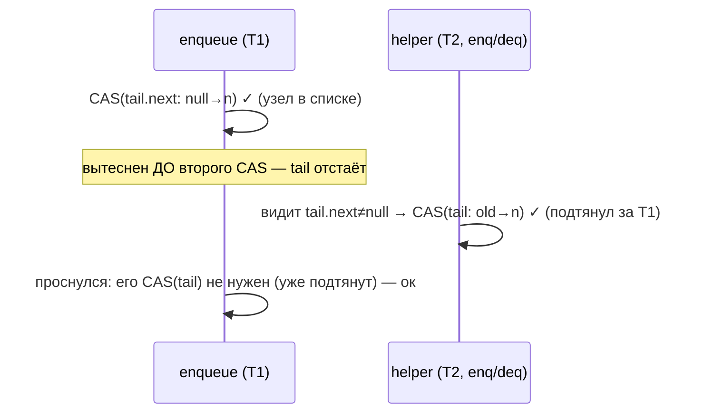
```mermaid
sequenceDiagram
  participant E as enqueue (T1)
  participant H as helper (T2, enq/deq)
  E->>E: CAS(tail.next: null→n)  ✓ (узел в списке)
  Note over E: вытеснен ДО второго CAS — tail отстаёт
  H->>H: видит tail.next≠null → CAS(tail: old→n) ✓ (подтянул за T1)
  E->>E: проснулся: его CAS(tail) не нужен (уже подтянут) — ок
```

---

## 5. Точки линеаризации, ABA, reclamation

**Точки линеаризации** (билет 29):
- успешный **`enqueue`** — момент **первого** CAS (`tail->next: null → n`): именно тогда элемент становится
  частью очереди (подтягивание `tail` — уже «уборка», на семантику FIFO не влияет);
- успешный **`dequeue`** — момент CAS `head: head → next` (элемент изъят);
- **`dequeue` из пустой** — момент чтения `head->next == null` при `head == tail`.

**ABA.** Как и в стеке Трайбера (билеты 22, 27), CAS по `head`/`tail` подвержен ABA при переиспользовании узлов.
Оригинальная статья использует **counted pointers** (указатель + счётчик, атомарно через double-width CAS).
Альтернативно — hazard pointers/RCU/epoch.

**Reclamation.** В `dequeue` старый dummy (`head`) **нельзя** освобождать сразу: другой поток мог только что
прочитать `head` и собирается читать `head->next` → use-after-free. Нужен safe reclamation (билет 22). Поэтому в
коде `delete head` закомментирован.

**Производительность.** В оригинальном эксперименте (12-узловой SGI Challenge, многократные пары
enqueue/dequeue) MS-queue **стабильно обгоняла** известные альтернативы (включая блокирующие на двух локах) и
была названа авторами «алгоритмом выбора для машин с универсальным атомарным примитивом» (CAS) — т. е. для
практически любого современного мультипроцессора.

---

## 6. Подводные камни

- **Два CAS в `enqueue` не атомарны** — обязательна логика helping; забыть обработать отстающий `tail` =
  зависание/некорректность.
- **`dequeue` должен читать значение ДО CAS `head`** (`T v = *next->value;` перед CAS) — иначе после успешного
  CAS узел может быть переиспользован/освобождён, и чтение значения станет некорректным.
- **Reclamation обязателен** — `delete` головы без hazard pointers/RCU → use-after-free.
- **ABA** на `head`/`tail` — counted pointers или reclamation.
- **memory_order**: `release` на CAS-вставке/изъятии, `acquire` на чтениях `next`/указателей — иначе невидимость
  значений на слабых моделях (билеты 25, 26).
- **Перепроверка стабильности** (`tail == tail_.load()` / `head == head_.load()`) важна: без неё можно работать
  с устаревшим снимком указателей.

---

## См. также

- Билет 27 — стек Трайбера (CAS-структура, более простая).
- Билет 24 — helping (тот же приём, доведение чужой операции).
- Билет 22 — ABA, counted pointers, reclamation.
- Билет 14 — CAS; билеты 25, 26 — память/барьеры.
- Билет 29 — линеаризуемость и точки линеаризации MS-queue.


---

# Билет 29. Линеаризуемость

> **На экзамен (кратко).**
> Объект **линеаризуем** (Herlihy & Wing, TOPLAS 1990), если каждая операция «происходит мгновенно» в некоторый
> момент — **точку линеаризации** — между своей **инвокацией** (вызовом) и **ответом**, и итог соответствует
> некоторой **легальной последовательной** истории, **не нарушающей реальный (физический) порядок** непересека-
> ющихся операций. Формально: историю $H$ можно дополнить ответами к части незавершённых операций до $H'$ так,
> что **(L1)** $H'$ эквивалентна легальной **последовательной** истории $S$ (совпадает с точки зрения каждого
> процесса), и **(L2)** если операция $e$ **завершилась раньше**, чем началась $f$ в $H$, то и в $S$ порядок
> $e \to f$ сохранён. Конкурентные (пересекающиеся) операции упорядочиваются **свободно**. Ключевые свойства:
> **локальность/композируемость** и **неблокирующность**. Линеаризуемость **строго сильнее** sequential
> consistency.

---

## 1. Зачем нужна линеаризуемость

Что значит «конкурентная структура **корректна**»? Для последовательной структуры есть спецификация (стек —
LIFO, очередь — FIFO). Но при конкурентном доступе операции **перекрываются** во времени — что считать
«правильным» результатом? Линеаризуемость даёт ответ: результат правилен, если он **объясним** неким
**последовательным** порядком, в котором каждая операция случилась **в один момент** внутри своего интервала
выполнения, **и** этот порядок не противоречит тому, что реально успело произойти раньше. Это самый сильный и
самый используемый критерий корректности конкурентных объектов.

**Интуиция:** каждая операция как будто «щёлкает» атомарно в одной точке (точке линеаризации) где-то между
вызовом и ответом. Если можно так расставить «щелчки», что получится валидная последовательная история, — объект
линеаризуем.

---

## 2. Формальное определение (L1 + L2)

**История** $H$ — последовательность событий: **инвокаций** (вызов операции процессом) и **ответов** (response).
Операция = пара (инвокация, ответ). Операции **не перекрываются**, если ответ одной предшествует инвокации
другой; иначе **конкурентны**.

История $H$ **линеаризуема**, если существует её **пополнение** $H'$ (добавлены ответы к некоторым незавершённым
операциям и/или отброшены остальные незавершённые) и **легальная последовательная** история $S$ такие, что:

- **L1.** $\mathrm{complete}(H')$ **эквивалентна** $S$: для каждого процесса $P$ его подпоследовательность
  одинакова ($H'|P = S|P$), и $S$ **легальна** (соответствует последовательной спецификации объекта).
- **L2.** $S$ **сохраняет реальный порядок** $H$: если в $H$ операция $e$ **завершилась** до начала $f$
  ($e <_H f$), то и в $S$ $e$ предшествует $f$ ($e <_S f$).

Пересекающиеся операции $<_H$ **не упорядочивает** — их можно ставить в $S$ в любом удобном порядке (лишь бы $S$
была легальна). Именно эта свобода и позволяет «объяснить» конкурентные исходы.

---

## 3. Точки линеаризации

**Точка линеаризации** (linearization point) — конкретный момент **внутри** интервала операции, в который она
«вступает в силу» атомарно. Доказательство линеаризуемости обычно состоит в указании точки линеаризации для
каждой операции; порядок точек и задаёт $S$. Примеры из курса:

- **Стек Трайбера / MS-queue** (билеты 27, 28): успешный **CAS** по `top`/`head`/`tail->next`.
- **Ленивый список** (билет 17): успешный `add` — установка `pred.next`; успешный `remove` — установка бита
  `marked` (логическое удаление, **не** физическое); `contains` — чтение (не)помеченного узла.
- **Atomic snapshot** (билет 23): `scan` — момент между двумя совпавшими сборами.

Иногда точка линеаризации **зависит от исполнения** (например, неуспешный `contains` линеаризуется либо на
чтении узла, либо непосредственно перед конкурентным `add`) — это нормально, лишь бы она лежала **внутри**
интервала операции.

```mermaid
sequenceDiagram
  participant A as enqueue(1)
  participant B as enqueue(2)
  participant C as dequeue()→?
  A->>A: |--- enq(1)  [LP] ---|
  B->>B:        |--- enq(2)  [LP] ---|
  C->>C:                 |--- deq [LP] ---|
  Note over A,C: точки LP задают единый последовательный порядок;<br/>deq обязан вернуть 1 (enq(1) завершился раньше enq(2) начался)
```

---

## 4. Локальность (композируемость) — главное практическое свойство

**Теорема (Herlihy & Wing).** Линеаризуемость **локальна** (композируема): история $H$ линеаризуема **тогда и
только тогда**, когда $H|x$ линеаризуема для **каждого** объекта $x$ по отдельности.

**Почему это бесценно.** Система, собранная из **линеаризуемых** объектов, **сама линеаризуема** — **без**
дополнительной глобальной синхронизации. Можно проектировать и доказывать корректность каждого объекта
**независимо**, а затем свободно их **комбинировать**. Это позволяет строить большие конкурентные системы из
проверенных «кирпичей». Контраст: **sequential consistency НЕ локальна** (см. §6) — из sequentially consistent
объектов система sequentially consistent **не** обязана быть, что делает её плохим композиционным критерием.

---

## 5. Неблокирующее свойство

Линеаризуемость — **неблокирующее** свойство: ожидающая (pending) инвокация **никогда не обязана ждать** другой
ожидающей инвокации, чтобы стать линеаризуемой. Иначе говоря, линеаризуемость **не навязывает** блокировку как
часть определения корректности (в отличие, например, от условий, требующих сериализации через критическую
секцию). Это согласуется с lock-free/wait-free структурами: они линеаризуемы и при этом неблокирующие.

(Не путать: «неблокирующее свойство **определения**» — про то, что критерий не требует ожидания; «non-blocking
**алгоритм**» — про прогресс. Связь есть, но это разные уровни.)

---

## 6. Линеаризуемость vs sequential consistency

**Sequential consistency** (Lamport, 1979): существует **последовательный** порядок всех операций, согласованный
с **программным порядком каждого процесса** (порядок операций **внутри** одного потока сохраняется), и
**легальный**. Отличие от линеаризуемости — **нет требования L2** (сохранения **реального/физического** порядка
между потоками).

| | Sequential consistency | **Линеаризуемость** |
|---|---|---|
| Сохраняет программный порядок процесса | да | да (часть L1) |
| Сохраняет **реальный** порядок между процессами (L2) | **нет** | **да** |
| Точка «момента» операции | не обязана быть внутри интервала | **внутри** интервала (LP) |
| Локальность/композируемость | **нет** | **да** |
| Сила | слабее | **строго сильнее** |

**Следствие.** При sequential consistency допустимы исходы, «противоречащие часам»: операция $A$, физически
завершившаяся **до** начала $B$, может в $S$ оказаться **после** $B$ (лишь бы программные порядки каждого потока
соблюдались). Линеаризуемость это запрещает (L2). Поэтому линеаризуемость интуитивнее («ведёт себя как мгновенная
атомарная») и, главное, **композируема** — за что её и предпочитают как критерий корректности конкурентных
структур.

Связь с моделью памяти (билет 26): SC как **модель памяти железа** почти нигде не реализуется в чистом виде
(дорого); реальные CPU дают более слабые модели + барьеры. SC/линеаризуемость как **критерий корректности
объекта** — это уровень выше, про поведение структуры данных, а не про порядок отдельных машинных обращений.

---

## 7. Примеры: что линеаризуемо, что нет

- **FIFO-очередь.** Если `enqueue(1)` **завершился** до начала `enqueue(2)`, то `dequeue` обязан вернуть `1`
  раньше `2` (L2). История, где первый `dequeue` вернул `2`, **не** линеаризуема (нарушен реальный порядок). Но
  если `enqueue(1)` и `enqueue(2)` **перекрывались**, допустим любой из порядков.
- **Регистр (read/write).** Чтение должно вернуть значение **последней линеаризованной** записи; «вернуть старое
  после того, как новая запись физически завершилась раньше начала чтения» — не линеаризуемо.
- **Конкурентные исходы.** Если две операции перекрылись, наличие нескольких допустимых результатов — норма
  (свобода упорядочивания конкурентных операций).

---

## 8. Подводные камни

- **Путать с sequential consistency.** Ключ — **L2** (реальный порядок) и **локальность**; на экзамене это
  главное различие.
- **Точка линеаризации обязана быть внутри интервала** операции; «задним числом» вне интервала — нельзя.
- **Точка может зависеть от исполнения** (как у неуспешного `contains`) — это допустимо.
- **Линеаризуемость ≠ прогресс.** Объект может быть линеаризуем и при этом блокирующим (грубый лок) или
  lock-free — корректность и прогресс ортогональны (билеты 15–18).
- **Доказательство = указать LP** для каждой операции и проверить, что порядок LP даёт легальную $S$,
  совместимую с реальным порядком.

---

## См. также

- Билеты 17, 18, 23, 24, 27, 28 — конкретные точки линеаризации.
- Билет 26 — модель памяти (SC как модель железа vs критерий корректности).
- Билеты 15–18 — корректность vs прогресс (линеаризуемость отдельно от lock-free/wait-free).
- Билет 34 — консенсус (теоретическая основа того, что вообще реализуемо).


---

# Билет 30. RCU: kernel-space

> **На экзамен (кратко).**
> **RCU** (Read-Copy-Update) — механизм синхронизации (в ядре Linux с версии 2.5.43, октябрь 2002), допускающий
> **одновременную** работу множества читателей с писателем(ами) при **почти нулевой** стоимости чтения. Идея:
> писатель **публикует новую** версию объекта, а **старую освобождает только после grace period** — периода,
> по истечении которого гарантировано, что все читатели, **начавшие до публикации**, уже завершились.
> Три составляющих: **publish-subscribe** (`rcu_assign_pointer` / `rcu_dereference`), **ожидание завершения
> существующих читателей** (`synchronize_rcu` / `call_rcu`), **поддержка нескольких версий**. На непреемптивном
> ядре (`CONFIG_PREEMPT` выключен) `rcu_read_lock()` — фактически **пустой** (компиляторный барьер + запрет
> вытеснения), без атомиков. **Grace period** заканчивается, когда каждый CPU прошёл **quiescent state**
> (точку, где он точно не внутри RCU-чтения: переключение контекста, idle, переход в user mode).

---

## 1. Зачем RCU: чем плох ReadWriteLock

(По `RCU_konspekt`.) RW-lock (билет 11) для «много чтений, редкие записи» кажется решением, но у него есть
фундаментальные минусы: **читатели всё равно пишут** в общий счётчик читателей (атомарный RMW → cache-line
bouncing между ядрами, билет 25), то есть «чтение» не масштабируется; есть стоимость атомиков и барьеров; и
возможна голодовка. RCU убирает это радикально: на стороне **чтения** — **никаких** атомиков, блокировок и
записей в общую память (на классическом ядре). Цена переносится на **писателя** (он делает копию и ждёт grace
period). Идеально, когда чтений несопоставимо больше записей.

Грубое позиционирование (McKenney): **RCU ≈ масштабируемая замена reader-writer lock**; **hazard pointers ≈
масштабируемая замена reference counting** (билет 22).

---

## 2. Суть: Read-Copy-Update и логическое vs физическое удаление

Название расшифровывает алгоритм обновления **на месте** под конкурентными читателями:

1. **Read** — читатель берёт текущую версию объекта (по указателю) и работает с ней без блокировок.
2. **Copy** — писатель, чтобы изменить объект, делает его **копию**, правит копию.
3. **Update** — писатель **атомарно публикует** указатель на новую версию (`rcu_assign_pointer`). Новые читатели
   увидят новую версию; **старые** продолжают работать со старой (она ещё жива).

Как и в ленивом/lock-free списках (билеты 17, 18), удаление разделяется:
- **логическое (remove)** — отцепить узел из структуры (новые читатели его уже не найдут);
- **физическое (delete/free)** — освободить память, но **только после grace period**, когда гарантированно нет
  читателей, держащих ссылку на старую версию.


```mermaid
graph TD
  W[Writer: kmalloc копию, править] --> P[rcu_assign_pointer gp = new  &#40;release&#41;]
  P --> R1[Старые читатели ещё работают со старой версией]
  P --> G[synchronize_rcu: ждать grace period]
  R1 --> G
  G --> F[kfree старой версии — читателей старой больше нет]
```

---

## 3. Три составляющих (McKenney «What is RCU, Fundamentally?»)

**(а) Publish-subscribe** — безопасная публикация объекта по указателю с нужными барьерами:
- `rcu_assign_pointer(gp, p)` (писатель) — публикует указатель с **release**-семантикой: все записи в объект
  **до** публикации видны читателю, который потом прочитает указатель.
- `rcu_dereference(gp)` (читатель) — читает указатель с **зависимостным** упорядочением: гарантирует, что
  обращения **по** загруженному указателю не «уедут» раньше самой загрузки. (Историческая основа
  `memory_order_consume`, который в C++ де-факто повышается до acquire, билет 26.)

**(б) Ожидание существующих читателей** — `synchronize_rcu()` блокируется, пока не истечёт grace period (все
**текущие** read-side секции завершились); `call_rcu(head, func)` — **асинхронный** вариант: зарегистрировать
колбэк, который ядро вызовет **после** grace period (писатель не блокируется).

**(в) Несколько версий** — пока идёт grace period, в системе **сосуществуют** старая и новая версии; старые
читатели видят согласованную старую, новые — новую. Это допустимо, когда «слегка устаревшие» данные приемлемы
(что часто верно для кэшей/таблиц).

---

## 4. Read-side: почему чтение «бесплатно» (CONFIG_PREEMPT выключен)

(По `RCU_konspekt`, §11.2.) Рассмотрим **непреемптивное** ядро (собрано **без** `CONFIG_PREEMPT` — вытеснение
кода ядра выключено). Тогда:

```c
// читатель:
rcu_read_lock();                 // на непреемптивном ядре — ПУСТО (preempt_disable + барьер компилятора)
struct foo* p = rcu_dereference(gp);
use(p->field);                   // работаем со старой/новой версией без блокировок
rcu_read_unlock();               // тоже почти пусто (preempt_enable + барьер)
```

`rcu_read_lock()`/`rcu_read_unlock()` **не делают** атомиков, не пишут в общую память, не берут блокировок — на
непреемптивном ядре это сводится к запрету вытеснения и **компиляторному барьеру**. Стоимость чтения — **близка к
нулю** и **масштабируется идеально** (ядра не мешают друг другу). В этом весь смысл RCU.

**Весь фокус — в `synchronize_rcu()`.** Раз read-lock пуст, как писатель узнаёт, что старых читателей не
осталось? Через **quiescent states**. На непреемптивном ядре read-side секция **не может** содержать
переключение контекста (вытеснение выключено, спать внутри нельзя). Значит, если каждый CPU **хотя бы раз
переключил контекст** (или ушёл в idle, или в user mode) **после** публикации, то любой читатель, начавшийся
**до** публикации, к этому моменту **точно завершил** свою секцию. `synchronize_rcu()` именно это и делает:
**дожидается, пока каждый CPU пройдёт хотя бы один quiescent state** (например, через context switch). После
этого старую версию можно `kfree`.

```c
// writer:
struct foo* newp = kmalloc(sizeof(*newp), GFP_KERNEL);
*newp = *oldp; newp->field = newval;        // Copy + правка
rcu_assign_pointer(gp, newp);               // Update (публикация, release)
synchronize_rcu();                          // ждём grace period (все CPU прошли quiescent state)
kfree(oldp);                                // безопасно: читателей старой версии нет
```

(По `RCU_konspekt`, §11.2: реальный механизм «ходит по CPU» — `rcu_barrier`/планировщик отслеживают, что каждый
CPU сообщил о quiescent state; есть нюансы с `CONFIG_HOTPLUG_CPU`. На **преемптивном** ядре, `CONFIG_PREEMPT`,
read-side может быть вытеснен, поэтому quiescent state определяется иначе — через явный учёт вложенности
`rcu_read_lock`, а read-lock уже не совсем пуст.)

---

## 5. Grace period: точное понятие

**Grace period** — интервал, по завершении которого гарантировано: **все** read-side критические секции, которые
**существовали в его начале**, уже **закончились**. Он заканчивается, когда каждый CPU прошёл **quiescent state**
— состояние, в котором CPU **заведомо не** внутри RCU-чтения:
- **переключение контекста** (на непреемптивном ядре read-секция не может его пережить);
- **idle** (CPU простаивает);
- **переход в user mode** (вышли из ядра).

Важно: grace period может быть **длиннее**, чем самая долгая read-секция (он ждёт **все** CPU), и его латентность
— порядка **миллисекунд**. Это осознанный размен: дорогая, редкая операция на стороне писателя ради **бесплатного**
чтения.

---

## 6. Реальные задачи (где RCU в ядре)

- **Таблицы маршрутизации**, списки сетевых правил — читаются на каждый пакет (горячий путь), обновляются редко.
- **dentry-кэш / VFS** — поиск по пути читает структуры RCU-защищённо.
- **Списки модулей, обработчиков, политик** — частые обходы, редкие изменения.
- Общий паттерн: **обход** структуры под `rcu_read_lock`, **обновление** через copy + `rcu_assign_pointer` +
  `synchronize_rcu`/`call_rcu` + отложенное `kfree`.

---

## 7. Подводные камни и ограничения

- **Писатели тяжелее**: copy + публикация + ожидание grace period; при частых записях RCU теряет преимущество
  (он для «почти только чтение»).
- **Латентность grace period** — миллисекунды; `synchronize_rcu()` **блокирует** (в асинхронном пути берут
  `call_rcu`). Нельзя вызывать `synchronize_rcu` в атомарном контексте.
- **Читатели видят слегка устаревшие данные** (множественные версии) — допустимо не везде; там, где нужна
  строгая свежесть, RCU не подходит.
- **Нельзя спать в read-side** на классическом RCU (есть SRCU — sleepable RCU — для исключений).
- **Низкоприоритетные читатели** могут задержать grace period (а значит, и писателя/освобождение памяти); в
  `-rt`-ядрах есть **RCU priority boosting**.
- **Преемптивное ядро** усложняет определение quiescent state (read-lock уже не пуст) — детали зависят от
  конфигурации.

---

## См. также

- Билет 31 — user-space RCU (liburcu): grace period без поддержки планировщика, `std::rcu`.
- Билет 22 — reclamation, сравнение RCU и hazard pointers.
- Билеты 17, 18 — логическое/физическое удаление (та же идея в lock-free списках).
- Билет 26 — `rcu_assign_pointer`/`rcu_dereference` и история `memory_order_consume`.
- Билет 11 — RW-lock, который RCU вытесняет при «почти только чтение».


---

# Билет 31. RCU: user-space

> **На экзамен (кратко).**
> **User-space RCU** (liburcu — Desnoyers/McKenney; libcds — Хижинский) — перенос RCU в пользовательское
> пространство, **без** поддержки планировщика ядра. **Grace period**: вводят **глобальный счётчик эпохи**
> (`GP`); читатель при входе **копирует** глобальную эпоху в свою локальную переменную, а при выходе её
> обновляет; писатель в `synchronize_rcu()` **инкрементирует** эпоху и **ждёт**, пока **каждый**
> зарегистрированный читатель не перейдёт в новую эпоху (т. е. покинет старую). **Идея алгоритма**: «никого из
> старой эпохи не осталось ⇒ читателей, начавшихся до публикации, больше нет ⇒ старую версию можно
> освободить». Варианты: **QSBR** (quiescent-state-based, быстрейшие читатели), **memory-barrier** (`urcu-mb`),
> **signal-based**. В C++26 — `std::rcu` (P2545). Ограничение: писатель **обязан знать** о читателях
> (регистрация/дерегистрация потоков).

---

## 1. Зачем и в чём отличие от kernel-RCU

В ядре (билет 30) grace period «бесплатно» детектируется планировщиком: read-side секция не может пережить
переключение контекста, поэтому «каждый CPU переключился» ⇒ старых читателей нет. В **пользовательском**
пространстве такого рычага нет — приложение не управляет планировщиком и не знает, когда поток «точно не внутри
чтения». Поэтому user-space RCU **явно** отмечает критические секции чтения и отслеживает эпохи. Мотивация та же,
что и у kernel-RCU: **почти бесплатное масштабируемое чтение** для «почти только чтение», замена RW-локу
(билет 11), без атомиков на стороне читателя в горячем пути.

---

## 2. Идея алгоритма: глобальная эпоха

(По `RCU_konspekt`, §11.3.) Вводится **глобальный счётчик эпохи** `GP` (grace period). Базовая схема:

```cpp
// Писатель: перейти в новую эпоху и дождаться, пока все её достигнут.
void synchronize_rcu() {
    ++globalEpoch;                              // объявили новую эпоху
    for (reader : registered_readers)
        wait_for_next_epoch(reader);            // ждём, пока КАЖДЫЙ перейдёт в новую эпоху
}
```

**Читатель** при входе в RCU-секцию **копирует** текущую `globalEpoch` в свою локальную переменную (публикует «я
читаю в эпоху N»), при выходе — увеличивает локальную/выходит из эпохи. Писатель просто **ждёт**, пока ни у
одного зарегистрированного читателя не останется **старой** эпохи. Когда так — все читатели, начавшиеся **до**
инкремента (а значит, до публикации новой версии), уже завершились → старую версию безопасно `free`.

**Два честных вопроса к схеме** (и ответы из `RCU_konspekt`):
1. **Откуда писатель знает о читателях?** Это **ограничение** user-space RCU: писатель **обязан** знать
   читателей. RCU предусматривает **регистрацию/дерегистрацию** потоков (`rcu_register_thread()` /
   `rcu_unregister_thread()`) — поток добавляет/убирает свою структуру в общий список.
2. **Что если читатель сейчас просто не читает** (и не хочет менять эпоху)? Либо **ждать** (расчёт на частые
   чтения — рано или поздно перейдёт), либо **положиться**: если эпоха читателя **не менялась**, он и **не
   собирался** читать — ждать его не нужно.

---

## 3. Что делают читатель и писатель (liburcu QSBR)

```cpp
#include <urcu-qsbr.h>          // QSBR: quiescent-state-based — самые быстрые читатели

rcu_register_thread();          // ОБЯЗАТЕЛЬНО: писатель должен знать о нас

// читатель (горячий путь — почти бесплатно):
rcu_read_lock();                // в QSBR — почти пусто
struct foo* p = rcu_dereference(gp);
use(p);
rcu_read_unlock();
rcu_quiescent_state();          // периодически объявляем «я не в чтении» (двигаем свою эпоху)

// писатель:
struct foo* oldp = gp;
rcu_assign_pointer(gp, newp);   // публикация (release)
synchronize_rcu();              // ждём grace period (все читатели покинули старую эпоху)
free(oldp);                     // безопасно
```

**Варианты реализации (компромисс «скорость чтения ↔ кооперация»):**
- **QSBR** (quiescent-state-based): читатели **обязаны** периодически вызывать `rcu_quiescent_state()`
  (или `rcu_thread_offline()/online()`), сообщая «сейчас точно не читаю». Читатели **быстрейшие** (почти нулевой
  оверхед), но требуют кооперации в коде.
- **`urcu-mb`** (memory-barrier): `rcu_read_lock/unlock` ставят **барьеры памяти** — читатели медленнее, но не
  нужно явно отмечать quiescent state.
- **signal-based** (`urcu-signal`): писатель **шлёт сигнал** читателям, заставляя их пройти quiescent state —
  быстрые читатели, но медленный `synchronize_rcu` и завязка на сигналы.

---

## 4. Боевая оптимизация: однобитная эпоха (libcds) и `flip_and_wait` дважды

(По `RCU_konspekt`, §11.3, доклад М. Хижинского, C++ Russia 2015.) В реальной библиотеке схему ужимают:
**счётчик эпохи — один бит** (важен сам **факт** смены, а не число), **мьютекс — только для писателей** (читателям
не нужен). В `ctl` старший бит — эпоха `E`, младшие 31 бит — **счётчик вложенности** (для реентерабельных входов
в RCU).

```cpp
std::atomic<uint32_t> globalCtl(1);
std::mutex rcu_mutex;                       // только писатели синхронизируются между собой
struct rcu_thread_data { std::atomic<uint32_t> ctl; rcu_thread_data* next; };
const uint32_t c_nNestMask = 0x7FFFFFFF;    // [ 31:E эпоха | 30..0 : nesting ]

void rcu_enter() {                          // читатель (учёт вложенности)
    auto* rec = get_thread_record();
    uint32_t tmp = rec->ctl.load();
    if ((tmp & c_nNestMask) == 0) rec->ctl.store(globalCtl.load()); // внешний вход: снять эпоху
    else                          rec->ctl.fetch_add(1);            // вложенный: +1
}
void rcu_leave() { get_thread_record()->ctl.fetch_sub(1); }

void rcu_sync() {                           // писатель: перейти в новую эпоху
    std::unique_lock sl(rcu_mutex);
    flip_and_wait();
    flip_and_wait();                        // ← ДВАЖДЫ! (почему — ниже)
}
void flip_and_wait() {
    globalCtl.fetch_xor(0x80000000);        // перевернуть бит эпохи
    for (rec : readers) while (!(rec в текущей эпохе)) std::this_thread::yield(); // back-off
}
```

**Почему `flip_and_wait()` вызывается ДВАЖДЫ — тонкая гонка** (специфика **однобитного** счётчика). Корень:
**копирование `atomic → atomic` не атомарно** — между `tmp = globalCtl.load()` и `rec->ctl.store(tmp)` проходит
время, и за это время писатель может **дважды** перевернуть бит, вернув глобальную эпоху к **исходному**
значению.

```
   Читатель A                          Писатель B
   ──────────                          ──────────
(1) tmp = globalCtl.load()  // epoch=0
                                       (2) flip_and_wait(): globalCtl.epoch = 1
(3) rec->ctl = tmp          // сохранили УСТАРЕВШЕЕ epoch=0
                                       (4) flip_and_wait(): globalCtl.epoch = 0 (вернулась!)
(5) ... читаем узел ...
                                       (6) delete node;   ← удалено СЛИШКОМ РАНО
(7) rcu_leave()                        ►►► use-after-free
```

Читатель **загрузил** эпоху `0` **до** первого переворота, но **сохранил** её **после**. Так как бит один, после
двух переворотов (`0→1→0`) глобальная эпоха снова `0`, и сохранённое читателем `epoch=0` **выглядит актуальным`».
Писатель решает, что читатель **уже перешёл** в новую эпоху, и удаляет узел, который тот ещё обходит.

**Решение** — дождаться читателей на **обеих чётностях** счётчика: сначала всех на исходной parity, затем
перевернуть и дождаться снова. Поэтому `flip_and_wait()` — **дважды**. (При многобитном счётчике эта конкретная
гонка не возникает, но платят разрядностью и сложнее со сбросом.)

---

## 5. `std::rcu` в C++26

C++26 стандартизует RCU (P2545, McKenney и др.): `std::rcu_obj_base<T, D>::retire()` (отложенное удаление
объекта), `std::rcu_synchronize()` (ждать grace period), `std::rcu_retire()`, плюс `std::rcu_domain`. Семантика —
та же: читатели заходят в read-side секцию, писатель публикует новую версию и `retire()`-ит старую, которая
освобождается **после** grace period. Грубое правило (McKenney): **RCU ≈ масштабируемый RW-lock; hazard pointers
≈ масштабируемый refcount** (билет 22) — в C++26 появились **оба** инструмента.

---

## 6. Сравнение kernel-space и user-space RCU

| | Kernel-space (билет 30) | **User-space (билет 31)** |
|---|---|---|
| Детекция grace period | планировщик (quiescent states: context switch/idle/user) | **глобальная эпоха** + явные отметки читателей |
| Read-lock | пустой на `CONFIG_PREEMPT`-off | QSBR — почти пуст; mb — барьеры; signal — сигналы |
| Знание о читателях | не нужно (через планировщик) | **нужно** (регистрация потоков) — ограничение |
| `synchronize_rcu` | ждёт прохождения CPU | ждёт смены эпохи всеми читателями |
| Реализации | в ядре | liburcu, libcds; C++26 `std::rcu` |

---

## 7. Подводные камни

- **Регистрация потоков обязательна** (`rcu_register_thread`/`unregister`) — незарегистрированный читатель не
  виден писателю → преждевременное освобождение.
- **QSBR требует периодических `rcu_quiescent_state()`** — иначе писатель ждёт «уснувшего» читателя вечно (рост
  памяти, зависание `synchronize_rcu`).
- **Однобитная эпоха ⇒ `flip_and_wait` дважды** — забыть второй переворот = use-after-free из-за гонки
  копирования эпохи.
- **Нельзя спать/долго блокироваться в read-side** (как и в ядре) — это задержит grace period для всех.
- **Писатели тяжелее**; RCU оправдан при доминирующих чтениях. При частых записях — не лучший выбор.

---

## См. также

- Билет 30 — kernel-space RCU (где grace period детектируется планировщиком).
- Билет 22 — reclamation; RCU vs hazard pointers; C++26 инструменты.
- Билет 26 — `rcu_assign_pointer`/`rcu_dereference`, история `memory_order_consume`.
- Билет 11 — RW-lock, который RCU вытесняет при «почти только чтение».


---

# Билет 32. Flat-combining

> **На экзамен (кратко).**
> **Flat combining** (Hendler, Incze, Shavit, Tzafrir, SPAA 2010) — техника, в которой потоки **не лезут**
> каждый в структуру под локом, а **публикуют свои запросы** в общий **список публикаций**; один поток —
> **combiner** — захватывает **единственный** глобальный лок и **последовательно** применяет к структуре
> **все** опубликованные запросы, проходя список и расставляя результаты. Резко снижает **контеншн** и
> **cache-line bouncing** (билет 25), используя кэш-локальность одного потока. **(1) Схема:** глобальный лок +
> publication list; поток записывает запрос → пытается стать combiner'ом (CAS лока); стал — обходит список и
> исполняет чужие запросы; не стал — ждёт результат в своей записи. **(2) TLS:** у каждого потока — своя
> публикационная запись через **thread-local storage**, линкуемая в список; неактивные записи периодически
> вычищаются. Превращает **последовательную** структуру в конкурентную с высокой пропускной способностью под
> нагрузкой («synchronization-parallelism tradeoff»).

---

## 1. Зачем: парадокс «честного» параллелизма под контеншном

Интуиция «дадим каждому потоку лезть в структуру независимо (fine-grained/lock-free)» под **высоким контеншном**
работает **плохо**: десятки потоков CAS-ят одну горячую точку (вершину стека, голову очереди), кэш-линия мечется
между ядрами в состоянии **M** (cache-line bouncing, билет 25), и пропускная способность падает. Каждый поток
платит за дорогую синхронизацию (атомики/барьеры), а полезной работы — мало.

**Контринтуитивная идея flat combining:** пусть **один** поток (combiner) сделает работу **за всех** —
**последовательно**, но **без** синхронизации на каждой операции и с **горячим кэшем** (структура целиком в кэше
combiner'а). Остальные лишь **публикуют** запросы и **ждут**. Под высокой нагрузкой «один последовательно, но без
синхронизации» **обгоняет** «все параллельно, но каждый с дорогими атомиками». Это и есть **synchronization-
parallelism tradeoff**: жертвуем параллелизмом ради устранения синхронизационных издержек.

---

## 2. (1) Схема

Компоненты: **глобальный лок** структуры, **publication list** (список публикационных записей потоков), сама
**последовательная** структура данных (стек/очередь/приоритетная очередь — без собственной синхронизации).

Алгоритм одной операции:
1. Поток записывает свой **запрос** (операция + аргументы) в **свою** публикационную запись и помечает её
   «активной».
2. Пытается **стать combiner'ом** — `try_lock` глобального лока (CAS).
3. **Если стал combiner'ом:** проходит **весь** publication list, для каждой активной записи **выполняет**
   операцию над структурой и **записывает результат** обратно в запись (с флагом «готово»). Сделав несколько
   проходов (или один), отпускает лок.
4. **Если не стал** (combiner уже есть): **ждёт** (спин/пауза), пока в **его** записи не появится флаг
   «результат готов» — combiner исполнит его запрос по пути.

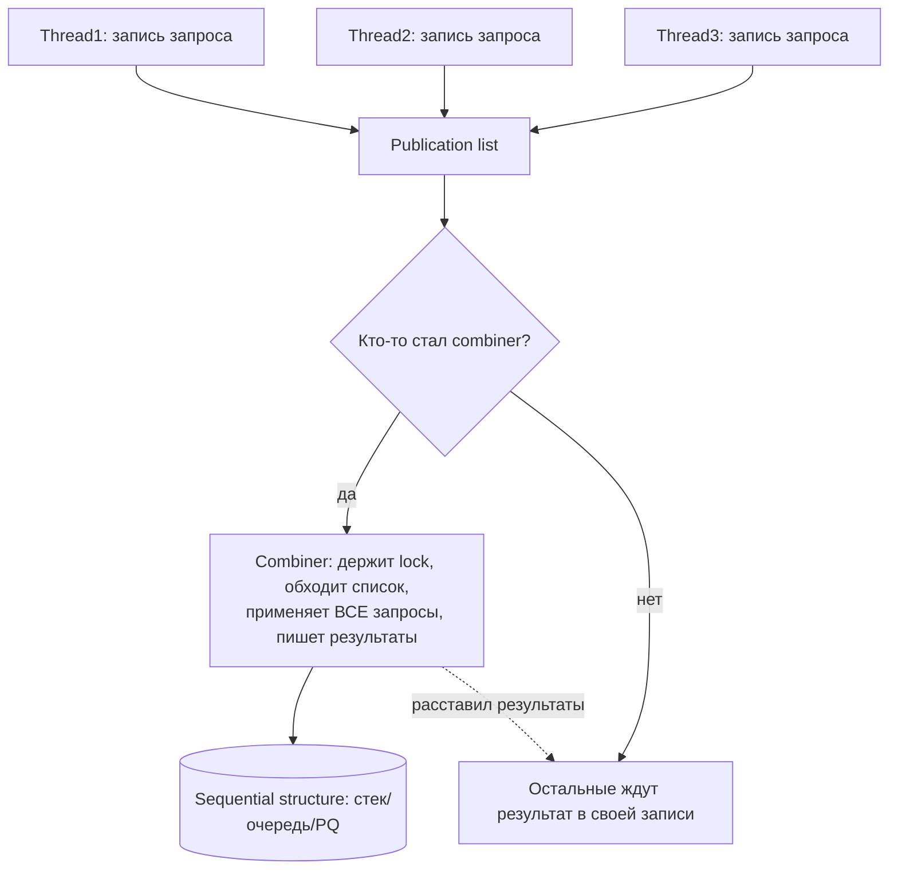
```mermaid
graph TD
  T1[Thread1: запись запроса] --> PL[Publication list]
  T2[Thread2: запись запроса] --> PL
  T3[Thread3: запись запроса] --> PL
  PL --> C{Кто-то стал combiner?}
  C -->|да| CB[Combiner: держит lock, обходит список,<br/>применяет ВСЕ запросы, пишет результаты]
  CB --> DS[(Sequential structure: стек/очередь/PQ)]
  C -->|нет| W[Остальные ждут результат в своей записи]
  CB -.->|расставил результаты| W
```

**Почему быстро.** (а) Глобальный лок берётся **редко** (один combiner на пачку запросов), а не на каждую
операцию. (б) Combiner работает с **горячим** кэшем и **без** межъядерной синхронизации внутри — структура не
«мечется» между ядрами. (в) Combiner может применять **оптимизации пачки** (например, гасить парные push/pop, как
elimination, билет 27; или объединять операции). Аморт. стоимость синхронизации на операцию падает с ростом
числа одновременных запросов.

---

## 3. (2) TLS — публикационные записи

Каждый поток владеет **своей** публикационной записью, хранимой через **thread-local storage** (билет 04). Записи
**связаны** в общий список (потоки линкуют свою запись при первом обращении). У записи поля: запрос (что
сделать), результат, флаг «активна/готово», метка «возраста» (для уборки). TLS даёт **стабильный слот** без
аллокации на каждый запрос — поток переиспользует свою запись.

**Уборка списка.** Combiner попутно **вычищает** давно неактивные записи (по «возрасту» — сколько проходов запись
простаивала), чтобы список не рос бесконечно из-за потоков, которые перестали обращаться к структуре. Запись
снова вставляется при следующем обращении потока.

```cpp
// Схематично (упрощённо)
struct Request { Op op; Value arg; std::atomic<bool> done{false}; Value result; int age; };
thread_local Request* my_rec = nullptr;     // TLS: своя запись на поток

Value apply(Op op, Value arg) {
    if (!my_rec) my_rec = publish_new_record();   // линкуем запись в общий список (один раз)
    my_rec->op = op; my_rec->arg = arg; my_rec->done.store(false);
    mark_active(my_rec);

    for (;;) {
        if (global_lock.try_lock()) {             // стал combiner'ом
            for (Request* r : publication_list)   // обходим список
                if (is_active(r) && !r->done.load()) {
                    r->result = sequential_struct.apply(r->op, r->arg);  // выполняем за него
                    r->done.store(true);
                }
            cleanup_stale_records();              // уборка по возрасту
            global_lock.unlock();
        }
        if (my_rec->done.load()) return my_rec->result;  // наш запрос исполнен combiner'ом
        cpu_relax();                               // не стали combiner'ом — ждём результат
    }
}
```

---

## 4. Где применяют и что это даёт

Flat combining превращает **любую последовательную** структуру в конкурентную с хорошей пропускной способностью
под контеншном — особенно структуры с **единой горячей точкой**, которые плохо параллелятся: **стек**,
**очередь**, **приоритетная очередь** (куча), **счётчики**. Для приоритетной очереди это особенно ценно — у неё
нет естественного «разнесения» операций, и lock-free-варианты сложны и медленны; combiner же делает всё
последовательно над обычной кучей.

Преимущества: высокая пропускная способность под нагрузкой; простота (структура — обычная последовательная);
возможность **пакетных** оптимизаций (combiner видит сразу много запросов). Недостаток — при **низком** контеншне
(мало одновременных запросов) накладные расходы публикации/ожидания **лишние**, и обычный лок/lock-free может быть
быстрее.

---

## 5. Связь с другими техниками

- **Elimination** (билет 27): combiner может попутно **гасить** парные операции (push+pop), как elimination-стек.
- **Helping** (билеты 24, 28): combiner, по сути, **помогает** другим потокам, выполняя их запросы — родственная
  идея «один доводит работу за многих».
- **Delegation/combining** — общий класс: вместо «все лезут в данные» — «делегируем работу одному». Контраст с
  fine-grained/lock-free, где наоборот максимизируют независимый доступ.

---

## 6. Подводные камни

- **Combiner — узкое место по своей природе** (работает последовательно): при **низком** контеншне это потеря; flat
  combining выигрывает именно под **высокой** нагрузкой.
- **Справедливость**: поток может долго ждать, пока кто-то станет combiner'ом и дойдёт до его записи; нужна
  политика, гарантирующая прогресс (combiner обязан обойти весь список).
- **Рост publication list** при многих заходивших потоках — обязательна уборка по «возрасту».
- **Это блокирующая техника** (combiner держит лок; если combiner «завис» — беда), не lock-free; отказ combiner'а
  останавливает обработку. На практике combiner быстр (горячий кэш, нет синхронизации), но гарантий прогресса
  lock-free здесь нет.
- **TLS-запись на поток** + связывание — следить за временем жизни записи относительно потока.

---

## См. также

- Билет 04 — TLS (thread-local storage), на котором держатся публикационные записи.
- Билет 25 — cache-line bouncing/контеншн (что flat combining лечит).
- Билеты 24, 28 — helping (combiner помогает другим).
- Билет 27 — elimination (пакетное гашение парных операций).
- Билет 01 — почему «последовательно, но без синхронизации» может обгонять параллельное под контеншном.


---

# Билет 33. Транзакционная память

> **На экзамен (кратко).**
> **Транзакционная память** (transactional memory) — модель, где критические секции выполняются как **атомарные
> транзакции**: код спекулятивно исполняется, отслеживая прочитанные/записанные ячейки (**read-set**/**write-
> set**); при **конфликте** с другим потоком транзакция **откатывается** (abort) к состоянию «до», иначе —
> атомарный **commit** (все записи становятся видимыми разом). Программная модель — `atomic { ... }` **без
> явных блокировок**. **HTM** — аппаратная (Intel **TSX**: интерфейсы **HLE** — Hardware Lock Elision, и
> **RTM** — Restricted Transactional Memory; read/write-set отслеживаются на гранулярности **кэш-линии**).
> **STM** — программная (логирование read/write-set, высокий оверхед). **Плюсы:** простота, композируемость,
> оптимистичный параллелизм, нет deadlock. **Минусы:** ограничение ёмкости (HTM), ложные конфликты по линиям,
> **обязательный fallback** на лок, недетерминированные аборты. Intel **отключила TSX** микрокодом из-за
> уязвимостей.

---

## 1. Зачем: блокировки трудны, хочется «просто атомарный блок»

Блокировки сложны: выбор гранулярности, порядок захвата (deadlock, билет 19), инверсия приоритетов (билет 21),
**не композируются** (взять два потокобезопасных объекта и атомарно изменить оба — нетривиально). Идея
транзакционной памяти заимствована у СУБД: **оберни код в транзакцию**, и система сама обеспечит атомарность и
изоляцию **оптимистично** — без явных локов. Если две транзакции не конфликтуют (работают с разными данными) —
обе проходят параллельно; если конфликтуют — одна откатывается и повторяется.

```cpp
// Желаемая модель (декларативно):
atomic {
    account_a -= 100;        // вся секция — атомарна и изолирована,
    account_b += 100;        // без явного выбора/порядка мьютексов
}
```

---

## 2. (1) Концепция: read-set, write-set, конфликт, commit/abort

Транзакция во время исполнения ведёт:
- **read-set** — множество ячеек, которые она **прочитала**;
- **write-set** — множество ячеек, которые она **(спекулятивно) записала** (записи не видны другим до commit).

**Конфликт** — другой поток **пишет** в ячейку из нашего read-set, либо его write-set пересекается с нашим
read/write-set (классические W-R, R-W, W-W конфликты). При обнаружении конфликта транзакция **abort**: все
спекулятивные записи **отбрасываются**, состояние откатывается к «до начала», транзакция **повторяется** (или
уходит на запасной путь). Если конфликтов нет — **commit**: write-set **атомарно** становится видимым всем разом.

Это **оптимистичная** синхронизация (ср. билет 16): «делаем, как будто никто не мешает; если помешали — откат».

---

## 3. (2) HTM: Intel TSX

Аппаратная транзакционная память реализует отслеживание read/write-set в **кэше** (на гранулярности **кэш-линии**)
через протокол когерентности (билет 25): конфликт = когерентное сообщение (чужой RFO/инвалидация) на линию из
нашего read/write-set. Intel **TSX** даёт **два** интерфейса:

**HLE (Hardware Lock Elision)** — обратносовместимое «элидирование локов». Префиксы **`XACQUIRE`** (на
инструкции захвата лока) и **`XRELEASE`** (на освобождении). Процессор **не захватывает** лок физически, а
**спекулятивно** входит в критическую секцию, как в транзакцию, **запомнив** значение лока в read-set. Несколько
потоков могут войти в «один и тот же залоченный» регион **одновременно** (лок элидирован), пока они не
конфликтуют по данным. Если конфликт/abort — откат и **реальный** захват лока. Прелесть HLE — старый
lock-based код ускоряется **без переписывания** (префиксы игнорируются на CPU без TSX).

**RTM (Restricted Transactional Memory)** — явный интерфейс: **`XBEGIN`** (начать транзакцию, задать fallback-
адрес), **`XEND`** (commit), **`XABORT`** (явный откат с кодом). Гибче HLE, но требует **обязательного fallback-
пути**.

```cpp
#include <immintrin.h>
unsigned status;
if ((status = _xbegin()) == _XBEGIN_STARTED) {   // транзакция началась
    critical_section();                          // спекулятивно
    _xend();                                     // commit
} else {
    // транзакция НЕ удалась (status — причина) → ОБЯЗАТЕЛЬНЫЙ запасной путь:
    std::scoped_lock lk{global_mutex};
    critical_section();
}
```

**Почему fallback обязателен.** Аппаратная транзакция может **никогда** не закоммититься (по причинам ниже),
поэтому **всегда** нужен гарантированно-прогрессирующий запасной путь (обычный лок). Без него — бесконечные
аборты.

**Причины abort в HTM:**
- **конфликт** доступа с другим ядром (когерентное событие на линию из read/write-set);
- **переполнение ёмкости** (capacity): write/read-set **не помещается** в кэш (отслеживание ограничено
  размером/ассоциативностью кэша) — большая транзакция аборт*ит*ся;
- **запрещённые инструкции/события**: системные вызовы, ввод-вывод, прерывания, переключение контекста,
  некоторые инструкции — внутри транзакции недопустимы (нельзя «откатить» I/O);
- **ложные конфликты** из-за гранулярности **кэш-линии**: две независимые переменные в одной линии → ложный
  конфликт (как false sharing, билет 25), хотя логически данные не пересекаются.

---

## 4. STM: программная транзакционная память

**STM** реализует то же в **программном** виде: библиотека/рантайм оборачивает чтения/записи в вызовы,
**логирующие** read/write-set, проверяющие конфликты (по версиям/локам на объектах) и выполняющие commit/abort/
retry. Плюс — **нет** аппаратных ограничений ёмкости (транзакция любого размера), работает на любом CPU. Минус —
**высокий оверхед**: каждое обращение к памяти превращается в инструментированный вызов (логирование, проверка
версий), что замедляет в разы. STM остаётся в основном **исследовательской**/нишевой (были варианты в GCC
`-fgnu-tm`, Clojure refs, Haskell STM как удачный практический пример в управляемой среде).

---

## 5. Плюсы и минусы

| | Плюсы | Минусы |
|---|---|---|
| **Концепция** | простота (`atomic{}`), **композируемость**, оптимистичный параллелизм для непересекающихся данных, **нет deadlock** | оптимизм проигрывает при высоком конфликте (много откатов) |
| **HTM (TSX)** | почти бесплатно для коротких некон­фликтующих секций; HLE ускоряет старый код | ограничение **ёмкости** (кэш), ложные конфликты по линиям, **обязательный fallback**, нельзя I/O/syscall в транзакции, недетерминированные аборты |
| **STM** | без аппаратных лимитов, портируемо | высокий оверхед логирования, медленно |

**Композируемость** — главный концептуальный плюс: транзакции **вкладываются** и **комбинируются** атомарно
(`atomic { f(); g(); }` атомарно даже если `f` и `g` сами транзакционны), чего блокировки «из коробки» не дают.

---

## 6. Реальность: TSX отключён

Важная практическая оговорка: Intel **отключила TSX** микрокодом на многих процессорах из-за ошибок и
уязвимостей (в частности **TAA**, TSX Asynchronous Abort — спекулятивная утечка данных через аборты транзакций).
Поэтому **переносимость HTM ограничена**: рассматривайте TSX как концептуально важный, но в продакшене часто
**недоступный** механизм. STM остаётся нишевым из-за оверхеда. На экзамене стоит знать **идею** (оптимистичные
транзакции, read/write-set, commit/abort, HLE/RTM) и **ограничения**, а не рассчитывать на TSX как на боевой
инструмент.

---

## 7. Подводные камни

- **Нет fallback → бесконечные аборты.** RTM **всегда** требует запасного пути на локе.
- **I/O/syscall в транзакции запрещены** — их нельзя откатить; такие операции выносят из транзакции.
- **Ложные конфликты по кэш-линии** (как false sharing) — выравнивайте данные, минимизируйте write-set.
- **Переполнение ёмкости** — большие транзакции в HTM аборт*ят*ся; дробите или используйте лок.
- **Недетерминированность** — одна и та же транзакция может то проходить, то аборт*ить*ся (зависит от нагрузки/
  прерываний); нельзя полагаться на «обязательно закоммитится».
- **TSX отключён микрокодом** на многих CPU (TAA) — проверяйте доступность; не закладывайте HTM как обязательный.

---

## См. также

- Билет 16 — оптимистичная синхронизация (та же идея «делаем, потом проверяем»).
- Билет 25 — когерентность кэшей и кэш-линии (как HTM отслеживает конфликты; ложные конфликты).
- Билет 19 — deadlock (которого транзакции избегают «из коробки»).
- Билет 14 — CAS (низкоуровневая атомарность; транзакции — над ней).


---

# Билет 34. Консенсус и консенсусные числа

> **На экзамен (кратко).**
> **Задача консенсуса:** каждый из $N$ потоков предлагает значение через `decide(v)`; все должны **договориться**
> об одном (agreement), это значение — **чьё-то предложенное** (validity), и каждый поток решает за конечное
> число шагов (**wait-free** termination). **Консенсусное число** объекта (Herlihy, 1991): максимальное $N$,
> для которого из этого объекта (+ сколько угодно atomic-регистров) можно построить **wait-free** консенсус для
> $N$ потоков, но нельзя для $N+1$ (если для любого $N$ — число $\infty$). Образует **иерархию консенсуса**:
> **atomic-регистры = 1**; **test&set, swap, fetch&add, стек, очередь = 2**; $n$-регистровое присваивание =
> $2n-2$; **CAS, LL/SC = $\infty$** (универсальны). Поэтому CAS кладут в систему команд: из него строится
> wait-free реализация **любого** объекта (universal construction).

---

## 1. Зачем нужны консенсусные числа

Вопрос: какие примитивы синхронизации **сильнее** других? Можно ли из `fetch_add` построить wait-free очередь?
А из обычных read/write-регистров — wait-free стек? Херлихи дал **точный** инструмент сравнения вычислительной
мощи примитивов — через задачу **консенсуса**. Консенсус — «самая трудная» базовая задача согласования: если из
объекта $X$ нельзя решить даже консенсус для 2 потоков, то из $X$ нельзя построить wait-free **никакой**
нетривиальный разделяемый объект для 2 потоков. И наоборот, объект с консенсусным числом $\infty$ — **универсален**
(из него строится что угодно). Это переводит вопрос «достаточно ли мощен примитив» в проверяемый: **каково его
консенсусное число**.

---

## 2. Задача консенсуса формально

(По `konspekt_parallel`, §5.) Интерфейс:

```java
interface Consensus<T> { T decide(T value); }   // каждый поток зовёт один раз
```
Требования к wait-free решению:
- **Agreement (согласие):** все потоки, завершившие `decide`, возвращают **одно и то же** значение.
- **Validity (обоснованность):** возвращённое значение — **одно из предложенных** каким-то потоком (не «из
  воздуха»).
- **Wait-free termination:** каждый поток завершает `decide` за **конечное** число **своих** шагов, независимо от
  других.

> С **блокировкой** консенсус тривиален: берём любой алгоритм взаимного исключения, под локом первый записавший
> фиксирует решение. Вся трудность — в **wait-free** (без ожидания) реализации: вот где регистры «ломаются».

---

## 3. Определение консенсусного числа и иерархия

**Определение.** Если из объектов класса $C$ (плюс atomic-регистры) можно построить **wait-free** консенсус для
$N$ потоков, но **нельзя** для $N+1$, то **консенсусное число** класса $C$ равно $N$. Если можно для **любого**
$N$ — консенсусное число $\infty$.

**Иерархия консенсуса (Herlihy):**

| Консенсусное число | Объекты |
|---|---|
| **1** | atomic read/write регистры (любой «читать/писать» примитив) |
| **2** | `test&set`, `swap` (`getAndSet`), `fetch&add`, **стек**, **очередь** |
| **$2n-2$** | атомарное присваивание $n$ регистров разом (n-register assignment) |
| **$\infty$** | **CAS** (`compareAndSet`), LL/SC, memory-to-memory move/swap, augmented queue, sticky byte |

Каждый уровень **строго сильнее** предыдущего: объект уровня $k$ **нельзя** построить wait-free из объектов
уровня $< k$ для $> k$ потоков. Например, wait-free очередь (CN=2) **невозможно** построить из одних регистров
(CN=1) даже для 2 потоков; а wait-free структуру для многих потоков **невозможно** из стека/очереди (CN=2) — но
**можно** из CAS (CN=∞).

---

## 4. Теорема: atomic-регистры имеют консенсусное число 1

(По `konspekt_parallel`, §5; это следствие FLP в shared-memory варианте.) **Из обычных read/write-регистров
нельзя решить wait-free консенсус даже для 2 потоков.** Идея доказательства — **аргумент бивалентности**
(valency argument):

- Состояние протокола **бивалентно**, если из него ещё достижимы **оба** исхода (решение 0 и решение 1);
  **0-валентно**/**1-валентно** — если предрешён только один исход.
- Начальное состояние (один поток предлагает 0, другой 1) **бивалентно** (исход ещё не определён).
- Существует **критическое** бивалентное состояние, из которого **любой** следующий шаг ведёт в моновалентное.
  Анализируют, какими операциями два потока могут «развести» исход в этом состоянии:
  - оба следующих шага — **чтения**, или чтения/записи **разных** регистров: их можно переставить — состояния
    неразличимы для соответствующего потока → приводит к противоречию (одно и то же состояние оказывается и
    0-, и 1-валентным);
  - оба пишут в **разные** регистры — порядок записей переставим, противоречие;
  - оба пишут в **один** регистр — поток, пишущий **вторым**, **затирает** след первого; для «выжившего» потока
    состояния, ведущие к разным исходам, **неразличимы** → он не может различить 0 и 1 → противоречие.
- Во всех случаях — противоречие. Значит, wait-free 2-консенсуса на регистрах **не существует**. $\blacksquare$

Суть: запись **затирает** информацию, а чтение её **не сохраняет атомарно с действием** — регистры «слишком
слабы», чтобы безусловно зафиксировать «кто первый».

---

## 5. RMW-примитивы и почему CAS универсален

(По `konspekt_parallel`, §6.) **RMW-регистр** атомарно применяет функцию $F$: `getAndF()` возвращает старое
значение и записывает $F(\text{старое})$.

- **Тривиальный RMW** ($F=\mathrm{id}$, обычное чтение) — CN=1.
- **Нетривиальный RMW** (у $F$ есть «подвижная точка»: $\exists v_0:\ F(v_0)\ne v_0$, как `test&set`,
  `fetch&add`, `swap`) — **CN ≥ 2**: первый, кто увидел $v_0$, «побеждает» и навязывает своё значение. Но эти
  примитивы (класс **Common2**) застревают на **CN=2** — для 3+ потоков их недостаточно.
- **CAS** — **CN=$\infty$**: `compareAndSet(expected, new)` позволяет **условно** записать, **сохранив** право
  первого. Из CAS строится **wait-free консенсус для любого $N$**:

```cpp
// Wait-free консенсус на CAS для любого числа потоков:
std::atomic<T> r{EMPTY};                 // начальное «пусто»
T decide(T mine) {
    T expected = EMPTY;
    if (r.compare_exchange_strong(expected, mine))
        return mine;                     // я успел первым — решение моё
    else
        return expected;                 // кто-то опередил — решение его (его значение в expected)
}
```
Один атомарный CAS «фиксирует победителя» навсегда: первый записавший задаёт решение, все остальные читают
**его** значение. Agreement, validity и wait-free — выполнены для любого $N$.

**Universal construction.** Из CAS (+ регистров) строится **wait-free реализация ЛЮБОГО** объекта с
последовательной спецификацией для любого числа потоков (Herlihy): потоки атомарно «применяют» свои операции к
разделяемому представлению (часто — лог/список операций, продвигаемый CAS-ом, с **helping**, билеты 24, 28).
Поэтому CAS **достаточно для всего**.

---

## 6. (ячейка памяти / мьютекс / CAS)

Прямой ответ на подпункт билета:
- **Ячейка памяти** (только read/write) — **CN=1**: сама по себе wait-free консенсус не решает (см. §4).
- **Мьютекс** (как объект lock/unlock) — даёт консенсус **с блокировкой** (тривиально), но это **не wait-free**
  (поток, упавший в критической секции, останавливает всех) — для **wait-free** иерархии мьютекс универсальности
  не даёт.
- **CAS** — **CN=$\infty$**, универсален → именно его (или LL/SC) закладывают в **систему команд** реальных
  процессоров. Это и объясняет, **почему** аппаратура обязана давать CAS/LL-SC: без примитива с CN=∞ нельзя было
  бы строить wait-free структуры для произвольного числа потоков.

---

## 7. Оговорка: иерархия не робастна

Важный нюанс (на «пятёрку»): иерархия консенсуса Херлихи **не робастна** в общем случае (Jayanti). Это значит,
что **комбинация** примитивов с малым консенсусным числом может дать большее. В частности, Ellen, Herlihy и др.
показали, что комбинация инструкций с **CN=1** (например, `fetch-and-add` + `test-and-set`), применяемых к
**одной ячейке**, может дать **CN=$\infty$**. Тонкость в том, что классическая иерархия рассматривает объекты
изолированно, а реальные мультипроцессоры применяют инструкции к **общим ячейкам памяти**, а не к абстрактным
независимым объектам. На экзамене подавайте это как **нюанс**, а не опровержение: основной результат (регистры=1,
CAS=∞, универсальность CAS) верен и фундаментален.

---

## 8. Подводные камни / как использовать на экзамене

- Консенсусные числа объясняют, **почему** нельзя построить wait-free стек/очередь **только на регистрах**, и
  **почему** CAS достаточно для всего — это любимый вопрос.
- **Wait-free** — ключевое слово: с блокировкой консенсус тривиален; вся теория — про реализацию **без ожидания**.
- **CN=2 у стека/очереди** означает: их можно реализовать друг через друга для 2 потоков, но для произвольного
  числа потоков нужен примитив CN=∞ (CAS).
- **Не робастность** — нюанс; не путайте «комбинация CN=1 даёт ∞» с «регистры решают консенсус» (не решают).

---

## См. также

- Билет 14 — CAS (универсальный примитив, CN=∞).
- Билет 29 — линеаризуемость (что значит «реализовать объект корректно»).
- Билеты 24, 28 — helping и universal construction (как CAS строит wait-free объекты).
- Билеты 15–18 — практические lock-free/wait-free структуры на CAS.


---

# Билет 35. Асинхронный ввод-вывод

> **На экзамен (кратко).**
> Две **ортогональные** оси. **(1) Синхронный/асинхронный** — *кто* дожидается завершения: вызывающий (sync)
> или система уведомит потом (async). **Блокирующий/неблокирующий** — *возвращает* ли вызов управление
> немедленно. Четыре комбинации: blocking-sync (`read`), non-blocking-sync (`O_NONBLOCK` + опрос готовности),
> async (POSIX AIO, IOCP, io_uring). **(2) select/poll/epoll/IOCP:** `select`/`poll` — модель **готовности**
> (readiness), сканируют **все** дескрипторы за O(n) на каждый вызов → плохо при тысячах соединений
> (**C10k**); `epoll` (Linux) — регистрация один раз + O(1) список готовых, LT/ET; **IOCP** (Windows) и
> **io_uring** (Linux) — модель **завершения** (completion): ядро уведомляет о **завершении** операции, а не о
> готовности.

---

## 1. Зачем: проблема масштабирования ввода-вывода

Сервер обслуживает тысячи соединений, большинство которых **простаивают** (ждут данные). Наивная модель «поток на
соединение» с блокирующим `read` (билет 36) не масштабируется: тысячи потоков = память на стеки + тысячи
переключений контекста. Нужна модель, где **один** (или несколько) потоков обслуживают **много** соединений,
реагируя только на те, где **есть работа**. Это и есть мультиплексирование ввода-вывода. Историческое название
проблемы — **C10k** (10 000 одновременных соединений на одной машине).

---

## 2. (1) Две оси: sync/async и blocking/non-blocking

Это **разные** вещи, их постоянно путают.

- **Блокирующий/неблокирующий** — про **возврат вызова**. Блокирующий `read` **не возвращает** управление, пока
  данных нет (поток спит). Неблокирующий (`O_NONBLOCK`) **сразу** возвращает — либо данные, либо `EAGAIN`/
  `EWOULDBLOCK` («сейчас нечего»).
- **Синхронный/асинхронный** — про **то, кто и когда обрабатывает завершение**. Синхронный: завершение
  операции наблюдает **сам вызывающий** (в точке вызова или последующей проверки готовности). Асинхронный: вы
  **инициируете** операцию, она выполняется «в фоне», а о **завершении** вас **уведомят** (callback/событие/
  заполненный буфер).

| | Блокирующий | Неблокирующий |
|---|---|---|
| **Синхронный** | `read()` ждёт данные (поток спит) | `read()`+`O_NONBLOCK` → `EAGAIN`; готовность узнают через `select`/`epoll` |
| **Асинхронный** | (редкая комбинация) | POSIX AIO, **IOCP**, **io_uring**: инициировал → уведомят о завершении |

**Ключевое различие моделей (см. §4):**
- **Readiness (готовность)** — ядро говорит «**можно** читать без блокировки», данные вы читаете **сами**
  (нужны неблокирующие сокеты). Так работают `select`/`poll`/`epoll`.
- **Completion (завершение)** — вы отдаёте ядру операцию (с буфером), ядро **само** её выполняет и уведомляет о
  **завершении** (данные уже в буфере). Так работают IOCP/io_uring.

---

## 3. (2) select / poll / epoll: модель готовности

**`select`.** Передаёшь три набора дескрипторов (на чтение/запись/исключения); вызов блокируется, пока какой-то
не станет «готов». Проблемы: набор ограничен **`FD_SETSIZE`** (обычно 1024); на **каждый** вызов ядро
**сканирует все** дескрипторы — **O(n)**; наборы надо **пересоздавать** каждый раз (они модифицируются).

**`poll`.** То же, но массив `struct pollfd` без лимита `FD_SETSIZE`. Всё ещё **O(n)** скан всех дескрипторов на
каждый вызов и передача всего набора в ядро каждый раз.

**`epoll` (Linux).** Качественно лучше за счёт **состояния в ядре**:
- `epoll_create` — создать epoll-инстанс (объект в ядре);
- `epoll_ctl(ADD/MOD/DEL)` — **зарегистрировать** дескрипторы **один раз** (ядро хранит «интересные» fd во
  внутренней структуре);
- `epoll_wait` — вернуть **только готовые** дескрипторы — **O(1)** относительно числа отслеживаемых (возвращает
  готовые из «ready-list», который ядро поддерживает по мере готовности).

Так устраняется и `FD_SETSIZE`, и пересылка/скан всего набора на каждый вызов — `epoll` масштабируется на сотни
тысяч соединений.

**Level-triggered (LT) vs edge-triggered (ET):**
- **LT** (по умолчанию): `epoll_wait` сообщает о готовности **пока** она сохраняется (есть непрочитанные данные —
  будет уведомлять). Проще и безопаснее.
- **ET**: уведомляет **об изменении** готовности (переход «нет данных → есть»). Получив ET-событие, нужно
  **вычитывать в цикле до `EAGAIN`** — иначе остаток данных «зависнет» (нового уведомления не будет). Меньше
  лишних пробуждений, но требует аккуратности.

```cpp
// epoll, схема (Linux):
int ep = epoll_create1(0);
epoll_event ev{ .events = EPOLLIN | EPOLLET, .data = { .fd = sock } };
epoll_ctl(ep, EPOLL_CTL_ADD, sock, &ev);          // зарегистрировали ОДИН раз
epoll_event events[MAXEV];
for (;;) {
    int n = epoll_wait(ep, events, MAXEV, -1);    // вернёт ТОЛЬКО готовые (O(1))
    for (int i = 0; i < n; ++i) {
        // ET: читать до EAGAIN на неблокирующем сокете
        while (true) { ssize_t r = read(events[i].data.fd, buf, sizeof buf);
                       if (r <= 0) break; /* обработать buf */ }
    }
}
```

---

## 4. IOCP и io_uring: модель завершения

**IOCP (Windows, I/O Completion Ports).** Истинно **completion**-модель: операция (`ReadFile`/`WriteFile` с
`OVERLAPPED`) **инициируется**, ядро выполняет её асинхронно, а по **завершении** кладёт уведомление в
**порт завершения**; пул потоков забирает готовые операции (`GetQueuedCompletionStatus`). Данные уже в буфере —
не «можно читать», а «**прочитано**». Хорошо интегрируется с пулом потоков и масштабируется.

**io_uring (Linux, с 5.1).** Современная completion-модель с **минимумом системных вызовов**: два кольцевых
буфера в разделяемой с ядром памяти — **SQ** (submission queue, заявки на операции) и **CQ** (completion queue,
результаты). Приложение кладёт заявки в SQ и одним `io_uring_enter` (а в polled-режиме — **вовсе без** syscall)
отправляет **пачку** операций; ядро исполняет и кладёт результаты в CQ. Работает **и с файлами**, и с сетью
(в отличие от `epoll`, который про сокеты/готовность). Это прямое продолжение идеи «минимизировать syscalls»
(билет 13): батчинг множества операций за один вызов.

---

## 5. Сводное сравнение

| API | Модель | Сложность на вызов | Лимит | ОС |
|---|---|---|---|---|
| `select` | readiness | **O(n)** скан, пересоздание наборов | `FD_SETSIZE` (~1024) | POSIX |
| `poll` | readiness | **O(n)** скан, передача всего набора | нет жёсткого | POSIX |
| `epoll` | readiness | регистрация 1 раз + **O(1)** ready-list; LT/ET | нет | Linux |
| **IOCP** | **completion** | пул потоков забирает завершённые | нет | Windows |
| **io_uring** | **completion** | кольца SQ/CQ, **батч**, минимум syscalls; **+файлы** | нет | Linux |

---

## 6. Реальные задачи

- **Высоконагруженные серверы** (nginx, Redis, прокси): event loop на `epoll` (Linux) / IOCP (Windows) +
  неблокирующие сокеты обслуживают десятки-сотни тысяч соединений на нескольких потоках.
- **Асинхронные рантаймы/движки** (Boost.Asio, libuv, Tokio, Seastar): абстрагируют `epoll`/IOCP/io_uring под
  единый интерфейс; на верхнем уровне — колбэки или корутины (билет 36).
- **Файловый ввод-вывод высокой пропускной способности**: io_uring (БД, хранилища) — батчинг и polled-режим.

---

## 7. Подводные камни

- **ET + не дочитал до `EAGAIN`** → «зависшие» данные (нового события не придёт). С ET всегда читать/писать в
  цикле до `EAGAIN`.
- **Неблокирующие сокеты обязательны** для readiness-модели: после «готов к чтению» сам `read` всё равно может
  упереться в `EAGAIN` (готовность могла «протухнуть»).
- **`EINTR`** на блокирующих вызовах — повторять (билет 13).
- **`select`/`poll` на 10k+ соединений** — O(n) на вызов убивает производительность (C10k); используйте
  `epoll`/IOCP/io_uring.
- **Thundering herd** на общем epoll у пула потоков — несколько потоков просыпаются на одно событие; решается
  `EPOLLEXCLUSIVE`/`SO_REUSEPORT`.
- **Readiness ≠ completion**: на Linux исторически нет «честного» async для сокетов кроме io_uring; POSIX AIO
  ограничен; путаница моделей ведёт к неверной архитектуре.

---

## См. также

- Билет 36 — синхронный vs асинхронный сервер (доклад Полухина), корутины.
- Билет 13 — системные вызовы (io_uring/epoll как минимизация syscalls).
- Билет 37 — пул потоков (обрабатывает завершения IOCP/события epoll).
- Билет 04 — почему «поток на соединение» не масштабируется (стеки, переключения).


---

# Билет 36. Асинхронный ввод-вывод: асинхронные движки (доклад Полухина)

> **На экзамен (кратко).**
> Доклад Антона Полухина (Яндекс, комитет C++) о том, почему синхронный сервер «поток на соединение» **не
> масштабируется** и как **корутины C++20** дают **линейный** код при асинхронном исполнении.
> **(1) Синхронный сервер:** на каждое соединение — поток с блокирующими `read`/`write` (каждый = **системный
> вызов** с переходом user→kernel) и сном на I/O. Тысячи соединений ⇒ тысячи потоков ⇒ память на стеки
> (≈мегабайты каждый) + тысячи **переключений контекста** (сохранение/восстановление регистров, давление на
> кэш/TLB) ⇒ упор в C10k. **(2) Асинхронный сервер:** один (или по числу ядер) поток + event loop
> (`epoll`/io_uring); неблокирующие сокеты; на каждое соединение — **лёгкая корутина** (stackless, C++20), а не
> поток. Корутина **приостанавливается** на `co_await` (регистрирует интерес и уступает), возобновляется при
> готовности. Память — на маленький coroutine frame; нет тысяч переключений контекста.

---

## 1. Постановка: почему синхронная модель упирается в стену

Самый простой способ написать сервер — **поток на клиента**: `accept` → новый поток → внутри блокирующие
`read`/`write`. Код **линеен и понятен** (читается сверху вниз, как обычная последовательная программа). Но он
**не масштабируется** на тысячи соединений по двум причинам, которые Полухин разбирает на уровне устройства.

---

## 2. (1) Синхронный сервер: стоимость на уровне железа

```cpp
// Синхронный сервер: поток на соединение
void handle(tcp::socket sock) {
    char buf[4096];
    for (;;) {
        ssize_t n = read(sock, buf, sizeof buf);   // БЛОКИРУЮЩИЙ: syscall + поток засыпает на I/O
        if (n <= 0) break;
        write(sock, buf, n);                       // снова syscall
    }
}
// на каждое соединение: std::thread{handle, std::move(sock)};
```

**Две статьи расходов:**

**(а) Системные вызовы (syscall).** Каждый блокирующий `read`/`write` — это переход user→kernel (билет 13):
смена режима/привилегии, `swapgs` + переключение стека, сохранение регистров, с KPTI — смена `CR3` и давление на
TLB. Сотни-тысячи тактов **на каждую** операцию ввода-вывода. При высокой частоте мелких операций это
доминирующая стоимость.

**(б) Переключения контекста (context switch).** При тысячах соединений — **тысячи потоков**. Каждый поток:
- занимает **стек** (по умолчанию ~мегабайты, билет 04) → десятки гигабайт виртуальной памяти на 10k+ потоков;
- участвует в **планировании**: чтобы дать всем поработать, ядро постоянно **переключает контекст** — сохраняет/
  восстанавливает регистры, грузит планировщик, **портит кэш и TLB** (даже у потоков одного процесса TLB цел, но
  кэши данных/инструкций «холодеют», билет 06). Тысячи переключений в секунду = огромные накладные расходы, не
  связанные с полезной работой.

Итог: простой код, но **O(N) ресурсов** на N соединений → упор в **C10k** (билет 35). Узкое место — не сеть, а
**потоки и системные вызовы**.

---

## 3. (2) Асинхронный сервер: event loop + корутины

**Идея.** Заменить «поток на соединение» на **один event loop** (или по числу ядер) поверх `epoll`/io_uring
(билет 35) и **неблокирующих** сокетов; а каждое соединение представить **лёгкой корутиной**, а не потоком.
Корутина (stackless, C++20) при операции ввода-вывода **не блокирует поток**, а **приостанавливается**
(`co_await`): регистрирует интерес в event loop и **уступает** управление; loop переключается на другие готовые
корутины; когда сокет готов — loop **возобновляет** корутину с того же места.

```cpp
// Асинхронный сервер: корутина на соединение (схематично)
task<void> session(tcp::socket sock) {
    char buf[4096];
    for (;;) {
        std::size_t n = co_await sock.async_read(buf);   // ПОДВЕШИВАЕТ КОРУТИНУ, не поток
        if (n == 0) break;
        co_await sock.async_write({buf, n});             // снова уступает, не блокируя поток
    }
}
// event loop крутит тысячи таких корутин на 1..N потоках
```

**Почему дёшево:**
- **Память.** Корутина хранит состояние в маленьком **coroutine frame** (только то, что живёт через точки
  приостановки), а не в мегабайтном стеке потока. Десятки тысяч корутин помещаются там, где не поместились бы
  тысячи потоков.
- **Нет тысяч переключений контекста.** Переключение между корутинами — это **возобновление функции** в
  пользовательском пространстве (несколько инструкций), **без** участия планировщика ядра, без смены стека/режима.
  Поток «спит» один раз — в `epoll_wait`, когда работать **некому**.
- **Меньше syscalls.** Один `epoll_wait`/`io_uring_enter` обслуживает множество соединений (батчинг), вместо
  блокирующего syscall на каждый поток.

**Корутины дают «линейный» вид асинхронного кода.** Главная ценность (которую подчёркивает Полухин): код с
`co_await` читается **как синхронный** (`auto data = co_await socket.receive(); process(data);`), хотя исполняется
асинхронно. Компилятор превращает корутину в **машину состояний** (где приостановки — это точки сохранения/
восстановления), скрывая её от программиста. Это сочетает **понятность** синхронной модели с
**масштабируемостью** асинхронной.

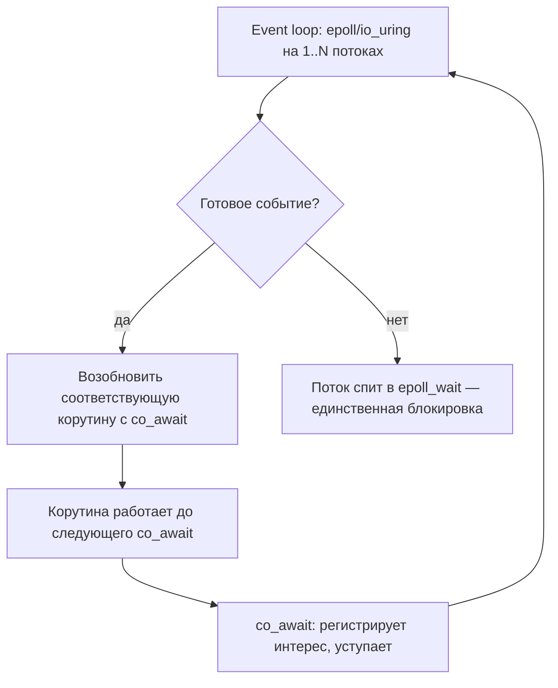
```mermaid
graph TD
  EL[Event loop: epoll/io_uring на 1..N потоках] --> R{Готовое событие?}
  R -->|да| RES[Возобновить соответствующую корутину с co_await]
  RES --> WORK[Корутина работает до следующего co_await]
  WORK --> SUS[co_await: регистрирует интерес, уступает]
  SUS --> EL
  R -->|нет| SLEEP[Поток спит в epoll_wait — единственная блокировка]
```

---

## 4. Контекст C++: корутины, P1485, stackful и TLS

- **Stackless-корутины C++20** (`co_await`/`co_yield`/`co_return`, `std::coroutine_handle`, `promise_type`) —
  это **языковой** механизм; кадр корутины аллоцируется отдельно, переключение — без отдельного стека.
- **P1485 «Better keywords for coroutines»** (Полухин) предлагал более читаемые ключевые слова (`async`/`await`/
  `yield`) вместо «уродливых» `co_*` — например `generator<int> get_integers(int start, int step) async { ...
  yield current; }`. Иллюстрирует мотивацию: корутины должны давать **естественный** синтаксис.
- **Stackful-корутины** (P0876, `fiber_context`) — с собственным стеком (можно приостанавливаться из любой
  вложенной функции). Важная архитектурная деталь: **миграция stackful-корутины между потоками запрещена**,
  потому что компиляторы **кэшируют адрес TLS** в регистрах между вызовами (билет 04), и переезд на другой поток
  сделал бы кэшированный `%fs`-адрес неверным — «invalidating cached TLS pointers across every opaque function
  call is deemed unacceptable overhead». Поэтому fiber'ы привязаны к потоку.

---

## 5. Когда асинхронность помогает, а когда нет

Асинхронность — **не** «всегда быстрее». Она выигрывает на **I/O-bound** нагрузке: пока одно соединение ждёт сеть,
поток занят **другими** соединениями — утилизация растёт. На **чисто CPU-bound** нагрузке (нет ожиданий, которыми
можно «прикрыть» работу) оверхед корутины/машины состояний может **замедлить** относительно простого
последовательного кода — выигрыша нет, т. к. нечего «накладывать» на ожидание. Правило: async окупается там, где
есть **много ожиданий ввода-вывода**, которые можно перекрыть полезной работой.

---

## 6. Сравнение

| | Синхронный (поток/соединение) | Асинхронный (event loop + корутины) |
|---|---|---|
| Единица на соединение | **поток** (стек ~МБ) | **корутина** (маленький frame) |
| Блокировка I/O | поток **спит** (syscall на операцию) | корутина **уступает**, поток не спит |
| Переключения | тысячи **context switch** (ядро) | возобновление функции (userspace) |
| Масштаб | упор в C10k | десятки-сотни тысяч соединений |
| Код | линейный, простой | линейный **благодаря** `co_await` |
| Когда лучше | мало соединений / простота | много I/O-bound соединений |

---

## 7. Подводные камни

- **Блокирующий вызов в event-loop потоке** — катастрофа: встанет **всё** (все корутины этого потока). В async-
  коде нельзя делать синхронный `read`/долгий syscall/`sleep`; для блокирующей работы — отдельный пул потоков.
- **Async не ускоряет CPU-bound** — может даже замедлить; не применяйте ради моды.
- **Время жизни во `co_await`**: данные, переживающие точку приостановки, должны жить достаточно долго (частый
  баг с висячими ссылками на буферы/`this`).
- **Stackful-fiber нельзя мигрировать между потоками** (TLS-кэширование); stackless-корутина C++20 может
  возобновляться на другом потоке, но тогда осторожно с `thread_local`.
- **Отладка** машин состояний сложнее линейного стека; стеки вызовов «рваные».

---

## См. также

- Билет 35 — `epoll`/IOCP/io_uring, readiness vs completion (фундамент event loop).
- Билет 13 — стоимость syscall и переключения режима (что асинхронность экономит).
- Билет 04, 06 — стек/TLS потока, переключение контекста, TLB.
- Билет 37 — пул потоков (для блокирующей работы и обработки событий).
- Билет 40 — dataflow/конвейеры (как организуют асинхронные стадии).


---

# Билет 37. Пул потоков

> **На экзамен (кратко).**
> **Пул потоков** (thread pool) — фиксированный набор заранее созданных **рабочих потоков**, разбирающих
> **задачи** из общей очереди. Амортизирует стоимость создания/уничтожения потоков (она велика — билет 04),
> ограничивает их число (нет переподписки) и переиспользует «тёплые» потоки. **(1) Наивная реализация:** одна
> общая очередь задач под **мьютексом** + **условная переменная** (воркеры спят, пока очередь пуста) + N
> воркеров. Узкое место наивного варианта — **контеншн** на едином мьютексе очереди. Промышленные пулы —
> **work-stealing**: у каждого воркера **своя двусторонняя очередь (deque)**, свои задачи берутся с одного
> конца (LIFO), а «кража» у чужих — с другого (FIFO).

---

## 1. Зачем пул

Создание потока — дорого (билет 04): syscall `clone`, выделение стека (~МБ), регистрация в планировщике. Если на
**каждую** короткую задачу создавать поток, накладные расходы съедят выигрыш, а при всплеске задач — тысячи
потоков и переподписка (лишние переключения контекста, билет 06). **Пул** решает это: создаём $N$ потоков
**один раз**, держим их «горячими», и **переиспользуем** для потока задач. Это базовый строительный блок для
параллельных вычислений (билеты 38–39), серверов (билет 35), асинхронных рантаймов.

---

## 2. (1) Наивная реализация

Компоненты: общая **очередь задач**, **мьютекс** (защищает очередь), **условная переменная** (воркеры спят, пока
нет задач, билет 12), $N$ **воркеров**.

```cpp
#include <thread>
#include <vector>
#include <queue>
#include <mutex>
#include <condition_variable>
#include <functional>
#include <future>

class ThreadPool {
    std::vector<std::jthread> workers_;
    std::queue<std::function<void()>> tasks_;
    std::mutex m_;
    std::condition_variable_any cv_;
public:
    explicit ThreadPool(unsigned n = std::thread::hardware_concurrency()) {
        for (unsigned i = 0; i < n; ++i)
            workers_.emplace_back([this](std::stop_token st) {
                for (;;) {
                    std::function<void()> job;
                    {
                        std::unique_lock lk{m_};
                        cv_.wait(lk, st, [&]{ return !tasks_.empty(); });  // спим, пока нет задач/остановки
                        if (st.stop_requested() && tasks_.empty()) return; // корректный shutdown
                        job = std::move(tasks_.front());
                        tasks_.pop();
                    }
                    job();                                                  // выполняем ВНЕ лока
                }
            });
    }

    // submit возвращает future с результатом задачи
    template <class F>
    auto submit(F f) -> std::future<std::invoke_result_t<F>> {
        using R = std::invoke_result_t<F>;
        auto task = std::make_shared<std::packaged_task<R()>>(std::move(f));
        std::future<R> fut = task->get_future();
        {
            std::scoped_lock lk{m_};
            tasks_.push([task]{ (*task)(); });    // оборачиваем в void()
        }
        cv_.notify_one();                          // будим одного воркера
        return fut;
    }

    ~ThreadPool() {
        for (auto& w : workers_) w.request_stop(); // запросить остановку всем
        cv_.notify_all();                           // разбудить спящих
        // ~jthread сам сделает join() каждому воркеру
    }
};
```

**Разбор ключевых моментов:**
- **`job()` вне лока** — иначе выполнение задачи держало бы мьютекс очереди, сериализуя всё (грубая ошибка).
- **`cv_.wait(lk, st, pred)`** — предикат защищает от spurious/lost wakeup (билет 12), а `stop_token` даёт
  **корректный shutdown** (билет 08): при `request_stop` воркеры просыпаются и выходят, когда очередь пуста.
- **`packaged_task` + `future`** — связывают результат задачи с вызывающим (можно дождаться/получить значение/
  поймать исключение).
- **`~jthread` делает `join`** автоматически — пул корректно дожидается воркеров.

---

## 3. Слабое место наивного пула: контеншн на очереди

**Единая** очередь под **одним** мьютексом — узкое место: все $N$ воркеров и все продьюсеры конкурируют за один
`m_`. Под высокой нагрузкой мьютекс очереди (и его кэш-линия, билет 25) становится точкой сериализации — закон
Амдала (билет 01) ограничивает масштабируемость. Чем больше ядер, тем заметнее: воркеры тратят время на борьбу за
лок, а не на работу.

---

## 4. Work-stealing: устройство промышленного пула

**Идея.** У **каждого** воркера — **своя** локальная двусторонняя очередь (**deque**). Воркер кладёт/берёт **свои**
задачи с **одного** конца (обычно «снизу», LIFO); когда его очередь **пуста** — он **крадёт** задачу у случайного
другого воркера с **противоположного** конца (FIFO). Это резко снижает контеншн: в типичном случае воркер
работает со **своей** очередью **без** конкуренции; синхронизация нужна лишь при краже (редко).

**Почему LIFO для себя, FIFO для кражи (Chase–Lev deque):**
- **LIFO у владельца** — лучшая **кэш-локальность** (последняя порождённая задача — самая «горячая», её данные в
  кэше) и естественность для divide-and-conquer (билет 39): свежие подзадачи берутся первыми, как рекурсия.
- **FIFO у вора** — крадут **старые** задачи «сверху»: они обычно **крупнее** (выше в дереве рекурсии, больше
  работы за одну кражу — амортизация стоимости кражи) и **дальше** по данным от владельца (меньше конфликтов за
  кэш).
- Владелец и вор работают с **разными концами** — почти не пересекаются; синхронизация только при «почти пустой»
  очереди (граничный случай в Chase–Lev решается аккуратным CAS).

```mermaid
graph TD
  subgraph "Worker 0"
    D0[deque0: push/pop снизу &#40;LIFO&#41;]
  end
  subgraph "Worker 1 &#40;простаивает&#41;"
    D1[deque1: пусто]
  end
  D1 -.->|steal сверху &#40;FIFO&#41;| D0
```

Так достигается **динамическая балансировка**: простаивающие воркеры сами «подтягивают» работу у занятых, без
центрального координатора. На work-stealing построены TBB, OpenMP tasks, Cilk, `std::async`-рантаймы, Tokio,
Go-планировщик.

---

## 5. Размер пула

- **CPU-bound** задачи (считают, не ждут): оптимум ≈ **числу аппаратных потоков** (`hardware_concurrency()`).
  Больше — переподписка (лишние переключения, билет 06); меньше — недогрузка ядер.
- **I/O-bound** задачи (часто **ждут** ввод-вывод): потоков нужно **больше** ядер (пока одни спят на I/O, другие
  считают) — либо лучше вообще асинхронная модель (билеты 35–36), чтобы не плодить блокирующиеся потоки.
- **Смешанная** нагрузка: часто разделяют пулы (CPU-пул + I/O-пул) или используют асинхронность для I/O + пул для
  CPU-частей.

---

## 6. Реальные задачи и подводные камни

**Применение.** Параллельная обработка независимых заданий (билет 38), fork-join рекурсия (билет 39), обработка
событий/завершений ввода-вывода (билеты 35–36), серверы запросов.

**Подводные камни:**
- **Deadlock через пул**: задача в пуле **ждёт результат** другой задачи **того же** пула, а все воркеры заняты
  такими же ожидающими задачами → пул исчерпан, никто не прогрессирует. Не блокируйтесь внутри пула на задачах
  того же пула (или используйте отдельный пул/continuation вместо блокирующего ожидания).
- **Контеншн на единой очереди** в наивном пуле — переходите к work-stealing/шардированию при росте ядер.
- **Неограниченная очередь** → рост памяти при всплеске задач; нужен **backpressure** (ограниченная очередь,
  отказ/блокировка продьюсера — связь с билетом 40).
- **Исключение в задаче** не должно «убивать» воркер: оборачивайте тело (`packaged_task` сохраняет исключение в
  `future`; «голые» лямбды — оборачивать `try/catch`).
- **Блокирующий вызов в воркере** надолго занимает поток пула, снижая параллелизм (как в async-loop, билет 36) —
  длинные блокировки выносите.
- **Корректный shutdown**: дождаться/слить задачи, остановить воркеров (`stop_token` + `join` через `jthread`),
  не «убивать» потоки (билет 08).

---

## См. также

- Билет 04 — почему создание потоков дорого (мотивация пула); переподписка.
- Билет 12 — условная переменная (воркеры спят на пустой очереди).
- Билет 08 — корректный shutdown через `stop_token`.
- Билеты 38, 39 — декомпозиция по данным/задачам поверх пула; fork-join и work-stealing.
- Билет 40 — backpressure/ограниченные очереди.
- Билет 01 — контеншн очереди как «последовательная доля» (Амдал).


---

# Билет 38. Паттерны ‖-программирования: разделение по данным

> **На экзамен (кратко).**
> **Декомпозиция по данным** (data parallelism / data decomposition) — **одна и та же** операция применяется к
> **разным частям данных** параллельно (модель **SPMD**: Single Program, Multiple Data). Данные разбивают на
> части (**блочно**, **циклически** round-robin, **блочно-циклически**, **геометрически** по доменам), и каждый
> поток/ядро обрабатывает свою часть. Балансировка: **статическая** (равные блоки — для однородной нагрузки) или
> **динамическая** (воркеры тянут чанки — для неоднородной). Важны: **NUMA** (политика *first-touch*),
> **false sharing** на границах чанков (билет 25). Нижний уровень data-параллелизма — **SIMD** (билет 02), и
> GPU — его предельная форма.

---

## 1. Зачем и где применимо

Огромный класс задач — это **одинаковая** обработка **массива однотипных** элементов: сложить два массива,
применить фильтр к пикселям, посчитать функцию для каждой строки матрицы, обработать миллион записей. Здесь
естественно **разрезать данные** на части и обрабатывать части **независимо** и **параллельно** — это и есть
декомпозиция по данным. Подходит для **регулярных** данных (массивы, матрицы, изображения, сетки), где элементы
обрабатываются однообразно и (в идеале) независимо.

**SPMD**: все потоки исполняют **одну** программу (один код), но над **своими** данными (своим диапазоном
индексов). Отличие от декомпозиции по **задачам** (билет 39), где потоки исполняют **разные** функции.

---

## 2. Схемы разбиения

| Схема | Как делит | Когда хороша |
|---|---|---|
| **Блочная** | подряд идущие диапазоны: поток $p$ берёт `[p·k, (p+1)·k)` | однородная нагрузка; хорошая локальность/кэш |
| **Циклическая** (round-robin) | элемент $i$ → потоку `i mod P` | когда стоимость элементов **возрастает** по индексу (выравнивает нагрузку) |
| **Блочно-циклическая** | блоки размера $b$, раздаются по кругу | компромисс локальность ↔ баланс (классика ScaLAPACK) |
| **Геометрическая** (домены) | разрезание 2D/3D-области на под-области | сетки/симуляции; минимизирует «границы» обмена |

Блочная даёт лучшую **локальность** (соседние элементы — у одного потока, кэш-дружелюбно), но плохо балансирует
**неоднородную** нагрузку. Циклическая балансирует лучше, но рвёт локальность. Геометрическая важна там, где
обработка элемента зависит от **соседей** (граничный обмен между доменами — типично с барьером, билет 09).

---

## 3. Код: параллельные алгоритмы и ручное разбиение

**Параллельные алгоритмы STL (C++17/20).** Самый простой способ — политика исполнения:

```cpp
#include <execution>
#include <algorithm>
#include <vector>

std::vector<double> in = /*...*/, out(in.size());

// par_unseq: параллельно (по потокам) И векторизованно (SIMD) — рантайм сам разбивает данные
std::transform(std::execution::par_unseq,
               in.begin(), in.end(), out.begin(),
               [](double x){ return std::sqrt(x); });
```
`std::execution::par` — параллельно по потокам; `par_unseq` — ещё и разрешает **SIMD-векторизацию** (билет 02)
внутри потока. Рантайм (часто поверх work-stealing пула, билет 37) сам режет диапазон на чанки.

**Ручное блочное разбиение** (когда нужен контроль):

```cpp
#include <thread>
unsigned P = std::thread::hardware_concurrency();
std::size_t n = data.size(), chunk = (n + P - 1) / P;
std::vector<std::jthread> ts;
for (unsigned p = 0; p < P; ++p)
    ts.emplace_back([&, p]{
        std::size_t lo = p * chunk, hi = std::min(n, lo + chunk);
        for (std::size_t i = lo; i < hi; ++i) process(data[i]);   // своя часть, без синхронизации
    });
// ~jthread join
```

---

## 4. Балансировка нагрузки

- **Статическая**: разрезать заранее на $P$ равных частей. Идеальна при **однородной** стоимости элементов;
  накладных расходов почти нет. Плоха, если элементы стоят по-разному (одни потоки простаивают, другие — узкое
  место → закон Амдала, билет 01).
- **Динамическая**: воркеры **тянут** следующий чанк из общего источника по мере готовности (часто — мелкие
  чанки + work-stealing, билет 37). Балансирует **неоднородную** нагрузку, но добавляет накладные расходы
  координации; слишком мелкие чанки → оверхед планирования.

Компромисс — **guided/блочно-циклический**: крупные чанки в начале, мелкие к концу (выравнивают «хвост»).

---

## 5. Аппаратные тонкости: NUMA и false sharing

**NUMA (first-touch).** На многосокетных системах доступ к памяти «своего» узла быстрее «чужой» (билет 06). В
Linux действует политика **first-touch**: физическая страница размещается на том узле, **который первым в неё
записал** (а не при `malloc`). Поэтому **инициализировать** данные нужно **тем же** потоком/узлом, который потом
будет их **обрабатывать** (параллельная инициализация по той же декомпозиции), иначе все данные осядут на одном
узле и пойдёт дорогой межсокетный трафик.

**False sharing на границах чанков** (билет 25). Если соседние чанки разных потоков делят **кэш-линию** на
стыке (например, потоки пишут в соседние элементы массива результатов, попавшие в одну 64-байтную линию), ядра
будут **инвалидировать** линию друг у друга (RFO туда-сюда) — резкое замедление, хотя логически данные
независимы. Лечение: выравнивать границы чанков по кэш-линии, агрегировать запись локально и писать результат
блоком, паддинг per-thread аккумуляторов (`alignas(std::hardware_destructive_interference_size)`).

---

## 6. Связь с SIMD и GPU

Декомпозиция по данным — это **иерархия** уровней data-параллелизма:
- **SIMD** (билет 02) — самый нижний: один поток обрабатывает вектор из 4/8/16 элементов одной инструкцией.
- **Потоки/ядра** — средний: разные части массива на разных ядрах (эта тема).
- **GPU** — предельная форма: тысячи лёгких потоков, каждый над своим элементом (SIMT).
`par_unseq` объединяет первые два (потоки × SIMD). Хорошая раскладка данных (**SoA**, билет 02) и выравнивание
важны на всех уровнях.

---

## 7. Подводные камни

- **False sharing на стыках чанков** — выравнивайте границы/аккумуляторы по кэш-линии.
- **NUMA**: инициализируйте данные параллельно (first-touch), иначе межсокетный трафик; привязка потоков к ядрам
  (affinity) помогает.
- **Дисбаланс при неоднородной стоимости** элементов — переходите к динамической балансировке/циклической
  схеме; помните Амдала (медленный кусок ограничивает всех).
- **Слишком мелкие чанки** → оверхед планирования превышает выигрыш; слишком крупные → плохая балансировка.
- **Скрытые зависимости** между «независимыми» элементами (общий аккумулятор, общий вывод) → гонки (билет 20);
  используйте per-thread частичные результаты + редукцию.
- **Bandwidth-bound**: при насыщении пропускной способности памяти добавление ядер не ускоряет (упор не в CPU);
  оптимизируйте доступ к памяти, а не число потоков.

---

## См. также

- Билет 02 — SIMD (нижний уровень data-параллелизма; SoA, выравнивание).
- Билет 39 — декомпозиция по задачам (контраст: разные функции, не данные).
- Билет 37 — пул потоков/work-stealing (рантайм под параллельные алгоритмы).
- Билет 25 — false sharing, кэш-линии; билет 06 — NUMA.
- Билет 09 — барьеры (граничный обмен в геометрической декомпозиции).
- Билет 01 — Амдал/баланс (медленный кусок ограничивает масштабируемость).


---

# Билет 39. Паттерны ‖-программирования: разделение по задачам

> **На экзамен (кратко).**
> **Декомпозиция по задачам** (task parallelism / task decomposition) — программа разбивается на **разные**
> задачи (функции), исполняемые параллельно; зависимости между ними образуют **DAG** (направленный ацикличный
> граф). Подходит для **нерегулярных** вычислений: рекурсия divide-and-conquer, обход дерева/графа, конвейеры
> разнородных стадий. Базовая модель — **fork-join**: задача **порождает** подзадачи (fork) и **дожидается** их
> (join). Реализуется поверх **work-stealing** пула (билет 37). Ключевое — **гранулярность**: слишком мелкие
> задачи дают оверхед планирования, слишком крупные — плохую загрузку; типичен **cutoff** (порог перехода на
> последовательный код у листьев рекурсии).

---

## 1. Зачем и отличие от декомпозиции по данным

Не всякая задача — «одинаковая операция над массивом». Часто параллелизм скрыт в **структуре алгоритма**:
независимые ветви рекурсии (быстрая сортировка, обход дерева), разные этапы обработки, граф зависимостей задач.
Здесь режут не **данные**, а **работу** — на разнородные **задачи**, которые могут выполняться параллельно, если
между ними нет зависимостей.

**Контраст с билетом 38:**
| | По данным (38) | По задачам (39) |
|---|---|---|
| Что параллельно | один код, **разные данные** (SPMD) | **разные** функции/задачи (MPMD) |
| Типичные данные | регулярные (массивы, сетки) | нерегулярные (деревья, графы, рекурсия) |
| Балансировка | разрезание диапазона | work-stealing по задачам |
| Структура | плоская | **DAG** зависимостей |

---

## 2. Fork-join и divide-and-conquer

**Fork-join** — базовая модель: задача **порождает** (fork) подзадачи, которые выполняются параллельно, затем
**дожидается** их завершения (join) и комбинирует результаты. Идеально ложится на рекурсию divide-and-conquer:
разбить задачу на части, решить части параллельно, объединить.

```cpp
#include <future>
#include <span>
#include <numeric>

long parallel_sum(std::span<const int> a) {
    constexpr std::size_t CUTOFF = 10'000;            // порог: ниже — последовательно
    if (a.size() <= CUTOFF)
        return std::accumulate(a.begin(), a.end(), 0L);

    std::size_t mid = a.size() / 2;
    // FORK: левую половину — в отдельную задачу
    std::future<long> left = std::async(std::launch::async,
                                        parallel_sum, a.subspan(0, mid));
    long right = parallel_sum(a.subspan(mid));        // правую — в текущем потоке
    return left.get() + right;                         // JOIN: дождались левой, объединили
}
```

**Cutoff (порог гранулярности).** На малых размерах рекурсия переключается на **последовательный** код
(`CUTOFF`): иначе на листьях дерева создавались бы миллионы крошечных задач, и оверхед их планирования
**превысил** бы полезную работу. Cutoff балансирует «достаточно задач для загрузки ядер» против «не слишком много
мелочи».

---

## 3. DAG зависимостей

Задачи редко полностью независимы — между ними есть **зависимости** (задача B использует результат A). Они
образуют **DAG**: рёбра — «должно выполниться раньше». Планировщик исполняет задачи в порядке, совместимом с
DAG (топологически), параллеля независимые ветви. Граф **обязан** быть **ацикличным** — цикл зависимостей =
взаимное ожидание = deadlock (билет 19).

```mermaid
graph TD
  A[task A] --> C[task C]
  B[task B] --> C
  C --> D[task D]
  A --> E[task E]
  E --> D
  Note[A,B,E параллельны; C ждёт A,B; D ждёт C,E]
```

Современный C++26 выражает такие графы через **`std::execution`** (senders/receivers, P2300) — композиция
асинхронных задач с зависимостями (`then`, `when_all`); это «структурная» альтернатива ручному `async`/`future`.

---

## 4. Реализация: work-stealing как рантайм

Fork-join эффективно исполняется на **work-stealing** пуле (билет 37): порождённая (fork) подзадача кладётся в
**локальную** deque воркера; простаивающие воркеры **крадут** задачи у занятых. LIFO-порядок у владельца
совпадает с естественным порядком рекурсии (свежая подзадача — первой), а кража **старых** (крупных) задач сверху
даёт хорошую балансировку и амортизацию (билет 37). Так fork-join автоматически и **динамически** балансируется
без ручного разрезания. На этом построены Cilk, TBB `task_group`, OpenMP tasks, `std::async`-рантаймы.

```cpp
// Идиоматичнее (без подводного камня блокирующего future, см. §5) — через пул/task_group:
// tbb::task_group g; g.run([&]{ left = sum(...); }); right = sum(...); g.wait();
```

---

## 5. Подводные камни

- **`std::async(std::launch::async)` без сохранения `future`** — деструктор временного `future` **блокирует** до
  завершения задачи (стандартное и неожиданное поведение), фактически **сериализуя** код. Всегда **сохраняйте**
  `future` в переменную (как в §2), иначе `std::async(...); std::async(...);` выполнится последовательно.
- **`std::async` не гарантирует пул**: реализация может создавать **новый поток** на каждый вызов (переподписка
  при глубокой рекурсии). Для контроля — явный work-stealing пул/`task_group`.
- **Слишком мелкая гранулярность** (нет cutoff) → оверхед создания/планирования задач превышает работу; слишком
  крупная → простаивают ядра. Подбирайте `CUTOFF`.
- **Deadlock через пул** (билет 37): задача ждёт другую задачу того же исчерпанного пула — все воркеры заняты
  ожидающими. Используйте continuation/`when_all` вместо блокирующего `get` внутри пула.
- **Циклические зависимости** в DAG → deadlock; граф должен быть ацикличным.
- **Неограниченный fork** (рекурсия без cutoff/лимита) → переподписка и исчерпание ресурсов.
- **Ложная независимость**: задачи, пишущие в общие данные без синхронизации → гонки (билет 20); передавайте
  результаты через возвращаемые значения/`future`, а не общую мутабельную память.

---

## 6. Реальные задачи

- **Divide-and-conquer**: параллельные сортировки (merge/quick), редукции, обходы деревьев, численные методы
  (адаптивная квадратура).
- **Обход графов/деревьев**: параллельный BFS/DFS, рекурсивная обработка иерархий (файловая система, AST).
- **Сборка/конвейеры разнородных этапов**: компиляция (разные фазы), обработка с зависимостями между шагами
  (часто переходит в dataflow, билет 40).
- **Рекурсивные алгоритмы на больших данных**: пространственные деревья (k-d, BVH), N-body с разбиением.

---

## См. также

- Билет 38 — декомпозиция по данным (контраст: SPMD над регулярными данными).
- Билет 37 — пул потоков и work-stealing (рантайм fork-join).
- Билет 40 — dataflow (когда DAG задач превращается в потоковый граф/конвейер).
- Билет 19 — deadlock (циклические зависимости, deadlock через пул).
- Билет 09 — join/барьеры как точки синхронизации fork-join.


---

# Билет 40. Паттерны ‖-программирования: управляемые потоком данных

> **На экзамен (кратко).**
> **Dataflow-параллелизм** (управление потоком данных) — вычисление представляется **графом**: узлы-операции
> **срабатывают**, как только **доступны их входные данные**; рёбра — потоки данных между узлами. **Явного
> управляющего потока нет** — параллелизм определяется **зависимостями по данным**. Частные случаи —
> **конвейер (pipeline)** и **потоковая обработка (stream processing)**: стадии работают **одновременно** над
> **разными** элементами (как сборочная линия) → растёт **пропускная способность** (throughput), но **не**
> латентность одного элемента. Реализации: TBB `flow_graph`, потоки + **ограниченные очереди** с
> **backpressure**, реактивные стримы; C++26 `std::execution` (senders/receivers, P2300). Балансировка: самая
> **медленная** стадия — bottleneck.

---

## 1. Зачем: данные диктуют порядок

В декомпозиции по задачам (билет 39) граф зависимостей задаётся явно. Dataflow доводит идею до предела:
**программа = граф**, где узел запускается **автоматически**, когда **пришли его входы**. Нет «главного цикла»,
управляющего порядком, — порядок **выводится** из зависимостей данных. Это естественно для потоковой обработки
(каждый поступающий элемент течёт через стадии), реактивных систем, обработки сигналов/видео/пакетов, ETL.

```mermaid
graph LR
  S[source] --> A[stage A: parse]
  A --> B[stage B: transform]
  A --> C[stage C: validate]
  B --> D[sink: write]
  C --> D
  Note[A,B,C,D работают одновременно над разными элементами потока]
```

---

## 2. Конвейер (pipeline): латентность vs пропускная способность

**Pipeline** — линейный dataflow: данные проходят последовательность **стадий** (parse → transform → write).
Ключевая идея — стадии работают **параллельно над разными элементами**, как сборочная линия: пока стадия B
обрабатывает элемент $i$, стадия A уже обрабатывает элемент $i{+}1$, а C — элемент $i{-}1$.

**Важнейшее различие (на экзамен):**
- **Пропускная способность (throughput)** — **растёт**: в установившемся режиме каждый «такт» из конвейера
  выходит готовый элемент; при $k$ стадиях обрабатывается до $k$ элементов одновременно.
- **Латентность (latency)** одного элемента — **не улучшается** (даже чуть хуже): элемент всё равно проходит
  **все** стадии последовательно. Конвейер ускоряет **поток**, а не **отдельный** элемент.

Аналогия: конвейер на заводе не делает **одну** машину быстрее, но выпускает **больше** машин в час.

---

## 3. Реализация: ограниченные очереди и backpressure

Простой способ построить конвейер — стадии-потоки, связанные **очередями**:

```cpp
// Конвейер на ограниченных очередях (схема)
BoundedQueue<Item> q1{64}, q2{64};            // ёмкость ограничена → backpressure

std::jthread parse([&](std::stop_token st){
    while (auto x = source.read())
        q1.push(transform_parse(*x));          // блокируется, если q1 полна (backpressure)
});
std::jthread proc([&](std::stop_token st){
    while (auto x = q1.pop())                   // блокируется, если q1 пуста
        q2.push(process(*x));
});
std::jthread sink([&](std::stop_token st){
    while (auto x = q2.pop())
        write(*x);
});
```

**Backpressure (обратное давление) — критическая деталь.** Очереди между стадиями **ограничены** по ёмкости.
Если стадия-потребитель медленнее производителя, очередь заполняется, и производитель **блокируется** при
`push` — это и есть backpressure: быстрая стадия **притормаживается** до скорости медленной, **предотвращая
неограниченный рост памяти**. Без ограничения ёмкости (неограниченная очередь) быстрый производитель завалил бы
память, если потребитель не успевает. Ограниченная очередь = естественный регулятор скорости (producer/consumer
на семафорах/CV, билеты 07, 12).

---

## 4. Балансировка стадий и bottleneck

Пропускная способность конвейера определяется **самой медленной** стадией (bottleneck): конвейер не быстрее
своего «узкого горлышка». Если стадия B вдвое медленнее остальных, она и задаёт темп, а остальные простаивают.
Лечение — **реплицировать** медленную стадию (несколько воркеров на неё, параллельная обработка элементов внутри
стадии), либо разбить её на более мелкие, либо ускорить. Цель — выровнять пропускную способность стадий, чтобы
ни одна не простаивала и не была горлышком (связь с законом Амдала и балансом, билет 01).

---

## 5. Современные средства

- **TBB `flow_graph`** — узлы (`function_node`, `join_node`, `broadcast_node`…) и рёбра; рантайм сам параллелит
  независимые узлы и обрабатывает поток сообщений.
- **`std::execution` (senders/receivers, P2300, C++26)** — стандартная модель **асинхронных графов задач**:
  `sender`'ы описывают вычисления с зависимостями, `then`/`when_all`/`let_value` строят граф, `scheduler` решает,
  где исполнять. Это «структурная» основа и для task-параллелизма (билет 39), и для dataflow.
- **Реактивные стримы** (RxCpp и аналоги) — потоки событий с операторами `map`/`filter`/`merge` и встроенным
  backpressure.
- **Акторные/потоковые системы** (Seastar, Akka-подобные) — узлы как акторы, обменивающиеся сообщениями.

---

## 6. Реальные задачи

- **Обработка видео/аудио**: декодирование → фильтр → кодирование как стадии конвейера.
- **ETL / обработка данных**: extract → transform → load потоком записей.
- **Компиляторы**: лексер → парсер → семантика → кодоген (классический конвейер фаз).
- **Сетевые пакеты**: приём → разбор → обработка → отправка (часто с репликацией горячих стадий).
- **Графы вычислений**: ML-инференс/обучение как граф операций (TensorFlow исторически — «dataflow graph»).

---

## 7. Подводные камни

- **Несбалансированные стадии** → одна простаивает, другая — bottleneck; реплицируйте/дробите медленную стадию.
- **Неограниченные очереди** → рост памяти при отставании потребителя; используйте **ограниченные** очереди
  (backpressure).
- **Циклические зависимости** в графе → deadlock (как в DAG задач, билет 39); следите за ацикличностью (или явно
  обрабатывайте циклы с буферизацией).
- **Латентность vs пропускная способность**: конвейер улучшает **throughput**, не **latency** одного элемента —
  не применяйте его там, где важна задержка единичного запроса.
- **Накладные расходы передачи** между стадиями (копирование/синхронизация очередей) могут съесть выигрыш при
  слишком мелких стадиях — гранулярность стадий тоже подбирают (ср. cutoff, билет 39).
- **Тупик при заполнении** в графах с обратными связями/несколькими входами (`join_node`) — продумывайте порядок
  и ёмкости.

---

## См. также

- Билет 39 — декомпозиция по задачам (DAG; dataflow — её потоковое развитие).
- Билет 38 — декомпозиция по данным (внутри стадии можно параллелить по данным).
- Билеты 07, 12 — producer/consumer, ограниченные очереди, backpressure.
- Билет 37 — пул потоков (воркеры стадий/репликация).
- Билеты 35, 36 — асинхронные движки (dataflow часто строят поверх event loop/корутин).
- Билет 01 — bottleneck-стадия как «последовательная доля» (Амдал).


---

