# Конспект к экзамену по проектированию программного обеспечения

## 1. Понятие архитектуры, профессия «Архитектор»

**Архитектура ПО** — совокупность важнейших решений об организации программной системы: о структуре, о выборе элементов и их интерфейсов, об их поведении и о композиции этих элементов во всё более крупные подсистемы. Это эволюционирующий свод знаний, допускающий разные точки зрения и разный уровень детализации. Ключевое слово — «важнейших»: архитектура фиксирует те решения, которые дорого менять потом (структура, границы, протоколы, технологический стек), и сознательно оставляет на потом легко изменяемые детали.

**Зачем нужна архитектура:**
- база («фундамент») для реализации системы;
- инструмент оценки трудоёмкости и отслеживания прогресса;
- средство обеспечения переиспользования;
- средство анализа системы ещё до того, как она реализована (можно делать утверждения о свойствах, не написав ни строчки кода и даже не выбрав язык).

**Архитектор** — специально выделенный человек (или группа), отвечающий за: разработку и описание архитектуры; доведение её до всех заинтересованных лиц (stakeholders); контроль реализации архитектуры; поддержание её актуального состояния по ходу разработки и сопровождения.

**Трудовые функции (профстандарт 06.003):** выявление и согласование требований с точки зрения архитектуры; выбор и моделирование архитектурного решения; разработка разделов по архитектуре в проектной и эксплуатационной документации; контроль реализации и испытаний; сопровождение эксплуатации.

**Архитектор vs разработчик.** Разработчик — это «глубина знаний» (вертикаль буквы «Т»), архитектор — «широта кругозора» (горизонталь). Архитектору нужны широта знаний и коммуникационные навыки. Часто роли совмещаются; архитектор «в башне из слоновой кости» (оторванный от реальной разработки) — это плохо.

**Когда нужна явная роль архитектора / формальная архитектура:** крупные и долгоживущие системы; много команд и stakeholder'ов; высокие нефункциональные требования (надёжность, безопасность, масштаб); интеграция многих систем; высокая цена ошибки.

**Когда избыточно:** маленький проект/прототип/MVP, одна небольшая команда, неустойчивые требования на старте — тяжёлая формальная архитектура только замедлит. Здесь работает «эволюционная архитектура» — минимум решений сейчас, остальное по мере прояснения.

**Компромиссы:** ранние решения снижают неопределённость и риск, но могут оказаться неверными (over-engineering, преждевременные обобщения). Поздние решения дешевле менять, но грозят хаосом. Искусство архитектора — отложить решения до «последнего ответственного момента», но не позже.

**Подводные камни:** «архитектура ради архитектуры» (красивые слои без пользы); документ-архитектура, расходящаяся с кодом; архитектор, не пишущий код и теряющий связь с реальностью; недооценка нефункциональных требований.

---

## 2. Архитектурные виды

**Архитектурный вид (view)** — представление системы с определённой точки зрения, описывающее определённую группу архитектурных решений. Один вид нельзя сделать исчерпывающим — система многогранна, поэтому её описывают набором взаимодополняющих видов («3+1», «4+1» Кручтена и т.п.). Стандарт **IEEE 1016-2009** перечисляет типовые виды:

- **Контекст** — окружение системы (внешние акторы, системы).
- **Композиция** — крупные части системы и их предназначение.
- **Логическая структура** — классы, интерфейсы и отношения между ними.
- **Зависимости** — связи по данным между элементами.
- **Информационная структура** — персистентные данные системы.
- **Использование шаблонов** — документирование локальных паттернов проектирования.
- **Интерфейсы** — внешние и внутренние интерфейсы.
- **Структура системы** — рекурсивное описание внутренней структуры компонентов.
- **Взаимодействия** — взаимодействие между сущностями.
- **Динамика состояний** — состояния и правила переходов.
- **Алгоритмы** — детальное поведение каждой сущности.
- **Ресурсы** — использование внешних ресурсов.

**Важные замечания:** ни один вид не обязателен; активно используются визуальные языки (в основном как дополнение к тексту); моделирование принципиально важно для архитектуры. Нельзя абстрагироваться от сложности, но можно её декомпозировать.

**Когда использовать какой вид:** выбирайте виды под вопрос, который надо решить и под аудиторию. Контекст и композиция — для общения с заказчиком/менеджментом; логическая структура и зависимости — для разработчиков; развёртывание и ресурсы — для DevOps/эксплуатации; динамика состояний/взаимодействия — для сложного поведения.

**Когда НЕ стоит:** не рисуйте все виды «на всякий случай» — это дорого в поддержке и быстро устаревает. Рисуйте вид, только если он отвечает на реальный вопрос.

**Компромиссы:** больше видов = полнее картина, но выше стоимость создания и синхронизации; расхождение видов между собой хуже их отсутствия.

**Подводные камни:** виды, противоречащие друг другу; виды, не отражающие фактическую систему; чрезмерная детализация там, где нужна обзорность.

---

## 3. Роль архитектуры в жизненном цикле ПО. Prescriptive и descriptive-архитектура

Архитектура — центр жизненного цикла ПО: она связывает сбор требований (Requirements), проектирование (System Design), анализ и оценку (Analysis & Evaluation), реализацию (Implementation), тестирование (System Test) и сопровождение (Maintenance). Архитектура влияет на каждую фазу и сама уточняется по их результатам.

**Архитектура и требования.** Функциональные требования (что система делает) выражаются, например, диаграммами случаев использования; нефункциональные (как именно) — эффективность, масштабируемость, удобство, надёжность, безопасность, сопровождаемость; плюс ограничения (технические и бизнес). Именно нефункциональные требования сильнее всего диктуют архитектуру.

**Архитектура и проектирование — задачи:** декомпозиция задачи, определение границ компонентов и интерфейсов между ними; общесистемные вопросы (стратегии обработки ошибок, логирования, обновлений, разделения доступа, локализации); анализ и верификация архитектуры.

**Prescriptive vs descriptive:**
- **Prescriptive architecture** (предписывающая) — архитектура, как её определил архитектор (как задумано, as-designed).
- **Descriptive architecture** (описательная) — архитектура, как она фактически есть в системе (as-built).

Архитектура у ПО есть всегда, «как вес у камня». Со временем возникают расхождения:
- **Architectural drift** («сползание») — появление в фактической архитектуре важных решений, отсутствующих в предписывающей.
- **Architectural erosion** («размывание») — прямые нарушения ограничений предписывающей архитектуры.

Результат накопленной эрозии — антипаттерн **«Big Ball of Mud»** (большой ком грязи). Пример — Hadoop: «as-designed» выглядит аккуратно, а «as-built» граф зависимостей превращается в плотный клубок.

**Как бороться с дрейфом и эрозией:** код-ревью с проверкой архитектурных правил; автоматический контроль зависимостей (ArchUnit, fitness functions, линтеры зависимостей); регулярная сверка as-built и as-designed; своевременный рефакторинг; «architecture decision records» (ADR) для фиксации причин решений.

**Подводные камни:** считать, что «у нас нет архитектуры» (она есть всегда, просто неуправляемая); документировать предписывающую архитектуру и забыть про неё; запрещать любые отклонения (иногда дрейф — это полезная эволюция, которую надо узаконить, а не подавить).

---

## 4. Понятие декомпозиции. Модульность, связность, сопряжение, сложность

**Сложность.** Различают:
- **Существенную (essential)** сложность — присущую самой проблеме; ею можно управлять, но нельзя устранить;
- **Случайную (accidental)** сложность — привнесённую способом решения; её следует минимизировать.

Сложные системы обладают свойствами: иерархичность, небольшое число видов компонентов, выделение общих свойств (абстрагирование), эволюция из простых систем. Важный практический вывод (Дж. Голл): «работающая сложная система всегда вырастает из работающей простой».

**Декомпозиция** — разбиение системы на части. Подходы:
- **Восходящее (bottom-up)** — сначала «кирпичики», потом их сборка; хорошо, когда нижний уровень понятен (библиотеки, утилиты);
- **Нисходящее (top-down)** — постепенная реализация модулей, строгое задание интерфейсов, использование «заглушек»; хорошо, когда понятна общая картина, а детали уточняются.

На практике используют обе стратегии встречно («meet in the middle»).

**Модульность** — разделение системы на компоненты. Хороший модуль: одна функциональность, минимальность, отсутствие побочных эффектов, независимость от других модулей, сокрытие данных. Строгие контракты позволяют разрабатывать модули независимо. Нужен баланс между количеством и размером модулей.

**Сопряжение (Coupling)** — мера взаимозависимости модулей. **Связность (Cohesion)** — мера того, насколько функции одного модуля решают однородные задачи (единая ответственность). **Цель: слабое сопряжение и сильная связность.**

**Когда дробить на модули:** код растёт, появляются отдельные ответственности, разные части меняются по разным причинам/с разной скоростью, нужна параллельная разработка или переиспользование.

**Когда НЕ дробить:** преждевременная декомпозиция крошечной задачи рождает «архитектуру из 50 файлов ради 100 строк»; чрезмерное число мелких модулей повышает когнитивную нагрузку и сопряжение через интерфейсы.

**Компромиссы:** мало крупных модулей → проще навигация, но хуже переиспользование и параллельная работа; много мелких → гибче, но больше «склейки» и накладных расходов. Слишком сильное стремление к слабому сопряжению может привести к анемичным, размазанным абстракциям.

**Подводные камни:** «ложная» модульность (физически разделили, но модули знают внутренности друг друга — высокое сопряжение осталось); циклические зависимости между модулями; «God module» с низкой связностью (делает всё подряд).

---

## 5. Понятия класса и объекта, абстракция, инкапсуляция, наследование

**Объект** хранит состояние в полях (атрибутах) и предоставляет поведение через методы. Объект имеет: **состояние**, **инвариант** (условие корректности состояния), **поведение** и **идентичность**. Объекты взаимодействуют через посылку/приём сообщений; объект сам решает, как обработать вызов (полиморфизм); могут жить в разных потоках. Как правило — экземпляры классов.

**Класс** — описание общих свойств и поведения множества объектов (шаблон, по которому создаются экземпляры).

**Абстракция** — выделение существенных характеристик объекта, отличающих его от остальных, с точки зрения наблюдателя (Booch). Позволяет рассуждать об объекте в нужных терминах, игнорируя несущественные детали.

**Инкапсуляция** — разделение интерфейса (контрактов) абстракции и её реализации; защита инвариантов абстракции. Скрывает детали реализации за интерфейсом, чтобы их можно было менять, не ломая клиентов.

**Наследование** — отношение «является» (is-a): способ абстрагирования/классификации и средство полиморфизма. Объект-потомок включает в себя объект-предок.

**Композиция** — отношение «имеет» (has-a): способ создания динамических связей и средство делегирования.

**Когда использовать наследование:** есть подлинное отношение is-a, подтип полностью соблюдает контракт базового типа (LSP), нужна полиморфная подстановка, иерархия стабильна и неглубока.

**Когда НЕ использовать наследование (использовать композицию):** отношение на самом деле has-a; нужно менять поведение в рантайме; «наследование ради переиспользования кода» (берём базовый класс просто чтобы не дублировать) — это худший повод; глубокие хрупкие иерархии. Правило: **«предпочитай композицию наследованию»**.

**Компромиссы:** наследование даёт компактность и полиморфизм «из коробки», но создаёт жёсткую связь подтипа с реализацией предка (хрупкий базовый класс — изменение предка ломает потомков). Композиция гибче и слабее связывает, но требует больше «проводки» (делегирующих методов).

**Подводные камни:** нарушение LSP (квадрат-наследник прямоугольника); «yo-yo problem» (логика прыгает вверх-вниз по иерархии); наследование от классов, не спроектированных под наследование; рассмотрение `protected`-полей как публичного API. Чрезмерная инкапсуляция (геттеры/сеттеры на всё) превращает объект в «мешок данных» и нарушает идею ОО.

---

## 6. Принципы выделения объектов

Построение **объектной модели предметной области**:
1. определение объектов и их атрибутов;
2. определение действий над каждым объектом (**назначение ответственности**);
3. определение связей между объектами;
4. определение интерфейса каждого объекта.

**Изоляция сложности.** Сложные алгоритмы, структуры данных и даже подсистемы могут быть инкапсулированы за продуманными интерфейсами — за ними нужно внимательно следить.

**Изоляция возможных изменений.** Потенциальные изменения инкапсулируются. Типичные источники изменений: бизнес-правила; зависимости от оборудования и ОС; ввод-вывод; нестандартные возможности языка; сложные аспекты проектирования; сторонние компоненты. Принцип: «найди то, что меняется, и инкапсулируй это».

**Изоляция служебной функциональности.** Служебную (вспомогательную) функциональность инкапсулируют в специальные объекты: репозитории, фабрики, диспетчеры/медиаторы, статические классы-сервисы.

**Эвристики выделения объектов:** объекты часто соответствуют существительным предметной области; ответственности (методы) — глаголам; ищите «информационных экспертов» (объект, у которого есть данные, должен и отвечать за операции над ними — GRASP Information Expert); распределяйте ответственность так, чтобы снизить сопряжение и повысить связность.

**Когда выделять отдельный объект:** у сущности есть собственное состояние и поведение; она меняется по своей причине; её можно осмысленно назвать в едином языке; она переиспользуется.

**Когда НЕ выделять:** «объект» без поведения, только данные (часто это просто value object или поле); классы-«менеджеры», вытягивающие поведение из настоящих объектов (анемичная модель); выделение ради паттерна, а не ради задачи.

**Компромиссы:** мелкие специализированные объекты дают гибкость, но размывают логику по множеству классов; крупные — концентрируют логику, но рискуют стать «богами». Баланс ищется через связность/сопряжение.

**Подводные камни:** анемичная доменная модель (данные в объектах, логика в сервисах); God Object; «функциональная декомпозиция в ОО-обёртке» (классы = процедуры); неверное назначение ответственности (объект лезет в чужие данные — нарушение закона Деметры).

---

## 7. Принципы SOLID. Закон Деметры

**SOLID** — пять принципов ОО-проектирования (Р. Мартин):

- **S — Single Responsibility Principle.** У класса должна быть единственная причина для изменения (одна обязанность, полностью инкапсулированная). *Нарушение:* класс, который и считает зарплату, и форматирует отчёт, и пишет в БД — три причины меняться.
- **O — Open/Closed Principle.** Сущности открыты для расширения, но закрыты для изменения. Новое поведение добавляется новым кодом (наследование, стратегии, плагины), а не правкой существующего. *Не доводить до абсурда:* нельзя сделать всё расширяемым — выбирайте оси изменчивости, которые реально варьируются.
- **L — Liskov Substitution Principle.** Подтип должен корректно работать везде, где ожидается базовый тип, не нарушая его контракт (предусловия не усиливать, постусловия не ослаблять, инварианты сохранять).
- **I — Interface Segregation Principle.** Клиенты не должны зависеть от методов, которые не используют. «Толстые» интерфейсы дробят на мелкие ролевые.
- **D — Dependency Inversion Principle.** Модули верхних уровней и нижних зависят от абстракций; абстракции не зависят от деталей. Реализуется через интерфейсы и внедрение зависимостей (DI).

**Закон Деметры** («Не разговаривай с незнакомцами!»): метод может обращаться только к самому объекту, его полям, своим параметрам и созданным внутри объектам — но не «ходить по цепочке» чужих объектов.

```
book.pages().last().text()   // плохо — «крушение поезда»
book.lastPageText()          // хорошо — спросить напрямую
```

**Когда применять SOLID:** в долгоживущем коде с меняющимися требованиями, особенно на границах, которые точно будут варьироваться (способы оплаты, источники данных, форматы).

**Когда НЕ переусердствовать:** в простом, стабильном или одноразовом коде строгий SOLID порождает лишние абстракции, интерфейсы с одной реализацией и «развязки в никуда» — это тоже техдолг (over-abstraction). SOLID — ориентиры, а не догмы.

**Компромиссы:** DIP/OCP дают гибкость и тестируемость ценой числа интерфейсов и косвенности (труднее «проследить» вызов). ISP уменьшает связь, но плодит мелкие интерфейсы. Закон Деметры снижает сопряжение, но иногда добавляет «прокидывающие» методы-обёртки.

**Подводные камни:** «интерфейс на каждый класс» без нужды; ложное понимание SRP («один класс — один метод»); нарушение LSP при наследовании ради переиспользования; DI-контейнер, превращающийся в глобальный сервис-локатор (скрытые зависимости).

---

## 8. Моделирование, визуальные модели, виды моделей, метафора визуализации

**Модель** — упрощённое подобие объекта или явления для изучения некоторых свойств с абстрагированием от полной сложности. Общие свойства: содержат меньше информации, чем реальность; существуют для определённой цели; субъективны (что позволяет отделить существенное от несущественного); ограничены. «*All models are wrong, some are useful*».

**Моделирование ПО** служит прежде всего для управления сложностью; позволяет понять, проанализировать и протестировать систему до реализации; моделировать можно и систему, и окружение. Преимущества: инструмент проектирования, средство коммуникации (между разработчиками и с заказчиком), документирование решений, источник для генерации кода.

**Виды моделей** (от неформальных к формальным):
- **Естественные языки** — выразительны, гибки, не требуют спецзнаний; но неоднозначны, многословны, бесполезны для автоматической обработки;
- **Неформальные графические модели** (рисунки в PowerPoint) — красивы, гибки; но неформальны и неоднозначны (хотя часто воспринимаются наоборот);
- **UML/SysML** — много точек зрения, общеприняты, поддержка инструментами; но нет строгой семантики, сложно поддерживать консистентность;
- **AADL и текстовые формальные языки** — для встроенных систем и реального времени, мощный анализ; но многословны и сложны.

**Ключевые понятия визуального моделирования:**
- **Метафора визуализации** — договорённость о том, как представляются сущности языка;
- **Точка зрения моделирования** — какой аспект и для кого моделируется;
- **Семантический разрыв** — неспособность модели полностью специфицировать систему.

**Когда моделировать:** сложная/незнакомая область; нужно согласовать понимание в команде или с заказчиком; высокая цена ошибки; проектирование до реализации; документирование «важных» решений.

**Когда НЕ моделировать (или минимально):** простая, понятная задача; быстро меняющиеся требования (модель устареет раньше, чем пригодится); когда стоимость создания и поддержания модели превышает выгоду. Тогда достаточно наброска на доске.

**Компромиссы:** формальные модели → анализ и генерация кода, но дороги и негибки; неформальные → дёшевы и наглядны, но не дают гарантий. Баланс — соотношение трудозатрат и выгоды.

**Подводные камни:** модель, разошедшаяся с кодом (хуже отсутствия модели); «моделирование ради моделирования»; иллюзия полноты (красивая диаграмма создаёт ложное ощущение, что всё продумано); попытка одной диаграммой описать всё.

---

## 9. Язык UML. Диаграммы классов

**UML (Unified Modeling Language)** — семейство графических нотаций (14 видов диаграмм) с общей метамоделью, стандарт OMG (UML 1.1 — 1997, 2.0 — 2005, 2.5.1 — 2017). Прежде всего для проектирования ПО; расширяется профилями (легковесное расширение) и метамоделированием. Конструктивные блоки: **сущности (Things)**, **отношения (Relationships)**, **диаграммы (Diagrams)**.

**Диаграмма классов** — статическая структурная диаграмма; определяет типы классов и статические связи между ними (атрибуты, операции, ограничения).

**Синтаксис свойства:** `видимость имя : тип кратность = значение_по_умолчанию {строка свойств}`. Видимость: `+` public, `−` private, `#` protected, `~` package. Кратность: `1`, `0..1`, `*`, `1..*`. **Операция:** `видимость имя(арг : тип, …) : тип_результата`.

**Виды связей:** зависимость (пунктирная стрелка, самый общий вид); ассоциация (линия); агрегация (полый ромб, «часть-целое» без владения); композиция (закрашенный ромб, владение и общий жизненный цикл); обобщение/наследование (полый треугольник к предку, в UML — generalization); реализация (пунктир с полым треугольником, «леденцовая» нотация — кружок).

**Когда использовать диаграммы классов:** проектирование доменной модели и структуры кода; документирование ключевых классов и связей; обсуждение дизайна; обратное проектирование (восстановление структуры из кода).

**Когда НЕ использовать / минимально:** не документируйте КАЖДЫЙ класс системы — диаграмма-«простыня» из сотен классов нечитаема и мгновенно устаревает. Рисуйте только ключевые фрагменты под конкретный вопрос. Для динамики (взаимодействие во времени) класс-диаграмма не подходит.

**Компромиссы:** детальная диаграмма ближе к коду (можно генерировать), но дорога в поддержке и быстро расходится с реализацией; эскизная — наглядна и дёшева, но неполна. Помните: всё, что явно не указано на UML, отдаётся на откуп реализатору.

**Подводные камни:** путаница направления стрелки обобщения (она указывает на предка); смешение агрегации и композиции (разница — во владении и жизненном цикле); попытка отразить навигабельность/кратность с фотографической точностью там, где это не нужно; диаграммы, не синхронизированные с кодом.

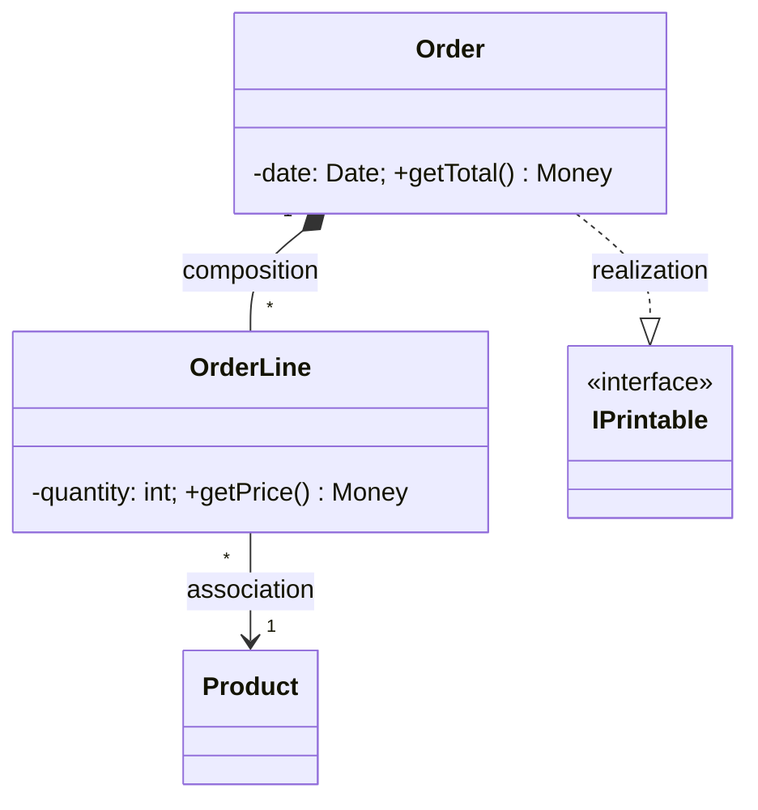

---

## 10. Диаграммы объектов, диаграммы пакетов UML

**Диаграмма объектов** показывает совокупность объектов (экземпляров) и связей между ними в фиксированный момент — «снимок» (snapshot) состояния. Напрямую соотносится с диаграммой классов. Объект: `имя : Класс` (подчёркнуто), ниже — значения атрибутов; имя можно опустить (`: Класс`). Операции обычно не показывают. Динамику изображают последовательностью таких снимков.

**Диаграмма пакетов** показывает разбиение модели/кода по пакетам и зависимости между ними. «Пакет» ≈ пакет Java / пространство имён C++. Связи: простая зависимость; реализация (пакет-предок содержит интерфейсы/абстрактные классы, реализуемые потомком); импорт пакета (`<<import>>`, имена добавляются в пространство имён; непомеченная зависимость трактуется как импорт); слияние (`<<merge>>`).

**Когда использовать диаграммы объектов:** объяснить запутанную конфигурацию связей на конкретном примере (особенно рекурсивные/сетевые структуры); очень полезны при анализе доменной модели в DDD; иллюстрация инварианта «как это выглядит в памяти».

**Когда использовать диаграммы пакетов:** показать крупноблочную структуру системы и зависимости между модулями; выявить нежелательные/циклические зависимости; задать целевую слоистую структуру.

**Когда НЕ использовать:** диаграмма объектов бесполезна для общей структуры (для этого есть классы); пакетная диаграмма не нужна для крошечного проекта без модульного деления.

**Компромиссы / подводные камни:** снимок объектов фиксирует один момент — легко принять частный случай за общее правило; для пакетов главный риск — **циклические зависимости** (их надо целенаправленно устранять, например через DIP). Слишком общие пакеты («utils», «common») превращаются в свалку.

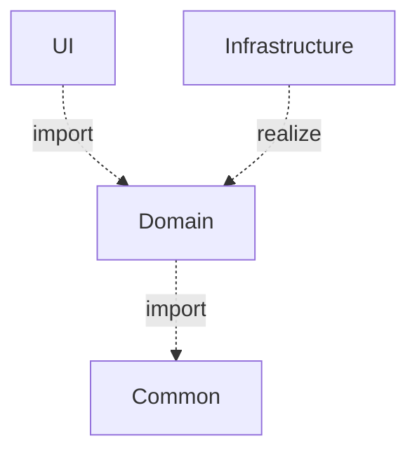

---

## 11. Диаграммы компонентов UML

**Диаграмма компонентов** — статическая структурная диаграмма; показывает разбиение системы на структурные компоненты и зависимости между ними на этапе компиляции/выполнения. Физические компоненты: файлы, библиотеки (DLL), модули, исполняемые файлы, пакеты. Компонент — прямоугольник со стереотипом `<<component>>`.

**Интерфейсы:** предоставляемый (provided) — «леденец» (кружок); требуемый (required) — «гнездо» (полукруг). Компоненты соединяются, когда требуемый интерфейс одного стыкуется с предоставляемым другого (assembly). При раскрытии внутренней структуры внешние интерфейсы делегируются внутренним компонентам.

**Когда использовать:** проектирование крупноблочной архитектуры (какие модули/сервисы и как стыкуются по интерфейсам); планирование сборки и зависимостей по бинарникам/библиотекам; документирование контрактов между командами; основа для микросервисной/компонентной архитектуры.

**Когда НЕ использовать:** для детальной логики классов (это уровень класс-диаграммы); для динамики взаимодействия (последовательности). Для совсем монолитного маленького приложения — избыточно.

**Компромиссы:** акцент на интерфейсах даёт слабое сопряжение и заменяемость реализаций, но добавляет уровни косвенности и «контрактную» бюрократию. Полезна ровно настолько, насколько компоненты действительно независимы.

**Подводные камни:** компоненты, которые «знают» внутренности друг друга (интерфейсы для галочки); чрезмерное дробление; путаница provided/required интерфейсов.

```mermaid
flowchart LR
    subgraph C1["«component» OrderService"] end
    subgraph C2["«component» PaymentGateway"] end
    C1 -->|requires IPayment| C2
```

---

## 12. Диаграммы развёртывания UML

**Диаграмма развёртывания** отражает распределение компонентов по физическим узлам и физические связи между узлами на этапе исполнения. Позволяет выявить узкие места и реконфигурировать топологию. **Узел (node)** — тип устройства («куб»): сервер, БД, датчик, рабочая станция. **Артефакт** — то, что развёртывается (исполняемый файл, библиотека). Связи между узлами — каналы с указанием протокола (`<<TCP/IP>>`).

**Когда использовать:** проектирование физической топологии (где что крутится, как связано); анализ производительности, отказоустойчивости, масштабирования, безопасности сетевых границ; общение с DevOps/эксплуатацией; документирование инфраструктуры распределённой системы.

**Когда НЕ использовать:** для одноузлового настольного приложения (нечего распределять); на ранних стадиях, когда инфраструктура ещё не определена.

**Компромиссы:** показывает «железную» картину, но быстро устаревает при динамической облачной инфраструктуре (автоскейлинг, контейнеры) — там полезнее IaC/диаграммы оркестрации. Уровень детализации балансируйте: «логические» узлы против конкретных серверов.

**Подводные камни:** смешение логической и физической структуры; игнорирование сетевых задержек/границ безопасности; единые точки отказа, незаметные на схеме без явного резервирования.

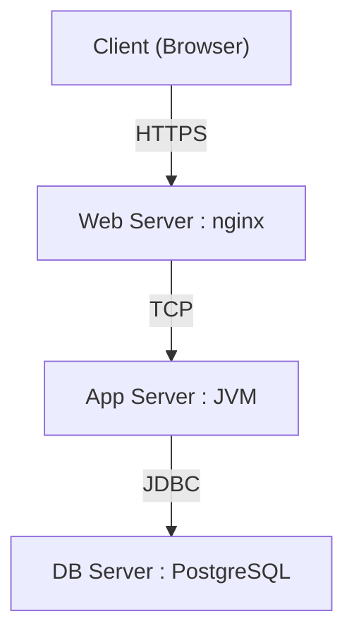

---

## 13. Диаграммы случаев использования UML

**Диаграмма случаев использования** моделирует функциональные требования: что система делает с точки зрения внешних пользователей. Элементы: **актор** (роль внешней сущности, «человечек»); **случай использования** (единица полезной функциональности, эллипс) внутри границы системы; ассоциации актор↔use case.

**Отношения:** **include** (`<<include>>`) — обязательное включение общего поведения (вынос повторяющегося); **extend** (`<<extend>>`) — необязательное/условное расширение в точке расширения; **generalization** — обобщение между use case или акторами.

К диаграмме прилагается **текстовое описание прецедента**: имя, краткое описание, актор, предусловие, основной успешный сценарий по шагам, альтернативы, постусловие. Именно текст несёт основную ценность — диаграмма лишь обзор.

**Когда использовать:** на этапе сбора требований для обзора функциональности и границ системы; согласование объёма (scope) с заказчиком; выявление акторов и их целей; планирование (каждый use case — единица работы/тестирования).

**Когда НЕ использовать:** для описания внутренней логики или алгоритмов (это не их задача); как замену детальным требованиям (диаграмма без текстовых сценариев почти бесполезна); для системной интеграции без пользователей-людей, где уместнее другие модели.

**Компромиссы:** диаграмма наглядна для обзора, но крайне бедна семантически — вся суть в текстовых сценариях. include/extend часто переусложняют — злоупотребление ими превращает диаграмму в «функциональную декомпозицию», что считается антипаттерном.

**Подводные камни:** превращение use case в мелкие «функции» (CRUD на каждое поле); путаница include/extend (include — всегда, extend — иногда); включение системных «акторов»-таймеров без нужды; раздувание диаграммы.

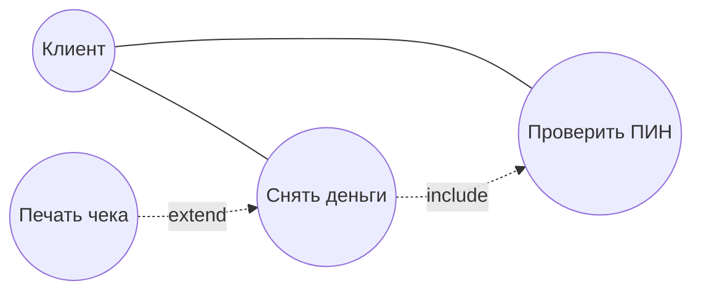

---

## 14. Диаграммы IDEF0 (контекстные)

**IDEF0** — методология функционального моделирования (на основе SADT): система как набор взаимосвязанных функций (работ). **Контекстная диаграмма** — самая верхняя: единственный блок A-0, описывающий систему целиком и её взаимодействие с окружением; задаёт **границы, цель и точку зрения** моделирования. Затем функция декомпозируется.

Каждая функция (прямоугольник, глагол) имеет **ICOM**-стрелки: **Input** (слева — что преобразуется), **Control** (сверху — правила/стандарты, управляющие выполнением), **Output** (справа — результат), **Mechanism** (снизу — ресурсы/исполнители).

**Когда использовать:** моделирование бизнес-процессов и производственных функций; анализ «как есть»/«как будет»; формальное описание с явным разделением входов и **управления** (это сильная сторона IDEF0 — оно отличает данные от регламентов); когда важна строгая иерархическая декомпозиция и контроль согласованности.

**Когда НЕ использовать:** для моделирования потока управления/алгоритмов (IDEF0 принципиально статичен — порядок выполнения не показывает); для ОО-проектирования ПО (нет объектов, состояний); когда нужна динамика — лучше BPMN/activity.

**Компромиссы:** строгость и формальность дают анализируемость и единообразие, но делают нотацию тяжёлой и непривычной заказчику; явное разделение Control/Mechanism ценно, но требует дисциплины.

**Подводные камни:** попытка читать IDEF0 как блок-схему (порядок ≠ слева направо); путаница Input и Control (Input преобразуется, Control только регламентирует); рассогласование границ родительской и дочерней диаграмм (стрелки должны совпадать).

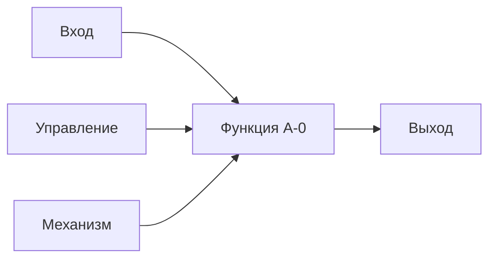

---

## 15. Диаграммы характеристик (Feature diagram)

**Диаграмма характеристик** — нотация для моделирования вариативности продукта (Software Product Lines): из каких характеристик (features) может состоять система и какие комбинации допустимы. Характеристики образуют дерево; связи родитель→потомок: **mandatory** (закрашенный кружок), **optional** (пустой кружок), **OR-группа** (закрашенный «веер» — одну или несколько), **alternative/XOR** (пустой «веер» — ровно одну). Дополнительно — ограничения `requires` и `excludes`.

**Когда использовать:** продуктовые линейки и конфигурируемые продукты (разные редакции/тарифы из общего ядра); управление вариативностью; генерация/валидация конфигураций; коммуникация о том, «какие сборки вообще возможны».

**Когда НЕ использовать:** для одного-единственного продукта без вариаций (нечего варьировать); для описания поведения/структуры кода; когда вариативность тривиальна (пара флагов — проще списком).

**Компромиссы:** формальная семантика (mandatory/XOR/ограничения) позволяет автоматически проверять и генерировать конфигурации, но требует усилий на построение и поддержку модели; при большом числе ограничений модель сама становится сложной (комбинаторный взрыв).

**Подводные камни:** забытые ограничения `requires`/`excludes` → недопустимые конфигурации проходят как валидные; смешение «фич продукта» и «задач реализации»; чрезмерная детализация дерева.

---

## 16. Feature tree

**Feature Tree (дерево функций)** — иерархическое представление функциональности продукта (в требованиях и продуктовом анализе). Корень — продукт, ниже — крупные области, далее — конкретные функции и под-функции. В отличие от формальной диаграммы характеристик (со строгой семантикой mandatory/XOR/ограничений), feature tree чаще используется как наглядный инструмент.

**Когда использовать:** структурирование и группировка требований; обзор объёма продукта (scope) и приоритизация; планирование релизов и трассировка требований; коммуникация с заказчиком; «карта продукта» для бэклога.

**Когда НЕ использовать:** когда нужна именно формальная вариативность с правилами совместимости (тогда — feature diagram); для технического дизайна (это про функции, а не про код).

**Компромиссы:** простота и наглядность ценой отсутствия строгой семантики — дерево не гарантирует корректность конфигураций, зато его легко строить и обсуждать с нетехническими стейкхолдерами.

**Подводные камни:** дерево превращается в плоский список без реальной иерархии; смешение уровней (рядом крупная область и мелкая деталь); устаревание относительно реального бэклога.

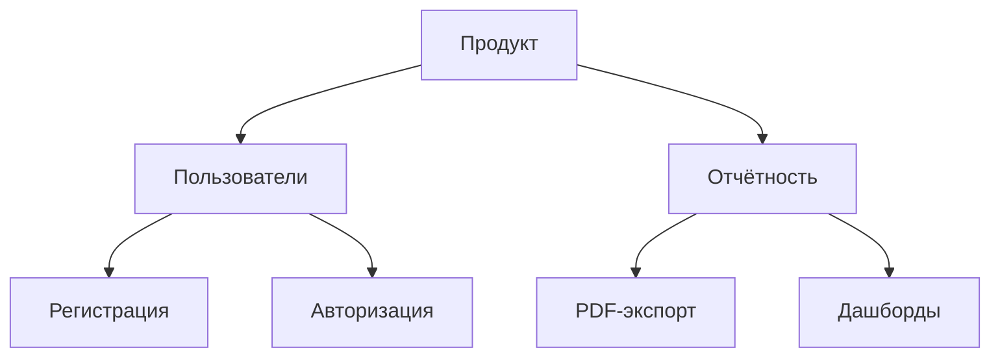

---

## 17. Диаграммы активностей UML

**Диаграмма активностей** показывает поток управления и данных через последовательные и параллельные действия (продвинутая блок-схема). Элементы: начальный/конечный узлы; **действие** (скруглённый прямоугольник); **переход** (стрелка); **решение/слияние** (ромб, `[guard]`); **fork/join** (толстая линия — параллелизм); **дорожки (swimlanes)** — кто выполняет (распределение ответственности); приём/отправка **сигналов**.

**Когда использовать:** моделирование бизнес-процессов и алгоритмов с ветвлениями и параллелизмом; описание сложных сценариев use case; показ распределения работ между ролями (дорожки); workflow.

**Когда НЕ использовать:** для простой линейной логики (избыточно — хватит текста); для структуры классов/данных; для точного взаимодействия объектов во времени (там лучше sequence). Не подменяйте ею код.

**Компромиссы:** наглядно показывает параллелизм и ветвление, но при росте сложности превращается в нечитаемую «паутину»; дорожки добавляют ясность ответственности ценой места.

**Подводные камни:** смешение потока управления и потока данных; забытые слияния после ветвлений (несбалансированные fork/join → формально некорректная модель); чрезмерная детализация до уровня операторов кода.

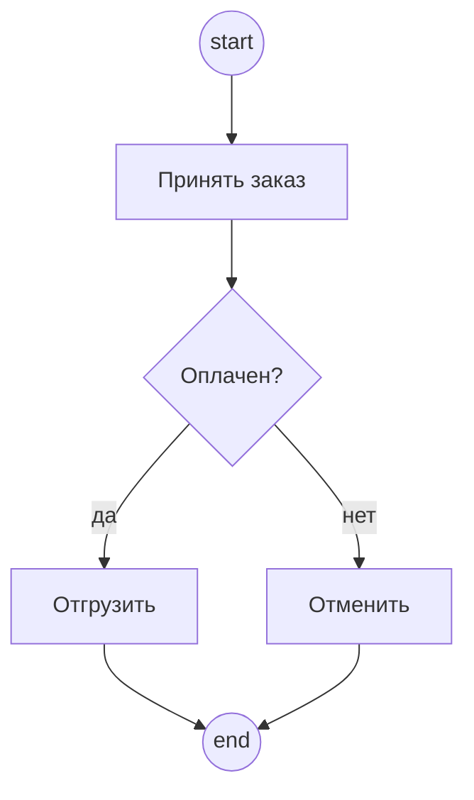

---

## 18. Язык BPMN

**BPMN (Business Process Model and Notation)** — стандарт OMG для моделирования бизнес-процессов, понятный аналитикам и разработчикам; выразительнее activity-диаграмм для бизнес-процессов. Элементы: **события** (кружки: начальное/промежуточное/конечное; таймеры, сообщения, ошибки); **задачи** (скруглённые прямоугольники); **шлюзы** (ромбы: XOR `×`, AND `+`, OR, событийный); **потоки** (последовательности — сплошные, сообщения — пунктир); **пулы и дорожки** (участники). Доп. виды: хореография (обмен сообщениями между участниками) и диалоги (conversation).

**Когда использовать:** документирование и автоматизация бизнес-процессов (особенно с движками BPM, где модель исполняется напрямую); межведомственные процессы с несколькими участниками; согласование процессов с бизнесом; процессы с событиями, таймерами, исключениями.

**Когда НЕ использовать:** для внутренней логики ПО/алгоритмов (это не код); для простых процессов, где хватит списка шагов; когда команда не знает нотацию (богатый словарь BPMN — барьер).

**Компромиссы:** богатая семантика (можно исполнять модель) ценой большой и сложной нотации; полнота против читаемости — легко перегрузить диаграмму редкими элементами.

**Подводные камни:** путаница типов шлюзов (XOR vs OR vs параллельный); смешение потоков последовательности и сообщений; «технические» детали в бизнес-модели; разные участники в одном пуле без дорожек.

---

## 19. Диаграммы «Сущность-связь» (ER)

**ER-диаграмма** — модель данных в терминах сущностей, атрибутов и связей; основа концептуального/логического проектирования реляционных БД. Нотация Чена: **сущность** (прямоугольник), **атрибут** (овал, ключ подчёркнут), **связь** (ромб). Кардинальность: 1:1, 1:N, M:N. В нотации «воронья лапка» (Crow's foot) кратность — окончаниями линий.

**Когда использовать:** проектирование схемы реляционной БД; анализ структуры данных предметной области; коммуникация о данных с заказчиком/DBA; обратное проектирование существующей БД.

**Когда НЕ использовать:** для поведения/логики (только структура данных); для документо-ориентированных/графовых хранилищ ER подходит хуже (другая модель данных); для богатой доменной модели с поведением — лучше класс-диаграмма/DDD (ER не показывает методы и инкапсуляцию).

**Компромиссы:** ER ближе к реализации БД (легко перейти к таблицам), но навязывает «табличное» мышление и плохо выражает поведение и сложные инварианты. Концептуальный уровень нагляден, но требует перевода в физический (нормализация, индексы).

**Подводные камни:** связи M:N без таблицы-связки в физической модели; пропущенные ограничения целостности; неправильная кардинальность/обязательность; смешение концептуального и физического уровней.

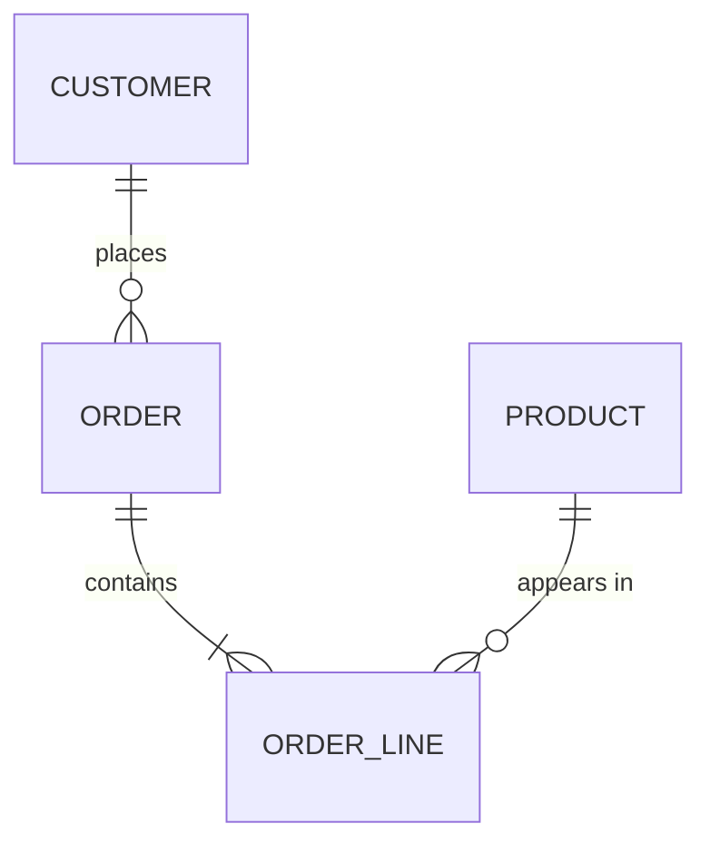

---

## 20. Концептуальное моделирование, диаграммы ORM

**Концептуальное моделирование** — построение модели предметной области на уровне понятий и отношений, независимо от реализации (БД, код); цель — точно и однозначно зафиксировать факты и ограничения совместно с экспертами.

**ORM (Object-Role Modeling)** описывает область через **объекты** (entity/value) и **роли** в **фактах (fact types)** — атомарных предложениях («Сотрудник работает в Отделе»). Особенности: оперирует элементарными фактами; **не имеет понятия «атрибут»** (всё через роли — attribute-free, устойчивее к изменениям); богатый набор графических ограничений (уникальность, обязательность, подмножество, исключение); верификация на естественно-языковых примерах («моделирование вслух»).

**Когда использовать:** ранний концептуальный анализ незнакомой области; тесная работа с предметными экспертами (факты проговариваются предложениями); когда важна точность ограничений и независимость от будущей схемы хранения; хорошо сочетается с DDD-подходом к единому языку.

**Когда НЕ использовать:** как непосредственную модель реализации (ORM-модель обычно трансформируют в ER/классы); для простых задач, где хватит ER; когда нет доступа к экспертам и нет нужды в фактологической точности.

**Компромиссы:** attribute-free даёт устойчивость к изменениям и точность, но порождает много элементов (детальнее ER) и требует обучения нотации; высокая выразительность ограничений ценой объёма модели.

**Подводные камни:** не-элементарные («составные») факты ломают анализ; недозаданные ограничения; путаница ролей; восприятие ORM как «ER с другими значками» (это другой подход).

---

## 21. Диаграммы конечных автоматов UML

**Диаграмма конечных автоматов (statechart)** описывает жизненный цикл объекта: состояния и переходы под действием событий (statecharts Харела). Обозначения: начальное (закрашенный круг) / конечное (круг в круге) состояния; **состояние** (скруглённый прямоугольник, внутри `entry/`, `do/`, `exit/`); **переход** со меткой `событие [условие] / действие`; fork/join; **составные (вложенные)** состояния, история (`H`). Реализуется кодом (switch), таблицей состояний или паттерном «Состояние».

**Когда использовать:** объекты/системы с явным, сложным поведением, зависящим от состояния (протоколы, UI-контролы, устройства, заказы, сессии); когда поведение естественно описывается «состояние → событие → переход»; генерация кода/тестов из автомата.

**Когда НЕ использовать:** для объектов без значимого состояния (просто данные); когда состояний слишком много и они слабо структурированы (взрыв состояний — лучше пересмотреть модель); для потока работ между ролями (там activity/BPMN).

**Компромиссы:** автомат делает поведение явным и верифицируемым (можно проверить достижимость, мёртвые состояния), но при росте числа состояний/событий быстро усложняется; вложенные состояния и регионы спасают, но добавляют сложности нотации.

**Подводные камни:** «взрыв состояний» (комбинаторный рост); забытые переходы/события (объект «застревает»); смешение охранных условий и действий; недетерминизм (два перехода по одному событию).

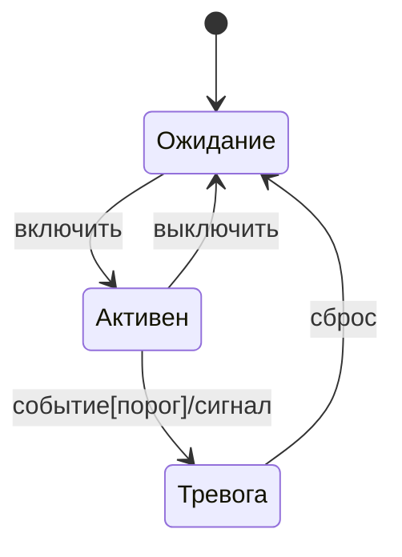

---

## 22. Диаграммы последовательностей UML

**Диаграмма последовательности** показывает взаимодействие объектов во времени в рамках одного сценария: какие сообщения и в каком порядке. Элементы: участники сверху; **линии жизни** (вертикальные пунктиры, время вниз); **фокус управления** (узкий прямоугольник — объект активен); **сообщения** (горизонтальные стрелки). Виды: синхронное (сплошная, закрашенный треугольник — ждёт ответа); ответное (пунктир, открытая стрелка); асинхронное (сплошная, открытая стрелка — не ждёт); потерянное/найденное (редко). Создание — стрелка к прямоугольнику; удаление — `X`. Условия/циклы — **фреймы** (`alt`, `opt`, `loop`, `par`, `ref`).

**Когда использовать:** детальная проработка сложного сценария взаимодействия; проектирование протокола вызовов между объектами/сервисами; документирование «как именно реализуется» прецедент; обнаружение лишних/недостающих сообщений; обсуждение асинхронности.

**Когда НЕ использовать:** для статической структуры; для простых одно-двухшаговых вызовов (избыточно); для отражения всех сценариев системы (получится сотни диаграмм — выбирайте ключевые/нетривиальные).

**Компромиссы:** ясно показывает порядок и синхронность ценой того, что одна диаграмма = один сценарий (одна ветка). Фреймы `alt/loop` добавляют ветвление, но снижают читаемость. Тесная привязка к реализации → быстрое устаревание.

**Подводные камни:** путаница синхронных/асинхронных стрелок (закрашенная vs открытая); попытка втиснуть всю логику с множеством `alt` в одну диаграмму; игнорирование возвратов; смешение акторов и внутренних объектов без необходимости.

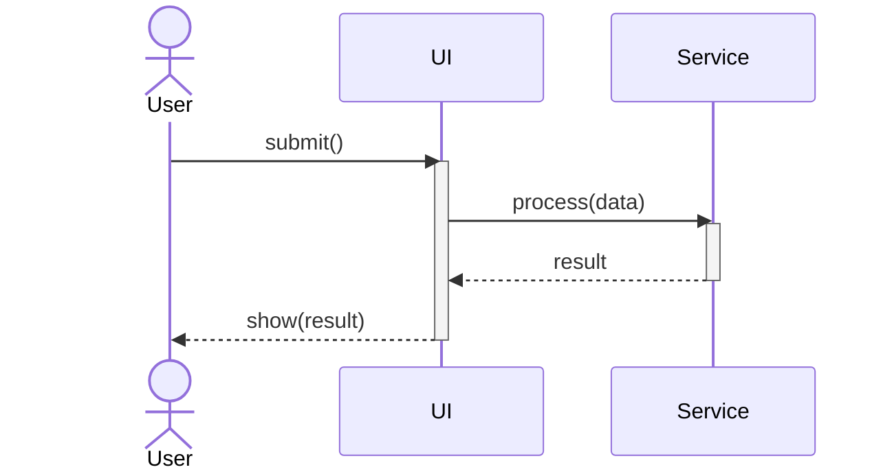

---

## 23. Диаграммы коммуникации UML

**Диаграмма коммуникации (collaboration)** изображает взаимодействие объектов с акцентом на **структуре связей**, а не на времени. Содержит ту же информацию, что и sequence, но иначе: объекты как на object-диаграмме, соединены линиями; сообщения подписаны на связях с **порядковыми номерами** (`1:`, `1.1:`, `2:`); ось времени отсутствует.

**Когда использовать:** когда важнее показать, **кто с кем связан** (топология взаимодействий), чем точный порядок; компактное представление взаимодействия в небольшой группе объектов; иллюстрация того, что связи реально существуют (а не только сообщения).

**Когда НЕ использовать:** когда критичен именно **порядок** и тайминг (тогда sequence нагляднее); для длинных сценариев с множеством шагов (нумерация становится нечитаемой); для сложных ветвлений (фреймы тут неудобны).

**Компромиссы:** лучше показывает структуру связей, хуже — последовательность (обратный баланс по сравнению с sequence). Выбор между ними — вопрос того, что важнее в конкретном случае; информация эквивалентна.

**Подводные камни:** запутанная нумерация при ветвлениях/вложенности; перегрузка диаграммы; ошибочное представление, что это «другой смысл», а не другой ракурс той же информации.

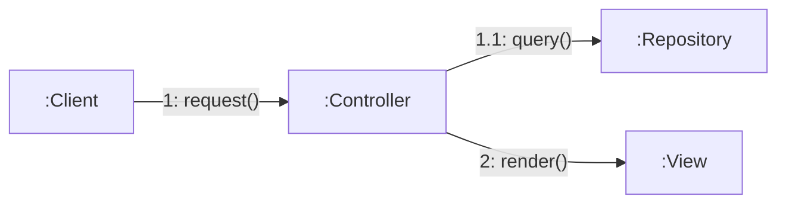

---

## 24. Диаграммы составных структур UML

**Диаграмма составной/композитной структуры** — статическая структурная диаграмма; показывает **внутреннюю структуру** классификатора (класса/компонента) и взаимодействие его частей в период исполнения. Элементы: **часть (part)** — экземпляр в составе целого; **порт (port)** — точка взаимодействия на границе; **коннектор** — связь между частями/портами; provided/required интерфейсы на портах.

**Когда использовать:** показать, из каких внутренних объектов состоит сложный класс/компонент и как они соединены, **не вынося** это на уровень внешних классов; проектирование компонентов с чёткими портами; описание архитектуры с инкапсулированными внутренними структурами.

**Когда НЕ использовать:** для простых классов без значимой внутренней структуры; для общей структуры системы (class/component-диаграмма); когда внутренности неважны для рассуждения.

**Компромиссы:** даёт точную картину «внутренностей» и их связей ценой детальности; полезна именно для компонентов с инкапсулированной композицией, иначе избыточна.

**Подводные камни:** путаница части (part, экземпляр-роль внутри) и обычной ассоциации; смешение портов и интерфейсов; чрезмерная детализация.

---

## 25. Диаграммы коопераций UML

**Диаграмма кооперации (collaboration, UML 2.0)** — подвид диаграмм составной структуры; показывает **роли** и их **взаимодействие** в рамках кооперации — структуры, совместно реализующей некоторое поведение. Описывает не конкретные объекты, а **роли** (части), которые должны выполнить участники.

**Когда использовать:** **моделирование шаблонов проектирования** (кооперация «Observer» описывает роли Subject/Observer безотносительно классов); описание переиспользуемых схем взаимодействия; абстрактное представление «кто какую роль играет» в типовом решении. Поведение кооперации детализируется sequence-диаграммами.

**Когда НЕ использовать:** для конкретных экземпляров (object/sequence); для общей структуры; когда нет переиспользуемой роли-схемы, а есть разовый сценарий.

**Компромиссы:** работа с ролями (а не классами) даёт переиспользуемость и абстрактность ценой отрыва от конкретики реализации — нужно дополнительно показать, какие классы какие роли играют.

**Подводные камни:** смешение роли и класса; кооперация без привязки ролей к реальным участникам; чрезмерная абстракция там, где достаточно простого примера.

---

## 26. Временные диаграммы UML

**Временная диаграмма (timing diagram)** — особая форма диаграммы взаимодействия, акцентирующая **изменение состояний экземпляров во времени** с явной шкалой времени. По оси X — время, по Y (для каждого участника) — его состояния/значения; ступенчатые линии показывают переходы; можно задавать временные ограничения (`{t < 5ms}`).

**Когда использовать:** системы реального времени и встроенные системы, где важны точные тайминги (длительности состояний, моменты переходов, синхронизация нескольких линий жизни); анализ временных характеристик протоколов; аппаратно-программные интерфейсы.

**Когда НЕ использовать:** для обычных бизнес-приложений (тайминги не критичны — sequence/state нагляднее); когда временная ось не несёт смысла; для структуры/логики.

**Компромиссы:** уникально показывает поведение во времени с количественными ограничениями ценой узкой применимости и громоздкости при многих участниках/состояниях.

**Подводные камни:** перегрузка множеством линий жизни; неверный масштаб времени; смешение состояний и событий; применение там, где тайминг не важен.

---

## 27. Диаграммы обзора взаимодействия, диаграммы потоков данных

**Диаграмма обзора взаимодействия (interaction overview)** — разновидность activity-диаграммы, узлы которой — **взаимодействия** (ссылки на sequence-диаграммы) или inline-взаимодействия. Поток управления берётся из activity (ветвления, fork/join), узлы — из sequence. Даёт высокоуровневую «карту» сценариев, не вникая в детали отдельного обмена.

**Когда использовать обзор взаимодействия:** связать несколько sequence-сценариев в единый поток с ветвлениями; высокоуровневый обзор того, как сценарии комбинируются; навигация по сложному поведению.

**Диаграмма потоков данных (DFD)** описывает **движение данных** (не поток управления!). Элементы: **процесс** (преобразование данных); **поток данных** (стрелка); **хранилище (data store)**; **внешняя сущность (terminator)**. Строятся иерархически: контекстная (уровень 0) → декомпозиция процессов.

**Когда использовать DFD:** анализ информационных систем «откуда и куда текут данные»; проектирование ETL/обработки данных; выявление хранилищ и интеграций; общение с аналитиками.

**Когда НЕ использовать:** DFD — для потока управления/алгоритмов (он про данные); обзор взаимодействия — когда хватает одной sequence; обе — для простых случаев.

**Компромиссы:** DFD нагляден для потоков данных, но не показывает порядок и условия выполнения; обзор взаимодействия даёт связность сценариев ценой потери деталей.

**Подводные камни:** в DFD — процесс без входа или выхода («чёрная дыра»/«чудо»); смешение управления и данных; рассогласование уровней декомпозиции; в обзоре — дублирование того, что уже есть в sequence.

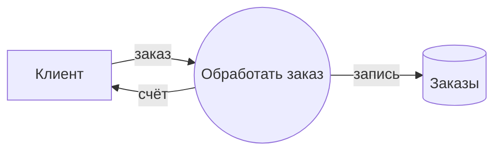

---

## 28. Диаграммы IDEF0

**IDEF0** — методология функционального моделирования (на основе SADT): система как иерархия функций и связей. В отличие от DFD моделирует именно функции и их **регламентацию** (управление, механизмы), а не только потоки данных. Базовый блок — функция (глагол) с **ICOM**-стрелками: Input (слева), Control (сверху), Output (справа), Mechanism (снизу). **Иерархическая декомпозиция:** A-0 (вся система) → A0 (3–6 функций A1..A6) → далее; границы родителя и потомка согласуются.

**Когда использовать:** строгое описание производственных/бизнес-процессов; анализ полноты и согласованности функциональной модели; явное разделение «данных» (Input) и «правил» (Control) — ключевое преимущество; стандартизованная документация (часто в госсекторе/промышленности).

**Когда НЕ использовать:** для потока управления и алгоритмов (IDEF0 статичен); для ОО-/событийных систем; когда нужна гибкая, лёгкая нотация для быстрого наброска.

**Компромиссы:** строгость и анализируемость ценой тяжеловесности и кривой обучения; иерархия даёт управление сложностью, но требует дисциплины согласования стрелок между уровнями.

**Подводные камни:** чтение как блок-схемы (порядок не задан); путаница Input/Control; нарушение баланса стрелок при декомпозиции; чрезмерное число функций на одной диаграмме (норма 3–6).

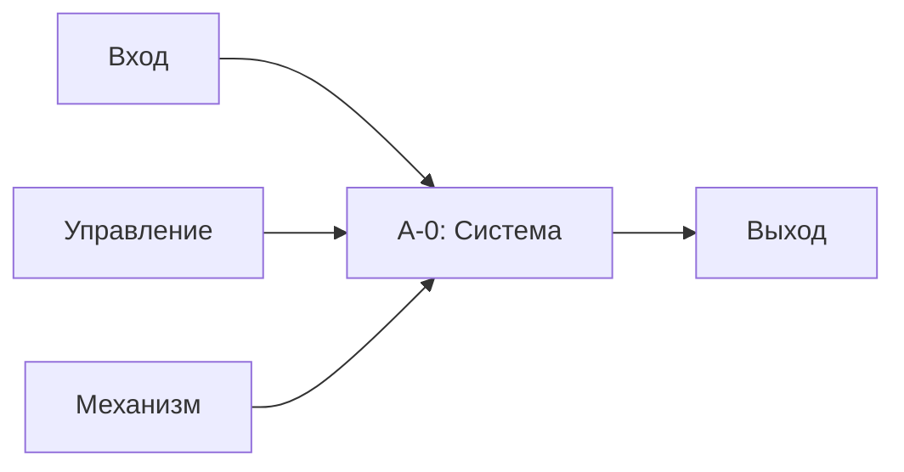

---

## 29. Сети Петри

**Сеть Петри** — математический аппарат для моделирования распределённых, параллельных и асинхронных систем. Двудольный ориентированный граф: **позиции (places)** — кружки (условия/состояния); **переходы (transitions)** — прямоугольники (события); **дуги** соединяют позиции с переходами и наоборот. **Маркировка** — распределение **фишек (tokens)** по позициям (текущее состояние). **Срабатывание:** переход разрешён, если во входных позициях достаточно фишек; при срабатывании забирает фишки из входных и кладёт в выходные (недетерминированно).

**Когда использовать:** формальный анализ параллельных/конкурентных систем; проверка свойств — достижимость, отсутствие тупиков (deadlock), живость, ограниченность, безопасность; моделирование протоколов, workflow-процессов, синхронизации; там, где нужна доказуемость свойств, а не только иллюстрация.

**Когда НЕ использовать:** для обычного последовательного ПО (избыточно); для коммуникации с бизнесом (нотация формальна и непривычна); когда нужна структура кода/данных. Для очень больших систем анализ страдает от «взрыва пространства состояний».

**Компромиссы:** строгая математика даёт доказуемость свойств ценой сложности построения и анализа; расширения (раскрашенные, временные, иерархические сети Петри) повышают выразительность, но усложняют анализ.

**Подводные камни:** взрыв пространства состояний при анализе достижимости; неограниченные сети (бесконечный рост фишек); ошибки в моделировании синхронизации; восприятие как простой блок-схемы.

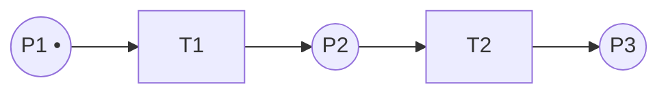

---

> **Паттерны проектирования** — типовые проверенные решения часто встречающихся задач (книга GoF «Design Patterns», 1994, 23 паттерна). Делятся на **порождающие** (создание объектов), **структурные** (композиция классов/объектов), **поведенческие** (распределение обязанностей и взаимодействие). Общее правило: паттерн применяют, когда есть **реальная** проблема, которую он решает; применение паттерна «потому что красиво» — частый источник лишней сложности.

## 30. Паттерн «Компоновщик» (Composite) — структурный

**Назначение:** компоновать объекты в древовидные структуры «часть-целое» и единообразно работать как с отдельными объектами, так и с композициями.

**Мотивация:** клиентский код вынужден различать «лист» и «контейнер» через `if`-ы (`if (node is Group) … else …`). Composite даёт общий интерфейс, и клиент рекурсивно работает с деревом одинаково.

**Структура:** интерфейс `Component`; `Leaf` (лист); `Composite` (хранит коллекцию `Component`, делегирует операции потомкам).

**Когда использовать:** есть естественная иерархия «часть-целое» (документ из глифов/групп, файловая система, GUI-контейнеры, организационные структуры, AST); клиент должен трактовать одиночные и составные объекты одинаково.

**Когда НЕ использовать:** структура не древовидная (граф с разделением — Composite не подходит, нужны меры против циклов); типы листьев и контейнеров слишком разные, и единый интерфейс получается «дырявым» (у листа нет `add/remove`); иерархии нет вовсе.

**Компромиссы:** единообразие клиента ценой того, что общий интерфейс содержит операции, осмысленные не для всех (классическая дилемма: `add()/remove()` в `Component` — прозрачно, но небезопасно; только в `Composite` — безопасно, но не прозрачно).

**Подводные камни:** вызов `add()` у листа (выбор между бросанием исключения и пустой реализацией); циклические ссылки в «дереве»; дорогие рекурсивные обходы больших деревьев. Часто сочетается с «Итератором» (обход) и «Посетителем» (операции над деревом); листья могут быть «Приспособленцами».

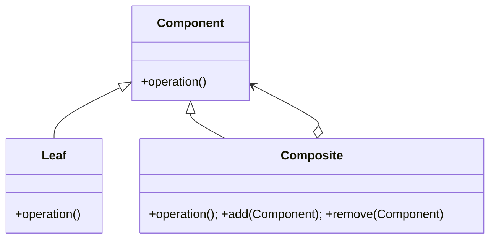

---

## 31. Паттерн «Декоратор» (Decorator) — структурный

**Назначение:** динамически добавлять объекту новые обязанности, не меняя его класс. Гибкая альтернатива наследованию.

**Мотивация:** нужно множество комбинаций возможностей (буфер + сжатие + шифрование потока). Наследованием это даёт комбинаторный взрыв подклассов; декораторы навешиваются друг на друга в любой комбинации в рантайме.

**Структура:** `Component`; `ConcreteComponent` (базовый объект); `Decorator` реализует `Component` и **содержит** ссылку на `Component`, делегируя и добавляя поведение до/после.

**Когда использовать:** нужно добавлять/комбинировать возможности динамически и независимо (потоки I/O `Buffered(Gzip(File))`, рамки/скроллбары виджетов, middleware); расширение наследованием непрактично (много осей вариативности).

**Когда НЕ использовать:** меняется «суть»/алгоритм объекта, а не довески — лучше «Стратегия»; декораторов нужно много и их порядок важен/хрупок; клиент полагается на конкретный тип объекта (декоратор «прячет» его).

**Компромиссы:** огромная гибкость комбинаций ценой множества мелких объектов и усложнения отладки (длинная цепочка обёрток); идентичность объекта теряется (`decorated != original`).

**Подводные камни:** зависимость от порядка декорирования; проверки `instanceof`/приведения типов ломаются на обёртках; «протекающие» методы, которые декоратор забыл проделегировать. Отличие от Proxy — Decorator добавляет поведение, Proxy управляет доступом; от Strategy — меняет «снаружи», а не «внутри».

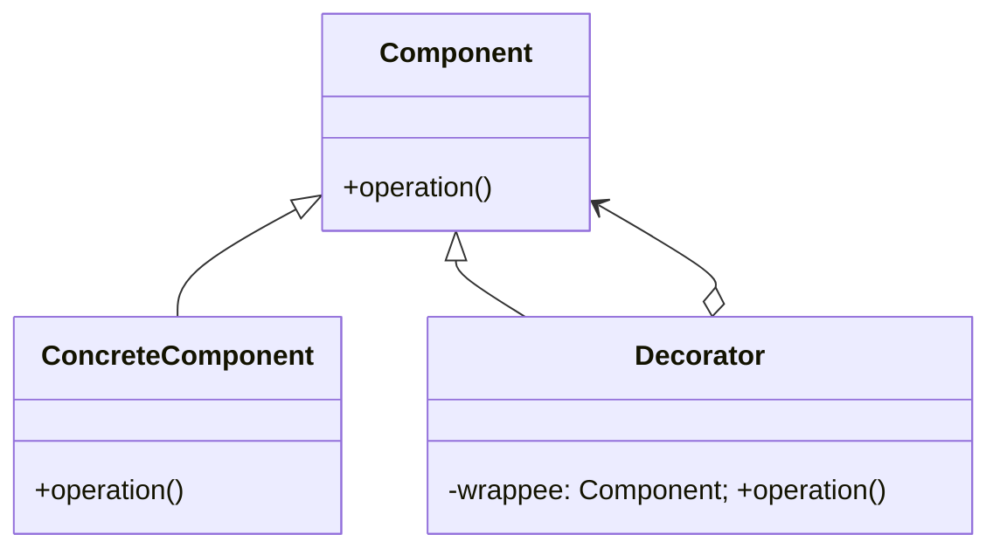

---

## 32. Паттерн «Стратегия» (Strategy) — поведенческий

**Назначение:** определить семейство взаимозаменяемых алгоритмов, инкапсулировать каждый и сделать их подменяемыми независимо от клиента.

**Мотивация:** класс обрастает `if/switch` по «режиму» (способ сортировки, расчёта скидки, оплаты). Стратегия выносит каждый вариант в отдельный объект, выбираемый/подменяемый в рантайме.

**Структура:** интерфейс `Strategy`; `ConcreteStrategyA/B`; `Context` хранит ссылку на стратегию и делегирует ей.

**Когда использовать:** есть несколько вариантов одного действия, выбираемых в рантайме или конфигурацией; хочется убрать ветвления по типу поведения; алгоритмы должны тестироваться/добавляться независимо (OCP).

**Когда НЕ использовать:** вариант ровно один и не предвидится других (преждевременное обобщение); различия между «алгоритмами» тривиальны (лямбды/функции проще, чем иерархия классов); поведение жёстко связано со структурой класса.

**Компромиссы:** гибкость и соблюдение OCP/DIP ценой числа классов и того, что клиент должен знать о существовании стратегий, чтобы выбрать нужную. В отличие от **Шаблонного метода** (наследование, статический выбор) — композиция и динамический выбор (предпочтительнее).

**Подводные камни:** утечка деталей контекста в интерфейс стратегии (стратегии нужны разные данные); «стратегия» с единственной реализацией; путаница со «Состоянием» (структурно похожи, но State управляет переходами между собой, Strategy — нет).

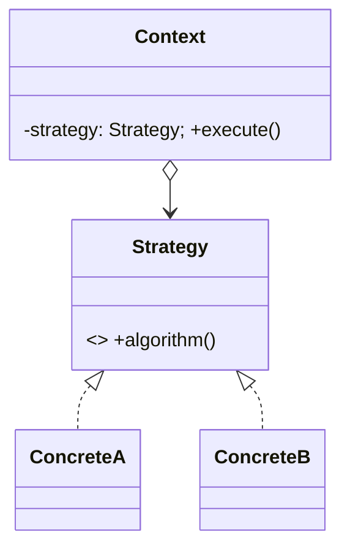

---

## 33. Паттерн «Адаптер» (Adapter) — структурный

**Назначение:** организовать использование объекта с несовместимым интерфейсом через класс-оболочку с требуемым интерфейсом. Применяется, когда объект нельзя изменить (сторонняя библиотека, legacy).

**Мотивация:** клиент ожидает интерфейс `Target`, а есть готовый класс `Adaptee` с другим API. Адаптер «переводит» вызовы.

**Две разновидности:** **адаптер объекта** (содержит адаптируемый объект, делегирует — композиция) и **адаптер класса** (наследует адаптируемый класс — нужно множественное наследование).

**Когда использовать:** интеграция несовместимых API; переиспользование «чужих»/старых классов без их модификации; изоляция от внешней зависимости (антикоррупционный слой); основа портов-адаптеров в гексагональной архитектуре.

**Когда НЕ использовать:** интерфейсы можно согласовать напрямую (адаптер лишний); адаптируемый объект под вашим контролем — лучше исправить его интерфейс; нужно не «подогнать», а «упростить» подсистему (это Фасад) или «добавить поведение» (Декоратор).

**Компромиссы:** позволяет переиспользовать несовместимый код ценой дополнительного уровня и небольших накладных расходов; «адаптер класса» жёстко привязан к конкретному Adaptee (наследование), «адаптер объекта» гибче.

**Подводные камни:** «толстый» адаптер, тянущий бизнес-логику; цепочки адаптеров поверх адаптеров; неполный перевод (часть интерфейса не поддержана). Близок к Фасаду (но тот создаёт новый удобный интерфейс, а не подгоняет под существующий) и к Мосту (но Мост проектируется заранее).

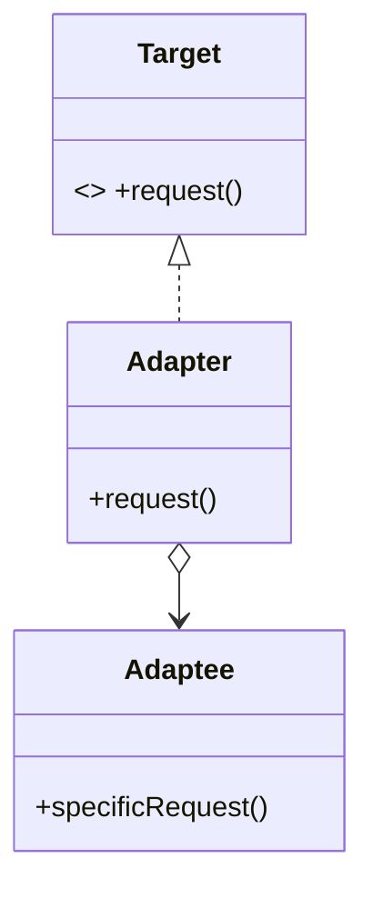

---

## 34. Паттерн «Заместитель» (Proxy) — структурный

**Назначение:** предоставить суррогат другого объекта, контролирующий доступ к нему, перехватывая все вызовы. Proxy реализует тот же интерфейс, что и реальный объект (прозрачен для клиента).

**Мотивация:** прямой доступ к объекту нежелателен — он дорог в создании, удалён, требует контроля прав или дополнительных действий (кеш, лог).

**Виды:** виртуальный (ленивое создание дорогого объекта), удалённый (представитель объекта в другом процессе — основа RPC/RMI), защищающий (контроль прав), «умная ссылка» (подсчёт ссылок, логирование, кеширование).

**Когда использовать:** нужен прозрачный для клиента уровень контроля при обращении к объекту: отложенная загрузка (ORM lazy loading), удалённые вызовы, контроль доступа, кеширование, метрики.

**Когда НЕ использовать:** дополнительный контроль не нужен (прямой доступ проще); требуется добавить функциональность (Декоратор) или упростить подсистему (Фасад); накладные расходы прокси критичны.

**Компромиссы:** прозрачный контроль доступа ценой косвенности и возможных скрытых эффектов (ленивый прокси внезапно бьёт в БД при обращении к полю → проблема N+1, неожиданные исключения).

**Подводные камни:** «невидимые» дорогие операции за безобидным геттером; различия в поведении прокси и реального объекта (идентичность, equals); цепочки прокси. Отличия: Decorator добавляет поведение, Proxy управляет доступом/жизненным циклом; Adapter меняет интерфейс, Proxy сохраняет.

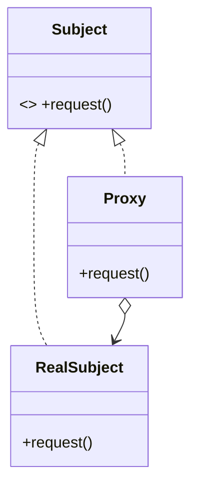

---

## 35. Паттерн «Фасад» (Facade) — структурный

**Назначение:** скрыть сложность подсистемы, предоставив единый упрощённый интерфейс; все внешние вызовы сводятся к фасаду, делегирующему их объектам подсистемы.

**Мотивация:** клиенту, чтобы выполнить типовую задачу, приходится оркестрировать множество классов подсистемы в правильном порядке. Фасад инкапсулирует этот сценарий.

**Структура:** `Facade` знает классы подсистемы и делегирует им; клиенты работают с фасадом. Возможен абстрактный фасад (интерфейс с реализациями).

**Когда использовать:** упрощение работы со сложной библиотекой/подсистемой; уменьшение сопряжения клиента с внутренностями; задание точки входа в слой/модуль; постепенное «оборачивание» legacy.

**Когда НЕ использовать:** подсистема и так проста; клиентам реально нужен полный доступ к деталям (фасад будет мешать); нужно «подогнать» один интерфейс под другой (Адаптер) или добавить поведение (Декоратор).

**Компромиссы:** упрощение и развязка ценой того, что фасад может стать «узким горлышком» или «богом», скрывающим слишком много; теряется тонкий контроль (фасад даёт усреднённый сценарий).

**Подводные камни:** фасад, копящий бизнес-логику (God Facade); фасад, не закрывающий доступ к подсистеме (его обходят) → дрейф; слишком «толстый» интерфейс фасада. Отличие от Адаптера: фасад создаёт **новый** удобный интерфейс, Адаптер подгоняет под **существующий**.

---

## 36. Паттерн «Приспособленец» (Flyweight) — структурный

**Назначение:** экономить память, разделяя общее (внутреннее) состояние между множеством мелких объектов.

**Мотивация:** нужны миллионы однотипных объектов (символы текста, частицы, тайлы) — наивно по объекту на каждый не помещается в память. Flyweight разделяет неизменную часть.

**Состояние:** **внутреннее (intrinsic)** — в приспособленце, не зависит от контекста, разделяемо; **внешнее (extrinsic)** — передаётся клиентом при вызове, контекстозависимо.

**Участники:** `Flyweight` (принимает внешнее состояние); `ConcreteFlyweight` (разделяемый); `UnsharedConcreteFlyweight` (неразделяемый, например для иерархий с Composite); `FlyweightFactory` (пул, создаёт и переиспользует).

**Когда использовать:** очень много объектов, большая часть состояния которых одинакова и может быть вынесена во внутреннее/разделяемое; память — узкое место.

**Когда НЕ использовать:** объектов немного (экономия не оправдывает усложнения); состояние почти всё контекстозависимо (нечего разделять); изменяемое разделяемое состояние (опасно). Преждевременная оптимизация без замеров.

**Компромиссы:** резкая экономия памяти ценой усложнения кода и возможного роста CPU (внешнее состояние вычисляется/передаётся каждый раз); разделяемые объекты должны быть **неизменяемыми**.

**Подводные камни:** случайное изменение разделяемого состояния (баги «во многих местах сразу»); путаница, что внутреннее, а что внешнее; пул как утечка памяти (объекты не освобождаются).

---

## 37. Паттерн «Мост» (Bridge) — структурный

**Назначение:** разделить абстракцию и реализацию так, чтобы они изменялись независимо.

**Мотивация:** есть две оси вариативности (например, «фигура» × «API отрисовки»). Наследование даёт комбинаторный взрыв (`CircleDirectX`, `CircleOpenGL`, `SquareDirectX`…). Мост делает две независимые иерархии, связанные композицией.

**Структура:** `Abstraction` содержит ссылку на `Implementor` (мост) и делегирует ему; `RefinedAbstraction` расширяет абстракцию; `Implementor` — интерфейс реализации, `ConcreteImplementor` — реализации.

**Когда использовать:** и абстракция, и реализация должны независимо расширяться (драйверы, GUI на разных платформах, СУБД-бэкенды); хочется избежать жёсткой компиляционной привязки к реализации; нужно менять реализацию в рантайме.

**Когда НЕ использовать:** ось реализации одна и стабильна (Мост — лишняя косвенность); вариативность можно покрыть Стратегией/наследованием проще; преждевременное разделение «на всякий случай».

**Компромиссы:** независимое развитие двух иерархий ценой дополнительного уровня косвенности и усложнения навигации по коду; выгоден, только если **обе** оси реально варьируются.

**Подводные камни:** путаница с Адаптером (Мост — заранее, для развязки; Адаптер — постфактум, для совместимости); «мост» при одной реализации; протекание деталей реализации в абстракцию.

```mermaid
classDiagram
    class Abstraction { -impl: Implementor; +operation() }
    class Implementor { <<interface>> +operationImpl() }
    Abstraction <|-- RefinedAbstraction
    Abstraction o--> Implementor
    Implementor <|.. ConcreteImplA
    Implementor <|.. ConcreteImplB
```

---

## 38. Паттерн «Фабричный метод» (Factory Method) — порождающий

**Назначение:** определить интерфейс создания объекта, но позволить подклассам решать, какой класс инстанцировать. Создание выносится в виртуальный метод.

**Мотивация:** базовый класс/каркас знает, **когда** создать продукт, но не **какой** конкретно — это должны определять подклассы (точка расширения framework'а).

**Структура:** `Creator` объявляет `factoryMethod()` и использует его в логике; `ConcreteCreator` переопределяет его, возвращая `ConcreteProduct`; `Product` — общий интерфейс.

**Когда использовать:** класс не знает заранее, объекты каких классов создавать; нужно дать подклассам/расширениям контроль над созданием; убрать `new ConcreteX()` из бизнес-логики ради тестируемости/OCP.

**Когда НЕ использовать:** тип создаваемого объекта всегда один (простой `new` или конструктор лучше); вариативность создания покрывается параметром/конфигом; ради «фабрики везде» (карго-культ).

**Компромиссы:** гибкость и расширяемость ценой роста числа классов (на каждый продукт — свой Creator) и косвенности; иногда достаточно простой статической фабрики/фабричной функции.

**Подводные камни:** разрастание параллельных иерархий Creator/Product; путаница с Абстрактной фабрикой (та создаёт **семейства**) и со «статической фабрикой» (не GoF-паттерн); фабрика, тянущая лишнюю логику.

```mermaid
classDiagram
    class Creator { +factoryMethod() Product; +someOperation() }
    class ConcreteCreator { +factoryMethod() Product }
    Creator <|-- ConcreteCreator
    Product <|.. ConcreteProduct
    ConcreteCreator ..> ConcreteProduct : creates
```

---

## 39. Паттерн «Абстрактная фабрика» (Abstract Factory) — порождающий

**Назначение:** интерфейс для создания **семейств** связанных объектов без указания конкретных классов; гарантирует совместимость продуктов одного семейства.

**Мотивация:** система должна работать с одним из нескольких согласованных наборов объектов (виджеты под Windows/macOS/Linux), и нельзя смешивать элементы разных наборов.

**Структура:** `AbstractFactory` с методами создания каждого продукта; `ConcreteFactory1/2` создают согласованные наборы; `AbstractProductA/B` — интерфейсы. Клиент работает только через интерфейсы.

**Когда использовать:** несколько «тем»/платформ/семейств, элементы которых должны быть совместимы; нужно изолировать клиента от конкретных классов целого семейства; смена семейства одним переключением фабрики.

**Когда НЕ использовать:** семейство одно; продукты не связаны (хватит отдельных фабричных методов); добавление новых **видов** продуктов часто (это требует менять интерфейс фабрики и все её реализации — слабое место паттерна).

**Компромиссы:** согласованность семейства и изоляция от конкретики ценой жёсткости: легко добавить новое **семейство** (новая фабрика), трудно добавить новый **продукт** (правка всех фабрик). Часто комбинируется с «Одиночкой» (одна фабрика на семейство), внутри — фабричные методы.

**Подводные камни:** взрыв интерфейсов при росте числа видов продуктов; смешение продуктов разных семейств; чрезмерное применение там, где хватает одной фабрики.

```mermaid
classDiagram
    class AbstractFactory { <<interface>> +createA() ProductA; +createB() ProductB }
    AbstractFactory <|.. Factory1
    AbstractFactory <|.. Factory2
```

---

## 40. Паттерн «Одиночка» (Singleton) — порождающий

**Назначение:** гарантировать единственный экземпляр класса и дать к нему глобальную точку доступа.

**Реализация:** приватный конструктор; статическое поле с экземпляром; `getInstance()`. В многопоточности — синхронизация (double-checked locking), eager-инициализация, holder-idiom или `enum` (Java).

**Когда использовать:** объект по своей природе должен быть один и нужен из многих мест: пул соединений, кеш, реестр, конфигурация, логгер. И то — часто это лучше оформить как **обычный объект с единственным экземпляром, внедряемый через DI**, а не как глобальный Singleton.

**Когда НЕ использовать (чаще всего!):** ради «удобного глобального доступа» — это замаскированная глобальная переменная; когда нужно тестировать код в изоляции (Singleton мешает мокам и изоляции тестов); в многопоточной среде без острой нужды; когда экземпляров на самом деле может потребоваться несколько (например, на тенант).

**Компромиссы:** контроль единственности и глобальный доступ ценой скрытого глобального состояния, высокого сопряжения, проблем с тестированием, конкурентностью и порядком инициализации. Многие считают его **антипаттерном**; предпочтительнее DI/контейнер, управляющий жизненным циклом.

**Подводные камни:** гонки при ленивой инициализации; «Singleton-ад» (всё зависит от глобалов); сложность подмены в тестах; неуправляемый порядок инициализации статических Singleton'ов; скрытые зависимости (не видны в сигнатурах).

---

## 41. Паттерны «Ленивая инициализация» и «Пул объектов»

**Ленивая инициализация (Lazy Initialization)** — откладывание ресурсоёмкой операции (создание объекта, вычисление) до момента, когда результат реально нужен; затем результат кешируется.

**Пул объектов (Object Pool)** — переиспользование дорогих объектов: клиент «берёт» из пула (`acquire`), пользуется, «возвращает» (`release`); объект очищается и снова доступен.

**Когда использовать ленивую инициализацию:** объект дорогой и может вообще не понадобиться; нужно ускорить старт приложения; разорвать тяжёлую цепочку инициализации.

**Когда использовать пул:** объекты дороги в создании/уничтожении и часто переиспользуются — соединения с БД (connection pool), потоки (thread pool), сокеты, крупные буферы; нагрузка высока и предсказуема.

**Когда НЕ использовать:** ленивость — если объект почти всегда нужен (выгоды нет, а сложность и гонки есть); пул — если объекты дёшевы (современные GC отлично создают короткоживущие объекты — пул только мешает) или их создание редко.

**Компромиссы:** ленивость экономит ресурсы/время старта ценой усложнения (проверки, синхронизация, отложенные ошибки и неожиданные задержки при первом обращении). Пул экономит на создании ценой управления жизненным циклом, риска утечек и сложностей с конкурентным доступом.

**Подводные камни:** ленивость — гонки в многопоточности (нужна корректная синхронизация), отложенные исключения; пул — «грязные» объекты (не очищены при возврате), исчерпание пула (deadlock на `acquire`), утечки (объект не возвращён), неверный размер пула.

---

## 42. Паттерн «Прототип» (Prototype) — порождающий

**Назначение:** создавать новые объекты копированием (клонированием) экземпляра-прототипа, а не вызовом конструктора конкретного класса.

**Мотивация:** класс создаваемого объекта определяется в рантайме; создание «с нуля» дорого или сложно, а копия существующего — проще; хочется избежать параллельной иерархии фабрик.

**Структура:** интерфейс `Prototype` с `clone()`; `ConcretePrototype` реализует клонирование (важно: поверхностное vs глубокое копирование). Часто — реестр прототипов.

**Когда использовать:** много похожих объектов, различающихся настройками (заготовки/шаблоны: «новый документ из шаблона», фигуры в редакторе); набор типов известен только в рантайме (плагины); дорогая инициализация, которую дешевле скопировать.

**Когда НЕ использовать:** объекты простые (конструктор/фабрика проще); сложный граф с циклами и внешними ресурсами (корректное глубокое копирование трудно и опасно); неизменяемые объекты (копировать незачем).

**Компромиссы:** гибкое создание без привязки к классам ценой сложности корректного клонирования (глубокое копирование, разделяемые ссылки, идентичность, внешние ресурсы).

**Подводные камни:** случайно поверхностная копия (изменения «протекают» в оригинал через общие ссылки); клонирование объектов с уникальной идентичностью/состоянием соединений; циклические ссылки при глубоком копировании.

---

## 43. Паттерн «Строитель» (Builder) — порождающий

**Назначение:** отделить конструирование сложного составного объекта от его представления, чтобы одним процессом строить разные представления; собирать объект пошагово.

**Мотивация:** объект имеет много параметров/опций — «телескопические» конструкторы (`new X(a,b,c,d,e,...)` ) нечитаемы и хрупки; сборка идёт в несколько шагов.

**Структура:** `Builder` (шаги построения); `ConcreteBuilder` (реализует шаги, хранит и отдаёт результат); `Director` (необязателен, задаёт порядок); `Product`.

**Когда использовать:** много параметров, особенно опциональных (часто fluent-интерфейс: `Network.builder().directed().allowSelfLoops().build()`); пошаговая сборка (парсеры, конвертеры документов, конфигурации); нужно несколько представлений из одного процесса сборки; хочется неизменяемый объект с валидацией в конце.

**Когда НЕ использовать:** у объекта мало полей (конструктор/фабрика проще); нет вариативности сборки; объект изменяемый и простой.

**Компромиссы:** читаемое и безопасное создание сложных объектов ценой дополнительного класса-строителя и дублирования полей (в продукте и в строителе); fluent-API удобен, но многословен в реализации.

**Подводные камни:** забытый обязательный шаг (объект собран наполовину — нужна валидация в `build()`); мутабельный строитель, переиспользуемый между сборками; путаница с Абстрактной фабрикой (та создаёт семейства за один вызов, Builder — один объект пошагово). Примеры: `StringBuilder`.

---

## 44. Паттерн «Наблюдатель» (Observer) — поведенческий

**Назначение:** определить зависимость «один-ко-многим»: при изменении субъекта все зависимые наблюдатели автоматически уведомляются и обновляются.

**Мотивация:** несколько объектов должны реагировать на изменения одного, но субъект не должен жёстко знать о конкретных наблюдателях (иначе высокое сопряжение).

**Структура:** `Subject` (список наблюдателей, `attach/detach/notify`); `Observer` (`update()`); `ConcreteObserver`. Модели **push** (субъект шлёт данные) и **pull** (наблюдатель запрашивает).

**Когда использовать:** изменения одного объекта должны автоматически отражаться в других, число и тип которых заранее неизвестны (MVC: модель → представления, подписки, событийные системы, реактивное программирование, GUI-события).

**Когда НЕ использовать:** связь один-к-одному и стабильна (прямой вызов проще); порядок/гарантии доставки критичны (наивный Observer их не даёт); цепочки уведомлений рискуют зациклиться или лавинообразно разрастись.

**Компromиссы:** слабое сопряжение и динамическая подписка ценой неявного потока управления (трудно проследить, кто на что реагирует), возможных каскадов обновлений и проблем с порядком/производительностью.

**Подводные камни:** утечки памяти (забыли `detach` — «lapsed listener»); циклические уведомления и бесконечные обновления; изменение списка наблюдателей во время `notify`; неопределённый порядок уведомления; падение одного наблюдателя ломает рассылку. Основа событийного архитектурного стиля; часто внутри Медиатора.

```mermaid
classDiagram
    class Subject { +attach(Observer); +detach(Observer); +notify() }
    class Observer { <<interface>> +update() }
    Subject o--> Observer
    Observer <|.. ConcreteObserver
```

---

## 45. Паттерн «Шаблонный метод» (Template Method) — поведенческий

**Назначение:** задать скелет алгоритма в методе базового класса, оставив реализацию отдельных шагов подклассам.

**Мотивация:** несколько вариантов алгоритма различаются лишь отдельными шагами, а общая структура одинакова — дублировать её нельзя.

**Структура:** `AbstractClass` с `templateMethod()` (невиртуальный, задаёт порядок шагов), абстрактными/виртуальными **шагами** и **хуками (hooks)**; `ConcreteClass` переопределяет шаги.

**Когда использовать:** есть фиксированный каркас алгоритма с варьирующимися деталями (фреймворки, пайплайны обработки, жизненный цикл компонента); хочется зафиксировать инвариантную часть в одном месте и запретить её изменение.

**Когда НЕ использовать:** варьируется сам каркас, а не шаги; нужна подмена поведения в рантайме (тогда Стратегия — композиция гибче); наследование нежелательно. Глубокие иерархии шаблонных методов хрупки.

**Компромиссы:** переиспользование каркаса и контроль над «скелетом» (принцип Голливуда: «не звоните нам, мы позвоним вам») ценой жёсткости наследования (статический выбор, хрупкий базовый класс). Strategy решает похожую задачу композицией — динамичнее, но требует объектов-стратегий.

**Подводные камни:** нарушение LSP при переопределении шагов; «yo-yo problem» (логика прыгает по иерархии); слишком много хуков превращает базовый класс в неуправляемый; подклассы, меняющие порядок шагов вопреки замыслу.

---

## 46. Паттерн «Посредник» (Mediator) — поведенческий

**Назначение:** инкапсулировать взаимодействие множества объектов в объекте-посреднике, чтобы они не ссылались друг на друга напрямую («каждый с каждым» → «каждый с посредником»).

**Мотивация:** в группе объектов растёт паутина взаимных ссылок (например, поля формы влияют друг на друга) — система становится сильно связанной и неизменяемой.

**Структура:** `Mediator` (интерфейс координации); `ConcreteMediator` (знает коллег, организует взаимодействие); `Colleague` (обращаются к посреднику). Посредник может подписываться на события коллег (комбинация с Observer).

**Когда использовать:** сложное взаимодействие many-to-many, которое хочется централизовать и упростить (диалоговые формы, чаты, диспетчеризация, координация виджетов/сервисов).

**Когда НЕ использовать:** взаимодействий мало/они простые (посредник — лишний уровень); логика координации настолько разрастается, что посредник становится «богом».

**Компромиссы:** снижение сопряжения между коллегами ценой концентрации сложности в посреднике (риск God Object); проще менять взаимодействие, но труднее понять его «в одном месте».

**Подводные камни:** посредник-«бог», знающий всё обо всех; чрезмерная централизация (даже простые связи идут через медиатор); путаница с Фасадом (тот — однонаправленное упрощение доступа к подсистеме, Медиатор — двунаправленная координация коллег).

---

## 47. Паттерн «Команда» (Command) — поведенческий

**Назначение:** инкапсулировать запрос как объект — параметризовать клиентов запросами, ставить в очередь, логировать, поддерживать отмену.

**Мотивация:** нужно отделить «что сделать» от «кто и когда это вызовет»; требуется undo/redo, очередь задач, макросы, журналирование операций.

**Структура:** `Command` (`execute()`, часто `undo()`); `ConcreteCommand` (ссылка на `Receiver` + параметры); `Invoker` (хранит/вызывает); `Receiver` (делает работу); `Client` (создаёт и настраивает).

**Когда использовать:** меню/кнопки GUI; отмена/повтор через стек команд; очереди и отложенное/асинхронное выполнение; макрокоманды; транзакции/журнал операций; CQRS-команды.

**Когда НЕ использовать:** действие простое и вызывается прямо (объект-команда — оверхед); не нужны ни отмена, ни очередь, ни журнал; команд так много, что классы плодятся без пользы (иногда лямбда/функция достаточна).

**Компромиссы:** развязка отправителя и получателя, поддержка undo/очередей ценой числа классов и усложнения (особенно реализация `undo` — нужно хранить состояние, см. «Хранитель»).

**Подводные камни:** некорректный/неполный `undo`; разрастание классов команд; утечки в истории команд (стек растёт бесконечно); хранение «тяжёлого» состояния в команде. Естественное место — MVC (команды в контроллере); для undo сочетается с «Хранителем».

```mermaid
classDiagram
    class Command { <<interface>> +execute(); +undo() }
    class Invoker { -command: Command; +invoke() }
    class Receiver { +action() }
    Command <|.. ConcreteCommand
    Invoker o--> Command
    ConcreteCommand o--> Receiver
```

---

## 48. Паттерн «Цепочка ответственности» (Chain of Responsibility) — поведенческий

**Назначение:** избежать привязки отправителя запроса к получателю — несколько объектов по очереди получают шанс обработать запрос; он идёт по цепочке, пока кто-то не обработает.

**Мотивация:** обработчик запроса заранее неизвестен или зависит от условий; жёсткие `if/else` по типу обработки плохо расширяются.

**Структура:** `Handler` (метод обработки + ссылка `successor`); `ConcreteHandler` либо обрабатывает, либо передаёт дальше.

**Когда использовать:** обработка событий (bubbling в GUI); middleware/фильтры HTTP-запросов; многоуровневая валидация/авторизация; эскалация (линии техподдержки); набор обработчиков, меняющийся динамически.

**Когда НЕ использовать:** обработчик всегда один и известен (прямой вызов проще); важно гарантировать обработку (в чистой цепочке запрос может «выпасть» необработанным); порядок/состав обработчиков критичен и хрупок.

**Компромиссы:** гибкость (добавление/перестановка обработчиков, развязка отправителя и получателя) ценой неопределённости (нет гарантии обработки) и трудностей отладки (запрос «теряется» где-то в цепи).

**Подводные камни:** необработанный запрос (нет «обработчика по умолчанию»); разрыв/цикл в цепочке; снижение производительности на длинных цепях; неочевидный порядок. Часто сочетается с Composite (цепочка вдоль дерева).

```mermaid
flowchart LR
    Req[Запрос] --> H1[Handler 1] --> H2[Handler 2] --> H3[Handler 3] --> End[Обработан/отброшен]
```

---

## 49. Паттерн «Состояние» (State) — поведенческий

**Назначение:** позволить объекту менять поведение при изменении внутреннего состояния — объект как будто меняет класс. ОО-реализация конечного автомата.

**Мотивация:** поведение объекта сильно зависит от состояния и реализовано через громоздкие `switch (state)` в каждом методе — трудно поддерживать и расширять.

**Структура:** `Context` (хранит текущий объект-состояние, делегирует ему); `IState` (интерфейс); `ConcreteStateA..Z` (поведение состояния + инициирование переходов).

**Когда использовать:** объект с явным конечным автоматом и большим числом зависящих от состояния операций (заказ, сессия, соединение, плеер, документ-workflow); хочется убрать ветвления по состоянию и сделать переходы явными.

**Когда НЕ использовать:** состояний мало и поведение почти не зависит от них (enum + пара `if` проще); состояния не образуют автомата; переходы тривиальны.

**Компромиссы:** явные состояния и переходы, соблюдение OCP (новое состояние = новый класс) ценой роста числа классов и «размазывания» логики переходов по состояниям (труднее увидеть автомат целиком).

**Подводные камни:** дублирование общего кода между состояниями; неясно, кто отвечает за переходы (контекст или сами состояния); забытые переходы; путаница со Стратегией (структурно идентичны, но State управляет сменой себя и состояния «знают» друг о друге, Strategy — независимые алгоритмы). Прямо соответствует statechart-диаграмме.

```mermaid
classDiagram
    class Context { -state: IState; +request() }
    class IState { <<interface>> +handle(Context) }
    Context o--> IState
    IState <|.. StateA
    IState <|.. StateB
```

---

## 50. Паттерн «Посетитель» (Visitor) — поведенческий

**Назначение:** вынести операцию над элементами структуры объектов в отдельный объект-посетитель; добавлять новые операции, не меняя классы элементов.

**Мотивация:** над стабильной иерархией (например, узлы AST) нужно выполнять много разных операций (печать, типизация, кодогенерация). Размещать все операции в самих классах элементов — раздувать их и нарушать SRP.

**Структура:** `Visitor` (`visit(ElementA)`, `visit(ElementB)`…); `ConcreteVisitor`; `Element` (`accept(Visitor)`); `ConcreteElement` (`accept` вызывает `visitor.visit(this)` — **двойная диспетчеризация**).

**Когда использовать:** иерархия элементов стабильна, а **набор операций часто растёт**; операции не вписываются в элементы (разнородны, тянут чужие зависимости); нужно несколько разных обходов одной структуры.

**Когда НЕ использовать:** **набор типов элементов часто меняется** (добавление типа требует правки ВСЕХ посетителей — главный недостаток); иерархия нестабильна; операций мало (проще методы в элементах). Нарушает инкапсуляцию (посетителю нужен доступ к внутренностям элементов).

**Компромиссы:** лёгкое добавление операций ценой тяжёлого добавления типов элементов (классическая дилемма «expression problem»); двойная диспетчеризация многословна; ослабление инкапсуляции элементов.

**Подводные камни:** добавили новый тип элемента — забыли обновить часть посетителей (ошибка в рантайме/компиляции); циклические зависимости visitor↔element; сложность для новичков. Часто применяется к Composite (обход дерева).

---

## 51. Паттерн «Хранитель» (Memento) — поведенческий

**Назначение:** не нарушая инкапсуляции, сохранить внутреннее состояние объекта, чтобы позже восстановить его.

**Мотивация:** нужны undo/контрольные точки/откат, но «вытаскивать» состояние объекта наружу (геттерами) нарушило бы инкапсуляцию.

**Структура:** `Originator` (создаёт `Memento` и восстанавливается из него); `Memento` (снимок состояния; полное состояние видит только Originator, остальным — узкий интерфейс); `Caretaker` (хранит мементо, не заглядывая внутрь).

**Когда использовать:** undo/redo; контрольные точки/snapshots; транзакции с откатом; сохранение/восстановление состояния (черновики, чекпоинты в играх).

**Когда НЕ использовать:** состояние огромно/дорого копировать (память, производительность); состояние легко пересчитать заново (снимок не нужен); нет требования инкапсуляции (тогда проще сериализация).

**Компromиссы:** полное инкапсулированное сохранение состояния ценой возможного большого расхода памяти (особенно при частых снимках) и сложности управления историей; полный снимок vs инкрементальные изменения (команды) — разный баланс памяти/скорости.

**Подводные камни:** неполный снимок (часть состояния не сохранена → ошибки восстановления); рост памяти при длинной истории; «протекание» внутреннего состояния через слишком широкий интерфейс мементо. Часто работает с «Командой» (undo).

---

## 52. Паттерн «Интерпретатор» (Interpreter) — поведенческий

**Назначение:** для заданного языка определить представление грамматики и интерпретатор, вычисляющий/разбирающий предложения этого языка.

**Мотивация:** есть простой повторяющийся «язык» (правила, выражения, фильтры), который удобно представить деревом и интерпретировать рекурсивно.

**Структура:** на каждое правило грамматики — класс выражения. `AbstractExpression` (`interpret(Context)`); `TerminalExpression` и `NonterminalExpression` (содержит подвыражения). Предложение = дерево выражений (AST), интерпретация = рекурсивный обход.

**Когда использовать:** простой стабильный DSL/грамматика (булевы/арифметические выражения, простые правила, шаблоны, регулярные выражения); грамматика мала и меняется редко.

**Когда НЕ использовать:** грамматика сложная или часто меняется (число классов взрывается, поддержка кошмарна — лучше парсер-генератор + обход AST «Посетителем»); важна производительность (интерпретация деревом медленна); язык богатый (нужен полноценный компилятор/транслятор).

**Компромиссы:** прямое и наглядное соответствие грамматике и лёгкость добавления правил ценой плохой масштабируемости (класс на правило) и низкой производительности; пригоден лишь для простых языков.

**Подводные камни:** применение к сложной грамматике (взрыв классов); отсутствие разделения парсинга и интерпретации; снижение производительности. Грамматика должна быть простой — иначе «Visitor» поверх готового AST.

---

## 53. Паттерн «Итератор» (Iterator) — поведенческий

**Назначение:** дать последовательный доступ к элементам агрегата без раскрытия его внутреннего представления.

**Мотивация:** клиент не должен знать, как устроена коллекция (массив, список, дерево, хеш), чтобы её обойти; нужно несколько независимых обходов одновременно.

**Структура:** `Iterator` (`hasNext()`, `next()`, иногда `reset()`); `ConcreteIterator` (хранит позицию); `Aggregate` (`createIterator()`); `ConcreteAggregate`. Бывает **внешний** (клиент управляет обходом) и **внутренний** (итератор сам обходит, вызывая колбэк).

**Когда использовать:** единообразный обход разных структур одним кодом; одновременно несколько обходов одной коллекции; сокрытие сложной внутренней структуры; ленивый/потоковый обход (генераторы).

**Когда НЕ использовать:** структура простая и язык уже даёт итерацию (обычно не нужно писать свой — используйте встроенные `Iterable`/`IEnumerable`/foreach); нужен произвольный доступ по индексу (итератор тут не помощник).

**Компромиссы:** развязка обхода и структуры, поддержка разных стратегий обхода ценой дополнительного объекта-итератора и аккуратной работы с изменением коллекции во время обхода.

**Подводные камни:** изменение коллекции во время итерации (ConcurrentModificationException / невалидный итератор); несколько итераторов и согласованность; «протекание» внутренней структуры через итератор; забытый `reset`/повторное использование. Встроен в большинство языков; связан с понятием курсора.

```mermaid
classDiagram
    class Aggregate { <<interface>> +createIterator() Iterator }
    class Iterator { <<interface>> +hasNext() bool; +next() }
    Aggregate <|.. ConcreteAggregate
    Iterator <|.. ConcreteIterator
    ConcreteAggregate ..> ConcreteIterator : creates
```

---

## 54. Понятие архитектурного стиля, трёхзвенная архитектура

**Архитектурный стиль** — именованная коллекция архитектурных решений для выбранного контекста; задаёт ограничения на решения и приводит к желаемым качествам. Определяется набором элементов (типы компонентов, соединителей, данных), правилами конфигурирования (топологические ограничения) и семантикой. **Стиль** — общий макет всей системы; **архитектурный паттерн** — конкретное решение для части (MVC, Репозиторий). Преимущества стилей: переиспользование архитектуры и кода, упрощение общения, интеграции, специфичные методы анализа/визуализации. Одна система может сочетать несколько стилей.

**Трёхзвенная архитектура (Three-tier / State-Logic-Display):** уровни — представление (UI), бизнес-логика, данные; каждый общается только с соседним.

**Когда использовать трёхзвенную:** типовые бизнес/веб-приложения, CRUD-системы; нужно независимо масштабировать и разрабатывать уровни; стандартная, понятная команде структура.

**Когда НЕ использовать:** очень простое приложение (избыточно); системы с богатой доменной логикой, где «логика» вырождается в тонкую прослойку над БД (риск анемичной модели — лучше слоистый/гексагональный/DDD); жёсткие требования реального времени.

**Компромиссы:** разделение ответственности и масштабируемость ценой накладных расходов на прохождение уровней и риска «тонкой» бизнес-логики (вся суть утекает в БД-запросы или в UI).

**Подводные камни:** «толстый» UI с бизнес-логикой (антипаттерн «Умный GUI»); анемичный средний слой; прямые обращения UI к данным в обход логики.

```mermaid
flowchart TB
    Display[Presentation / UI] --> Logic[Business Logic] --> State[Data / Storage]
```

---

## 55. Шаблоны Model-View-Controller, Sense-Compute-Control

**MVC** разделяет данные, представление и взаимодействие: **Model** (данные + логика, уведомляет представления через Observer); **View** (отображение); **Controller** (обрабатывает ввод, обновляет модель). Естественное место для «Команды» и undo/redo.

**Sense-Compute-Control** — цикл управления для встроенных систем/робототехники: **Sense** (сбор с датчиков) → **Compute** (обработка, решение) → **Control** (воздействие на актуаторы).

**Когда использовать MVC:** интерактивные приложения с UI, где важно отделить логику от представления и иметь несколько представлений одних данных; тестируемость логики без UI.

**Когда использовать Sense-Compute-Control:** реактивные системы реального времени, робототехника, управление устройствами.

**Когда НЕ использовать MVC:** простейший UI без логики (оверхед); сложные UI, где классический MVC путается с потоками данных (тогда MVVM/MVP/однонаправленные потоки вроде Flux/Redux).

**Компромиссы:** MVC даёт развязку и тестируемость ценой косвенности и неоднозначности (много трактовок «кто за что отвечает», «толстый контроллер» vs «толстая модель»). Sense-Compute-Control прост и предсказуем, но узко специализирован.

**Подводные камни:** «Massive View Controller» (вся логика в контроллере); протекание логики в View; неоднозначность границ модели/контроллера; в SCC — несоблюдение дедлайнов цикла (реальное время).

```mermaid
flowchart LR
    User -->|ввод| Controller --> |обновляет| Model
    Model -->|уведомляет| View --> |отображает| User
```

---

## 56. Слоистый стиль, «Клиент-сервер»

**Слоистый стиль (Layered):** иерархия слоёв; каждый слой — одновременно сервер для слоя выше и клиент для слоя ниже; взаимодействие только с соседними; соединители — протоколы слоёв. Примеры: ОС, сетевые стеки, слои DDD.

**«Клиент-сервер»:** компоненты — клиенты и серверы; сервер не знает о клиентах (даже их число); клиенты знают только серверы и не общаются друг с другом; соединители — сетевые протоколы.

**Когда использовать слоистый:** нужна понятная иерархия абстракций и лёгкая заменяемость реализаций слоя; крупные системы с чётким разделением ответственности; стандартизованная структура для команды.

**Когда использовать клиент-сервер:** централизованные ресурсы/данные, обслуживающие многих клиентов; разделение ответственности фронт/бэк; контроль доступа на сервере.

**Когда НЕ использовать слоистый:** жёсткие требования к производительности (прохождение всех слоёв дорого); когда строгая слоистость искусственна и порождает «сквозные» обходы; не всегда применим.

**Компромиссы (слоистый):** абстракция, расширяемость, изоляция изменений (затрагивают максимум два соседних слоя) ценой производительности и риска «дырявых» слоёв (когда верхний обращается через нижний напрямую). Клиент-сервер: централизация и контроль ценой того, что сервер — узкое место и точка отказа.

**Подводные камни:** «обход слоёв» (нарушение строгой слоистости → эрозия); слой-«пустышка», просто прокидывающий вызовы; в клиент-сервере — сервер как SPOF и узкое горлышко (нужны репликация/балансировка).

```mermaid
flowchart TB
    L1[Presentation] --> L2[Application] --> L3[Domain] --> L4[Infrastructure]
```

---

## 57. Гексагональная архитектура, луковая архитектура

**Гексагональная («порты и адаптеры»):** приложение делится на ядро (доменную логику) и внешние интерфейсы. Взаимодействие с ядром — через **порты** (интерфейсы), реализуемые **адаптерами** (паттерн «Адаптер»), подключающими БД, API, UI. Самый нижний уровень — предметная область; всё остальное — внешние зависимости (активный Dependency Inversion).

**Луковая (Onion):** развитие гексагональной, определяющее внутреннюю структуру ядра концентрическими слоями; внутренние слои не знают о внешних, доменная модель в центре ни о ком не знает; внутренние слои **определяют** интерфейсы, внешние **реализуют**; слоистость нестрогая.

**Когда использовать:** системы с богатой и важной доменной логикой, которую надо защитить от инфраструктуры; высокая потребность в тестируемости (моки вместо БД/внешних сервисов); ожидается смена технологий (БД, фреймворк, UI); хорошо сочетается с DDD.

**Когда НЕ использовать:** CRUD-приложение с тонкой логикой (слои и порты — лишняя церемония); прототип/MVP; маленькая команда без опыта (высокий порог входа).

**Компromиссы:** чистая, тестируемая, технологически независимая бизнес-логика ценой тяжеловесности, большого числа интерфейсов/адаптеров и «неочевидности, что делать с фреймворками»; много boilerplate-кода для маппинга между слоями.

**Подводные камни:** «протекание» инфраструктурных типов в ядро (теряется независимость); анемичное ядро при формальном следовании структуре; чрезмерный маппинг DTO↔domain; превращение портов в формальность.

```mermaid
flowchart TB
    UIA[Adapter: UI] --> P1((Port)) --> Core[Domain Core]
    Core --> P2((Port)) --> DBA[Adapter: DB]
```

---

## 58. Чистая архитектура (Clean Architecture)

**Чистая архитектура** — развитие луковой, дополнительно определяющее **поток управления** и **правило зависимостей**. Слои изнутри наружу: **Entities** (корпоративные бизнес-правила) → **Use Cases** (прикладные правила) → **Interface Adapters** (контроллеры, презентеры, гейтвеи) → **Frameworks & Drivers** (UI, БД, веб). **Правило зависимостей:** зависимости в коде направлены только внутрь; внутренние слои не знают о внешних. Пересечение границ — через инверсию зависимостей (input/output ports).

**Когда использовать:** крупные долгоживущие системы со сложной, ценной бизнес-логикой; высокая тестируемость и независимость от фреймворков/БД; необходимость держать «детали» (UI, БД, веб) заменяемыми; команды, разделяющие домен и инфраструктуру.

**Когда НЕ использовать:** небольшие/простые приложения, прототипы, тонкие CRUD-сервисы — накладные расходы (слои, порты, маппинг, presenters) перевешивают выгоду; жёсткие дедлайны MVP.

**Компромиссы:** максимальная независимость и тестируемость бизнес-логики ценой значительного boilerplate (DTO, мапперы, интерфейсы портов, presenters), большего числа классов и порога входа; «правильность» против скорости разработки.

**Подводные камни:** догматичное применение к простым задачам (over-engineering); протекание зависимостей наружу→внутрь; дублирование моделей на каждом слое; контроллеры/презентеры, перетягивающие бизнес-логику.

---

## 59. Пакетная обработка, каналы и фильтры

**Пакетная обработка (Batch sequential):** набор программ, выполняющихся последовательно; данные передаются между ними стандартно (pipes, файлы) в явном виде. «Прадедушка стилей», типичен для старых финансовых систем (ночные пакеты).

**Каналы и фильтры (Pipes and Filters):** компоненты — **фильтры** (преобразуют данные вход→выход), соединители — **каналы**. Инварианты: фильтры независимы (нет разделяемого состояния), не знают о соседях. Вариации: конвейеры, ограниченные/типизированные каналы.

**Когда использовать каналы и фильтры:** потоковая поэтапная обработка данных (компиляторы, обработка текста/сигналов/изображений, ETL, потоковая аналитика); нужна композируемость и переиспользование шагов; есть потенциал параллелизма.

**Когда использовать пакетную:** массовая периодическая обработка больших наборов (биллинг, отчётность), где интерактивность не нужна.

**Когда НЕ использовать:** интерактивные приложения с диалогом и состоянием (плохо ложатся на «фильтры без состояния»); задачи, требующие случайного доступа/обратной связи между этапами; низкая латентность при длинном конвейере.

**Компромиссы:** лёгкость добавления/замены/переиспользования фильтров, совместимость любых пар, простор для анализа и параллелизма — ценой накладных расходов на передачу данных, последовательности исполнения и того, что пропускная способность определяется самым «узким» фильтром.

**Подводные камни:** «узкое место» в одном фильтре тормозит весь конвейер; накладные расходы на сериализацию между фильтрами; скрытое состояние/связи между фильтрами (нарушение инварианта независимости); сложность обработки ошибок поперёк конвейера.

```mermaid
flowchart LR
    In[Источник] --> F1[Фильтр 1] --> F2[Фильтр 2] --> F3[Фильтр 3] --> Out[Сток]
```

---

## 60. Стиль Blackboard («Классная доска»)

**Blackboard** — стиль для задач без детерминированной стратегии решения (часто ИИ). Компоненты: центральная структура данных — **доска (blackboard)** — и **источники знаний (knowledge sources)**, читающие/записывающие данные. Инварианты: управление — только через состояние доски; компоненты не знают друг о друге и не имеют собственного состояния.

**Когда использовать:** сложные задачи, решаемые накоплением частичных результатов разными независимыми «экспертами» (распознавание речи/образов, некоторые задачи ИИ, трансляторы, системы переписывающих правил, графовые грамматики); нет заранее известного порядка применения знаний.

**Когда НЕ использовать:** есть чёткий алгоритм/последовательность (пайплайн/каналы-фильтры проще и быстрее); строгие требования к производительности и предсказуемости; простые задачи.

**Компромиссы:** гибкость и расширяемость (легко добавлять источники знаний), развязка компонентов через доску — ценой непредсказуемости (порядок и сходимость не гарантированы), сложности отладки и того, что доска становится узким местом и общим разделяемым состоянием.

**Подводные камни:** доска как узкое горлышко и точка конкуренции (синхронизация доступа); отсутствие сходимости (источники бесконечно «толкают» данные); сложно понять, почему получился такой результат; неявное связывание через структуру данных доски.

```mermaid
flowchart TB
    KS1[Источник знаний 1] <--> BB[(Blackboard)]
    KS2[Источник знаний 2] <--> BB
    KS3[Источник знаний 3] <--> BB
```

---

## 61. Понятие предметно-ориентированного проектирования, единый язык

**DDD** (Эрик Эванс) — методология, использующая предметную область как основу архитектуры; архитектура строится вокруг **Модели предметной области** (не только диаграммы, но прежде всего код и устное общение). DDD отвечает на вопрос «откуда брать классы» и позволяет целенаправленно улучшать архитектуру.

**Единый язык (Ubiquitous Language)** — общий язык разработчиков и экспертов, состоящий из понятий модели (классы, методы), паттернов, элементов высокоуровневой структуры. Изменение языка = рефакторинг кода. Приём — «моделирование вслух». Модель и код должны соответствовать друг другу; нельзя разделять моделировщиков и программистов.

**Когда использовать DDD:** сложная, богатая, нетривиальная предметная область, которая является ядром бизнеса; долгоживущая система; тесное взаимодействие с экспертами доступно; область незнакома и её нужно целенаправленно осваивать.

**Когда НЕ использовать:** простая/техническая область (CRUD, утилиты, инфраструктурные сервисы) — DDD будет дорогим оверхедом; нет доступа к экспертам; короткоживущий проект/прототип; команда не готова инвестировать в моделирование и единый язык.

**Компромиссы:** глубокое понимание области, гибкость и выразительность модели ценой больших инвестиций (время на моделирование, рефакторинг, обучение, коммуникацию с экспертами); окупается только там, где сложность области реальна.

**Подводные камни:** «DDD везде» (даже в простых сервисах); тактические паттерны без стратегического мышления («DDD-Lite»); разрыв модели и кода; единый язык, существующий только на бумаге; «разрушительный рефакторинг» при отрыве моделировщиков от программистов.

---

## 62. Изоляция предметной области в DDD, антипаттерн «Умный GUI»

**Изоляция предметной области.** Модель отделяется от остальной программы по слоям: **UI** (представление, ввод); **прикладной/операционный** (сборка, управление процессом — тонкий, без бизнес-логики); **предметной области (Domain)** (бизнес-регламенты, «суть»); **инфраструктурный** (БД, middleware, сеть, утилиты). Связи «снизу вверх» — через Observer/MVC.

**Антипаттерн «Умный GUI» (Smart UI):** вся бизнес-логика в обработчиках формы; GUI напрямую работает с БД. Делает невозможным проектирование по модели.

**Когда допустим «Умный GUI»:** простые приложения, RAD-разработка, прирост производительности на старте, лёгкое добавление/переписывание **простых** фич, короткий жизненный цикл.

**Когда категорически нет:** сложная бизнес-логика, долгоживущая система, потребность в переиспользовании и интеграции — там Smart UI становится тупиком.

**Когда применять строгую изоляцию домена:** богатая логика, долгий жизненный цикл, несколько UI/каналов, высокая потребность в тестировании.

**Когда НЕ переусердствовать:** тонкая логика — полная многослойная изоляция избыточна (много маппинга ради ничего).

**Компромиссы:** изоляция даёт чистую, тестируемую, переиспользуемую модель ценой слоёв, маппинга и накладных расходов; Smart UI даёт скорость на старте ценой невозможности развития.

**Подводные камни:** бизнес-логика, протекающая в UI или в SQL; анемичный домен; «толстый» прикладной слой, тянущий регламенты; маппинг ради маппинга.

---

## 63. DDD: основные структурные элементы модели, идентичность объекта

Строительные блоки тактического DDD: **Сущность (Entity)** — объект с собственной **идентичностью**, сохраняющейся во времени независимо от атрибутов (Клиент, Заказ); **Объект-значение (Value Object)** — определяется только атрибутами, без идентичности, обычно неизменяем (Деньги, Адрес); **Сервис (Service)** — операция предметной области без естественного «владельца», без состояния.

**Идентичность в ИС:** объекты живут дольше сессии и хранятся в БД, поэтому нужен явный механизм: естественный ключ (атрибуты, уникальные в реальности — рискован, может меняться) или суррогатный (GUID/автоинкремент). Идентичность должна сохраняться при сохранении/загрузке, репликации, пересборке.

**Когда что выбирать:** делайте объект **значением**, если важны только его атрибуты и индивидуальность не нужна (так проще: неизменяемость, безопасность, кеширование, отсутствие проблем идентичности); делайте **сущностью**, если важна непрерывность и индивидуальность во времени; делайте **сервисом**, если операция не принадлежит ни сущности, ни значению.

**Когда НЕ делать сущностью:** всё подряд (избыток сущностей с идентичностью усложняет согласованность и хранение — многое лучше как value object).

**Компромиссы:** value object — простота и безопасность ценой возможного дублирования данных; entity — отслеживание во времени ценой управления идентичностью и жизненным циклом; surrogate vs natural key — стабильность против «осмысленности» ключа.

**Подводные камни:** изменяемые value object (теряется их главное преимущество); естественный ключ, который внезапно меняется; «анемичные» сущности (данные без поведения); сервисы, в которые утекает вся логика (домен пустеет).

---

## 64. DDD: паттерн «Агрегат» (Aggregate)

**Агрегат** — кластер связанных объектов (сущностей и значений) как единое целое с точки зрения изменений. **Корень (Aggregate Root)** — глобально идентичная сущность, единственная точка входа; остальные объекты идентичны локально и доступны только через корень. Правила: внешние ссылки — только на корень; корень держит инварианты агрегата; агрегат — граница транзакционной согласованности (одна транзакция — один агрегат); удаление корня удаляет весь агрегат.

**Когда использовать:** нужно чётко очертить границы согласованности и владения; защитить инварианты группы объектов; в распределённых системах — определить единицу транзакции и масштабирования (агрегат ≈ единица согласованности).

**Когда НЕ использовать / осторожно:** слишком крупные агрегаты (тянут полмодели — конкуренция за блокировки, медленная загрузка); искусственное объединение слабосвязанных сущностей; когда между объектами нет настоящих общих инвариантов.

**Компромиссы:** ясные границы согласованности и защита инвариантов ценой ограничений (нельзя транзакционно менять несколько агрегатов сразу — между ними только eventual consistency через события); размер агрегата — баланс между согласованностью (крупный) и производительностью/конкурентностью (мелкий). Правило: **делайте агрегаты маленькими**, ссылайтесь между ними по идентификатору.

**Подводные камни:** «мегаагрегат»; прямые ссылки на внутренние объекты в обход корня; попытка одной транзакцией менять несколько агрегатов; нарушение инвариантов из-за обхода корня.

```mermaid
flowchart TB
    Root["Cargo (Aggregate Root)"] --> DH["DeliveryHistory (Entity, local id)"]
    Root --> DS["DeliverySpecification (Value Object)"]
    Ext[Внешний объект] -.->|только на корень| Root
```

---

## 65. DDD: паттерны «Фабрика», «Репозиторий»

**Фабрика (Factory)** инкапсулирует знание о том, как собрать корректный объект/агрегат (со всеми инвариантами), и атомарно создаёт его; бывает и для **восстановления** объекта (пересборка из БД). **Репозиторий (Repository)** даёт доступ к объектам (обычно корням агрегатов) как к коллекции в памяти, скрывая детали хранения; запросы по критериям (`findById`, `findBySpec`), сохранение без знания о SQL.

**Когда использовать фабрику:** создание сложное (много инвариантов, шагов, выбор подтипа); хочется убрать логику создания из конструктора/клиента; нужна пересборка из персистентного представления.

**Когда использовать репозиторий:** доменному коду нужен доступ к агрегатам без зависимости от инфраструктуры; хочется тестировать домен с in-memory реализацией; единая точка доступа к персистентным объектам.

**Когда НЕ использовать:** создание тривиально (простой `new`/конструктор — фабрика лишняя); для простого CRUD без доменной модели репозиторий часто вырождается в дублирование DAO/ORM (тогда проще использовать ORM напрямую); репозиторий для не-корней агрегатов (обычно не нужен).

**Компромиссы:** изоляция создания и хранения от домена, тестируемость ценой дополнительных абстракций; репозиторий, прячущий БД, может скрывать стоимость запросов (N+1, неэффективные выборки) и провоцировать «дырявые» абстракции (специфичные методы под каждый запрос).

**Подводные камни:** репозиторий, превращающийся в God-DAO с сотней методов; фабрика, тянущая бизнес-логику; репозитории для каждого класса вместо агрегатов; утечка ORM-деталей в домен. Разница: фабрика создаёт **новые** объекты, репозиторий находит/возвращает **существующие**; при загрузке репозиторий может использовать фабрику для пересборки.

---

## 66. Паттерн «Спецификация» (Specification)

**Назначение:** инкапсулировать бизнес-правило/критерий в объекте, умеющем проверять кандидата: `isSatisfiedBy(candidate) -> bool`. Применения: валидация, выборка (selection) из коллекции/репозитория, конструирование «под заказ». Спецификации комбинируются булевыми операциями (`and/or/not`).

**Когда использовать:** одно и то же бизнес-правило нужно в нескольких местах (валидация + выборка + проверка при создании); правила сложные/комбинируемые и должны быть переиспользуемыми и тестируемыми; хочется вынести правила из сущностей в явные объекты на едином языке.

**Когда НЕ использовать:** правило простое и одноразовое (обычное условие/предикат/лямбда проще); правил мало; для выборок из БД наивная спецификация в памяти неэффективна (загружает всё и фильтрует).

**Компромиссы:** переиспользуемые, комбинируемые, тестируемые правила на едином языке ценой числа классов и сложности эффективной трансляции спецификации в SQL-запрос (in-memory проверка vs запрос к БД — разные реализации одного правила).

**Подводные камни:** загрузка всей коллекции ради in-memory фильтрации (производительность); рассинхрон между «правилом для валидации» и «правилом для выборки»; чрезмерная комбинаторика спецификаций, теряющая читаемость.

```mermaid
classDiagram
    class Specification { <<interface>> +isSatisfiedBy(c) bool; +and(s); +or(s) }
    Specification <|.. ConcreteSpec
    Specification <|.. AndSpecification
    AndSpecification o--> Specification
```

---

## 67. Ограниченный контекст, непрерывная интеграция, карта контекстов

**Ограниченный контекст (Bounded Context)** — граница, внутри которой определена и согласована конкретная модель и свой единый язык; одно слово в разных контекстах может значить разное. **Непрерывная интеграция** (в смысле DDD) — поддержание модели и кода внутри контекста согласованными (частые слияния, тесты, устранение расхождений). **Карта контекстов (Context Map)** — схема всех контекстов и отношений между ними.

**Когда вводить контексты:** система большая, в ней несколько подобластей с разными моделями/языками; работают несколько команд; разные части эволюционируют независимо; есть интеграция с внешними/legacy-системами.

**Когда НЕ дробить:** маленькая система с одной согласованной моделью (один контекст); искусственное дробление повышает накладные расходы на интеграцию между контекстами.

**Компромиссы:** ясные границы и независимость моделей/команд ценой стоимости интеграции и перевода между контекстами (мапперы, антикоррупционные слои); крупные контексты проще интегрировать, но труднее держать единую модель согласованной.

**Подводные камни:** «единая модель на всё предприятие» (нереалистично, расползается); неявные границы (разные смыслы терминов в одном контексте → конфликты); карта контекстов, не отражающая реальность; контекст без непрерывной интеграции раскалывается изнутри.

```mermaid
flowchart LR
    Sales[Sales] ---|Customer-Supplier| Billing[Billing]
    Sales ---|Shared Kernel| Catalog[Catalog]
    Support[Support] -.->|Anticorruption Layer| Legacy[Legacy]
```

---

## 68. Подходы к интеграции контекстов

Типовые отношения на карте контекстов: **Shared Kernel** (совместное владение общим подмножеством — тесная связь, требует согласования); **Customer-Supplier** (upstream обслуживает downstream, учитывая его приоритеты); **Conformist** (downstream подчиняется модели upstream без влияния); **Anticorruption Layer** (прослойка-переводчик, защищающая свою модель от чужой/legacy); **Separate Ways** (отказ от интеграции, когда выгода < затрат); **Open Host Service / Published Language** (публичный сервис и стандартный язык обмена для многих потребителей).

**Когда какой:** Shared Kernel — две команды с действительно общей частью и готовностью её согласовывать; Customer-Supplier — есть рычаг влияния на upstream; Conformist — upstream чужой/негибкий, а его модель приемлема; Anticorruption Layer — чужая/legacy модель плоха и её надо изолировать; Separate Ways — интеграция дороже пользы; Open Host — много потребителей одного сервиса.

**Когда НЕ применять:** Shared Kernel между несогласованными командами (постоянные конфликты); Conformist, когда чужая модель токсична (нужен ACL); насильственная интеграция там, где уместны Separate Ways.

**Компромиссы:** сильная интеграция (Shared Kernel) — меньше дублирования, но больше связности и координации; слабая (ACL/Separate Ways) — независимость ценой дублирования и стоимости перевода. Метафора «слона»: минимальная интеграция → ACL; слабая → Shared Kernel; сильная → единый контекст.

**Подводные камни:** Shared Kernel без дисциплины согласования → хаос; ACL, который не успевают поддерживать; Conformist, тянущий чужие проблемы в свою модель; отсутствие явного выбора стратегии (стихийная интеграция).

---

## 69. Смысловое ядро, приёмы дистилляции, абстрактное ядро

**Смысловое ядро (Core Domain)** — то, что делает систему ценной и составляет know-how; туда направляют лучших разработчиков. **Приёмы дистилляции:** Domain Vision Statement (одностраничное описание ядра и его пользы); Highlighted Core (явное обозначение элементов ядра); дистилляционный документ (3–7 страниц о ядре и взаимодействии его элементов); Generic Subdomains (вынос неспецифичных кусков — можно купить/поручить менее опытным); Cohesive Mechanisms (вынос сложных вычислительных механизмов в «движки»). **Абстрактное ядро** — вынос фундаментальных понятий в виде абстракций/интерфейсов, когда даже ядро велико.

**Когда применять:** крупная сложная система, где важно сфокусировать усилия на главном; ограниченные ресурсы (надо понять, куда вкладывать лучших людей); ядро тонет в инфраструктурном и общем коде.

**Когда НЕ применять:** маленькая система (всё и так обозримо); нет выраженного конкурентного «ядра» (вся система — типовой CRUD/утилиты).

**Компромиссы:** концентрация усилий и ясность приоритетов ценой работы по выделению и документированию ядра; вынос generic-подобластей экономит силы, но добавляет интеграцию с купленными/внешними решениями.

**Подводные камни:** лучшие разработчики тратятся на инфраструктуру, а ядро отдаётся новичкам (антипаттерн); ядро размывается generic-кодом; дистилляционные документы устаревают; неверная идентификация ядра (приняли за ядро вспомогательную часть).

---

## 70. Крупномасштабная структура, метафора системы, разбиение по уровням

**Крупномасштабная структура** — высокоуровневые концепции/правила, задающие общий «каркас» понимания всей системы поверх контекстов. **Метафора системы (System Metaphor)** — образная аналогия системы (из XP), дающая команде общее интуитивное представление. **Разбиение по уровням (Responsibility Layers)** — группировка объектов по уровням ответственности так, чтобы зависимости шли в одну сторону (сверху вниз); например, вынос «уровня принятия решений», когда двунаправленная связь мешает.

**Когда применять:** очень большая система, где даже на уровне контекстов трудно ориентироваться; нужно общее «правило игры» для согласованности множества команд.

**Когда НЕ применять:** небольшая/средняя система (крупномасштабная структура — лишняя абстракция, навязанная сверху); когда структура навязывается искусственно и мешает естественному развитию модели.

**Компромиссы:** общая ориентация и согласованность ценой риска, что навязанная структура не подойдёт всем частям и будет ограничивать; метафора облегчает понимание, но может вводить в заблуждение при буквальном восприятии.

**Подводные камни:** жёсткая структура «сверху», которой части системы сопротивляются; неудачная метафора, искажающая дизайн; смешение уровней ответственности; структура ради структуры.

---

## 71. Типичные уровни в производственных и финансовых системах

При разбиении по уровням ответственности выделяются типовые наборы. **Производственные системы:** Operations (текущая деятельность — заказы, рабочие задания) → Capability/Potential (ресурсы и мощности — что система способна делать) → Policy/Decision Support (правила и стратегии планирования); иногда Commitments (планы, обязательства). **Финансовые системы:** Operations (транзакции, текущие позиции) → Capability (доступные средства, лимиты, инструменты) → Policy (правила учёта, регламенты) → Knowledge Level (описания типов инструментов и схем учёта). Общий принцип: нижние уровни — «факты»/операции, верхние — правила и потенциал; зависимости сверху вниз.

**Когда использовать такое разбиение:** сложные домены производства/финансов с явным разделением «что происходит», «что можем» и «как решаем»; потребность изолировать часто меняющиеся бизнес-политики от стабильных операций.

**Когда НЕ использовать:** простые домены без выраженных уровней; когда деление искусственно.

**Компромиссы:** устойчивость к изменениям политик (меняем верхний уровень, не трогая операции) и ясность ответственности ценой дополнительной структуры и необходимости правильно разнести объекты по уровням.

**Подводные камни:** смешение уровней (политика в операциях и наоборот); зависимости «снизу вверх» (нарушение направления); неверное отнесение объекта к уровню.

---

## 72. Стили «Уровень знаний», «Подключаемые компоненты»

**Уровень знаний (Knowledge Level)** оперирует **информацией о типах** (метаданными), отделяя её от экземпляров (операционного уровня); позволяет переконфигурировать поведение без изменения кода (настраиваемые типы счетов, конфигурируемые роли/права). **Подключаемые компоненты (Pluggable Component Framework)** — общее (абстрактное) ядро, определяющее интерфейсы/протокол, и набор взаимозаменяемых плагинов, которыми ядро управляет.

**Когда использовать Уровень знаний:** пользователям/администраторам нужно менять «правила»/типы в рантайме без участия разработчиков; высокая конфигурируемость; домен, где «типы сущностей» сами являются данными.

**Когда использовать Подключаемые компоненты:** несколько систем разделяют общее ядро, но различаются деталями; нужна расширяемость через плагины; экосистема сторонних расширений.

**Когда НЕ использовать:** конфигурируемость не востребована (Knowledge Level — лишняя сложность и «мета-мета» абстракции, тяжёлые для понимания); нет потребности в плагинах (прямой код проще).

**Компромиссы:** огромная гибкость и расширяемость без изменения кода ценой сложности (мета-моделирование, косвенность, труднее отлаживать и тестировать); «всё конфигурируемо» — мощно, но порог входа высок.

**Подводные камни:** over-engineering (мета-уровень там, где хватило бы констант); потеря типобезопасности и читаемости; «фреймворк ради фреймворка»; плагины, нарушающие контракт ядра. Близки к абстрактному ядру и «портам и адаптерам».

---

## 73. Понятие распределённой системы, заблуждения при проектировании

**Распределённая система** — компоненты на разных сетевых узлах, взаимодействующие передачей сообщений и согласующие действия ради общей цели (часто выглядит для пользователя как единая система).

**Заблуждения распределённых вычислений (Fallacies of Distributed Computing):** 1) сеть надёжна; 2) задержка равна нулю; 3) пропускная способность бесконечна; 4) сеть безопасна; 5) топология не меняется; 6) есть один администратор; 7) стоимость передачи равна нулю; 8) сеть однородна. Все они **ложны** — их игнорирование рождает хрупкие системы.

**Когда переходить к распределённой системе:** требования к масштабу/доступности/геораспределению, которые не покрыть одним узлом; организационная необходимость (независимые команды/сервисы); интеграция разнородных систем.

**Когда НЕ переходить:** задача решается монолитом на одном-двух узлах; нет требований к масштабу/доступности, оправдывающих сложность; команда не готова к эксплуатации распределёнки. Правило: «распределённость — не бесплатна; начинайте с монолита, распределяйте по необходимости».

**Компромиссы:** масштабируемость, доступность, изоляция отказов ценой резкого роста сложности (сеть, частичные отказы, согласованность данных, отладка, эксплуатация, задержки). Распределённая система почти всегда сложнее эквивалентного монолита.

**Подводные камни:** проектирование «как будто сеть локальна» (синхронные блокирующие вызовы без тайм-аутов/повторов); игнорирование частичных отказов; распределённый монолит (сервисы сильно связаны и деплоятся вместе — худшее из обоих миров); недооценка стоимости эксплуатации.

---

## 74. RPC, RMI. Пример: gRPC

**RPC (Remote Procedure Call)** — вызов удалённой процедуры как локальной: **stub** клиента маршалит аргументы → сеть → **skeleton** сервера демаршалит, вызывает процедуру, возвращает результат. Полная **прозрачность** недостижима (сбои, задержки, разные адресные пространства). **RMI** — то же для ОО (удалённый вызов метода объекта, ссылки на удалённые объекты). **protobuf** — компактная бинарная сериализация (описание в `.proto`, кодогенерация). **gRPC** — RPC поверх protobuf и HTTP/2; сервисы и типы в `.proto`; поддержка стримов:
```
rpc GetFeature(Point) returns (Feature) {}
rpc ListFeatures(Rectangle) returns (stream Feature) {}
```

**Когда использовать RPC/gRPC:** внутрисервисное взаимодействие в распределённой системе, где важны производительность, строгие контракты и кодогенерация (gRPC — отличный выбор для микросервисов «сервис-сервис»); двунаправленные/потоковые взаимодействия; полиглот-окружение (общий `.proto`).

**Когда НЕ использовать:** публичные API для браузеров/широкой аудитории (REST/HTTP+JSON проще и совместимее; gRPC-web ограничен); когда нужна слабая связанность и эволюция через сообщения (лучше очереди/события); простые редкие вызовы (оверхед инфраструктуры).

**Компromiссы:** производительность, типобезопасность, стримы ценой более тесной связанности (общий контракт), бинарного непрозрачного формата (труднее отлаживать «глазами»), инфраструктуры (генерация, версии proto) и иллюзии локальности (вызов выглядит локальным, но сетевой).

**Подводные камни:** трактовка удалённого вызова как локального (нет тайм-аутов/обработки сбоев); несовместимость версий `.proto`; тесная связанность сервисов через общие контракты; «болтливые» интерфейсы (много мелких вызовов по сети).

---

## 75. Веб-сервисы, SOAP. WCF

**Веб-сервис** — система, предоставляющая по сети машинный интерфейс; сложные приложения = интеграция веб-сервисов. **SOAP** — протокол обмена XML-сообщениями (`Envelope`/`Header`/`Body`), обычно поверх HTTP; сопутствуют **WSDL** (XML-описание интерфейса) и **UDDI** (реестр). **WCF (Windows Communication Foundation)** — фреймворк .NET для SOA; формула **ABC**: **Address** (где), **Binding** (как — протокол/кодировка/безопасность), **Contract** (что).

**Когда использовать SOAP/WCF:** корпоративная интеграция со строгими контрактами и расширенными требованиями (WS-Security, WS-* транзакции, гарантированная доставка); взаимодействие с существующими SOAP-инфраструктурами/legacy; .NET-окружение (WCF).

**Когда НЕ использовать:** новые публичные/веб/мобильные API (REST+JSON или gRPC проще и легче); простые сценарии (SOAP избыточно многословен); высоконагруженные низколатентные внутренние вызовы (бинарный gRPC эффективнее).

**Компромиссы:** строгие контракты, богатые стандарты безопасности/транзакций и инструментальная поддержка ценой тяжеловесности, многословности XML и сложности; WCF гибок (много транспортов), но сложен в конфигурировании и привязан к .NET (классический WCF).

**Подводные камни:** «WSDL-ад» (хрупкие сложные контракты); накладные расходы XML; переусложнение WS-* стеком; устаревание (классический WCF не перенесён в современный .NET — для нового лучше альтернативы).

---

## 76. Архитектурные стили распределённых приложений: Big Compute, Big Data

**Big Compute** — массивные вычисления (HPC): много узлов/ядер, задача дробится на параллельные подзадачи, интенсивные вычисления при умеренных данных; планировщики заданий, кластеры, GPU, низколатентные сети (MPI). **Big Data** — обработка очень больших объёмов данных: данные распределены/реплицированы, вычисления переносятся к данным (data locality), batch и stream обработка; распределённые хранилища (HDFS) и фреймворки (MapReduce/Spark).

**Когда использовать Big Compute:** научное моделирование, рендеринг, симуляции, финансовая аналитика — много счёта, данных умеренно.

**Когда использовать Big Data:** данные не помещаются/не обрабатываются на одной машине; нужны распределённое хранение и параллельная обработка больших наборов; аналитика, ETL, ML на больших данных.

**Когда НЕ использовать:** объёмы данных/вычислений умещаются на одной мощной машине (распределёнка — лишняя сложность); требования к низкой латентности отдельных запросов (batch-системы дают пропускную способность, а не отклик).

**Компромиссы:** огромный масштаб ценой сложности инфраструктуры, эксплуатации и задержек; Big Data жертвует строгой согласованностью и латентностью ради пропускной способности и масштаба; data locality экономит сеть ценой сложного размещения.

**Подводные камни:** «Big Data ради хайпа» при умеренных объёмах; неучёт стоимости перемещения данных; узкие места ввода-вывода/сети; неверная модель согласованности; недооценка эксплуатации кластеров.

---

## 77. Web-queue-worker, N-звенная архитектура

**Web-queue-worker:** **Web** (обрабатывает HTTP, быстро отвечает) → **Queue** (буфер между фронтом и обработкой, развязка во времени) → **Worker** (выполняет ресурсоёмкие задачи асинхронно); дополняется БД/кешем/CDN. **N-звенная (N-tier):** обобщение трёхзвенной — несколько физических уровней (presentation → business → data + gateway/кеш/очередь), масштабируемых независимо; бывает закрытая (только к соседнему) и открытая (к любому нижнему).

**Когда использовать Web-queue-worker:** есть тяжёлые/долгие задачи, которые нельзя делать синхронно в запросе (генерация отчётов, обработка медиа, рассылки); пиковые нагрузки надо сглаживать; облачное приложение среднего размера.

**Когда использовать N-tier:** классические корпоративные приложения с чётким разделением уровней; нужно независимое масштабирование/развёртывание уровней.

**Когда НЕ использовать:** простое приложение без фоновой работы (очередь и воркер — лишние); когда задержка очереди недопустима (нужен синхронный ответ); чрезмерное число звеньев без необходимости (латентность, сложность).

**Компромиссы:** развязка, сглаживание нагрузки, независимое масштабирование ценой усложнения (очередь — ещё один компонент с доставкой/порядком/идемпотентностью), eventual consistency между фронтом и результатом; больше звеньев = больше латентности и точек отказа.

**Подводные камни:** очередь без обработки повторов/идемпотентности (дублирование задач); «отравленные» сообщения, блокирующие воркер (нужна dead-letter queue); неучёт того, что результат готов не сразу; «толстые» звенья, прокидывающие вызовы.

```mermaid
flowchart LR
    Client --> Web[Web Front End] -->|enqueue| Q[(Queue)] --> Worker[Worker] --> DB[(Database)]
```

---

## 78. Микросервисная архитектура

**Микросервисы** — набор небольших независимых сервисов: каждый реализует одну бизнес-возможность (часто = один контекст DDD), развёртывается независимо, владеет своими данными (database per service), общается через лёгкие протоколы (REST/gRPC/очереди). Противопоставляется монолиту; сопровождается API Gateway, service discovery, контейнерами и оркестрацией.

**Когда использовать:** крупная система с независимыми подобластями и командами; нужно независимо масштабировать/деплоить части; разные технологии для разных задач; высокие требования к доступности и изоляции отказов; организация уже зрелая в DevOps.

**Когда НЕ использовать:** стартап/MVP/небольшая система (начните с монолита — «monolith first»); незрелая инфраструктура и отсутствие DevOps-культуры (эксплуатация раздавит); нечёткие границы домена (неверная нарезка сервисов крайне дорога в исправлении); маленькая команда.

**Компромиссы:** независимость разработки/деплоя/масштабирования, технологическая гетерогенность, изоляция отказов — ценой сложности распределённой системы (сеть, согласованность данных, распределённые транзакции/saga), затрат на эксплуатацию (мониторинг, трейсинг, оркестрация), сложности тестирования/отладки и сетевых задержек.

**Подводные камни:** «распределённый монолит» (сервисы сильно связаны, деплоятся вместе); неверные границы сервисов (chatty-взаимодействие, общие БД); общая база на несколько сервисов (теряется независимость); недооценка эксплуатации; распределённые транзакции вместо saga/eventual consistency.

```mermaid
flowchart TB
    GW[API Gateway] --> S1[Orders] & S2[Payments] & S3[Inventory]
    S1 --> DB1[(Orders DB)]
    S2 --> DB2[(Payments DB)]
    S3 --> DB3[(Inventory DB)]
```

---

## 79. Хорошие практики проектирования REST-интерфейсов

**REST** — стиль клиент-серверного взаимодействия через HTTP с передачей «самоописываемого» состояния ресурсов. **Практики:** ресурсо-ориентированные URI (существительные, мн. число: `/orders/42`); HTTP-методы по семантике (`GET` безопасный/идемпотентный, `POST` создание, `PUT` идемпотентная замена, `PATCH` частичное, `DELETE` идемпотентное удаление); корректные коды состояния; **stateless** (нет серверной сессии); иерархия ресурсов; фильтрация/сортировка/пагинация через query; версионирование; HATEOAS (по возможности); согласованный JSON, понятные ошибки, идемпотентность изменяющих операций, кеширование (`ETag`, `Cache-Control`).

**Когда использовать REST:** публичные/веб/мобильные API; CRUD-ориентированные ресурсы; нужна простота, кешируемость, широкая совместимость, человекочитаемость.

**Когда НЕ использовать REST:** операции плохо ложатся на ресурсы/CRUD (сложные процессы, RPC-семантика — лучше gRPC или явный RPC); нужен высокопроизводительный бинарный обмен/стримы (gRPC); событийная/асинхронная интеграция (очереди/события); запросы с гибкой выборкой полей (иногда GraphQL).

**Компромиссы:** простота, кешируемость, совместимость, единообразие ценой многословности (over-/under-fetching), отсутствия строгого контракта (по умолчанию) и неудобства для не-CRUD операций; HATEOAS красив в теории, редко используется на практике.

**Подводные камни:** «глаголы» в URI (`/getOrder`); неидемпотентный `PUT`/`GET` с побочными эффектами; неверные коды состояния; отсутствие пагинации (тяжёлые ответы); ломающие изменения без версионирования; «болтливые» клиенты (N+1 запросов).

---

## 80. Принципы дизайна распределённых приложений: самовосстановление

**Самовосстановление (Self-healing)** — способность обнаруживать сбои и автоматически восстанавливаться без участия человека (возможно, с деградацией), поскольку отказы неизбежны. Приёмы: **Retry** с экспоненциальной задержкой и джиттером (для transient-сбоев); **Circuit Breaker**; **Timeout** на все удалённые вызовы; **Bulkhead** (изоляция ресурсов); **graceful degradation**; health checks + автоперезапуск/замена; компенсирующие транзакции (saga); идемпотентность.

**Когда применять:** любая серьёзная распределённая/облачная система — самовосстановление обязательно для доступности; критичные сервисы; зависимости от ненадёжных внешних систем.

**Когда НЕ переусердствовать:** простые внутренние утилиты без требований к доступности; когда сбой допустимо просто пробросить наверх; чрезмерные ретраи там, где сбой постоянный (только усугубит нагрузку — «retry storm»).

**Компромиссы:** высокая доступность и устойчивость ценой сложности (нужно проектировать обработку сбоев, идемпотентность, тайм-ауты) и риска неверной настройки (агрессивные ретраи усиливают перегрузку; долгие тайм-ауты копят зависшие запросы).

**Подводные камни:** ретраи без идемпотентности (дублирование операций); «retry storm» (лавина повторов добивает падающую зависимость); отсутствие тайм-аутов (каскадные зависания); ретраи неустранимых ошибок; отсутствие предела попыток.

---

## 81. Паттерн «Circuit Breaker» (Предохранитель)

**Назначение:** предотвратить повторные обращения к сбойной зависимости, дать ей восстановиться и защитить вызывающую сторону от зависания на тайм-аутах (каскадных отказов). Работает как электрический предохранитель.

**Три состояния:** **Closed** (запросы проходят, считаются ошибки; при превышении порога → Open); **Open** (запросы сразу отклоняются — fail fast, можно вернуть fallback; по тайм-ауту → Half-Open); **Half-Open** (пропускается пробный запрос: успех → Closed, неудача → Open).

**Когда использовать:** вызовы ненадёжных удалённых зависимостей (внешние API, другие сервисы, БД); защита от каскадных отказов в микросервисах; когда лучше быстро отказать, чем ждать тайм-аут.

**Когда НЕ использовать:** локальные/надёжные операции (предохранитель — лишний); сбои не временные, а логические (предохранитель их не лечит); единичные редкие вызовы, где проще обычный тайм-аут/ретрай.

**Компромиссы:** быстрый отказ и защита падающей зависимости ценой сложности настройки (пороги, тайм-ауты, окна) и того, что в Open-состоянии часть валидных запросов отклоняется (доступность приносится в жертву стабильности). Нужен продуманный fallback.

**Подводные камни:** неверные пороги (слишком чувствительный размыкается зря; слишком грубый не защищает); общий предохранитель на разнородные операции; отсутствие fallback (пользователь получает голую ошибку); отсутствие метрик состояния. Сочетается с Retry, Timeout, Bulkhead.

```mermaid
stateDiagram-v2
    [*] --> Closed
    Closed --> Open : порог ошибок превышен
    Open --> HalfOpen : истёк тайм-аут
    HalfOpen --> Closed : пробный запрос успешен
    HalfOpen --> Open : пробный запрос неудачен
```

---

## 82. Принципы дизайна распределённых приложений: избыточность

**Избыточность (Redundancy)** — дублирование критичных компонентов и данных, чтобы отказ одного экземпляра не валил систему (устранение SPOF). Приёмы: репликация сервисов за балансировщиком; репликация данных (master-replica, multi-master); резервирование по зонам/регионам; stateless-компоненты (легко дублировать); failover; N+1/N+M резервирование мощностей.

**Когда применять:** требования к высокой доступности и отказоустойчивости; критичные компоненты и данные; есть единые точки отказа, которые надо устранить; SLA с жёстким аптаймом.

**Когда НЕ применять:** некритичные системы, где простой допустим; жёсткие ограничения бюджета при низких требованиях к доступности; данные легко восстановить из источника (избыточность не нужна).

**Компromиссы:** рост доступности и устойчивости ценой стоимости ресурсов (×2 и более), усложнения согласованности данных (реплики → CAP-компромиссы, eventual consistency), необходимости механизмов failover и обнаружения сбоев. Чем больше согласованность реплик, тем дороже и медленнее.

**Подводные камни:** «скрытый» SPOF (балансировщик, общая БД, общая сеть/зона); рассинхрон реплик и конфликты записи (multi-master); расщепление сети (split-brain) при failover; иллюзия избыточности без реального тестирования отказов (chaos engineering помогает); рост стоимости.

---

## 83. Принципы дизайна распределённых приложений: минимизация координации

**Минимизация координации** — уменьшать необходимость согласования между узлами, т.к. координация (распределённые блокировки, 2PC, синхронные согласования) дорога, увеличивает задержки, снижает доступность и масштабируемость. Приёмы: асинхронные идемпотентные операции; eventual consistency там, где допустимо; партиционирование/шардирование так, чтобы операция затрагивала один раздел; database per service; **Saga** вместо распределённых транзакций; CRDT, версионирование, append-only журналы.

**Когда применять:** системы, нацеленные на высокую масштабируемость и доступность; высокая нагрузка; геораспределение; бизнес допускает «в конечном счёте согласованность».

**Когда НЕ применять (нужна координация):** инварианты требуют строгой согласованности (финансовые балансы, бронирование уникального ресурса) — здесь без согласования нельзя, и слабую согласованность применять опасно; небольшие системы, где простая транзакция в одной БД проще и корректнее.

**Компromиссы:** масштабируемость, низкая латентность, устойчивость к разделению ценой ослабления согласованности (eventual consistency, временные аномалии), усложнения логики (компенсации, идемпотентность, разрешение конфликтов). «Меньше координации» = «больше ответственности за согласованность на уровне приложения».

**Подводные камни:** применение eventual consistency там, где нужна строгая (нарушение инвариантов, двойное списание); сложные saga с трудными компенсациями; неидемпотентные операции при ретраях; конфликты при multi-master без стратегии разрешения; иллюзия независимости разделов при скрытых межразделовых операциях.

---

## 84. Command and Query Responsibility Segregation (CQRS)

**Назначение:** разделить операции **изменения** (Commands) и **чтения** (Queries) на разные модели/пути. Команды меняют состояние через write model (логика, валидация), запросы читают через read model (денормализованные представления под выборки). Модели могут жить в разных хранилищах, синхронизируемых асинхронно (часто с eventual consistency, нередко с Event Sourcing).

**Когда использовать:** сильный дисбаланс чтений и записей (чтений намного больше) с потребностью независимого масштабирования; сложная доменная логика на записи, но простые разнообразные запросы на чтение; нужны оптимизированные под задачу модели чтения (отчёты, дашборды); часто вместе с Event Sourcing.

**Когда НЕ использовать:** простой CRUD (CQRS — серьёзный оверхед: дублирование моделей, синхронизация, eventual consistency); нагрузки невелики; требуется строгая мгновенная согласованность чтения после записи.

**Компромиссы:** независимое масштабирование и оптимизация чтения/записи, упрощение каждой модели по отдельности — ценой существенного роста сложности (две модели, синхронизация, дублирование данных, eventual consistency, сложность отладки). Применять точечно, где сложность оправдана, а не на всю систему.

**Подводные камни:** CQRS «везде» (over-engineering); ожидание мгновенной согласованности read-модели после команды; рассинхрон моделей; сложность при сочетании с Event Sourcing; отсутствие явной обработки задержки обновления проекций.

```mermaid
flowchart LR
    UI -->|Command| WM[Write Model] --> WDB[(Write DB)]
    WDB -.->|sync events| RDB[(Read DB)]
    UI -->|Query| RM[Read Model] --> RDB
```

---

## 85. CAP-теорема, модели ACID и BASE

**CAP-теорема (Брюер):** распределённая система с репликацией может одновременно гарантировать максимум **два** из трёх: **Consistency** (все узлы видят последнюю запись), **Availability** (любой запрос завершается ответом), **Partition tolerance** (работа при потере связи между узлами). Поскольку разделения (P) в реальной сети неизбежны, выбор при разделении идёт между **C** и **A**: системы **CP** (жертвуют доступностью ради согласованности) и **AP** (наоборот).

**ACID** (классические транзакции): Atomicity (всё-или-ничего), Consistency (не нарушает целостность), Isolation (параллельные транзакции не мешают), Durability (результат сохраняется). **BASE** (NoSQL/распределённые): Basically Available (в основном доступна; отказ узла → некорректный ответ только его клиентам), Soft-state (состояние может меняться само, согласованность не гарантируется ежемоментно), Eventually consistent (целостность гарантируется лишь в будущем).

**Когда выбирать CP/ACID:** строгие инварианты, где аномалии недопустимы (финансы, бронирование, учёт остатков); важнее корректность, чем доступность при сбое.

**Когда выбирать AP/BASE:** важнее доступность и масштаб, а временная несогласованность приемлема (соцсети, корзины, аналитика, кеши, каталоги).

**Когда НЕ применять механически:** CAP — это про поведение **во время разделения**; в нормальном режиме система может давать и C, и A. Не используйте CAP как оправдание отказа от согласованности там, где она нужна; и наоборот.

**Компромиссы:** строгая согласованность (CP/ACID) — корректность ценой доступности и масштабируемости; высокая доступность (AP/BASE) — масштаб и отзывчивость ценой временных аномалий и усложнения логики приложения (разрешение конфликтов, идемпотентность). Реальные системы выбирают баланс по операциям (не вся система одинакова).

**Подводные камни:** трактовка CAP как «выбери ровно 2 навсегда» (упрощение); применение eventual consistency к строгим инвариантам; игнорирование latency (есть расширение PACELC: при отсутствии разделения — компромисс между latency и consistency); смешение «consistency» в CAP и в ACID (это разные понятия).

---

## 86. Принципы дизайна распределённых приложений: проектирование для обслуживания

**Проектирование для обслуживания (Design for Operations)** — система должна быть удобной в эксплуатации: наблюдаемой, диагностируемой, обновляемой, автоматически обслуживаемой. **Аспекты:** наблюдаемость (структурированные логи, метрики, распределённая трассировка); health checks (readiness/liveness); автоматизация (CI/CD, IaC — деплой, откат, масштабирование, бэкапы); управление конфигурацией (отделена от кода); плавные обновления (rolling/blue-green/canary) без простоя; алертинг; runbook'и и процедуры восстановления.

**Когда применять:** любая продакшен-система, особенно распределённая/облачная и критичная для бизнеса; системы с частыми релизами; команды, эксплуатирующие свой код (DevOps/SRE).

**Когда НЕ переусердствовать:** прототипы, внутренние утилиты, короткоживущие проекты — полный observability/CD-стек избыточен; начинайте с базового логирования и наращивайте по мере роста.

**Компромиссы:** надёжная эксплуатация, быстрая диагностика и обновления без простоя ценой инвестиций в инфраструктуру наблюдаемости/автоматизации и накладных расходов (сбор метрик/трейсов нагружает систему; CD-конвейеры требуют поддержки). Эти вложения окупаются на долгой дистанции и при росте нагрузки.

**Подводные камни:** «логи есть, но бесполезны» (неструктурированные, без контекста/correlation id); метрики без алертов (никто не смотрит); деплой с простоем; конфигурация в коде (пересборка ради смены параметра); отсутствие отката; отсутствие health checks (оркестратор не понимает состояние); чрезмерный сбор данных (стоимость и шум).

---

## 87. Docker, Docker Compose

**Docker** — контейнеризация: «упаковка» приложения с зависимостями в изолированный контейнер, разделяющий ядро ОС хоста (легче ВМ). **Image (образ)** — неизменяемый шаблон (слои); **Container** — запущенный экземпляр; **Dockerfile** — рецепт сборки; **DockerHub** — репозиторий образов. Команды: `docker run` (`-p host:container`, `-d`, `-it`), `docker ps`, `docker stop`, `docker exec`. **Docker Compose** — описание многоконтейнерного приложения в `docker-compose.yml` (`services`), запуск `docker compose up`. **Docker Swarm** — встроенный оркестратор.

**Когда использовать Docker:** воспроизводимая среда «работает у меня → работает везде»; упаковка сервисов для деплоя; изоляция зависимостей; CI/CD; основа для микросервисов/оркестрации.

**Когда использовать Compose:** локальная разработка и тестовые стенды из нескольких сервисов (приложение + БД + кеш); простые многоконтейнерные сценарии на одной машине.

**Когда НЕ использовать:** ПО, требующее другого ядра ОС или тесной работы с железом/GUI (контейнеры — это не ВМ); продакшен-кластер из многих узлов (Compose не для этого — нужен Kubernetes); когда контейнеризация не даёт выгоды (простое локальное приложение).

**Компромиссы:** лёгкость, переносимость, быстрый старт, плотность размещения ценой того, что изоляция слабее ВМ (общее ядро → вопросы безопасности), и необходимости управлять образами/слоями/реестром; Compose прост, но ограничен одной машиной.

**Подводные камни:** «жирные» образы (медленная сборка/доставка); секреты внутри образа; состояние в контейнере без томов (теряется при пересоздании); запуск нескольких процессов в одном контейнере (антипаттерн «один контейнер — один процесс»); `latest`-теги (нерепродуцируемость).

```dockerfile
FROM python:3.11-slim
WORKDIR /app
COPY . .
RUN pip install -r requirements.txt
CMD ["python", "app.py"]
```

---

## 88. Kubernetes

**Kubernetes (k8s)** — оркестратор контейнеров: размещение по узлам, масштабирование, мониторинг, управление жизненным циклом (продвинутый Compose для кластеров). **Control Plane:** API Server, etcd (состояние), Scheduler, Controller Manager. **Worker:** kubelet, kube-proxy, runtime. **Объекты:** Pod (минимальная единица — 1+ контейнеров с общей сетью/томами), ReplicaSet, Deployment (декларативное управление, rolling updates/откаты), Service (стабильная точка доступа, балансировка, discovery), ConfigMap/Secret, Namespace, Ingress. Работает **декларативно**: описываем желаемое состояние (YAML), k8s приводит фактическое к нему (reconciliation), обеспечивая самовосстановление и масштабирование (HPA).

**Когда использовать:** много контейнеризованных сервисов на кластере; нужны автоскейлинг, самовосстановление, плавные обновления, service discovery; микросервисы в продакшене; зрелая DevOps-команда.

**Когда НЕ использовать:** одно-два приложения на одном сервере (Compose/PaaS проще); маленькая команда без DevOps-экспертизы (k8s сложен в эксплуатации); простые проекты (managed-PaaS/serverless дешевле по усилиям). «Не используйте Kubernetes, если не уверены, что он вам нужен».

**Компромиссы:** мощная оркестрация, переносимость, самовосстановление, экосистема ценой высокой сложности (крутая кривая обучения, эксплуатация control plane/сети/хранилищ, безопасность) и накладных расходов. Управляемый k8s (EKS/GKE/AKS) снижает, но не убирает сложность.

**Подводные камни:** недооценка операционной сложности; неверные requests/limits ресурсов (OOM, неэффективность); отсутствие health-проб; секреты в открытом виде; over-engineering (k8s для крошечного проекта); сетевые/RBAC-проблемы безопасности.

```yaml
apiVersion: apps/v1
kind: Deployment
metadata: { name: demo }
spec:
  replicas: 3
  template:
    spec:
      containers:
        - name: demo
          image: cloudnatived/demo:hello
```

---

## 89. Облачная инфраструктура, AWS, Terraform

**Облачная инфраструктура** — ресурсы по требованию через интернет с оплатой по факту. Модели: IaaS / PaaS / SaaS. Свойства: эластичность, оплата по потреблению, высокая доступность по зонам/регионам, управляемые сервисы. **AWS:** EC2 (ВМ), S3 (объектное хранилище), RDS (управляемые БД), VPC (сети), IAM (доступ), ELB/Lambda и др. **Terraform** — Infrastructure as Code: инфраструктура декларативно на HCL; `terraform plan` → `apply`; **state-файл** хранит текущее состояние; провайдеры и переиспользуемые модули.

**Когда использовать облако:** переменная/растущая нагрузка (эластичность); нежелание управлять железом; быстрый запуск и геораспределение; потребность в управляемых сервисах (БД, очереди, ML).

**Когда использовать IaC/Terraform:** воспроизводимая, версионируемая, ревьюируемая инфраструктура; несколько окружений (dev/stage/prod) из одного описания; командная работа над инфраструктурой; мультиоблако.

**Когда НЕ использовать облако/IaC:** стабильная предсказуемая нагрузка, где своё железо дешевле; жёсткие требования к данным/регуляторике (on-premise); крошечная статичная инфраструктура (IaC — оверхед).

**Компромиссы:** облако — гибкость, скорость, управляемость ценой текущих расходов (которые при невнимании превышают своё железо), привязки к вендору (vendor lock-in) и вопросов безопасности/контроля. IaC — воспроизводимость и автоматизация ценой кривой обучения, управления state-файлом и дисциплины (дрейф между кодом и реальностью).

**Подводные камни:** неконтролируемые счета (забытые ресурсы, неверный размер); vendor lock-in; небезопасный/несекретный state-файл Terraform (содержит чувствительные данные); ручные правки в обход IaC (дрейф); чрезмерные права IAM; недооценка эксплуатации управляемых сервисов.

---

## 90. Основные понятия сетевой безопасности, шифрование с симметричным ключом

**Принцип Керкгоффса:** алгоритм известен, секретен только **ключ**; усложнение алгоритма не всегда повышает стойкость (security through obscurity — плохо). Цели: конфиденциальность, целостность, аутентификация, неотказуемость. **Симметричное шифрование** — один секретный ключ для шифрования и дешифрования; быстрое, для больших объёмов; проблема — безопасная передача ключа. Алгоритмы: AES, 3DES. **Режимы блочных шифров:** **ECB** (каждый блок независимо — одинаковые блоки дают одинаковый шифртекст, небезопасен); **CBC** (XOR с предыдущим зашифрованным блоком, нужен IV); **SCM/Stream** (генерация гаммы шифрованием IV); **CTR** (шифрование счётчика — произвольный доступ, распараллеливание).

**Когда использовать симметричное:** шифрование больших объёмов данных (файлы, трафик, БД at-rest); сеансовое шифрование после обмена ключом; когда стороны уже разделяют секрет.

**Когда НЕ использовать (одно симметричное):** когда нет защищённого канала для передачи ключа многим сторонам (проблема распределения ключей — решается асимметрией/Диффи-Хеллманом); когда нужна неотказуемость/подпись (симметрия её не даёт).

**Компромиссы:** скорость и простота ценой проблемы распределения ключей (n участников → много ключей) и отсутствия неотказуемости; выбор режима — баланс безопасности, параллелизма и произвольного доступа.

**Подводные камни:** использование ECB (раскрывает структуру данных); повторное использование IV/nonce (катастрофа для потоковых режимов/CTR); самодельная криптография; хранение ключа рядом с данными; отсутствие проверки целостности (шифрование ≠ аутентификация — нужны MAC/AEAD).

---

## 91. Алгоритм Диффи-Хеллмана. Шифрование с открытым ключом

**Диффи-Хеллман** — выработка **общего секрета** по незащищённому каналу: стороны договариваются о `p`, `g`; Алиса шлёт `A=g^a mod p`, Боб — `B=g^b mod p`; оба вычисляют `g^(ab) mod p`. Перехватчик не может эффективно получить секрет (сложность дискретного логарифма). Уязвим к «человеку посередине» без аутентификации. **Асимметричное шифрование:** у каждого пара ключей — открытый `E` (публикуется) и закрытый `D` (секретен); по открытому нельзя получить закрытый. Конфиденциальность: Боб шифрует открытым ключом Алисы `EA`, расшифровать может только она. Алгоритмы: RSA, ElGamal, ECC.

**Когда использовать Диффи-Хеллмана:** установление сеансового ключа в защищённых протоколах (TLS handshake); forward secrecy (эфемерный DH/ECDH).

**Когда использовать асимметрию:** обмен ключами, цифровые подписи, шифрование небольших данных (например, сеансового симметричного ключа) при отсутствии общего секрета; PKI.

**Когда НЕ использовать асимметрию напрямую:** для больших объёмов данных (медленно — поэтому гибридные схемы: асимметрично шифруют только симметричный ключ); DH без аутентификации (MITM).

**Компромиссы:** асимметрия решает проблему распределения ключей и даёт подписи ценой низкой скорости и больших ключей; отсюда гибридные схемы (асимметрия для обмена ключом + симметрия для данных). DH даёт общий секрет без предварительного обмена ценой необходимости аутентификации сторон.

**Подводные камни:** MITM при неаутентифицированном DH (нужны подписи/сертификаты); слабые параметры (малые `p`, небезопасные кривые); шифрование больших данных асимметрией; неправильная реализация (утечки через побочные каналы); повторное использование эфемерных ключей.

---

## 92. Цифровые подписи, сертификаты

**Цифровая подпись** даёт аутентификацию, целостность и **неотказуемость**. Реализация: подписывают **закрытым** ключом, проверяют **открытым**; подписывают не всё сообщение, а его **хеш** (Message Digest, например SHA) — почти так же стойко, но в сотни раз быстрее. Проблема доверия открытому ключу решают **сертификаты**: сертификат (X.509) подтверждает привязку «субъект ↔ открытый ключ», подписан **CA**; **цепочка сертификатов** (CA верхнего уровня → CA ниже → пользователь); **корневые** сертификаты (доверенные, предустановлены); **самоподписанные** (недоверенные, для отладки). Это основа PKI и TLS/HTTPS.

**Когда использовать подписи:** проверка авторства и целостности (обновления ПО, документы, токены JWT, транзакции); неотказуемость (юридически значимые действия); аутентификация в TLS.

**Когда использовать сертификаты/PKI:** установление доверия к открытым ключам в открытой среде (HTTPS, корпоративная аутентификация, подпись кода).

**Когда НЕ использовать:** для конфиденциальности (подпись её не даёт — нужно шифрование); самоподписанные сертификаты в продакшене (нет доверия); подпись без хеша больших данных (медленно).

**Компромиссы:** подпись хеша — скорость ценой зависимости от стойкости хеш-функции (слабый хеш → подбор коллизии ломает подпись). PKI даёт масштабируемое доверие ценой сложности инфраструктуры (выпуск, отзыв, ротация, доверие к CA как к единой точке доверия/отказа).

**Подводные камни:** слабые/устаревшие хеши (MD5/SHA-1 — коллизии); компрометация закрытого ключа (нужен отзыв — CRL/OCSP); истёкшие/невалидные/самоподписанные сертификаты в проде; доверие к скомпрометированному CA; неполная цепочка сертификатов; отсутствие проверки отзыва.

---

## 93. Сопровождение ПО, законы Лемана, legacy-системы, модернизация

**Сопровождение** — изменение ПО после передачи в эксплуатацию. Виды: корректирующее (ошибки), адаптивное (под окружение), совершенствующее/перфективное (новые возможности), профилактическое (предупреждение проблем). Составляет основную долю стоимости за жизненный цикл.

**Законы Лемана:** 1) непрерывное изменение; 2) увеличение сложности (если не бороться); 3) саморегулирование; 4) сохранение организационной стабильности (средняя скорость работы постоянна); 5) сохранение осведомлённости (умеренный объём изменений между релизами); 6) непрерывный рост функциональности; 7) ухудшение качества (если не адаптироваться); 8) система обратной связи.

**Legacy-системы** — устаревшие, но важные для бизнеса: нет документации/оригинальных разработчиков, устаревшие технологии, дублирование/неконсистентность данных, высокий риск изменений, высокая стоимость поддержки. **Факторы стоимости сопровождения:** стабильность команды, ответственность по контракту, квалификация, возраст/структура программы, качество кода и документации, неожиданные изменения бизнеса/законодательства. **Прогнозирование сопровождения** оценивает будущую сложность изменений (например, по числу корректировок на модуль). **Модернизация** — улучшение без полной замены (рефакторинг, реинжиниринг, перенос на новые платформы, постепенная замена).

**Когда инвестировать в сопровождение/модернизацию:** система ценна для бизнеса и будет жить долго; стоимость изменений растёт, но замена слишком рискованна/дорога; есть техдолг, тормозящий развитие.

**Когда НЕ инвестировать (вывести из эксплуатации):** система почти не нужна или дешевле заменить готовым решением; затраты на поддержку превышают пользу.

**Компромиссы:** профилактическое сопровождение/рефакторинг снижает будущую стоимость изменений ценой текущих вложений без немедленной видимой пользы для бизнеса (трудно «продать» менеджменту); игнорирование ведёт к росту сложности и деградации (законы 2 и 7).

**Подводные камни:** недооценка доли сопровождения в бюджете; накопление техдолга; «оригинальные разработчики не мотивированы облегчать сопровождение»; потеря знаний о системе (закон 5); хрупкие изменения в недокументированном legacy.

---

## 94. Техподдержка и способы её организации. Линии техподдержки

**Техподдержка** — помощь пользователям и поддержание работоспособности в эксплуатации. Контракты: на срок; по числу обращений; SLA; гарантийная. **Линии (уровни) поддержки** (эскалация наверх, по сути «Цепочка ответственности»): **Линия 1** — приём, регистрация, типовые проблемы по инструкциям (низкая техническая, высокая коммуникативная квалификация; фильтрует поток); **Линия 2** — помощь линии 1, более сложные проблемы известным способом, техническая работа (правка данных); **Линия 3** — команда сопровождения/разработки, изменения кода и глубокий анализ. Иногда линия 0 (самообслуживание: база знаний, боты) и линия 4 (вендоры).

**Когда строить многоуровневую поддержку:** большой поток обращений; разнородные по сложности проблемы; нужно экономить дорогих специалистов; формальные SLA.

**Когда НЕ нужна сложная структура:** маленький продукт/команда (разработчики сами поддерживают); низкий поток обращений; ранняя стадия продукта.

**Компромиссы:** многоуровневая модель удешевляет поддержку (дешёвая линия 1 фильтрует, дорогая линия 3 решает только сложное) ценой задержек на эскалацию, риска «потери контекста» при передаче между линиями и возможного раздражения пользователей от «футбола» между уровнями.

**Подводные камни:** линия 1 как «стена» (бесконечная эскалация без решения); потеря информации при передаче; неверная маршрутизация; отсутствие базы знаний (повторное решение одних задач); разрыв между поддержкой и разработкой (баги не доходят до линии 3).

---

## 95. Улучшения, реинжиниринг и переписывание legacy. «Strangler»

Выбор для legacy: **сопровождать**, **реинжиниринг** или **полное переписывание**. **Реинжиниринг** — преобразование системы в улучшенную форму (рефакторинг, реструктуризация, перенос) с сохранением функциональности; включает обратное проектирование (восстановление модели из кода) и прямое проектирование улучшенной версии. **«Приложение-душитель» (Strangler, Fowler)** — постепенная замена: вокруг старой системы выращивается новая (через фасад/прокси запросы постепенно перенаправляются), старая «удушается» по частям. **Процесс реинжиниринга:** анализ → обратное проектирование → реструктуризация программы и данных → прямое проектирование/документирование. **Факторы стоимости:** качество исходного ПО, наличие инструментов, объём преобразования данных, квалификация команды.

**Когда реинжиниринг/Strangler:** система ценна, но деградировала; полное переписывание слишком рискованно/дорого; нужно сохранить накопленную (часто недокументированную) бизнес-логику; миграция должна идти без простоя бизнеса.

**Когда полное переписывание оправдано:** технология совершенно устарела/не поддерживается; система мала; архитектура принципиально не позволяет развитие; стоимость поддержки превышает стоимость новой разработки.

**Когда просто сопровождать:** система стабильна, изменений мало, риски/затраты модернизации не оправданы.

**Компромиссы:** реинжиниринг дешевле и безопаснее переписывания, но лишь **частично** решает проблему (наследует часть старых решений); переписывание даёт чистый старт ценой высокого риска, долгого отсутствия улучшений для бизнеса и потери скрытой логики. Strangler распределяет риск во времени ценой длительного периода сосуществования двух систем (сложность фасада, дублирование).

**Подводные камни:** «второй системы» эффект и провал полного переписывания (классический риск); недооценка скрытой логики legacy; бесконечное сосуществование старой и новой систем при Strangler; реинжиниринг, лишь «полирующий» плохую архитектуру.

```mermaid
flowchart LR
    Client --> Facade[Facade / Proxy]
    Facade -->|старые функции| Legacy[Legacy System]
    Facade -->|новые/мигрированные| New[New System]
    Legacy -. постепенно заменяется .-> New
```

---

## 96. Автоматизация реинжиниринга и её проблемы; модули, данные, структура программы

**Автоматизация реинжиниринга** использует инструменты: трансляторы между языками, средства реструктуризации, анализаторы, средства миграции данных — снижает трудозатраты и ошибки на рутине. **Проблемы автоматизации:** автоперевод сохраняет структуру (в т.ч. плохую) — получается «тот же legacy на новом языке» без улучшения архитектуры; трудно восстановить утраченную семантику/намерения; идиомы и особенности платформы плохо переносимы; «грязный»/самомодифицирующийся код, недокументированные допущения; результат требует ручной доводки и тщательного тестирования.

**Основные направления преобразований:** **Разбиение на модули** — выделение связных модулей с чёткими интерфейсами, разрыв лишних зависимостей (рост связности, снижение сопряжения). **Изменение данных (data reengineering)** — очистка, устранение дублирования/неконсистентности, изменение схемы, миграция (часто самый трудоёмкий и рискованный этап). **Модификация структуры программы** — устранение «спагетти»-логики, упрощение условий, выделение функций, приведение к структурному виду без изменения внешнего поведения (поведение-сохраняющий рефакторинг).

**Когда автоматизировать:** большой объём однотипных механических преобразований (массовый перевод языка, форматирование, простые миграции схемы); есть зрелые инструменты под задачу.

**Когда НЕ автоматизировать (делать вручную/полуавтоматически):** нужна архитектурная переработка (инструмент не «придумает» хорошую структуру); сложная семантика, требующая понимания намерений; небольшой объём (ручной труд дешевле настройки инструмента); критичные данные с тонкими правилами.

**Компромиссы:** автоматизация ускоряет и снижает число ошибок на рутине ценой того, что переносит и закрепляет старые проблемы и требует ручной доводки/верификации; полностью автоматический реинжиниринг качественной архитектуры не даёт.

**Подводные камни:** ожидание, что автоперевод «улучшит» архитектуру (он лишь переносит структуру); потеря/искажение данных при миграции (нужны валидация и сверка); непротестированный результат автопреобразования; недооценка этапа преобразования данных; перенос идиом, неестественных для целевой платформы.
