# Конспект к экзамену по проектированию программного обеспечения

> Подготовлено по материалам курса (лекции Ю. Литвинова / В. Андриенко, СПбГУ) и классическим источникам (Booch, Fowler, GoF, Eric Evans, Garlan & Shaw и др.). Каждый раздел соответствует одному экзаменационному вопросу.

---

## 1. Понятие архитектуры, профессия «Архитектор»

**Архитектура ПО** — совокупность важнейших решений об организации программной системы: о структуре, о выборе элементов и их интерфейсов, об их поведении и о композиции этих элементов во всё более крупные подсистемы. Это эволюционирующий свод знаний, допускающий разные точки зрения и разный уровень детализации.

**Зачем нужна архитектура:**
- база («фундамент») для реализации системы;
- инструмент оценки трудоёмкости и отслеживания прогресса;
- средство обеспечения переиспользования;
- средство анализа системы ещё до того, как она реализована (можно делать утверждения о свойствах, не написав ни строчки кода).

**Архитектор** — специально выделенный человек (или группа), отвечающий за:
- разработку и описание архитектуры;
- доведение её до всех заинтересованных лиц (stakeholders);
- контроль реализации архитектуры;
- поддержание её актуального состояния по ходу разработки и сопровождения.

**Трудовые функции (профстандарт 06.003):** выявление и согласование требований с точки зрения архитектуры; выбор и моделирование архитектурного решения; разработка разделов по архитектуре в проектной и эксплуатационной документации; контроль реализации и испытаний; сопровождение эксплуатации.

**Архитектор vs разработчик.** Разработчик — это «глубина знаний» (вертикаль буквы «Т»), архитектор — «широта кругозора» (горизонталь). Архитектору нужны широта знаний и коммуникационные навыки. Часто роли совмещаются; архитектор «в башне из слоновой кости» (оторванный от реальной разработки) — это плохо.

---

## 2. Архитектурные виды

**Архитектурный вид (view)** — представление системы с определённой точки зрения, описывающее определённую группу архитектурных решений. Стандарт **IEEE 1016-2009** перечисляет типовые виды:

- **Контекст** — фиксирует окружение системы (внешние акторы, системы).
- **Композиция** — крупные части системы и их предназначение.
- **Логическая структура** — классы, интерфейсы и отношения между ними.
- **Зависимости** — связи по данным между элементами.
- **Информационная структура** — персистентные данные системы.
- **Использование шаблонов** — документирование локальных паттернов проектирования.
- **Интерфейсы** — внешние и внутренние интерфейсы.
- **Структура системы** — рекурсивное описание внутренней структуры компонентов.
- **Взаимодействия** — взаимодействие между сущностями.
- **Динамика состояний** — состояния и правила переходов.
- **Алгоритмы** — детальное поведение каждой сущности.
- **Ресурсы** — использование внешних ресурсов.

**Важные замечания:** ни один вид не обязателен; активно используются визуальные языки (в основном как дополнение к тексту); моделирование принципиально важно для архитектуры. Нельзя абстрагироваться от сложности, но можно её декомпозировать.

---

## 3. Роль архитектуры в жизненном цикле ПО. Prescriptive и descriptive-архитектура

Архитектура — центр жизненного цикла ПО: она связывает сбор требований (Requirements), проектирование (System Design), анализ и оценку (Analysis & Evaluation), реализацию (Implementation), тестирование (System Test) и сопровождение (Maintenance). Архитектура влияет на каждую фазу и сама уточняется по их результатам.

**Архитектура и требования.** Функциональные требования (что система делает) выражаются, например, диаграммами случаев использования; нефункциональные (как именно) — эффективность, масштабируемость, удобство, надёжность, безопасность, сопровождаемость; плюс ограничения (технические и бизнес).

**Архитектура и проектирование — задачи:** декомпозиция задачи, определение границ компонентов и интерфейсов между ними; общесистемные вопросы (стратегии обработки ошибок, логирования, обновлений, разделения доступа, локализации); анализ и верификация архитектуры.

**Prescriptive vs descriptive:**
- **Prescriptive architecture** (предписывающая) — архитектура, как её определил архитектор (как задумано, as-designed).
- **Descriptive architecture** (описательная) — архитектура, как она фактически есть в системе (as-built).

Архитектура у ПО есть всегда, «как вес у камня». Со временем возникают расхождения:
- **Architectural drift** («сползание») — появление в фактической архитектуре важных решений, отсутствующих в предписывающей.
- **Architectural erosion** («размывание») — прямые нарушения ограничений предписывающей архитектуры.

Результат накопленной эрозии — антипаттерн **«Big Ball of Mud»** (большой ком грязи). Пример — Hadoop: «as-designed» выглядит аккуратно, а «as-built» граф зависимостей превращается в плотный клубок.

---

## 4. Понятие декомпозиции. Модульность, связность, сопряжение, сложность

**Сложность.** Различают:
- **Существенную (essential)** сложность — присущую самой проблеме; ею можно управлять, но нельзя устранить;
- **Случайную (accidental)** сложность — привнесённую способом решения; её следует минимизировать.

Сложные системы обладают свойствами: иерархичность, небольшое число видов компонентов, выделение общих свойств (абстрагирование), эволюция из простых систем.

**Декомпозиция** — разбиение системы на части. Подходы:
- **Восходящее (bottom-up)** проектирование — сначала «кирпичики», потом их сборка;
- **Нисходящее (top-down)** — постепенная реализация модулей, строгое задание интерфейсов, использование «заглушек».

**Модульность** — разделение системы на компоненты. Хороший модуль: одна функциональность, минимальность, отсутствие побочных эффектов, независимость от других модулей, сокрытие данных. Строгие контракты позволяют разрабатывать модули независимо. Нужен баланс между количеством и размером модулей.

**Сопряжение (Coupling)** — мера взаимозависимости модулей. **Связность (Cohesion)** — мера того, насколько функции одного модуля решают однородные задачи (единая ответственность). **Цель: слабое сопряжение и сильная связность.**

---

## 5. Понятия класса и объекта, абстракция, инкапсуляция, наследование

**Объект** хранит состояние в полях (атрибутах) и предоставляет поведение через методы. Объект имеет: **состояние**, **инвариант** (условие корректности состояния), **поведение** и **идентичность**. Объекты взаимодействуют через посылку/приём сообщений; объект сам решает, как обработать вызов (полиморфизм); могут жить в разных потоках. Как правило — экземпляры классов.

**Класс** — описание общих свойств и поведения множества объектов (шаблон, по которому создаются экземпляры).

**Абстракция** — выделение существенных характеристик объекта, отличающих его от остальных, с точки зрения наблюдателя (Booch). Позволяет рассуждать об объекте в нужных терминах, игнорируя несущественные детали.

**Инкапсуляция** — разделение интерфейса (контрактов) абстракции и её реализации; защита инвариантов абстракции. Скрывает детали реализации за интерфейсом.

**Наследование** — отношение «является» (is-a): способ абстрагирования/классификации и средство полиморфизма. Объект-потомок включает в себя объект-предок.

**Композиция** — отношение «имеет» (has-a): способ создания динамических связей и средство делегирования. Наследование и композиция более-менее взаимозаменяемы, но **композиция обычно предпочтительнее** (меньше связности, гибче).

---

## 6. Принципы выделения объектов

Построение **объектной модели предметной области**:
1. определение объектов и их атрибутов;
2. определение действий над каждым объектом (**назначение ответственности**);
3. определение связей между объектами;
4. определение интерфейса каждого объекта.

**Изоляция сложности.** Сложные алгоритмы, структуры данных и даже подсистемы могут быть инкапсулированы за продуманными интерфейсами — за ними нужно внимательно следить.

**Изоляция возможных изменений.** Потенциальные изменения инкапсулируются. Типичные источники изменений: бизнес-правила; зависимости от оборудования и ОС; ввод-вывод; нестандартные возможности языка; сложные аспекты проектирования; сторонние компоненты.

**Изоляция служебной функциональности.** Служебную (вспомогательную) функциональность инкапсулируют в специальные объекты: репозитории, фабрики, диспетчеры/медиаторы, статические классы-сервисы.

---

## 7. Принципы SOLID. Закон Деметры

**SOLID** — пять принципов ОО-проектирования (Р. Мартин):

- **S — Single Responsibility Principle.** Каждый объект имеет одну обязанность, полностью в нём инкапсулированную. (У класса должна быть единственная причина для изменения.)
- **O — Open/Closed Principle.** Сущности (классы, модули, функции) открыты для расширения, но закрыты для изменения. Достигается через наследование и неизменные интерфейсы.
- **L — Liskov Substitution Principle.** Функции, использующие базовый тип, должны корректно работать с подтипами, не зная об этом. Подтип не должен нарушать контракт базового типа.
- **I — Interface Segregation Principle.** Клиенты не должны зависеть от методов, которые не используют. «Толстые» интерфейсы дробят на мелкие специфические.
- **D — Dependency Inversion Principle.** Модули верхних уровней не зависят от модулей нижних; оба зависят от абстракций. Абстракции не зависят от деталей, детали зависят от абстракций.

**Закон Деметры** («Не разговаривай с незнакомцами!»). Объект A не должен иметь прямой доступ к объекту C, если A имеет доступ к B, а B — к C. То есть метод может обращаться только к: самому объекту, его полям, параметрам метода и созданным внутри объектам.

```
// Плохо — «крушение поезда»:
book.pages().last().text()
// Хорошо — спросить напрямую:
book.lastPageText()
```

Нарушение часто называют «крушением поезда» (train wreck). Закон уменьшает сопряжение.

---

## 8. Моделирование, визуальные модели, виды моделей, метафора визуализации

**Модель** — упрощённое подобие объекта или явления, нужное для изучения некоторых свойств с абстрагированием от полной сложности оригинала. Общие свойства моделей: содержат меньше информации, чем реальность; существуют для определённой цели; субъективны (что и позволяет отделить существенное от несущественного); ограничены. «*All models are wrong, some are useful*».

**Моделирование ПО** служит прежде всего для управления сложностью; позволяет понять, проанализировать и протестировать систему до её реализации; моделировать можно и саму систему, и окружение. Преимущества: инструмент проектирования, средство коммуникации между разработчиками и с заказчиком, средство документирования решений, источник для генерации кода.

**Виды моделей** (от неформальных к формальным):
- **Естественные языки** — выразительны, гибки, но неоднозначны и бесполезны для автоматической обработки;
- **Неформальные графические модели** (рисунки в PowerPoint) — красивы, гибки, но неформальны;
- **UML/SysML** — много точек зрения, общеприняты, инструментальная поддержка, но нет строгой семантики;
- **AADL и текстовые формальные языки** — для встроенных систем и реального времени, мощный анализ, но многословны и сложны.

**Ключевые понятия визуального моделирования:**
- **Метафора визуализации** — договорённость о том, как представляются сущности языка;
- **Точка зрения моделирования** — какой аспект системы и для кого моделируется;
- **Семантический разрыв** — неспособность модели полностью специфицировать систему.

---

## 9. Язык UML. Диаграммы классов

**UML (Unified Modeling Language)** — семейство графических нотаций (14 видов диаграмм) с общей метамоделью, стандарт под управлением OMG (UML 1.1 — 1997, UML 2.0 — 2005, UML 2.5.1 — 2017). Прежде всего для проектирования ПО. Расширяется профилями (легковесное расширение) и метамоделированием.

Конструктивные блоки UML: **сущности (Things)**, **отношения (Relationships)**, **диаграммы (Diagrams)**.

**Диаграмма классов** — статическая структурная диаграмма; определяет типы классов и статические связи между ними (атрибуты, операции, ограничения).

**Синтаксис свойства (поля):**
`видимость имя : тип кратность = значение_по_умолчанию {строка свойств}`
- **Видимость:** `+` public, `−` private, `#` protected, `~` package.
- **Кратность:** `1`, `0..1`, `*`, `1..*`, `2..*`. Пишется у того конца ассоциации, к которому относится.

**Операция:** `видимость имя(арг1 : тип1, ...) : тип_результата`.

**Атрибуты и ассоциации** синтаксически — одно и то же; атрибуты используют для элементарных типов/перечислений, ассоциации — когда связи между классами важны. Ассоциация-класс — ассоциация с собственными атрибутами.

**Виды связей:**
- **Зависимость** (пунктирная стрелка) — самый общий вид: один класс «что-то знает» про другой (стереотипы `call`, `create`, `derive`, `realize`, `refine`, `trace`).
- **Ассоциация** (линия) — структурная связь.
- **Агрегация** (полый ромб) — «часть-целое» без владения.
- **Композиция** (закрашенный ромб) — владение: время жизни частей связано с целым, целое отвечает за удаление.
- **Обобщение/наследование** (полая треугольная стрелка к предку) — в UML называется *generalization*, стрелка указывает на предка.
- **Реализация** (пунктирная линия с полым треугольником) — реализация интерфейса; «леденцовая» нотация — кружок на линии.

Стереотипы (`<<interface>>`, `<<bind>>` и т.п.) пишутся в «ёлочках». Шаблонные классы (дженерики) — параметры-типы в пунктирном прямоугольнике в правом верхнем углу.

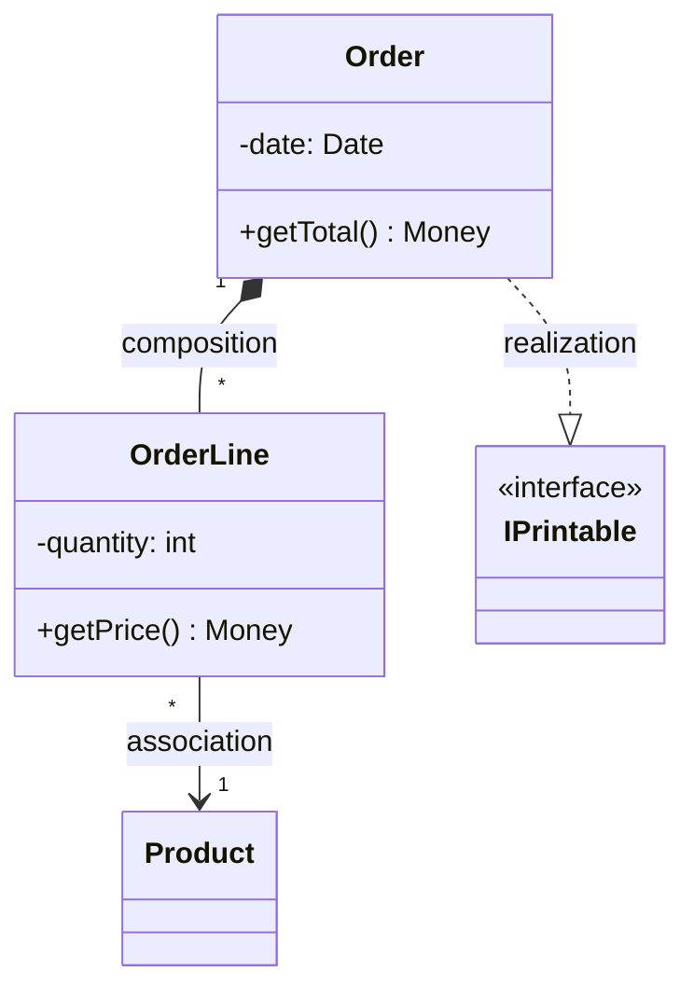

---

## 10. Диаграммы объектов, диаграммы пакетов UML

**Диаграмма объектов** показывает совокупность объектов (экземпляров классов) и связей между ними в фиксированный момент времени — «снимок» (snapshot) состояния системы. Напрямую соотносится с диаграммой классов. Объект обозначается прямоугольником: в верхней секции `имя_объекта : Класс` (подчёркнуто), в нижней — значения атрибутов. Имя объекта может быть опущено (`: Класс`). Операции обычно не показывают (они общие для всех экземпляров). Динамику изображают последовательностью таких диаграмм. Очень полезны при анализе модели предметной области (DDD).

**Диаграмма пакетов** показывает разбиение модели/кода по пакетам и зависимости между ними. «Пакет» в UML ≈ пакет Java / пространство имён C++. Виды связей между пакетами:
- **простая зависимость** — пакет как-то связан с другим;
- **реализация** — в пакете-предке есть класс-предок (или интерфейс), который реализуется пакетом-потомком; часто используется, когда пакет-предок содержит интерфейсы/абстрактные классы;
- **импорт пакета** (`<<import>>`) — имена членов пакета добавляются в пространство имён импортирующего; непомеченная зависимость по умолчанию трактуется как импорт;
- **слияние пакета** (`<<merge>>`) — содержимое пакетов объединяется (похоже на обобщение).

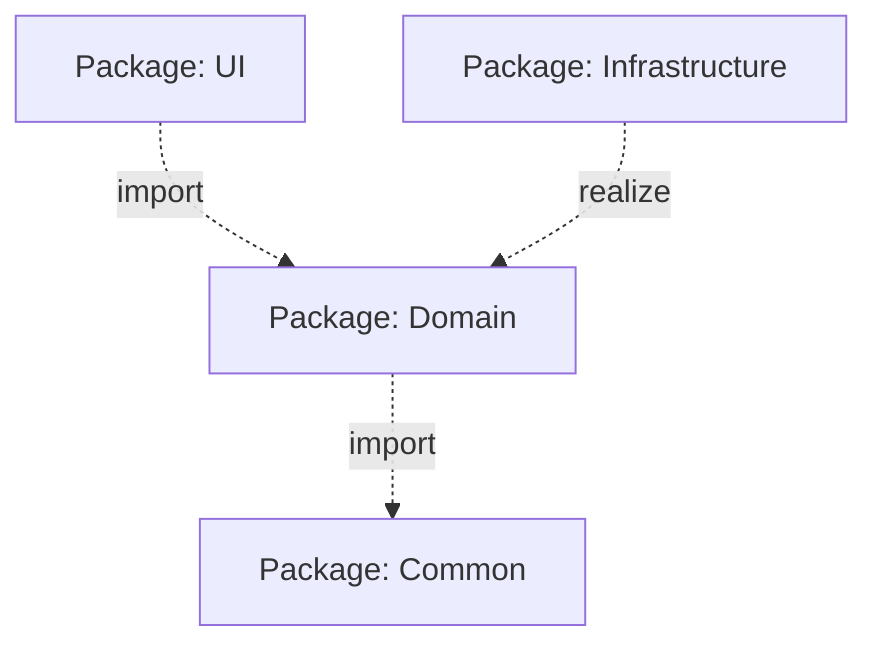

---

## 11. Диаграммы компонентов UML

**Диаграмма компонентов** — статическая структурная диаграмма, показывающая разбиение программной системы на структурные компоненты и зависимости между ними, возникающие на этапе компиляции или выполнения. Физические компоненты: файлы, библиотеки (DLL), модули, исполняемые файлы, пакеты.

Каждый класс/подсистема модели обычно преобразуется в компонент. Компонент изображается прямоугольником со стереотипом `<<component>>` и значком.

**Интерфейсы:**
- **Предоставляемый (provided)** интерфейс — «леденец» (кружок на ножке);
- **Требуемый (required)** интерфейс — «гнездо» (полукруг/розетка).

Компоненты связываются, когда требуемый интерфейс одного соединяется с предоставляемым интерфейсом другого (assembly-коннектор) — иллюстрируются отношения клиент-источник. Зависимость рисуется пунктирной стрелкой от интерфейса/порта клиента к импортируемому интерфейсу. При показе внутренней структуры составного компонента внешние интерфейсы **делегируются** во внутренние компоненты (порты + внутренние коннекторы).

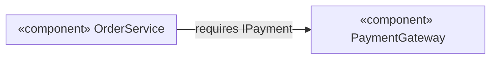

---

## 12. Диаграммы развёртывания UML

**Диаграмма развёртывания (deployment diagram)** отражает распределение компонентов системы по её физическим узлам и физические связи между узлами на этапе исполнения. Позволяет выявить узкие места и реконфигурировать топологию для нужной производительности.

**Узел (node)** — тип вычислительного устройства (изображается «кубом»/3D-прямоугольником): сервер, БД, датчик, рабочая станция и т.п. **Артефакт** — то, что развёртывается на узле (исполняемый файл, библиотека, скрипт). Связи между узлами — каналы связи (с указанием протокола, например `<<TCP/IP>>`). Внутри узлов размещаются артефакты/компоненты.

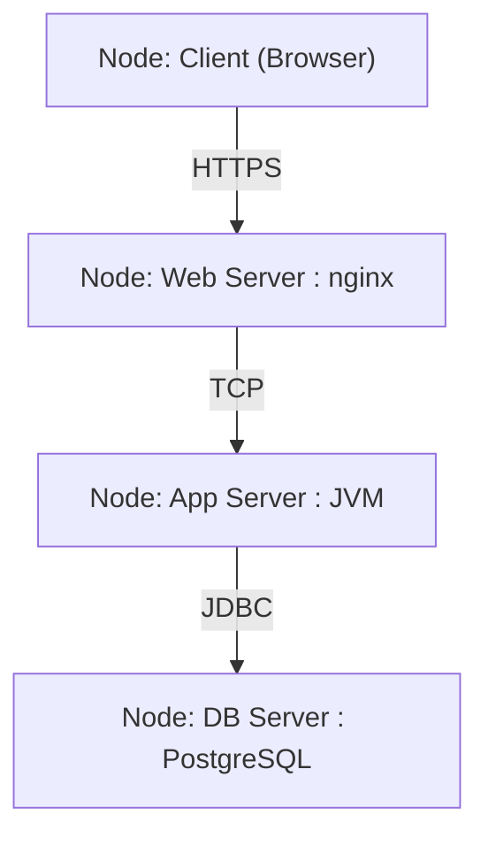

---

## 13. Диаграммы случаев использования UML

**Диаграмма случаев использования (use case diagram)** моделирует функциональные требования: что система должна делать с точки зрения внешних пользователей.

Элементы:
- **Актор (actor)** — роль внешней сущности (человек, система), взаимодействующей с системой («человечек»);
- **Случай использования (use case)** — единица полезной функциональности (эллипс), расположен внутри границы системы (прямоугольник);
- связи актор↔use case — ассоциации.

**Отношения между случаями использования:**
- **include** (`<<include>>`, пунктирная стрелка к включаемому) — обязательное включение общего поведения (вынос повторяющегося сценария);
- **extend** (`<<extend>>`, пунктирная стрелка к расширяемому) — необязательное расширение поведения в точке расширения (опциональный/условный сценарий);
- **generalization** — обобщение между use case или между акторами.

К диаграмме обычно прилагается **текстовое описание прецедента**: имя, краткое описание, актор, предусловие, основной успешный сценарий (по шагам), альтернативные сценарии, постусловие.

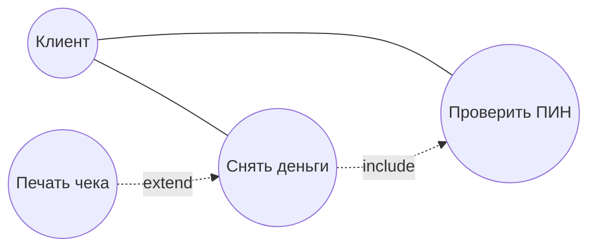

---

## 14. Диаграммы IDEF0 (контекстные)

**IDEF0** — методология функционального моделирования (из семейства IDEF, основана на SADT). Описывает систему как набор взаимосвязанных функций (работ).

**Контекстная диаграмма** — самая верхняя диаграмма IDEF0: единственный блок (функция A-0), описывающий систему целиком и её взаимодействие с окружением. Затем функция декомпозируется на более детальные диаграммы.

Каждая функция (прямоугольник) имеет **ICOM**-стрелки по сторонам:
- **Input (Вход)** — слева: что преобразуется;
- **Control (Управление)** — сверху: правила, стандарты, что управляет выполнением;
- **Output (Выход)** — справа: результат;
- **Mechanism (Механизм)** — снизу: ресурсы/исполнители, выполняющие функцию.

Контекстная диаграмма задаёт границы и цель моделирования (точку зрения), не вдаваясь в детали.

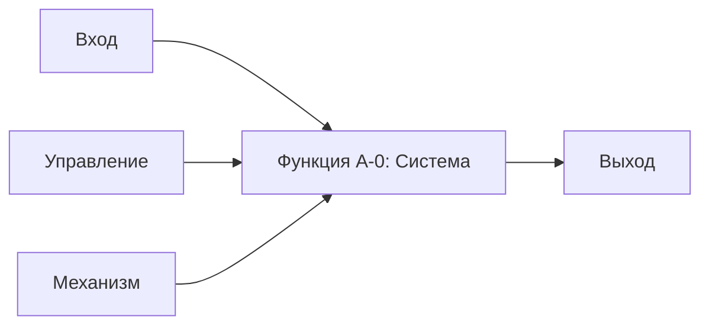

---

## 15. Диаграммы характеристик (Feature diagram)

**Диаграмма характеристик (feature diagram / feature model)** — нотация для моделирования вариативности продукта (используется в Software Product Lines). Описывает, из каких характеристик (features) может состоять система и какие комбинации допустимы.

Характеристики образуют дерево; связи родитель→потомок:
- **Обязательная (mandatory)** — закрашенный кружок: характеристика присутствует, если присутствует родитель;
- **Необязательная (optional)** — пустой кружок;
- **OR-группа** — закрашенный «веер»: можно выбрать одну или несколько;
- **Alternative (XOR)** — пустой «веер»: ровно одну из группы.

Дополнительно задаются **ограничения** между характеристиками: `requires` (одна требует другую) и `excludes` (взаимоисключение). Диаграмма характеристик отвечает на вопрос «какие конфигурации продукта вообще допустимы».

---

## 16. Feature tree

**Feature Tree (дерево функций/характеристик)** — иерархическое (древовидное) представление функциональности продукта, используемое в требованиях и продуктовом анализе. Корень — продукт целиком, ниже — крупные функциональные области, далее — конкретные функции и под-функции.

В отличие от формальной диаграммы характеристик (с строгой семантикой mandatory/optional/XOR и ограничениями), feature tree чаще используется как наглядный инструмент для:
- структурирования и группировки требований;
- обзора объёма продукта (scope) и приоритизации;
- коммуникации с заказчиком.

По сути это упрощённое дерево, где каждый узел — отдельная возможность системы, что облегчает планирование релизов и трассировку требований.

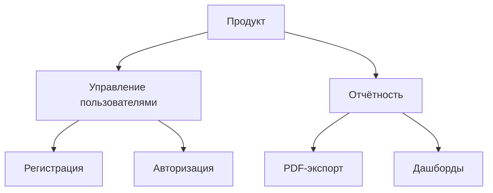

---

## 17. Диаграммы активностей UML

**Диаграмма активностей (activity diagram)** — UML-диаграмма, показывающая поток управления и данных через последовательные и параллельные действия. Спецификация исполняемого поведения как координированного выполнения подчинённых действий, соединённых потоками от выходов одного узла ко входам другого. По сути — продвинутая блок-схема.

Элементы:
- **начальный узел** (закрашенный круг), **конечный узел** (круг в круге);
- **действие (action)** — скруглённый прямоугольник;
- **переход (flow)** — стрелка;
- **решение/слияние (decision/merge)** — ромб (ветвление по условию `[guard]`);
- **разветвление/объединение (fork/join)** — толстая горизонтальная/вертикальная линия (параллелизм: один вход → много выходов и наоборот);
- **дорожки (swimlanes / разделы)** — кто/что выполняет действие (распределение ответственности);
- **сигналы** — приём/отправка сигналов (события), узлы приёма/отправки сигнала.

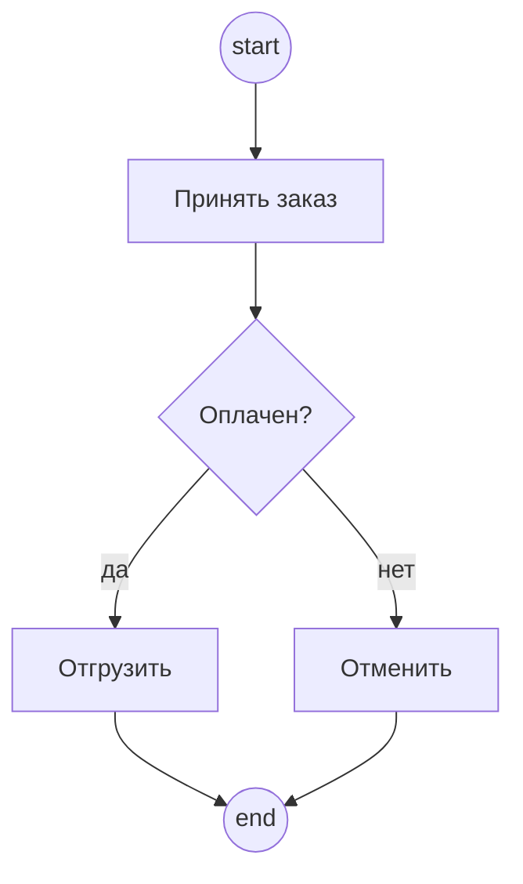

---

## 18. Язык BPMN

**BPMN (Business Process Model and Notation)** — стандартная нотация (OMG) для моделирования бизнес-процессов, понятная и аналитикам, и разработчикам. Более выразительна для бизнес-процессов, чем диаграммы активностей.

Основные элементы:
- **События (events)** — кружки: начальное (тонкая граница), промежуточное (двойная), конечное (толстая); по типу — таймеры, сообщения, ошибки и т.п.;
- **Задачи/действия (activities)** — скруглённые прямоугольники;
- **Шлюзы/операторы ветвления (gateways)** — ромбы: эксклюзивный (XOR, ×), параллельный (AND, +), инклюзивный (OR, O), событийный;
- **Потоки** — последовательности (сплошная стрелка) и сообщения (пунктирная);
- **Пулы и дорожки (pools/lanes)** — участники процесса.

Дополнительные виды:
- **Диаграмма хореографии** — описывает обмен сообщениями между участниками без раскрытия их внутренней логики;
- **Диаграмма диалогов (conversation)** — обзор взаимодействий (обменов сообщениями) между участниками.

---

## 19. Диаграммы «Сущность-связь» (ER)

**ER-диаграмма (Entity-Relationship)** — модель данных, описывающая предметную область в терминах сущностей, их атрибутов и связей. Основа концептуального и логического проектирования реляционных БД.

Элементы (классическая нотация Чена):
- **Сущность (entity)** — прямоугольник (например, «Клиент», «Заказ»);
- **Атрибут** — овал (ключевые атрибуты подчёркиваются);
- **Связь (relationship)** — ромб между сущностями.

**Кардинальность связи:** 1:1, 1:N, M:N. В нотации «воронья лапка» (Crow's foot) кратность изображается окончаниями линий (один — чёрточка, многие — «лапка», ноль — кружок).

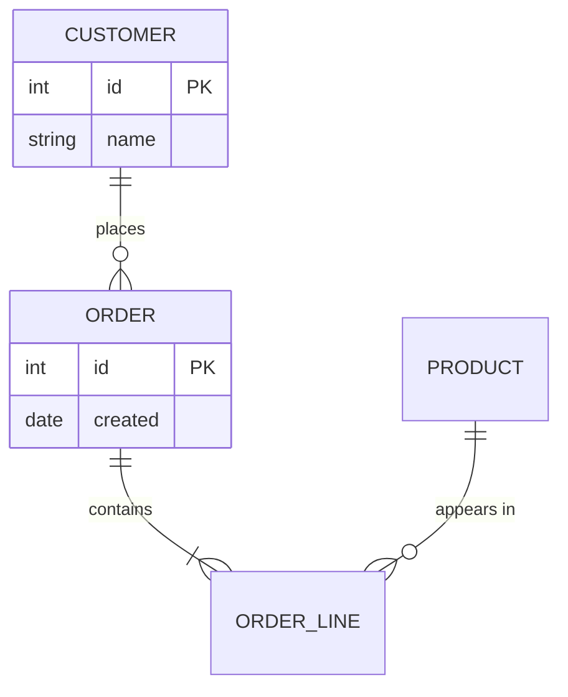

---

## 20. Концептуальное моделирование, диаграммы ORM

**Концептуальное моделирование** — построение модели предметной области на уровне понятий и их отношений, независимо от реализации (БД, кода). Цель — точно и однозначно зафиксировать факты и ограничения предметной области совместно с экспертами.

**ORM (Object-Role Modeling)** — метод концептуального моделирования, описывающий предметную область через **объекты (entity/value)** и **роли**, которые они играют в **фактах (fact types)**. В отличие от ER, ORM:
- оперирует элементарными фактами (атомарные предложения вида «Сотрудник работает в Отделе»);
- не имеет понятия «атрибут» — всё выражается через роли и связи (attribute-free), что устойчивее к изменениям;
- позволяет наглядно задавать богатый набор ограничений (уникальность, обязательность, подмножество, исключение и т.д.);
- допускает верификацию модели на естественно-языковых примерах («моделирование вслух»).

Это делает ORM удобным для тесной работы с предметными экспертами и согласуется с подходом DDD к единому языку.

---

## 21. Диаграммы конечных автоматов UML

**Диаграмма конечных автоматов (state machine / statechart diagram)** описывает жизненный цикл объекта: множество его состояний и переходы между ними под действием событий. Основана на конечных автоматах из теории автоматов со стандартизированной нотацией (statecharts Харела).

Обозначения:
- **начальное состояние** — закрашенный круг; **конечное** — круг в круге;
- **состояние** — скруглённый прямоугольник (название сверху, под чертой — внутренние активности: `entry/`, `do/`, `exit/`);
- **переход** — стрелка с меткой: `событие [охранное_условие] / действие`;
- **fork/join** — толстая линия для параллельных подавтоматов;
- **составные (вложенные) состояния**, история (`H`).

Из автомата можно генерировать код или представить **таблицей состояний** (строки — состояния, столбцы — события, ячейки — переходы). На уровне ОО-реализации соответствует паттерну **«Состояние»**.

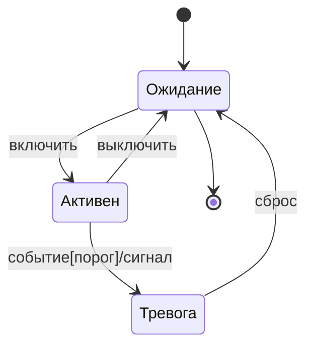

---

## 22. Диаграммы последовательностей UML

**Диаграмма последовательности (sequence diagram)** показывает взаимодействие объектов во времени в рамках одного прецедента: какие сообщения и в каком порядке они посылают друг другу.

Элементы:
- **участники** — прямоугольники сверху;
- **линии жизни (lifelines)** — вертикальные пунктиры (ось времени сверху вниз);
- **фокус управления (activation)** — узкий прямоугольник на линии жизни (объект активен/выполняет операцию);
- **сообщения** — горизонтальные стрелки.

**Виды стрелок (сообщений):**
- **синхронное** — сплошная линия с закрашенным треугольником (отправитель ждёт завершения);
- **ответное (return)** — пунктирная линия с открытой стрелкой (возврат значения и управления);
- **асинхронное** — сплошная линия с открытой стрелкой (отправитель не ждёт);
- **потерянное** (есть отправитель, нет получателя) и **найденное** (нет отправителя) — используются редко.

Создание объекта — стрелка к прямоугольнику объекта; удаление — крест `X` в конце линии жизни. Условные/циклические фрагменты задаются **фреймами** (`alt`, `opt`, `loop`, `par`, `ref`).

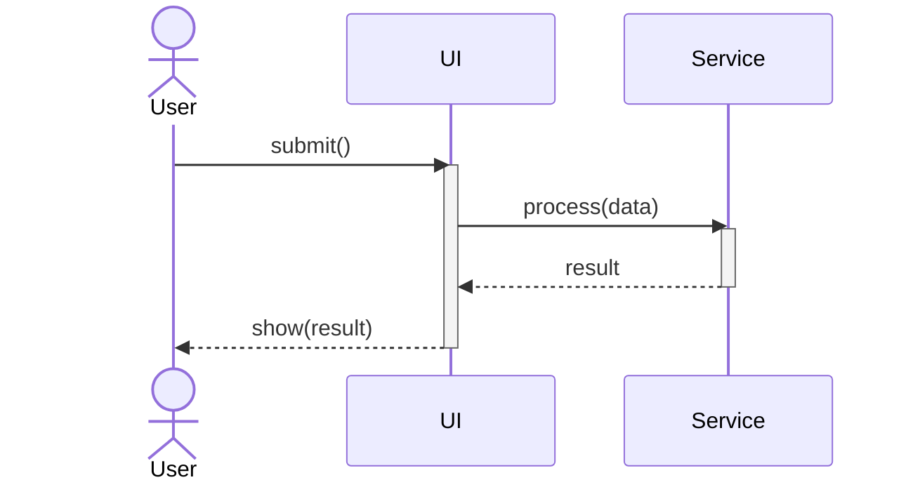

---

## 23. Диаграммы коммуникации UML

**Диаграмма коммуникации (communication diagram, ранее collaboration)** изображает взаимодействия между объектами/ролями, делая акцент на структуре связей, а не на времени. Содержит ту же информацию, что и диаграмма последовательности, но иначе организованную.

Особенности:
- объекты располагаются как на диаграмме объектов, соединены линиями (связями);
- сообщения подписываются на связях с **порядковыми номерами** (`1:`, `1.1:`, `2:`), задающими очерёдность;
- время как отдельное измерение не используется.

Диаграмма коммуникации **нагляднее показывает, с кем связан каждый элемент** (структуру взаимодействий), тогда как диаграмма последовательности яснее показывает **порядок** взаимодействий. Объединяет сведения из диаграмм классов, последовательности и прецедентов.

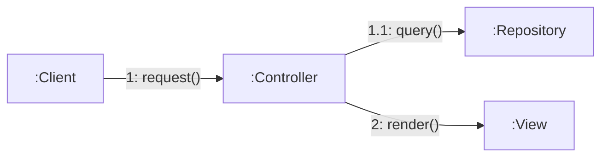

---

## 24. Диаграммы составных структур UML

**Диаграмма составной/композитной структуры (composite structure diagram)** — статическая структурная диаграмма, демонстрирующая **внутреннюю структуру классификатора** (класса/компонента) и взаимодействие его частей в период исполнения.

Элементы:
- **часть (part)** — экземпляр, входящий в состав целого (прямоугольник внутри классификатора);
- **порт (port)** — точка взаимодействия на границе классификатора;
- **коннектор** — связь между частями/портами;
- предоставляемые/требуемые интерфейсы на портах.

Позволяет показать, из каких внутренних объектов состоит класс и как они соединены, не «вытаскивая» это на уровень внешних классов. Подвид — диаграммы кооперации.

---

## 25. Диаграммы коопераций UML

**Диаграмма кооперации (collaboration, введена в UML 2.0)** — подвид диаграмм составной структуры; показывает **роли** и их **взаимодействие** в рамках некоторой кооперации (collaboration) — структуры, которая совместно реализует некоторое поведение.

Кооперация описывает не конкретные объекты, а **роли** (части), которые должны выполнить участники, чтобы достичь цели. Очень удобна для **моделирования шаблонов проектирования**: например, кооперация «Observer» описывает роли Subject и Observer и их связи, безотносительно конкретных классов. Поведение кооперации может детализироваться диаграммами последовательностей.

---

## 26. Временные диаграммы UML

**Временная диаграмма / диаграмма синхронизации (timing diagram)** — особая форма диаграммы взаимодействия, акцентирующая **изменение состояний экземпляров во времени** с явной шкалой времени. Альтернативное представление диаграммы последовательности, где на линии жизни явно показаны изменения состояния по заданной временной оси.

Используется для систем реального времени и встроенных систем, где важны точные временные характеристики: длительности состояний, моменты переходов, ограничения по времени (`{t < 5ms}`), синхронизация нескольких линий жизни. По оси X — время, по оси Y (для каждого участника) — его состояния/значения; ступенчатые линии показывают переходы.

---

## 27. Диаграммы обзора взаимодействия, диаграммы потоков данных

**Диаграмма обзора взаимодействия (interaction overview diagram)** — разновидность диаграммы деятельности, узлами которой являются **взаимодействия** (ссылки на диаграммы последовательности) или inline-взаимодействия. Цель — высокоуровневое представление общего хода взаимодействий: поток управления берётся из диаграммы деятельности (ветвления, forks/joins), а узлы — из диаграмм последовательности. Не концентрируется на деталях отдельного обмена сообщениями, а даёт «карту» сценариев.

**Диаграмма потоков данных (DFD, Data Flow Diagram)** — модель, описывающая движение данных в системе (не поток управления!). Элементы:
- **процесс** — преобразование данных (круг/скруглённый прямоугольник);
- **поток данных** — стрелка (что и куда передаётся);
- **хранилище данных (data store)** — открытый прямоугольник/две линии;
- **внешняя сущность (terminator)** — прямоугольник (источник/приёмник вне системы).

DFD строятся иерархически: контекстная диаграмма (уровень 0) → декомпозиция процессов.

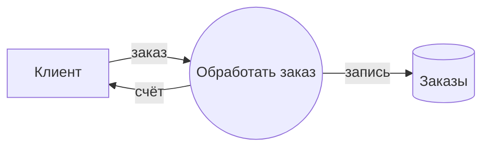

---

## 28. Диаграммы IDEF0

**IDEF0** — методология функционального моделирования (на основе SADT), описывающая систему как иерархию функций (работ) и связей между ними. В отличие от DFD моделирует именно функции и их регламентацию (управление, механизмы), а не только потоки данных.

Базовый блок — функция (прямоугольник с глаголом), окружённая **ICOM**-стрелками:
- **I — Input** (слева) — преобразуемые данные/объекты;
- **C — Control** (сверху) — управление: стандарты, правила, политики;
- **O — Output** (справа) — результат функции;
- **M — Mechanism** (снизу) — ресурсы/исполнители.

**Иерархическая декомпозиция:** контекстная диаграмма A-0 (вся система) → диаграмма A0 (декомпозиция на 3-6 функций A1..A6) → дальнейшая детализация. Действует принцип согласования границ: стрелки родительской функции должны соответствовать стрелкам диаграммы-потомка. IDEF0 строг, поддерживает анализ полноты и согласованности модели; применяется для описания производственных и бизнес-процессов.

---

## 29. Сети Петри

**Сеть Петри** — математический аппарат для моделирования распределённых, параллельных и асинхронных систем. Это двудольный ориентированный граф из двух типов вершин:
- **позиции (places)** — кружки (условия/состояния);
- **переходы (transitions)** — прямоугольники/чёрточки (события/действия);
- **дуги (arcs)** соединяют позиции с переходами и наоборот (но не одноимённые узлы).

**Маркировка (marking)** — распределение **фишек (tokens)** по позициям, задающее текущее состояние системы.

**Правило срабатывания:** переход **разрешён (enabled)**, если в каждой его входной позиции есть достаточно фишек (по весам дуг). При **срабатывании** переход забирает фишки из входных позиций и кладёт в выходные. Срабатывания происходят недетерминированно.

Сети Петри позволяют формально анализировать свойства: достижимость состояний, отсутствие тупиков (deadlock), живость, ограниченность, безопасность, параллелизм. Применяются для моделирования протоколов, бизнес-процессов (workflow-сети), параллельных алгоритмов.

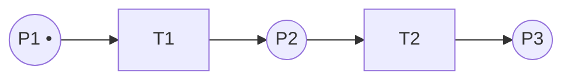

---

> **Паттерны проектирования** — типовые проверенные решения часто встречающихся задач проектирования (книга GoF «Design Patterns», 1994, 23 паттерна). Делятся на: **порождающие** (creational, создание объектов), **структурные** (structural, композиция классов/объектов) и **поведенческие** (behavioral, распределение обязанностей и взаимодействие).

## 30. Паттерн «Компоновщик» (Composite) — структурный

**Назначение:** компоновать объекты в древовидные структуры «часть-целое» и единообразно работать как с отдельными объектами, так и с их композициями.

**Структура:** общий интерфейс `Component`; `Leaf` (лист, не имеет потомков); `Composite` (хранит коллекцию `Component` и реализует операции, делегируя их потомкам). Клиент работает только с интерфейсом `Component`.

**Применимость:** иерархии объектов (документ из глифов/групп, файловая система, GUI-контейнеры). Позволяет рекурсивно обходить структуру одинаковым кодом.

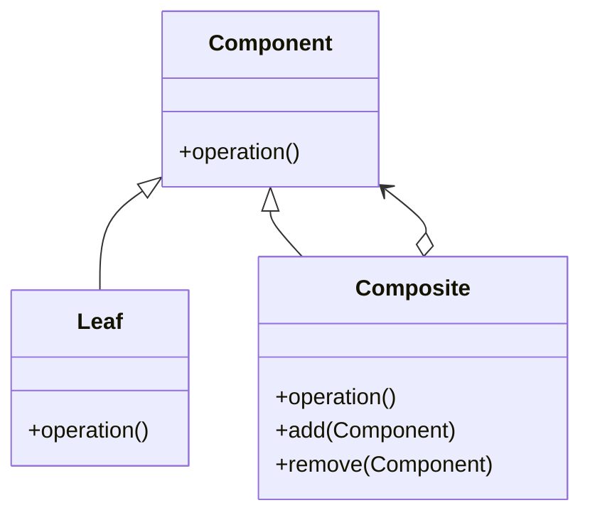

---

## 31. Паттерн «Декоратор» (Decorator) — структурный

**Назначение:** динамически добавлять объекту новые обязанности, не меняя его класс. Гибкая альтернатива наследованию для расширения функциональности.

**Структура:** интерфейс `Component`; `ConcreteComponent` (базовый объект); `Decorator` реализует `Component` и **содержит** ссылку на `Component`, делегируя ему вызовы и добавляя поведение до/после. Декораторы можно вкладывать друг в друга.

**Применимость:** когда нужно навешивать комбинации возможностей в рантайме (например, потоки ввода-вывода `BufferedInputStream(GzipInputStream(...))`, рамки/скроллбары у виджетов). Если расширение касается алгоритма, а не объекта — лучше «Стратегия».

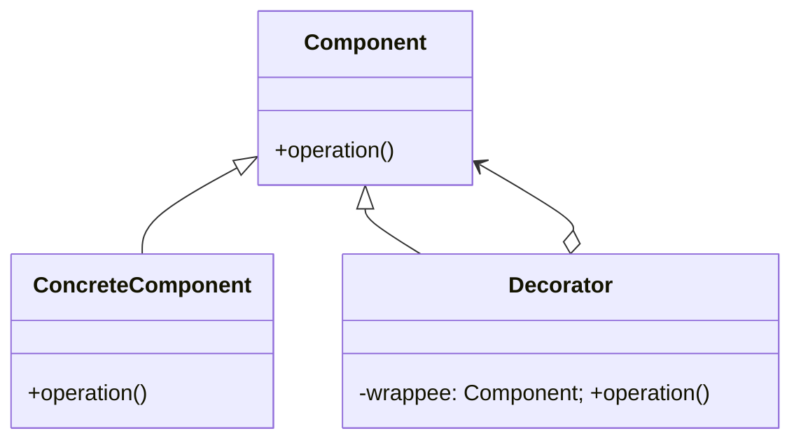

---

## 32. Паттерн «Стратегия» (Strategy) — поведенческий

**Назначение:** определить семейство взаимозаменяемых алгоритмов, инкапсулировать каждый и сделать их подменяемыми. Алгоритм изменяется независимо от использующего его клиента.

**Структура:** интерфейс `Strategy` с методом алгоритма; `ConcreteStrategyA/B/...`; `Context` хранит ссылку на `Strategy` и делегирует ей работу. Стратегию можно менять в рантайме.

**Применимость:** разные варианты одного действия (сортировка, расчёт скидки, способ оплаты). В отличие от **Шаблонного метода** (наследование, фиксация скелета в базовом классе), Стратегия использует композицию/делегирование — поэтому гибче и предпочтительнее.

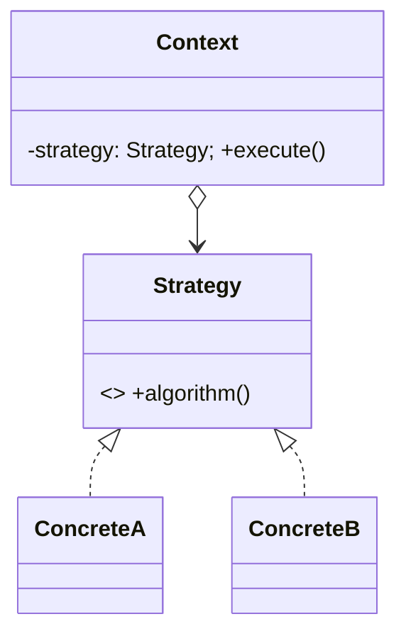

---

## 33. Паттерн «Адаптер» (Adapter) — структурный

**Назначение:** организовать использование функций объекта с несовместимым интерфейсом через специально созданный класс-оболочку с требуемым интерфейсом. Применяется, когда объект нельзя модифицировать (например, сторонняя библиотека).

**Две разновидности:**
- **Адаптер объекта** — оболочка **содержит** ссылку на адаптируемый объект и делегирует ему (композиция);
- **Адаптер класса** — оболочка **наследует** адаптируемый класс и реализует целевой интерфейс (множественное наследование).

**Применимость:** интеграция несовместимых интерфейсов, переиспользование «чужих» классов. Лежит в основе портов-адаптеров в гексагональной архитектуре.

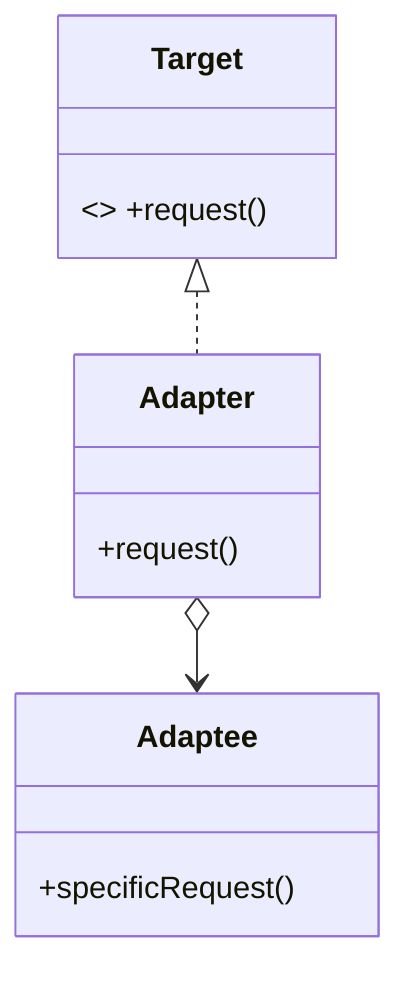

---

## 34. Паттерн «Заместитель» (Proxy) — структурный

**Назначение:** предоставить суррогат/заместитель другого объекта, контролирующий доступ к нему, перехватывая все вызовы. Proxy реализует тот же интерфейс, что и реальный объект.

**Виды:** виртуальный (ленивое создание дорогого объекта), удалённый (remote proxy — представитель объекта в другом адресном пространстве), защищающий (контроль прав доступа), «умная ссылка» (подсчёт ссылок, логирование, кеширование).

**Применимость:** когда нужен дополнительный уровень контроля при обращении к объекту, прозрачный для клиента. Отличие от Декоратора — Proxy управляет доступом/жизненным циклом, а не добавляет функциональность.

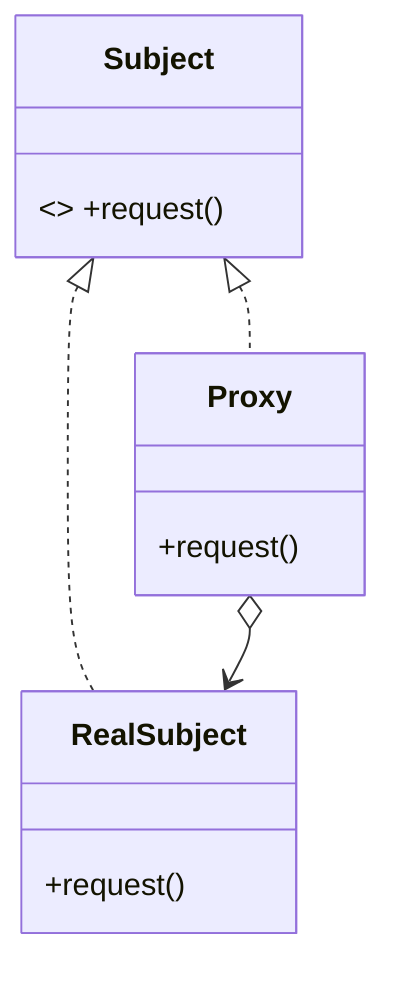

---

## 35. Паттерн «Фасад» (Facade) — структурный

**Назначение:** скрыть сложность подсистемы, предоставив единый упрощённый интерфейс. Все внешние вызовы сводятся к одному объекту-фасаду, делегирующему их соответствующим объектам системы.

**Структура:** `Facade` знает классы подсистемы и делегирует им запросы клиента; клиенты работают с фасадом, а не с множеством классов напрямую. Возможен **абстрактный фасад** (интерфейс с несколькими реализациями).

**Применимость:** упрощение работы со сложной библиотекой/подсистемой, уменьшение сопряжения клиента с внутренностями подсистемы, разделение на уровни. В отличие от Адаптера, Фасад создаёт новый удобный интерфейс, а не подгоняет под существующий.

---

## 36. Паттерн «Приспособленец» (Flyweight) — структурный

**Назначение:** экономить память за счёт разделения общего (внутреннего) состояния между множеством мелких объектов. Объект, выглядящий как уникальный экземпляр в разных местах, фактически разделяется.

**Состояние разделяется на:**
- **внутреннее (intrinsic)** — хранится в приспособленце, не зависит от контекста, разделяемо;
- **внешнее (extrinsic)** — передаётся клиентом извне при вызове, контекстозависимо.

**Участники:** `Flyweight` (интерфейс, принимающий внешнее состояние); `ConcreteFlyweight` (разделяемый, хранит внутреннее состояние); `UnsharedConcreteFlyweight` (неразделяемый, например для сборки иерархий с Composite); `FlyweightFactory` (пул приспособленцев, создаёт и переиспользует их).

**Применимость:** очень много однотипных объектов (символы в текстовом редакторе, частицы, тайлы в игре).

---

## 37. Паттерн «Мост» (Bridge) — структурный

**Назначение:** разделить абстракцию и реализацию так, чтобы они могли изменяться независимо. Вместо одной иерархии с комбинаторным взрывом подклассов («фигура × платформа отрисовки») создаются две независимые иерархии, связанные композицией.

**Структура:** `Abstraction` содержит ссылку на `Implementor` (мост) и делегирует ему низкоуровневые операции; `RefinedAbstraction` расширяет абстракцию; `Implementor` — интерфейс реализации, `ConcreteImplementor` — конкретные реализации.

**Применимость:** когда и абстракция, и её реализация должны независимо расширяться (драйверы устройств, GUI на разных платформах, оконные системы). Отличие от Адаптера: Мост проектируется заранее, Адаптер — постфактум.

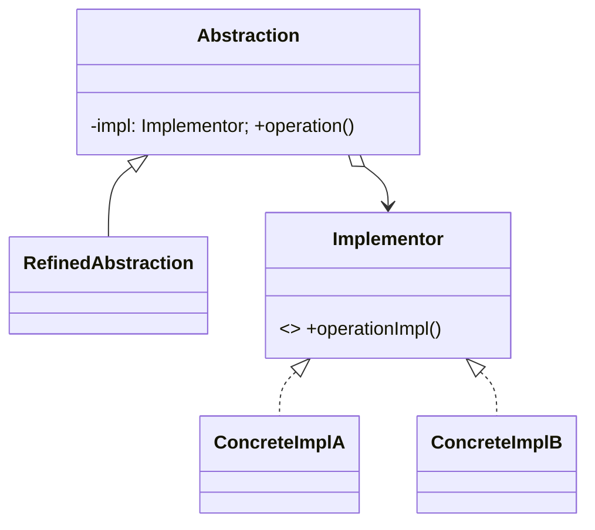

---

## 38. Паттерн «Фабричный метод» (Factory Method) — порождающий

**Назначение:** определить интерфейс для создания объекта, но позволить подклассам решать, какой класс инстанцировать. Создание объекта выносится в виртуальный метод.

**Структура:** `Creator` объявляет `factoryMethod()` (часто абстрактный) и использует его в своей логике; `ConcreteCreator` переопределяет `factoryMethod()`, возвращая `ConcreteProduct`; `Product` — общий интерфейс продуктов.

**Применимость:** когда класс не знает заранее, объекты каких классов ему создавать, и хочет делегировать это подклассам; для встраивания точки расширения «какой продукт создать» в каркас (framework).

```mermaid
classDiagram
    class Creator { +factoryMethod() Product; +someOperation() }
    class ConcreteCreator { +factoryMethod() Product }
    class Product { <<interface>> }
    Creator <|-- ConcreteCreator
    Product <|.. ConcreteProduct
    ConcreteCreator ..> ConcreteProduct : creates
```

---

## 39. Паттерн «Абстрактная фабрика» (Abstract Factory) — порождающий

**Назначение:** предоставить интерфейс для создания **семейств** связанных объектов без указания их конкретных классов. Гарантирует совместимость создаваемых продуктов.

**Структура:** `AbstractFactory` объявляет методы создания каждого продукта семейства; `ConcreteFactory1/2` создают согласованные наборы продуктов; `AbstractProductA/B` — интерфейсы продуктов. Клиент работает с фабрикой и продуктами только через интерфейсы.

**Применимость:** поддержка нескольких «тем»/платформ (виджеты под разные ОС, наборы драйверов). Хорошо комбинируется с паттерном **«Одиночка»** (фабрика часто существует в единственном экземпляре). Внутри методы часто реализованы как фабричные методы.

```mermaid
classDiagram
    class AbstractFactory { <<interface>> +createA() ProductA; +createB() ProductB }
    AbstractFactory <|.. Factory1
    AbstractFactory <|.. Factory2
```

---

## 40. Паттерн «Одиночка» (Singleton) — порождающий

**Назначение:** гарантировать, что у класса есть только один экземпляр, и предоставить глобальную точку доступа к нему.

**Реализация:** приватный конструктор; статическое поле с единственным экземпляром; статический метод `getInstance()`, возвращающий его (часто с ленивой инициализацией). В многопоточной среде требуется синхронизация (double-checked locking) либо инициализация при загрузке класса (eager / holder idiom / `enum` в Java).

**Применимость:** логгеры, пулы соединений, конфигурация, фабрики. **Критика:** фактически глобальное состояние, усложняет тестирование (моки) и повышает связность; нередко считается антипаттерном — предпочтительнее внедрение зависимостей (DI).

---

## 41. Паттерны «Ленивая инициализация» и «Пул объектов»

**Ленивая инициализация (Lazy Initialization)** — приём, при котором ресурсоёмкая операция (создание объекта, вычисление значения) откладывается до момента, когда её результат реально понадобится. Реализуется проверкой «значение уже вычислено?»: если нет — вычислить и сохранить, иначе вернуть кешированное. Экономит ресурсы, если объект может не понадобиться; в многопоточной среде требует синхронизации.

**Пул объектов (Object Pool)** — порождающий паттерн: вместо создания/уничтожения дорогих объектов их держат в **пуле** и переиспользуют. Клиент «берёт» объект из пула (`acquire`), пользуется, затем «возвращает» (`release`) — объект очищается и снова доступен. Снижает накладные расходы на создание/сборку мусора.

**Применимость пула:** дорогие в создании ресурсы — соединения с БД (connection pool), потоки (thread pool), сокеты, крупные буферы. Важно: возврат объекта в корректном состоянии, ограничение размера пула, обработка исчерпания.

---

## 42. Паттерн «Прототип» (Prototype) — порождающий

**Назначение:** задавать виды создаваемых объектов с помощью экземпляра-**прототипа** и создавать новые объекты путём его **копирования (клонирования)**, а не вызовом конструктора конкретного класса.

**Структура:** интерфейс `Prototype` с методом `clone()`; `ConcretePrototype` реализует клонирование (важно различать поверхностное и глубокое копирование). Клиент создаёт объекты, вызывая `clone()` на прототипе.

**Когда использовать:** когда классы создаваемых объектов определяются в рантайме; когда дорого/неудобно создавать объект «с нуля», а проще скопировать существующий; когда нужно избежать параллельной иерархии фабрик. Прототипом может выступать и сам объект-класс (например, `Class` в Java). Часто комбинируется с реестром прототипов.

---

## 43. Паттерн «Строитель» (Builder) — порождающий

**Назначение:** отделить конструирование сложного составного объекта от его представления, чтобы одним и тем же процессом строительства можно было получать разные представления. Удобно собирать объект пошагово.

**Структура:** `Builder` — интерфейс с шагами построения (`buildPartA()`, ...); `ConcreteBuilder` реализует шаги и хранит результат, возвращает его через `getResult()`; `Director` (необязателен) задаёт порядок шагов; `Product` — собираемый объект.

**Применимость:** объекты с множеством параметров/опций (часто реализуется как fluent-интерфейс: `NetworkBuilder.directed().allowSelfLoops().build()`), пошаговая сборка (парсеры, конвертеры документов). Примеры из стандартных библиотек: `StringBuilder`.

---

## 44. Паттерн «Наблюдатель» (Observer) — поведенческий

**Назначение:** определить зависимость «один-ко-многим» между объектами так, чтобы при изменении состояния одного объекта (субъекта) все зависимые от него (наблюдатели) автоматически уведомлялись и обновлялись.

**Структура:** `Subject` хранит список наблюдателей, методы `attach()/detach()/notify()`; `Observer` — интерфейс с методом `update()`; `ConcreteObserver` реагирует на уведомление, при необходимости запрашивая состояние субъекта. Модели **push** (субъект шлёт данные) и **pull** (наблюдатель сам запрашивает).

**Применимость:** событийные системы, MVC (модель уведомляет представления), подписки, реактивное программирование. Основа событийного архитектурного стиля.

```mermaid
classDiagram
    class Subject { +attach(Observer); +detach(Observer); +notify() }
    class Observer { <<interface>> +update() }
    Subject o--> Observer
    Observer <|.. ConcreteObserver
```

---

## 45. Паттерн «Шаблонный метод» (Template Method) — поведенческий

**Назначение:** определить скелет алгоритма в методе базового класса, оставив реализацию отдельных шагов подклассам. Подклассы переопределяют шаги, не меняя структуру алгоритма.

**Структура:** `AbstractClass` содержит `templateMethod()` (невиртуальный, задаёт порядок вызова шагов) и абстрактные/виртуальные **шаги (primitive operations)** и **хуки (hooks)**; `ConcreteClass` переопределяет шаги.

**Применимость:** есть общий каркас алгоритма с варьирующимися деталями (фреймворки, обработка данных). Реализует «принцип Голливуда»: «не звоните нам, мы позвоним вам». Отличие от **Стратегии**: Шаблонный метод использует наследование (статический выбор), Стратегия — композицию (динамический выбор).

---

## 46. Паттерн «Посредник» (Mediator) — поведенческий

**Назначение:** инкапсулировать взаимодействие множества объектов в отдельном объекте-посреднике, чтобы объекты не ссылались друг на друга напрямую. Уменьшает связность (вместо «каждый с каждым» — «каждый с посредником»).

**Структура:** `Mediator` — интерфейс координации; `ConcreteMediator` знает коллег и организует их взаимодействие; `Colleague` обращаются к посреднику вместо прямого общения. Посредник может **подписываться на события** коллег (комбинация с Observer).

**Применимость:** сложные диалоговые формы (поля влияют друг на друга), чаты, диспетчеризация. Отличие от Фасада: посредник организует двунаправленное взаимодействие коллег, а фасад лишь упрощает доступ к подсистеме «сверху вниз».

---

## 47. Паттерн «Команда» (Command) — поведенческий

**Назначение:** инкапсулировать запрос как объект, позволяя параметризовать клиентов разными запросами, ставить запросы в очередь, логировать их и поддерживать отмену операций.

**Структура:** `Command` — интерфейс с `execute()` (и часто `undo()`); `ConcreteCommand` хранит ссылку на `Receiver` и параметры, реализует `execute()`, вызывая методы получателя; `Invoker` хранит/вызывает команды; `Receiver` выполняет реальную работу; `Client` создаёт и настраивает команды.

**Применимость:** меню/кнопки GUI, отмена/повтор (undo/redo) через стек команд, макрокоманды, очереди задач, транзакции. Естественное место — паттерн MVC (команды в контроллере).

```mermaid
classDiagram
    class Command { <<interface>> +execute(); +undo() }
    class Invoker { -command: Command; +invoke() }
    class Receiver { +action() }
    Command <|.. ConcreteCommand
    Invoker o--> Command
    ConcreteCommand o--> Receiver
```

---

## 48. Паттерн «Цепочка ответственности» (Chain of Responsibility) — поведенческий

**Назначение:** избежать жёсткой привязки отправителя запроса к получателю, дав возможность обработать запрос нескольким объектам. Получатели связаны в цепочку, и запрос передаётся по ней, пока кто-то его не обработает.

**Структура:** `Handler` — интерфейс с методом обработки и ссылкой на `successor` (следующий обработчик); `ConcreteHandler` либо обрабатывает запрос, либо передаёт дальше по цепочке.

**Применимость:** обработка событий (bubbling в GUI), middleware/фильтры HTTP-запросов, многоуровневая валидация, эскалация (линии техподдержки). Отправитель не знает, кто именно обработает запрос; обработчиков можно добавлять/менять динамически.

```mermaid
flowchart LR
    Req[Запрос] --> H1[Handler 1] --> H2[Handler 2] --> H3[Handler 3] --> End[Обработан/отброшен]
```

---

## 49. Паттерн «Состояние» (State) — поведенческий

**Назначение:** позволить объекту менять поведение при изменении его внутреннего состояния — объект выглядит так, будто сменил класс. Это объектно-ориентированная реализация конечного автомата.

**Структура:** `Context` хранит ссылку на текущий объект-состояние и делегирует ему запросы; `IState` — интерфейс состояния; `ConcreteStateA..Z` реализуют поведение для конкретного состояния и могут инициировать переход (меняя состояние в контексте).

**Применимость:** объект с поведением, сильно зависящим от состояния, и большим числом условных операторов по состоянию. Прямо соответствует диаграмме конечного автомата. Отличие от Стратегии (структурно похож): состояния «знают» друг о друге и управляют переходами, тогда как стратегии независимы.

```mermaid
classDiagram
    class Context { -state: IState; +request() }
    class IState { <<interface>> +handle(Context) }
    Context o--> IState
    IState <|.. StateA
    IState <|.. StateB
```

---

## 50. Паттерн «Посетитель» (Visitor) — поведенческий

**Назначение:** вынести операцию, выполняемую над элементами структуры объектов, в отдельный объект-посетитель. Позволяет добавлять новые операции, не меняя классы элементов.

**Структура:** `Visitor` объявляет `visit(ElementA)`, `visit(ElementB)`...; `ConcreteVisitor` реализует операцию; `Element` объявляет `accept(Visitor)`; `ConcreteElement` реализует `accept`, вызывая `visitor.visit(this)` (**двойная диспетчеризация**).

**Применимость:** над стабильной иерархией элементов нужно выполнять много разных, не связанных между собой операций (обход AST: типизация, генерация кода, печать). Минус: добавление нового типа элемента требует правки всех посетителей. Если над деревом нужно несколько разных операций — лучше Visitor, чем дублирование обходов.

---

## 51. Паттерн «Хранитель» (Memento) — поведенческий

**Назначение:** не нарушая инкапсуляции, зафиксировать и сохранить внутреннее состояние объекта, чтобы позже восстановить его в это состояние.

**Структура:**
- `Originator` — объект, состояние которого сохраняется; умеет создавать `Memento` (`createMemento()`) и восстанавливаться из него (`restore(Memento)`);
- `Memento` — «снимок» состояния; раскрывает полное состояние только Originator'у (узкий публичный интерфейс для остальных);
- `Caretaker` — хранит мементо (например, стек), но не заглядывает внутрь.

**Применимость:** undo/redo, контрольные точки (snapshots), транзакции с откатом. Хранитель помогает избежать ошибок неполного восстановления состояния, сохраняя его целиком и инкапсулированно. Часто работает в связке с «Командой».

---

## 52. Паттерн «Интерпретатор» (Interpreter) — поведенческий

**Назначение:** для заданного языка определить представление его грамматики и интерпретатор, использующий это представление для разбора/вычисления предложений языка.

**Структура:** для каждого правила грамматики — свой класс выражения. `AbstractExpression` объявляет `interpret(Context)`; `TerminalExpression` (терминалы) и `NonterminalExpression` (составные правила, содержат подвыражения) реализуют интерпретацию. Предложение языка представляется деревом выражений (AST), интерпретация — рекурсивный обход.

**Применимость:** простые DSL, регулярные выражения, булевы/арифметические выражения, правила. **Ограничение:** грамматика должна быть простой — для сложных грамматик число классов взрывается, и лучше применить парсер-генератор и обходить AST «Посетителем».

---

## 53. Паттерн «Итератор» (Iterator) — поведенческий

**Назначение:** предоставить способ последовательного доступа к элементам составного объекта (агрегата) без раскрытия его внутреннего представления.

**Структура:** `Iterator` — интерфейс обхода (`hasNext()`, `next()`, иногда `reset()`); `ConcreteIterator` хранит позицию обхода конкретного агрегата; `Aggregate` объявляет `createIterator()`; `ConcreteAggregate` возвращает подходящий итератор.

**Применимость:** единообразный обход разных структур (массив, список, дерево, хеш-таблица) одним кодом; одновременно несколько независимых обходов одной коллекции. Бывает **внешний** (клиент управляет обходом) и **внутренний** (итератор сам обходит, вызывая колбэк). Встроен в большинство языков (`Iterable`/`IEnumerable`, foreach, генераторы). Связан с понятием курсора.

```mermaid
classDiagram
    class Aggregate { <<interface>> +createIterator() Iterator }
    class Iterator { <<interface>> +hasNext() bool; +next() }
    Aggregate <|.. ConcreteAggregate
    Iterator <|.. ConcreteIterator
    ConcreteAggregate ..> ConcreteIterator : creates
```

---

## 54. Понятие архитектурного стиля, трёхзвенная архитектура

**Архитектурный стиль** — именованная коллекция архитектурных решений, применимых в выбранном контексте; задаёт ограничения на решения и приводит к желаемым качествам системы. Определяется: набором элементов (типы компонентов, соединителей, данных), правилами конфигурирования (топологические ограничения на соединения) и семантикой элементов.

**Стиль vs паттерн:** стиль — общий макет всей системы (как компоненты взаимодействуют, глобальная структура); архитектурный **паттерн** — конкретное решение для части системы (локальная структура, например MVC, Репозиторий).

**Преимущества стилей:** переиспользование архитектуры и кода (неизменяемые части стиля); упрощение общения и понимания; упрощение интеграции; специфичные для стиля методы анализа и визуализации (возможны благодаря ограничениям на структуру). Одна система может сочетать несколько стилей; стиль применим и к подсистемам.

**Трёхзвенная архитектура (Three-tier / State-Logic-Display):** система разбивается на три уровня —
1. **представление (Display/Presentation)** — UI;
2. **бизнес-логика (Logic)** — обработка, правила;
3. **данные (State/Data)** — хранение, БД.

Каждый уровень общается только с соседним. Применяется в бизнес-приложениях, веб-приложениях, многопользовательских играх. Упрощает масштабирование и независимую разработку уровней.

```mermaid
flowchart TB
    Display[Presentation / UI] --> Logic[Business Logic] --> State[Data / Storage]
```

---

## 55. Шаблоны Model-View-Controller, Sense-Compute-Control

**Model-View-Controller (MVC):** разделяет данные, представление и взаимодействие с пользователем.
- **Model** — данные и бизнес-логика; при изменении оповещает представления (через Observer);
- **View** — отображение данных модели;
- **Controller** — обрабатывает весь пользовательский ввод и обновляет модель.

Естественное место для паттерна «Команда» и undo/redo. Варианты: MVP, MVVM. Снижает связность, облегчает замену UI и тестирование логики.

```mermaid
flowchart LR
    User -->|ввод| Controller
    Controller -->|обновляет| Model
    Model -->|уведомляет| View
    View -->|отображает| User
```

**Sense-Compute-Control:** шаблон для встроенных систем и робототехники. Цикл управления:
- **Sense** — сбор данных с датчиков (восприятие);
- **Compute** — обработка данных, принятие решения;
- **Control** — выдача управляющих воздействий на исполнительные механизмы (актуаторы).

Описывает типичный цикл реактивной системы реального времени.

---

## 56. Слоистый стиль, «Клиент-сервер»

**Слоистый стиль (Layered):** иерархическая организация системы — «многоуровневый клиент-сервер». Система делится на слои, каждый выполняет свою роль и взаимодействует только с соседними. Каждый слой одновременно:
- **сервер** — предоставляет интерфейс/функциональность слоям выше;
- **клиент** — использует функциональность слоёв ниже.

Соединители — протоколы взаимодействия слоёв. Примеры: ОС, сетевые стеки протоколов (OSI/TCP-IP), стандартные слои в DDD.

*Преимущества:* повышение уровня абстракции; лёгкость расширения (изменения затрагивают максимум два соседних слоя); взаимозаменяемость реализаций слоя при сохранении интерфейса. *Недостатки:* не всегда применим; проблемы с производительностью (прохождение через все слои).

**«Клиент-сервер»:** компоненты — клиенты и серверы. Сервер не знает ничего о клиентах (даже их количество); клиенты знают только про серверы и не общаются друг с другом. Соединители — сетевые протоколы. Основа большинства распределённых систем.

```mermaid
flowchart TB
    L1[Presentation Layer] --> L2[Application Layer] --> L3[Domain Layer] --> L4[Infrastructure / Data]
```

---

## 57. Гексагональная архитектура, луковая архитектура

**Гексагональная архитектура («порты и адаптеры»):** приложение делится на **ядро (доменную логику)** и внешние интерфейсы. Ядро независимо от технологий и окружения. Взаимодействие с ядром идёт через **порты** (интерфейсы, предоставляемые или потребляемые ядром), а конкретные реализации портов — **адаптеры** (паттерн «Адаптер») — подключают приложение к внешним системам (БД, API, UI). Активно используется Dependency Inversion: самый нижний уровень — предметная область, всё остальное поставляется ей как внешние зависимости.

*Плюсы:* изоляция механизмов доставки и вспомогательных механизмов; лёгкость тестирования (моки вместо адаптеров); чистая бизнес-логика; валидация/конвертация данных на границе. *Минусы:* тяжеловесна; неясно, куда девать фреймворки; не очень детальна.

**Луковая архитектура (Onion):** развитие гексагональной — **определяет внутреннюю структуру ядра** в виде концентрических слоёв. Внутренние слои не знают о внешних; доменная модель в центре не знает ни о ком. Внутренние слои **определяют интерфейсы**, внешние их **реализуют** (инверсия зависимостей направлена внутрь). Уровневость нестрогая — слой может использовать любые слои под собой.

```mermaid
flowchart TB
    subgraph Hexagonal
    UIA[Adapter: UI] --> P1((Port)) --> Core[Domain Core]
    Core --> P2((Port)) --> DBA[Adapter: DB]
    end
```

---

## 58. Чистая архитектура (Clean Architecture)

**Чистая архитектура** — развитие луковой архитектуры, которое дополнительно **определяет поток управления** и формализует правило зависимостей.

Концентрические слои (изнутри наружу):
1. **Entities** — корпоративные бизнес-правила (доменные сущности);
2. **Use Cases** — прикладные бизнес-правила (сценарии);
3. **Interface Adapters** — контроллеры, презентеры, гейтвеи;
4. **Frameworks & Drivers** — UI, БД, веб, внешние сервисы.

**Главное правило — правило зависимостей (Dependency Rule):** зависимости в исходном коде направлены **только внутрь** — внешние слои зависят от внутренних, но не наоборот. Внутренние слои ничего не знают о внешних.

**Обработка запроса** пересекает границу через инверсию зависимостей: контроллер вызывает интерфейс use case (input port), use case возвращает результат через интерфейс презентера (output port). Это позволяет менять UI и БД, не трогая бизнес-логику; логика тестируема в изоляции.

---

## 59. Пакетная обработка, каналы и фильтры

**Пакетная обработка (Batch sequential):** система строится как набор отдельных программ, выполняющихся **последовательно**; данные передаются от программы к программе стандартным для ОС способом (pipes, named pipes, файлы) в явном виде (всё необходимое для работы). «Прадедушка стилей», типичен для старых финансовых систем (ночные пакеты обработки транзакций).

**Каналы и фильтры (Pipes and Filters):** компоненты — **фильтры**, преобразующие данные из входных каналов в выходные; соединители — **каналы (pipes)**.
*Инварианты:* фильтры независимы (нет разделяемого состояния); фильтр не знает о соседях до/после него.
*Вариации:* конвейеры (линейная последовательность), ограниченные каналы (очередь конечной длины), типизированные каналы.

*Преимущества:* поведение системы — просто композиция фильтров; легко добавлять/заменять/переиспользовать фильтры; любые два фильтра совместимы; широкие возможности анализа (пропускная способность, задержки, deadlock) и параллелизма. *Недостатки:* проблемы с интерактивными приложениями; пропускная способность определяется самым «узким» фильтром. Классический пример — конвейеры Unix (`cat | grep | sort`), компиляторы.

```mermaid
flowchart LR
    In[Источник] --> F1[Фильтр 1] --> F2[Фильтр 2] --> F3[Фильтр 3] --> Out[Сток]
```

---

## 60. Стиль Blackboard («Классная доска»)

**Blackboard** — стиль для задач без детерминированной стратегии решения (часто из области ИИ). Два типа компонентов:
- **центральная структура данных** — собственно «доска» (blackboard), хранит всё состояние и промежуточные результаты;
- **источники знаний (knowledge sources)** — компоненты, читающие данные с доски и записывающие новые результаты.

*Инварианты:* управление системой осуществляется только через состояние доски; компоненты **не знают друг о друге** и **не имеют собственного состояния** — они взаимодействуют исключительно через доску.

Компоненты «срабатывают», когда на доске появляются подходящие данные, и постепенно наращивают решение. Применение: распознавание речи/образов, некоторые задачи ИИ, трансляторы, системы переписывающих правил, графовые грамматики, алгорифмы Маркова.

```mermaid
flowchart TB
    KS1[Источник знаний 1] <--> BB[(Blackboard)]
    KS2[Источник знаний 2] <--> BB
    KS3[Источник знаний 3] <--> BB
```

---

## 61. Понятие предметно-ориентированного проектирования, единый язык

**Domain-Driven Design (DDD)** (Эрик Эванс) — методология проектирования, использующая **предметную область как основу архитектуры**. Архитектура строится вокруг **Модели предметной области** — не только диаграмм, но прежде всего кода и устного общения. DDD отвечает на вопрос «откуда брать все эти классы» и позволяет целенаправленно уточнять архитектуру; особенно полезен, когда область незнакома.

**Единый язык (Ubiquitous Language)** — общий язык, на котором разговаривают и разработчики, и эксперты предметной области; состоит из понятий модели (классы, методы), паттернов и элементов высокоуровневой структуры. Проблема: у программистов и экспертов свой жаргон, необходимость перевода размывает смысл, «еретики» используют термины по-разному. Решение: единый язык, отражённый в коде; **изменение языка = рефакторинг кода**. Языков в проекте может быть несколько (по контекстам).

**«Моделирование вслух»** — приём: проговаривание сценариев предметной области естественными фразами, чтобы выявить и уточнить понятия модели совместно с экспертами.

**Модель и реализация** должны соответствовать друг другу: модель без кода бесполезна, код без модели обычно неверен. Нельзя разделять моделировщиков и программистов («разрушительный рефакторинг» возникает, когда они оторваны). В DDD модель одновременно служит и моделью анализа, и моделью проектирования.

---

## 62. Изоляция предметной области в DDD, антипаттерн «Умный GUI»

**Изоляция предметной области.** Модель предметной области должна быть **отделена** от остальной программы. Распределение ответственности по слоям (слоистая архитектура DDD):
- **Уровень представления (UI)** — отображение, ввод;
- **Прикладной (операционный) уровень** — сборка воедино, общее управление процессом (тонкий, без бизнес-логики);
- **Уровень предметной области (Domain)** — бизнес-регламенты, «суть»; классы модели умеют только существенное;
- **Инфраструктурный уровень** — все технические вещи: работа с БД, middleware, сетевые коммуникации, утилиты.

Для связей «снизу вверх» (от инфраструктуры/домена к UI) используют Observer или вариации MVC.

**Антипаттерн «Умный GUI» (Smart UI):** вся бизнес-логика пишется прямо в обработчиках событий на форме; код GUI напрямую работает с БД. Делает невозможным проектирование по модели.
*Когда не плохо:* быстрые средства разработки (RAD), прирост производительности на старте, легко добавлять/переписывать простые фичи. *Когда плохо:* почти невозможно переиспользование; сложно реализовать сложное поведение; сложно интегрироваться. Для нетривиальных систем — антипаттерн.

---

## 63. DDD: основные структурные элементы модели, идентичность объекта

Основные **строительные блоки** тактического DDD:

- **Сущность (Entity)** — объект, обладающий собственной **идентичностью**, сохраняющейся во времени независимо от значений атрибутов (например, Клиент, Заказ). Два объекта-сущности с одинаковыми атрибутами — это разные сущности. Нужен способ поддержания идентичности.
- **Объект-значение (Value Object)** — объект, полностью определяемый своими атрибутами, без идентичности (например, Деньги, Адрес, Координата). Взаимозаменяем при равенстве атрибутов; обычно неизменяем (immutable).
- **Сервис (Service)** — операция, не принадлежащая естественно ни одной сущности/значению; не имеет состояния, выражает действие предметной области.

**Идентичность объекта в информационных системах.** Поскольку объекты живут дольше одного сеанса и хранятся в БД, нужен явный механизм идентичности:
- естественный ключ (атрибуты, уникальные в реальности — например, номер паспорта) — рискован, может меняться;
- суррогатный ключ (искусственный идентификатор — GUID, автоинкремент), генерируемый системой.

Идентичность должна сохраняться при сохранении/загрузке объекта (object-relational mapping), репликации и пересборке. Решение о том, что есть сущность, а что — значение, зависит от того, важна ли индивидуальность объекта для предметной области.

---

## 64. DDD: паттерн «Агрегат» (Aggregate)

**Агрегат** — изолированный «кусок» модели: кластер связанных объектов (сущностей и значений), рассматриваемый как единое целое с точки зрения изменения данных.

Структура:
- **Корень агрегата (Aggregate Root)** — глобально идентичная сущность, единственная **точка входа** в агрегат;
- остальные объекты внутри агрегата идентичны только **локально** (в пределах агрегата) и доступны лишь через корень.

**Правила (инварианты):**
- внешние объекты могут ссылаться только на корень, но не на внутренние объекты;
- корень отвечает за поддержание инвариантов всего агрегата;
- агрегат — граница транзакционной согласованности (одна транзакция меняет один агрегат);
- удаление корня удаляет весь агрегат.

Пример (модель доставки грузов): агрегат «Груз» (Cargo) с корнем Cargo; «История доставки» (Delivery History) — внутренняя сущность, локально идентичная; «Задание на доставку» (Delivery Specification) — объект-значение. Агрегаты управляют сложностью, чётко разграничивая границы согласованности.

```mermaid
flowchart TB
    Root["Cargo (Aggregate Root)"] --> DH["DeliveryHistory (Entity, local id)"]
    Root --> DS["DeliverySpecification (Value Object)"]
    Ext[Внешний объект] -.->|ссылается только на корень| Root
```

---

## 65. DDD: паттерны «Фабрика», «Репозиторий»

**Фабрика (Factory).** Создание сложного объекта или целого агрегата — само по себе ответственность, которую не стоит возлагать на создаваемый объект или на клиента. Фабрика инкапсулирует знание о том, как собрать корректный объект/агрегат (со всеми инвариантами), и атомарно его создаёт. Виды: фабричный метод, отдельный класс-фабрика, фабрика для **восстановления** объекта (например, при чтении из БД — пересборка ранее существовавшего объекта). Фабрика отделяет конструирование от использования и гарантирует, что создаётся валидный объект.

**Репозиторий (Repository).** Хранилище, предоставляющее доступ к объектам (обычно к корням агрегатов) так, будто это коллекция в памяти, скрывая детали хранения (БД, ORM). Клиент запрашивает объекты по критериям (`findById`, `findBySpecification`) и сохраняет их, не зная о SQL/инфраструктуре. Репозиторий:
- инкапсулирует механизм персистентности (изоляция инфраструктуры от домена);
- возвращает полностью восстановленные объекты предметной области;
- обычно есть только для корней агрегатов.

Связка: репозиторий при загрузке может использовать фабрику для пересборки объекта. Разница: фабрика создаёт **новые** объекты, репозиторий находит/возвращает **существующие**.

---

## 66. Паттерн «Спецификация» (Specification)

**Спецификация** инкапсулирует бизнес-правило или критерий отбора в отдельном объекте, который умеет проверять, удовлетворяет ли ему кандидат: `isSatisfiedBy(candidate) -> bool`.

**Применение:**
- **валидация** — проверка, удовлетворяет ли объект требованиям;
- **выборка (selection)** — отбор объектов из коллекции/репозитория по критерию;
- **конструирование «под заказ»** — описание того, каким должен быть создаваемый объект.

Спецификации можно **комбинировать** булевыми операциями (`and`, `or`, `not`), строя сложные правила из простых (композитная спецификация). Это выносит бизнес-правила из сущностей в явные переиспользуемые объекты, делает их тестируемыми и выражает в едином языке.

Пример (контейнеры): `ContainerSpecification` хранит требуемую характеристику (`requiredFeature`); метод `isSatisfiedBy(container)` проверяет, обладает ли контейнер нужным свойством; при загрузке опасного груза проверяется `drum.containerSpecification().isSatisfiedBy(container)`.

```mermaid
classDiagram
    class Specification { <<interface>> +isSatisfiedBy(c) bool; +and(Specification); +or(Specification) }
    Specification <|.. ConcreteSpec
    Specification <|.. AndSpecification
    AndSpecification o--> Specification
```

---

## 67. Ограниченный контекст, непрерывная интеграция, карта контекстов

**Ограниченный контекст (Bounded Context)** — явная граница, внутри которой определена и согласована конкретная модель предметной области (и свой единый язык). Одно и то же слово в разных контекстах может означать разное (например, «Клиент» в продажах и в поддержке). Большая система = несколько контекстов с разными моделями. Фрагментированная модель (без явных границ) затрудняет переиспользование и грозит ошибками при интеграции.

**Непрерывная интеграция (Continuous Integration)** в смысле DDD — поддержание модели и кода **внутри одного контекста** согласованными: частое слияние работы всех участников, автоматизированные тесты, постоянное устранение расхождений в понимании модели. Не даёт контексту «расколоться» изнутри.

**Карта контекстов (Context Map)** — документ/схема, показывающая все ограниченные контексты системы и **отношения между ними** (типы интеграции). Даёт глобальную картину ландшафта моделей и точек соприкосновения команд. Помогает осознанно управлять границами и переводами между моделями.

```mermaid
flowchart LR
    Sales[Bounded Context: Sales] ---|Customer-Supplier| Billing[Bounded Context: Billing]
    Sales ---|Shared Kernel| Catalog[Bounded Context: Catalog]
    Support[Bounded Context: Support] -.->|Anticorruption Layer| Legacy[Legacy System]
```

---

## 68. Подходы к интеграции контекстов

Типовые ситуации и пути действий при интеграции контекстов (отношения на карте контекстов):

- **Shared Kernel (Общее ядро)** — две команды совместно владеют общим подмножеством модели/кода; изменения согласуются. Тесная связь, требует дисциплины.
- **Customer-Supplier (Заказчик-Поставщик)** — один контекст (поставщик, upstream) обслуживает другой (заказчик, downstream); приоритеты заказчика учитываются в планах поставщика.
- **Conformist (Конформист)** — downstream-команда просто **подчиняется** модели upstream (нет влияния на неё), используя её как есть. Дёшево, но навязывает чужую модель.
- **Anticorruption Layer (Защитный/изолирующий слой)** — downstream строит **прослойку перевода** между своей моделью и чужой (часто legacy), защищая свою модель от «загрязнения». Дороже, но изолирует.
- **Separate Ways (Отдельное существование)** — отказ от интеграции, когда выгоды от неё меньше затрат. Иногда **отсутствие интеграции — лучший способ интеграции**.
- **Open Host Service / Published Language** — поставщик публикует общедоступный сервис/протокол и стандартный язык обмена для многих потребителей.

Метафора «слона»: минимальная интеграция → Anticorruption Layer; слабая интеграция → Shared Kernel; сильная интеграция → единый Bounded Context.

---

## 69. Смысловое ядро, приёмы дистилляции, абстрактное ядро

**Смысловое ядро (Core Domain)** — то, что делает систему ценной и составляет реальное конкурентное преимущество (know-how). Туда стоит направлять лучших разработчиков; всё остальное — поддержка ядра.

**Приёмы дистилляции** (выделения и прояснения ядра):
- **Domain Vision Statement** — документ на одну страницу, описывающий смысловое ядро и его полезность;
- **Highlighted Core (Выделенное ядро)** — явное обозначение элементов ядра в модели/документации;
- **Дистилляционный документ** — 3–7 страниц о том, что составляет ядро и как его элементы взаимодействуют;
- **Generic Subdomains (Неспециализированные подобласти)** — выделение кусков кода, неспецифичных для системы (общие/типовые), чтобы убрать их из ядра (можно купить готовое или поручить менее опытным);
- **Cohesive Mechanisms** — вынесение сложных вычислительных механизмов из ядра в отдельные «движки».

**Абстрактное ядро (Abstract Core).** Применяется, когда даже ядро оказывается слишком большим: наиболее фундаментальные понятия и связи выносятся в виде **абстракций/интерфейсов** в отдельный модуль, а специфика реализуется в других модулях. Это делает важнейшие отношения предметной области явными и стабильными.

---

## 70. Крупномасштабная структура, метафора системы, разбиение по уровням

**Крупномасштабная структура (Large-Scale Structure)** — набор высокоуровневых концепций/правил, задающих общий «каркас» понимания всей системы поверх отдельных контекстов, чтобы можно было ориентироваться в целом, не вникая в детали.

**Метафора системы (System Metaphor)** — образная аналогия, описывающая систему в целом (из XP); даёт команде общее интуитивное представление об архитектуре и направляет проектирование («система как конвейер», «как доска объявлений»).

**Разбиение по уровням (Responsibility Layers).** Объекты группируются по уровням ответственности так, чтобы зависимости шли в одном направлении (сверху вниз). Пример из доставки: двунаправленная связь между Customer и Cargo мешает; выделяется отдельный «уровень принятия решений» — модель распадается на согласованные уровни (например: операционный — что делается сейчас; уровень возможностей — что можем; уровень принятия решений — как управляем). Уровни делают крупномасштабную структуру явной и снижают связность.

---

## 71. Типичные уровни в производственных и финансовых системах

При разбиении по уровням ответственности (Responsibility Layers) выделяются типовые наборы уровней.

**Системы автоматизации производства (типичные уровни):**
- **Operations (Операции)** — текущая деятельность, что происходит/делается прямо сейчас (заказы, рабочие задания);
- **Capability / Potential (Возможности/Потенциал)** — ресурсы и мощности, что система **способна** делать (оборудование, материалы, доступность);
- **Policy / Decision Support (Политика/Поддержка решений)** — правила и стратегии планирования, как управлять операциями в рамках возможностей;
- иногда отдельно — **Commitments (Обязательства)** — планы и договорённости.

**Финансовые системы (типичные уровни):**
- **Operations** — конкретные транзакции и текущие позиции;
- **Capability** — доступные средства, лимиты, инструменты;
- **Policy** — правила учёта, регламенты, стратегии;
- **Knowledge Level** — описания типов инструментов, схем учёта (то, что задаёт конфигурацию).

Общий принцип: нижние уровни описывают «факты»/операции, верхние — правила и потенциал; зависимости направлены сверху вниз, что делает модель устойчивой к изменениям бизнес-политик.

---

## 72. Стили «Уровень знаний», «Подключаемые компоненты»

**Уровень знаний (Knowledge Level)** — часть модели, оперирующая **информацией о типах** сущностей (метаданными), а не самими экземплярами. Разделяет систему на:
- **операционный уровень** — конкретные объекты повседневной работы;
- **уровень знаний** — описания/правила/типы, которыми операционный уровень конфигурируется.

Позволяет **гибко переконфигурировать систему** без изменения кода: пользователь меняет «знание» (типы, правила), и поведение операционного уровня меняется. Пример — настраиваемые типы счетов в финансовой системе, конфигурируемые роли и права.

**Подключаемые компоненты (Pluggable Component Framework)** — стиль, описывающий **общее (абстрактное) ядро** и набор **взаимозаменяемых компонентов-плагинов**, которыми оно управляет. Ядро определяет интерфейсы (порты) и протокол взаимодействия, а конкретные реализации подключаются как плагины. Применяется, когда несколько систем разделяют общую модель ядра, но различаются в деталях; обеспечивает расширяемость и переиспользование. Близок к абстрактному ядру и архитектуре «порты и адаптеры».

---

## 73. Понятие распределённой системы, заблуждения при проектировании

**Распределённая система** — система, компоненты которой расположены на разных сетевых узлах (компьютерах) и взаимодействуют, передавая сообщения по сети, согласовывая свои действия для достижения общей цели. Для пользователя часто выглядит как единая система.

**Заблуждения распределённых вычислений (Fallacies of Distributed Computing, L. P. Deutsch и др.)** — ложные допущения, которые часто делают проектировщики:
1. **Сеть надёжна** (на самом деле возможны отказы и потери);
2. **Задержка (latency) равна нулю**;
3. **Пропускная способность бесконечна**;
4. **Сеть безопасна**;
5. **Топология не меняется**;
6. **Есть один администратор**;
7. **Стоимость передачи равна нулю**;
8. **Сеть однородна**.

Игнорирование этих заблуждений приводит к хрупким системам: нужно явно проектировать обработку сбоев, тайм-аутов, повторов, безопасность, разнородность узлов и изменчивость топологии.

---

## 74. RPC, RMI. Пример: gRPC

**RPC (Remote Procedure Call)** — удалённый вызов процедуры: клиент вызывает функцию, выполняемую на другом узле, как если бы она была локальной. Механизм:
- **stub (заглушка)** на стороне клиента упаковывает (**маршалинг/сериализация**) аргументы в сообщение;
- сообщение передаётся по сети;
- **skeleton** на сервере распаковывает аргументы, вызывает реальную процедуру, упаковывает результат обратно.

**Прозрачность RPC** (стремление сделать вызов неотличимым от локального) неполна: сетевые сбои, задержки, разные адресные пространства — поэтому полная прозрачность недостижима (см. заблуждения).

**RMI (Remote Method Invocation)** — то же, но в объектно-ориентированном виде: удалённый вызов **метода** объекта, живущего в другой JVM/процессе; передаются ссылки на удалённые объекты.

**protobuf (Protocol Buffers)** — механизм сериализации/десериализации данных от Google: структуры (`message`) описываются в `.proto`-файле, кодогенерация под многие языки, компактный бинарный формат.

**gRPC** — средство удалённого вызова (RPC) поверх protobuf (тоже Google). Сервисы описываются в том же `.proto`-файле; типы параметров и результатов — protobuf-сообщения. Поддерживает потоки (streaming):
```
rpc GetFeature(Point) returns (Feature) {}
rpc ListFeatures(Rectangle) returns (stream Feature) {}
rpc RecordRoute(stream Point) returns (RouteSummary) {}
rpc RouteChat(stream RouteNote) returns (stream RouteNote) {}
```
Сборка — плагином grpc к `protoc`; на клиенте — blocking/async stub'ы. Работает поверх HTTP/2.

---

## 75. Веб-сервисы, SOAP. WCF

**Веб-сервис** — отдельная система, предоставляющая по сети интерфейс (вроде RPC/RMI) для машинного взаимодействия. Сложные приложения строятся как **интеграция веб-сервисов**. Основные подходы: SOAP/WSDL/UDDI, XML-RPC, REST.

**SOAP (Simple Object Access Protocol)** — протокол обмена структурированными сообщениями в формате XML (обычно поверх HTTP). SOAP-сообщение — XML-документ `Envelope` с `Header` и `Body`:
```xml
<env:Envelope xmlns:env="http://www.w3.org/2003/05/soap-envelope"> ... </env:Envelope>
```
Сопутствующие стандарты:
- **WSDL (Web Services Description Language)** — XML-описание интерфейса сервиса (операции, типы, привязки);
- **UDDI** — реестр для публикации и поиска сервисов.

SOAP строг, расширяем (WS-* для безопасности, транзакций), но многословен и тяжеловесен.

**WCF (Windows Communication Foundation)** — фреймворк Microsoft для построения сервис-ориентированных приложений (.NET). Ключевая формула — **ABC of WCF**:
- **A — Address** — где находится сервис (URI);
- **B — Binding** — как с ним общаться (протокол, кодировка, безопасность);
- **C — Contract** — что сервис делает (интерфейс, операции).

Конфигурируется декларативно; поддерживает разные транспорты (HTTP, TCP, named pipes) и протоколы (SOAP и др.).

---

## 76. Архитектурные стили распределённых приложений: Big Compute, Big Data

**Big Compute** — стиль для задач, требующих **массивных вычислений** (HPC): научное моделирование, рендеринг, финансовая аналитика, симуляции. Характеристики: большое число вычислительных узлов/ядер, задача разбивается на множество параллельных подзадач, интенсивные вычисления при умеренных объёмах данных. Часто используется планировщик заданий, кластеры, иногда GPU/специализированное «железо»,низколатентные сети (MPI). Масштабирование «вычислительной мощностью».

**Big Data** — стиль для обработки **очень больших объёмов данных**, которые не помещаются/не обрабатываются на одной машине. Характеристики: данные распределены и реплицированы по узлам; вычисления переносятся к данным (data locality), а не наоборот; пакетная (batch) и потоковая (stream) обработка.

*Хорошие практики Big Data:* обрабатывать данные там, где они лежат; использовать распределённые хранилища (HDFS) и фреймворки (MapReduce, Spark); разделять «горячие»/«холодные» данные; проектировать под отказоустойчивость и горизонтальное масштабирование; денормализация и схема «на чтение».

---

## 77. Web-queue-worker, N-звенная архитектура

**Web-queue-worker** — стиль для приложений с фоновой обработкой:
- **Web (front end)** — обрабатывает HTTP-запросы, быстро отвечает пользователю;
- **Queue (очередь)** — буфер сообщений между фронтом и обработчиком (развязывает их во времени);
- **Worker (обработчик)** — выполняет ресурсоёмкие/длительные задачи из очереди асинхронно.

Дополняется БД, кешем, CDN. Преимущества: развязка компонентов, сглаживание пиков нагрузки, независимое масштабирование фронта и воркеров. Подходит для облачных приложений среднего размера.

**N-звенная (N-tier) архитектура** — обобщение трёхзвенной: система делится на несколько физических уровней (например, presentation → business → data + дополнительные: API gateway, кеш, очередь). Уровни могут масштабироваться независимо и развёртываться на разных узлах. Бывает **закрытая** (звено обращается только к соседнему) и **открытая** (может обращаться к любому нижнему). Традиционна для корпоративных приложений; пример — N-звенное приложение на Azure (веб-уровень, бизнес-уровень, СУБД, балансировщики).

```mermaid
flowchart LR
    Client --> Web[Web Front End]
    Web -->|enqueue| Q[(Queue)]
    Q --> Worker[Worker]
    Worker --> DB[(Database)]
```

---

## 78. Микросервисная архитектура

**Микросервисная архитектура** — стиль, при котором приложение строится как набор небольших **независимых сервисов**, каждый из которых:
- реализует одну бизнес-возможность (часто = один ограниченный контекст DDD);
- является отдельным приложением, развёртывается независимо;
- имеет собственное хранилище данных (database per service);
- общается с другими через лёгкие сетевые протоколы (REST/HTTP, gRPC, очереди сообщений).

*Преимущества:* независимая разработка, развёртывание и масштабирование сервисов; технологическая гетерогенность; изоляция отказов; малые автономные команды. *Недостатки:* сложность распределённой системы (сеть, согласованность данных, распределённые транзакции); затраты на эксплуатацию (DevOps, мониторинг, оркестрация); сложность тестирования и отладки; задержки межсервисных вызовов.

Противопоставляется **монолиту** (одно развёртываемое приложение). Часто сопровождается API Gateway, service discovery, контейнеризацией (Docker) и оркестрацией (Kubernetes).

```mermaid
flowchart TB
    GW[API Gateway] --> S1[Orders Service]
    GW --> S2[Payments Service]
    GW --> S3[Inventory Service]
    S1 --> DB1[(Orders DB)]
    S2 --> DB2[(Payments DB)]
    S3 --> DB3[(Inventory DB)]
```

---

## 79. Хорошие практики проектирования REST-интерфейсов

**REST (REpresentational State Transfer)** — архитектурный стиль взаимодействия компонентов распределённого приложения через HTTP, описывающий принципы клиент-серверного обмена «самоописываемым» состоянием ресурсов.

**Хорошие практики дизайна REST-API:**
- **Ресурсо-ориентированность:** URI обозначают **существительные-ресурсы**, а не действия (`/orders/42`, а не `/getOrder?id=42`); использовать множественное число коллекций.
- **HTTP-методы по семантике:** `GET` (чтение, безопасный, идемпотентный), `POST` (создание), `PUT` (полная замена, идемпотентен), `PATCH` (частичное обновление), `DELETE` (удаление, идемпотентен).
- **Коды состояния HTTP** по смыслу: 200/201/204, 400/401/403/404, 409, 500 и т.д.
- **Без состояния (stateless):** сервер не хранит сессионное состояние клиента; каждый запрос самодостаточен.
- **Иерархия ресурсов:** вложенность через путь (`/orders/42/items`).
- **Фильтрация, сортировка, пагинация** — через query-параметры (`?page=2&sort=date`).
- **Версионирование API** (в URL `/v1/` или заголовке).
- **HATEOAS** (по возможности) — ответы содержат ссылки на доступные действия.
- **Согласованные форматы** (обычно JSON), понятные сообщения об ошибках, идемпотентность изменяющих операций где возможно, кеширование (`ETag`, `Cache-Control`).

---

## 80. Принципы дизайна распределённых приложений: самовосстановление

**Самовосстановление (Self-healing)** — способность системы обнаруживать сбои и автоматически восстанавливаться без вмешательства человека, продолжая работать (возможно, с деградацией). Поскольку в распределённой системе отказы неизбежны (сеть ненадёжна), систему проектируют так, чтобы она их переживала.

**Приёмы самовосстановления:**
- **Retry (повтор)** с экспоненциальной задержкой и джиттером — для временных (transient) сбоев;
- **Circuit Breaker** — размыкание цепи при устойчивых сбоях зависимости;
- **Timeout** на все удалённые вызовы (не ждать бесконечно);
- **Bulkhead (переборки)** — изоляция ресурсов, чтобы отказ одной части не «утопил» всю систему;
- **Graceful degradation** — частичная функциональность при отказе некритичных компонентов;
- **Health checks** и автоматический перезапуск/замена нездоровых экземпляров (оркестратором);
- **Компенсирующие транзакции** — откат бизнес-операций при частичном сбое (в saga);
- **Идемпотентность** операций — чтобы повтор был безопасен.

Цель — спроектировать систему, ожидающую сбои и справляющуюся с ними автоматически.

---

## 81. Паттерн «Circuit Breaker» (Предохранитель)

**Circuit Breaker** предотвращает повторные обращения к сбойной зависимости, давая ей восстановиться и защищая вызывающую сторону от зависания на тайм-аутах (каскадных отказов). Работает как электрический предохранитель.

**Три состояния:**
- **Closed (замкнут)** — запросы проходят нормально; подсчитываются ошибки. При превышении порога ошибок — переход в Open.
- **Open (разомкнут)** — запросы **сразу отклоняются** (fail fast) без обращения к зависимости (можно вернуть запасной ответ/ошибку). По истечении тайм-аута — переход в Half-Open.
- **Half-Open (полуоткрыт)** — пропускается пробный запрос(ы): если успешны — возврат в Closed (зависимость восстановилась), если нет — снова Open.

Преимущества: быстрый отказ вместо ожидания, разгрузка падающей зависимости, автоматическое восстановление. Часто сочетается с Retry, Timeout, fallback.

```mermaid
stateDiagram-v2
    [*] --> Closed
    Closed --> Open : порог ошибок превышен
    Open --> HalfOpen : истёк тайм-аут
    HalfOpen --> Closed : пробный запрос успешен
    HalfOpen --> Open : пробный запрос неудачен
```

---

## 82. Принципы дизайна распределённых приложений: избыточность

**Избыточность (Redundancy)** — дублирование критичных компонентов и данных, чтобы отказ одного экземпляра не приводил к отказу системы (устранение единых точек отказа, SPOF).

**Приёмы:**
- **Репликация сервисов** — несколько экземпляров за **балансировщиком нагрузки**; при отказе экземпляра трафик идёт на оставшиеся;
- **Репликация данных** — копии БД (master-replica, multi-master), приводящие к компромиссам согласованности (см. CAP, Eventual Consistency);
- **Резервирование по зонам/регионам** — размещение в разных availability zones / дата-центрах для устойчивости к отказам инфраструктуры;
- **Stateless-компоненты** — экземпляры без локального состояния легко дублировать и заменять;
- **Failover** — автоматическое переключение на резерв;
- **N+1 / N+M резервирование** мощностей.

Избыточность повышает доступность и отказоустойчивость ценой стоимости ресурсов и усложнения согласованности данных.

---

## 83. Принципы дизайна распределённых приложений: минимизация координации

**Минимизация координации** — стремление уменьшить необходимость согласования между узлами/сервисами, поскольку координация (распределённые блокировки, двухфазные коммиты, синхронные согласования) дорога, увеличивает задержки и снижает доступность и масштабируемость.

**Приёмы:**
- **Асинхронные, идемпотентные операции** — узлы работают независимо, обмениваясь сообщениями без блокирующего ожидания; повтор безопасен;
- **Eventual Consistency** вместо строгой согласованности там, где это допустимо бизнесом;
- **Разбиение данных (partitioning/sharding)** так, чтобы операции затрагивали один раздел и не требовали координации между разделами;
- **Database per service** — каждый сервис владеет своими данными, нет общих блокировок;
- **Saga** вместо распределённых транзакций — последовательность локальных транзакций с компенсациями;
- **Конфликт-устойчивые структуры (CRDT)**, версионирование, append-only журналы.

Чем меньше узлам нужно договариваться, тем выше масштабируемость и устойчивость к разделению сети.

---

## 84. Command and Query Responsibility Segregation (CQRS)

**CQRS** — паттерн, разделяющий операции **изменения** состояния (Commands) и операции **чтения** (Queries) на разные модели и, часто, разные пути обработки.

- **Команды (Commands)** — изменяют состояние, не возвращают данные (только результат выполнения); проходят через модель записи (write model), где сосредоточена бизнес-логика и валидация.
- **Запросы (Queries)** — только читают, не меняют состояние; используют отдельную модель чтения (read model), оптимизированную под выборки (денормализованные представления).

Модели чтения и записи могут использовать **разные хранилища**, синхронизируемые асинхронно (часто с Eventual Consistency, нередко в связке с Event Sourcing).

*Преимущества:* независимое масштабирование чтения и записи (чтений обычно намного больше); оптимизированные под задачу модели; упрощение сложной доменной логики на стороне записи. *Недостатки:* усложнение архитектуры, согласованность «в конечном счёте», дублирование данных. Применять только там, где сложность оправдана.

```mermaid
flowchart LR
    UI -->|Command| WM[Write Model] --> WDB[(Write DB)]
    WDB -.->|sync events| RDB[(Read DB)]
    UI -->|Query| RM[Read Model] --> RDB
```

---

## 85. CAP-теорема, модели ACID и BASE

**CAP-теорема (Брюер):** распределённая система с репликацией данных может одновременно гарантировать максимум **два** из трёх свойств:
- **Consistency (Согласованность)** — во всех узлах данные консистентны (любое чтение видит последнюю запись);
- **Availability (Доступность)** — любой запрос завершается корректным ответом, но без гарантии одинаковости ответов разных узлов;
- **Partitioning Tolerance (Устойчивость к разделению)** — потеря связи между узлами не нарушает работу.

Поскольку в реальной сети разделения (P) неизбежны, выбор практически идёт между **C** и **A** при возникновении разделения: системы CP (жертвуют доступностью ради согласованности) и AP (жертвуют согласованностью ради доступности).

**ACID** (классические транзакции БД):
- **Atomicity** — транзакция применяется целиком или не применяется вовсе;
- **Consistency** — завершённая транзакция не нарушает целостности данных;
- **Isolation** — параллельные транзакции не мешают друг другу;
- **Durability** — результат зафиксированной транзакции сохраняется.

**BASE** (подход NoSQL/распределённых систем, противоположный полюс):
- **Basically Available** — система в основном доступна; отказ узла может дать некорректный ответ, но только для его клиентов;
- **Soft-state** — состояние может меняться само собой, согласованность между узлами не гарантируется в каждый момент;
- **Eventually consistent** — целостность гарантируется лишь в некоторый момент в будущем.

ACID — про строгую согласованность (часто CP), BASE — про доступность и масштабируемость с согласованностью «в конечном счёте» (часто AP).

---

## 86. Принципы дизайна распределённых приложений: проектирование для обслуживания

**Проектирование для обслуживания (Design for Operations)** — система должна быть удобной в эксплуатации: легко наблюдать, диагностировать, обновлять и автоматически обслуживать в продакшене. Эксплуатационные качества закладываются в архитектуру с самого начала.

**Ключевые аспекты:**
- **Наблюдаемость (observability):** логирование (структурированные логи), метрики, распределённая трассировка (tracing), агрегация в единые системы мониторинга;
- **Health checks** — эндпоинты проверки готовности/живости (readiness/liveness) для оркестраторов;
- **Автоматизация задач обслуживания** — деплой, откат, масштабирование, резервное копирование выполняются автоматически (CI/CD, IaC);
- **Управление конфигурацией** — конфиг отделён от кода, меняется без пересборки;
- **Плавные обновления (rolling/blue-green/canary deployments)** без простоя;
- **Алертинг** — оповещение о проблемах по метрикам/логам;
- **Документирование** runbook'ов и процедур восстановления.

Цель — чтобы команда могла надёжно эксплуатировать систему, быстро находить и устранять проблемы, выполнять обновления без простоев.

---

## 87. Docker, Docker Compose

**Docker** — ПО для автоматизации развёртывания и управления приложениями в средах с поддержкой **контейнеризации**. Контейнер «упаковывает» приложение со всеми зависимостями в изолированную среду, разделяя ядро ОС хоста (легче виртуальных машин). Инструментарий: DSL для описания образов (Dockerfile), публичный репозиторий, поддержка оркестраторами.

Ключевые понятия:
- **Image (образ)** — неизменяемый шаблон (слои файловой системы) для создания контейнеров; на основе одного образа можно собрать другой;
- **Container (контейнер)** — запущенный экземпляр образа; может быть сохранён как новый образ;
- **Dockerfile** — рецепт сборки образа (`FROM`, `RUN`, `COPY`, `CMD` и т.д.);
- **DockerHub** — внешний репозиторий образов (официальные и пользовательские).

Основные команды: `docker run` (запуск контейнера, при необходимости `pull`; `-p host:container` — проброс порта, `-d` — фон, `-it` — интерактивно); `docker ps` (список запущенных); `docker stop` (SIGTERM → SIGKILL); `docker exec` (запуск процесса в контейнере).

**Docker Compose** — инструмент для описания и запуска **многоконтейнерных** приложений одним файлом `docker-compose.yml` (раздел `services`, для каждого — образ/сборка, порты, переменные, тома, зависимости). Команда `docker compose up` поднимает всё приложение. Удобен для локальной разработки и тестовых стендов.

**Docker Swarm** — встроенный оркестратор: машина становится главной (manager), другие присоединяются к swarm'у и получают копии контейнеров; Docker балансирует нагрузку по машинам.

```dockerfile
FROM python:3.11-slim
COPY . /app
WORKDIR /app
RUN pip install -r requirements.txt
CMD ["python", "app.py"]
```

---

## 88. Kubernetes

**Kubernetes (k8s)** — оркестратор контейнеров: отвечает за раскидывание контейнеров по хостам, масштабирование, мониторинг и управление жизненным циклом. По сути — сильно продвинутый Docker Compose для кластеров.

**Архитектура:**
- **Control Plane (master):** API Server (точка входа), etcd (хранилище состояния кластера), Scheduler (размещение подов по узлам), Controller Manager (поддержание желаемого состояния);
- **Worker nodes:** kubelet (агент узла), kube-proxy (сеть), container runtime.

**Основные объекты:**
- **Pod** — минимальная единица развёртывания: один или несколько тесно связанных контейнеров с общей сетью/томами;
- **ReplicaSet** — поддерживает заданное число реплик пода;
- **Deployment** — декларативное управление подами/репликами, плавные обновления и откаты;
- **Service** — стабильная сетевая точка доступа к набору подов (балансировка, service discovery);
- **ConfigMap/Secret** — конфигурация и секреты;
- **Namespace** — логическое разделение ресурсов;
- **Ingress** — маршрутизация внешнего HTTP-трафика.

Принцип работы — **декларативный**: пользователь описывает желаемое состояние (YAML-манифесты), Kubernetes непрерывно приводит фактическое состояние к желаемому (reconciliation loop). Обеспечивает самовосстановление, масштабирование (HPA), rolling updates.

```yaml
apiVersion: apps/v1
kind: Deployment
metadata: { name: demo }
spec:
  replicas: 3
  template:
    spec:
      containers:
        - name: demo
          image: cloudnatived/demo:hello
```

---

## 89. Облачная инфраструктура, AWS, Terraform

**Облачная инфраструктура** — вычислительные ресурсы (серверы, хранилища, сети, сервисы), предоставляемые провайдером по требованию через интернет с оплатой по факту использования. Модели: IaaS (инфраструктура), PaaS (платформа), SaaS (готовое ПО). Свойства: эластичность (масштабирование вверх/вниз), оплата по потреблению, высокая доступность по зонам/регионам, управляемые сервисы.

**AWS (Amazon Web Services)** — крупнейший облачный провайдер. Базовые сервисы:
- **EC2** — виртуальные машины (compute);
- **S3** — объектное хранилище;
- **RDS** — управляемые реляционные БД;
- **VPC** — изолированные виртуальные сети;
- **IAM** — управление доступом;
- **ELB** — балансировщики нагрузки; **Lambda** — бессерверные функции; и т.д.

**Terraform (HashiCorp)** — инструмент **Infrastructure as Code (IaC)**: инфраструктура описывается декларативно на языке HCL, а Terraform создаёт/изменяет/удаляет реальные ресурсы у провайдера, приводя их к описанному состоянию. Ключевое:
- **декларативность** — описываем желаемое состояние, а не шаги;
- **state-файл** — хранит текущее известное состояние инфраструктуры;
- `terraform plan` (показать изменения) → `terraform apply` (применить);
- провайдеры (AWS, Azure, GCP и др.), переиспользуемые модули.

IaC даёт воспроизводимость, версионирование инфраструктуры в Git, ревью изменений и автоматизацию развёртывания.

---

## 90. Основные понятия сетевой безопасности, шифрование с симметричным ключом

**Принцип Керкгоффса:** алгоритм шифрования считается известным, секретен только **ключ**. Усложнение самого алгоритма не всегда повышает криптостойкость (security through obscurity — плохо).

Базовые цели безопасности: конфиденциальность, целостность, аутентификация, неотказуемость (см. подписи).

**Симметричное шифрование** — один и тот же секретный ключ используется и для шифрования, и для дешифрования. Быстрое, подходит для больших объёмов данных. Проблема — безопасная **передача ключа** обеим сторонам. Алгоритмы: AES, DES/3DES.

**Режимы шифрования блочных шифров:**
- **ECB (Electronic Code Book)** — один ключ применяется к каждому блоку независимо. Прост, но одинаковые блоки открытого текста дают одинаковые блоки шифртекста (раскрывает структуру — небезопасен).
- **CBC (Cipher Block Chaining)** — каждый блок открытого текста XOR-ится с предыдущим зашифрованным блоком перед шифрованием (нужен вектор инициализации IV). Скрывает повторы.
- **SCM / Stream Cipher Mode** — шифруем IV ключом снова и снова, генерируя гамму (ключевой поток) бесконечной длины, которой XOR-им данные (потоковое шифрование).
- **Counter Mode (CTR)** — шифруется счётчик, результат XOR-ится с данными; допускает произвольный доступ к блокам и распараллеливание.

---

## 91. Алгоритм Диффи-Хеллмана. Шифрование с открытым ключом

**Алгоритм Диффи-Хеллмана (Diffie-Hellman)** — протокол выработки **общего секретного ключа** по **незащищённому** каналу без предварительного обмена секретами. Идея (на основе сложности дискретного логарифма):
- стороны публично договариваются о большом простом `p` и основании `g`;
- Алиса выбирает секрет `a`, посылает `A = g^a mod p`;
- Боб выбирает секрет `b`, посылает `B = g^b mod p`;
- Алиса вычисляет `B^a mod p`, Боб — `A^b mod p`; оба получают одинаковый секрет `g^(ab) mod p`.

Перехватчик, зная `p, g, A, B`, не может эффективно вычислить секрет. Уязвим к атаке «человек посередине» без аутентификации (поэтому комбинируется с подписями/сертификатами).

**Шифрование с открытым ключом (асимметричное).** У каждого пользователя — **пара ключей**: открытый `E` (публикуется) и закрытый `D` (держится в секрете). Свойства: `E` не ломается атакой «произвольного открытого текста»; по открытому ключу нельзя получить закрытый.
- **Конфиденциальность:** чтобы послать Алисе сообщение, Боб шифрует его её **открытым** ключом `EA`; расшифровать может только Алиса своим закрытым ключом.
- Решает проблему передачи ключа (не нужен общий секрет заранее), но медленнее симметричного — поэтому обычно асимметрично шифруют только сеансовый симметричный ключ (гибридные схемы).

Алгоритмы: **RSA**, ElGamal, эллиптические кривые (ECC).

---

## 92. Цифровые подписи, сертификаты

**Цифровая подпись** решает задачи: **аутентификация** (подтверждение авторства), **целостность** (сообщение не изменено) и **неотказуемость** (отправитель не может отрицать, что подписал).

**Реализация:** подпись использует асимметрию «наоборот» — подписывают **закрытым** ключом, проверяют **открытым**. Чтобы не шифровать всё сообщение (дорого), подписывают его **хеш**:
1. вычисляется криптографический хеш сообщения (Message Digest — хороший хеш, например SHA);
2. хеш шифруется закрытым ключом отправителя → это и есть подпись;
3. получатель пересчитывает хеш сообщения и сравнивает с расшифрованной открытым ключом подписью.

Подписывать только хеш почти так же криптостойко, но в сотни раз быстрее. (Важна стойкость хеша к коллизиям — иначе можно подобрать другое сообщение с тем же хешем.)

**Проблема:** как убедиться, что открытый ключ принадлежит именно нужному лицу? Решение — **сертификаты**:
- **Сертификат** — сообщение, подтверждающее идентичность ключа (привязку «субъект ↔ открытый ключ»), подписанное **центром сертификации (Certificate Authority, CA)**; стандарт **X.509**;
- **Цепочка сертификатов** — CA верхнего уровня подписывает сертификаты CA уровнем ниже, те — сертификаты пользователей;
- **Корневые сертификаты** — те, которым принято доверять (предустановлены в ОС/браузерах);
- **Самоподписанные сертификаты** — недоверенные, используются для отладки.

Эта инфраструктура (PKI) лежит в основе TLS/HTTPS.

---

## 93. Сопровождение ПО, законы Лемана, legacy-системы, модернизация

**Сопровождение (maintenance)** — деятельность по изменению ПО после его передачи в эксплуатацию. Виды: **корректирующее** (исправление ошибок), **адаптивное** (под изменения окружения), **совершенствующее/перфективное** (новые возможности, улучшения) и **профилактическое (превентивное)** (предупреждение будущих проблем, рефакторинг). Составляет основную часть стоимости ПО за жизненный цикл.

**Законы Лемана (эволюции ПО):**
1. **Непрерывное изменение** — система должна постоянно адаптироваться, иначе становится всё менее полезной;
2. **Увеличение сложности** — при изменениях сложность растёт, если специально с ней не бороться;
3. **Саморегулирование** — процесс эволюции саморегулируется (метрики продукта/процесса близки к нормальному распределению);
4. **Сохранение организационной стабильности** — средняя скорость работы над системой примерно постоянна;
5. **Сохранение осведомлённости (familiarity)** — между релизами объём изменений должен быть умеренным, чтобы команда сохраняла понимание системы;
6. **Непрерывный рост** — функциональность должна расти, чтобы удовлетворять пользователей;
7. **Ухудшение качества** — качество снижается, если система не адаптируется к изменяющемуся окружению;
8. **Система обратной связи** — процесс эволюции есть система с обратной связью и должен так и рассматриваться.

**Legacy-системы** — унаследованные системы, важные для бизнеса, но устаревшие технологически. Нюансы: отсутствие документации и оригинальных разработчиков; устаревшие технологии; дублирование и неконсистентность данных; высокий риск изменений; высокая стоимость поддержки. Оригинальные разработчики обычно не мотивированы облегчать сопровождение.

**Факторы стоимости сопровождения:** стабильность команды; ответственность по контракту; квалификация персонала; возраст и структура программы; качество кода и документации; неожиданные изменения бизнеса/законодательства.

**Прогнозирование сопровождения** оценивает будущую сложность изменений; оценка удобства сопровождения — например, по числу корректировок, затронувших каждый модуль (модули с частыми правками — кандидаты на рефакторинг).

**Модернизация ПО** — улучшение системы без полной замены: рефакторинг, реинжиниринг, перенос на новые платформы, постепенная замена частей.

---

## 94. Техподдержка и способы её организации. Линии техподдержки

**Техническая поддержка** — помощь пользователям и обеспечение работоспособности ПО в эксплуатации. Виды контрактов: поддержка на определённый срок; по количеству обращений; SLA-контракты; гарантийная поддержка.

**Линии (уровни) поддержки** — иерархия с возрастающей квалификацией и зоной ответственности; обращение эскалируется наверх, если нижняя линия не справляется (по сути — «Цепочка ответственности»):
- **Линия 1 (first line)** — приём обращений, регистрация, решение типовых/известных проблем по инструкциям (FAQ, скрипты). Низкая техническая квалификация, высокая коммуникативная; фильтрует поток.
- **Линия 2 (second line)** — помощь линии 1, решение известным способом более сложных проблем; некоторая техническая работа (например, правка данных). Выше квалификация.
- **Линия 3 (third line)** — настоящая команда сопровождения/разработки; решает проблемы, требующие изменения кода, глубокого анализа, новых решений. Высшая квалификация.

Иногда выделяют линию 0 (самообслуживание: база знаний, чат-боты) и линию 4 (вендоры/внешние поставщики). Грамотное распределение по линиям удешевляет поддержку: дорогие специалисты не тратят время на типовые вопросы.

---

## 95. Улучшения, реинжиниринг и переписывание legacy-систем. «Strangler»

При работе с legacy есть выбор: **сопровождать**, **реинжиниринг** или **полное переписывание**.

**Реинжиниринг (reengineering)** — преобразование существующей системы в улучшенную форму (рефакторинг, реструктуризация, перенос) **с сохранением функциональности**, без переписывания с нуля. Включает обратное проектирование (reverse engineering — восстановление модели/документации из кода) и прямое проектирование улучшенной версии.

**Реинжиниринг против полного переписывания:**
- Переписывание с нуля рискованно: долго, дорого, теряется накопленная в legacy бизнес-логика (часто недокументированная), бизнес всё это время не получает улучшений, велик риск провала;
- Реинжиниринг дешевле и безопаснее, но **лишь частично** решает проблему сопровождения (наследует часть старых решений).

**«Приложение-душитель» (Strangler Pattern, M. Fowler):** постепенная замена legacy-системы. Вокруг старой системы выращивается новая: новые функции реализуются в новой системе, а запросы постепенно перенаправляются с legacy на неё (через фасад/прокси). Старая система «удушается» по частям, пока не будет полностью заменена. Преимущества: нет «большого взрыва», система работает всё время миграции, риск распределён.

**Процесс реинжиниринга** (типовые шаги): анализ исходной системы → обратное проектирование → реструктуризация программы и данных → прямое проектирование/документирование. **Факторы стоимости реинжиниринга:** качество ПО, подвергаемого реинжинирингу; наличие средств поддержки процесса (инструментов); объём необходимого преобразования данных; квалификация команды.

```mermaid
flowchart LR
    Client --> Facade[Facade / Proxy]
    Facade -->|старые функции| Legacy[Legacy System]
    Facade -->|новые/мигрированные функции| New[New System]
    Legacy -. постепенно заменяется .-> New
```

---

## 96. Автоматизация реинжиниринга и её проблемы; разбиение на модули, изменение данных, модификация структуры

**Автоматизация реинжиниринга** использует инструменты для преобразования кода и данных: трансляторы между языками, средства реструктуризации, анализаторы, средства миграции данных. Снижает трудозатраты и число ошибок на рутинных преобразованиях.

**Проблемы автоматизации:**
- автоматический перевод сохраняет структуру (в т.ч. плохую) — получается «структурно тот же» легаси на новом языке, без улучшения архитектуры;
- сложно автоматически восстановить утраченную семантику/намерения;
- идиомы и особенности исходного языка/платформы трудно переносимы;
- нестандартный/«грязный» код, самомодифицирующийся код, недокументированные допущения;
- автоматика требует ручной доводки и тщательного тестирования результата.

**Основные направления преобразований:**
- **Разбиение на модули (модуляризация):** выделение из монолитного кода связных модулей с чёткими интерфейсами, группировка по функциональности, разрыв лишних зависимостей — повышает связность и снижает сопряжение, облегчает дальнейшее сопровождение и поэтапную замену.
- **Изменение данных (data reengineering):** очистка и преобразование данных — устранение дублирования и неконсистентности, нормализация/денормализация, изменение схемы, миграция в новое хранилище; часто самый трудоёмкий и рискованный этап (данные надо сохранить корректными).
- **Модификация структуры программы:** реструктуризация управляющей логики — устранение запутанного потока управления («спагетти», лишние `goto`), упрощение условий, выделение функций, приведение к структурному/модульному виду без изменения внешнего поведения (поведение-сохраняющие преобразования = рефакторинг).

Цель всех преобразований — улучшить сопровождаемость и подготовить систему к дальнейшей эволюции, сохранив её функциональность.
